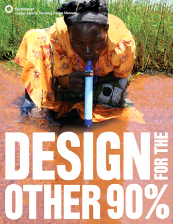

[← go back to the list](HCI00.md)

## Human-Computer Interaction (SIT32002) - Essays
(last update: 05 May 2021)

### Announcement
- The essay topics might be changed over time, but not be updated in this site yet.
- Therefore, please **double-check the LMS**.
- **Due date** for each essay assignment will be noticed in the LMS ([lms.handong.edu](https://lms.handong.edu)).

### General Guidelines for Writers
- Find guidelines about the essay writing from [here](HCI00.md#philosophy-about-essay-writing).
- Minimum requirement
	- **Minimum TWO pages** per essay
	- Language: basically, English (Korean is partly allowed)
	- **More than half of essay assignments (at least five out of ten essays) should be submitted in English**
	- Use the shared essay form (Download: [here](https://goo.gl/Lh7d4a))
		- Font: Batang & Times New Roman
		- Font size: 12 pt.
		- Line height: 1.5
	- Evaluation
		- Satisfaction of the minimum requirement
		- Evaluation criteria: clarity of opinion, rationality of argument, creativity about new ideas, depth of own philosophy about the topic
- **Do NOT put the instructions in your essay.**

### Topics

#### Topic 1. [The First Essay]
Write the first essay including the following subtopics.

- **Subtopic 1. Introduction to yourself**: Say something about yourself. What do you study in Handong? Why do you want to take this course? What do you expect to learn from this course? Is there anything that you'd like to say to the professor?

- **Subtopic 2. What is the 'human-computer interaction'?**: What do you know about HCI? Find one or two examples of human-computer interaction that you are interested in. Also, please provide what kind of HCI product/app/system do you want to build through the course project?

#### Topic 2. [Introduction to HCI]
[Take the video lecture **1. Introduction to HCI**](HCI01.md), then write an essay including the following subtopics.

- **Subtopic 1. Explain what is "interaction"**: Look back on your daily life and find how you live a day. You surely live a day with having a relationship with other people, also with using lots of products. Yes, you are keeping interacting with someone and something around you. Even you are now indirectly interacting with prof. Lee, by reading this article and understanding his assignment. Reading a book is an interaction/communication with the author of the book, even it was written in the 1800s. Watching a movie is also an interaction with filmmakers of that movie. KakaoTalk, e-mail, driving, smartphone game, taking a course, listening to music, having dinner with your family, ... all is worked based on a concept of "interaction". Genesis chapter 1, God created heaven and earth, and his created human, then immediately started to interact with his creature. Interaction is an essential action of living beings. **SO, my question is "how do you interact with your family, with your friends and colleagues, with your mobile phone and computer, with other devices/object around you, with God (if you have Christianity), and with any other target that you need to interact with?" This question is asking you to explain what is the philosophy of interaction and how interaction is working in our daily life.** (Answering this question is very important in this course. You will learn about HCI and do a term-project through this semester while you are searching for your own answer to the question that "What is good interaction? How to develop a product/software/app for better human life?")

- **Subtopic 2. Computers**: The `computer` these days is more than a personal computer (e.g., desktop, laptop). In a broad definition, the computer includes any ICT devices that have chips (e.g., a microprocessor) inside so that it can treat information as programmed. Here are examples of devices that are sometimes called as `computer`: smartphone, smartwatch, smart TV, smart refrigerator, VR headset, earbuds, autonomous car, etc. **What do they (=computers) do? What kind of services do they provide to users? What are computers' roles in Human-Computer Interaction?**

#### Topic 3. [HCI Applications and Case Studies]
[Take the video lecture **2. Examples of HCI Application**](HCI02.md), then write an essay including the following subtopics.

- **Subtopic 1. What HCI application would you like to try to build in this semester?**: You probably have watched lots of HCI examples and student projects, so far. And some of you already have interesting ideas for your project. Please share **what would you like to do in this course**. By the way, let's think about your idea in detail. Here are some questions.
	- What will be the goal/purpose?
	- Who will be the target user?
	- Main functions?
	- What values it can provide?
	- Why they (=users) need it?
	- Will it be fun to use?
	- What computer tech or knowledge do you need for development?
	- What could be challenges?
	- Do you have already some sketches? (You can put some sketches or any figures in essays)

- (there's no other subtopics)

#### Topic 4. [Home & Human Life]
[Take the video lecture **3. Home & Human Life**](HCI03.md), then write an essay including the following subtopics.

- **Subtopic 1. What's Value/Benefit**: People want to get values/benefits from services provided by products/devices as they paid for it. Here I give you some keywords what people want to earn by products: `convenience`, `comfort`, `health`, `safety`, `efficiency`, `fun`, `satisfaction`, `relief`, `family reunion`, `happy evening`, `loving each other`, ... First, **please provide some of your experiences about (1) what benefits you earned (2) by which product/service** in your daily life. A refrigerator, hairdryer, microwave oven, laundry machine can be the one you might remind for the first time. Then, you may say some smartphone apps such as KakaoTalk, Mise Mise, YouTube, Instagram, ... as those provide you particular benefits (e.g., easy conversation, easy information search, connected each other, being informed, ...) in your daily life. **As a student who is taking an HCI course, it's important to think of VALUES/BENEFITS that people want to get. Write your deep thoughts about `human VALUES` and `BENEFITS`.** Why do we need to care about someone's values/benefits? Do you really want to create values? For what? Why?

- **Subtopic 2. Your ideas?**: From the videos, you might have insights and inspirations on how you will live your future life (individual life as well as family life) with smart techs and HCI products. **Provide some new HCI ideas** related to Home and Human Life, which can deliver values/benefits to people. Then, here are some questions followed by. **Which people?, For which purpose? What values/benefits?, ...** You may put some **sketch or illustration** if available. Also, you may use the following form to describe your thoughts (at least, five).
	- [`A`] Which devices, products, or smartphone apps?
	- [`B`] What can people do (=task) with [`A`]?
	- [`C`] What information (or service) can [`A`] provide by doing [`B`]?
	- [`D`] How can people react on [`C`]?
	- [`E`] Values/Benefits people can earn from [`A`]

| [`A`] | [`B`] | [`C`] | [`D`] | [`E`] |
|---|---|---|---|---|
| (next generation) refrigerator | ... | ... | ... | ... |
| smart speaker | ... | ... | ... | ... |
| small garden in the kitchen | ... | ... | ... | ... |
| (something for pets) | ... | ... | ... | ... |
| (something for family happy time) | ... | ... | ... | ... |
| (something related to good sleep) | ... | ... | ... | ... |
| (something for fun exercise) | ... | ... | ... | ... |
| (any new ideas about smartphone apps that make our life more convenient) | ... | ... | ... | ... |
| (assistive devices for disabled people) | ... | ... | ... | ... |
| ... | ... | ... | ... | ... |

<iframe src="https://www.youtube.com/embed/6LELq9ZbS8o" frameborder="0" allow="autoplay; encrypted-media" allowfullscreen style="position: absolute; top: 0; left: 0; width: 100%; height: 100%;"></iframe>

#### Topic 5. [Healthcare & Safety]
[Take the video lecture **4. Healthcare & Safety**](HCI04.md), then write an essay including the following subtopics.

- **Subtopic 1. Core values?**: The videos are showing various cases of how computer technologies can help people in medical/healthcare situations. Don't just get information about technologies and products themselves, but try to catch how the interaction between human and computer works.  
As emphasized in this HCI course, 'human' is the most important part among the H, C, and I. Any fancy technologies without considering humans are sucks. Only technologies that bring benefits as much as possible to human is the good tech; otherwise, valueless and unsuccessful.  
Through this series of videos (Healthcare & Safety), find **what values people could earn from the interactive technologies related to medical/healthcare and safety.** And explain **which aspects could make people healthy and safe.** Here are some keywords that might be helpful: `#effective communication`;, `#right information on time`, `#accuracy and reliability`, `#fast enough`, `#accessibility to necessary data`, ... In the design of HCI applications, it is important to consider what values people would receive.)

- **Subtopic 2. HCI ideas?**: Here now, all over the world is facing a serious problem with COVID-19, an infectious virus. You might have some ideas such as a device, facility, hospital environment/interior, personal protective equipment (PPE), software/app showing visual data about any useful information, and so forth, which could support people in health and safety from COVID-19. **Provide your HCI idea(s) that can help overcome COVID-19 (or any upcoming pandemic-like situations). And explain in detail the interactions between people through the suggested items. Try to visualize (e.g., sketches maybe) your idea.**

#### Topic 6. [Education & Work]
[Take the video lecture **5. Education & Work**](HCI05.md), then write an essay including the following subtopics.

- **Subtopic 1. New Normal Life of Learning?**: All the learning is resulted based on some kind of interactive activities. Reading, watching videos, discussion, presentation, practice, participation in an exhibition or a conference, ... we learn through various types of interactions. Among those different types, some activities (such as reading a book, watching a video) are indirect between learner and teacher, while discussion or presentation is the more direct way of interaction between learner and teacher (or between learners). By the way, COVID-19 definitely changes our lives, especially education. **What kind of educational situations do you face every day while COVID-19?** For example, we all need to use Zoom and more online content and tools these days. **How do you think of the new style of student life?** Based on your learning experiences after COVID-19, try to compare **what are the benefits/positive-effects and disadvantages/negative-effects of online lectures (also, online and off-line blended classes) in terms of INTERACTION** Here are some examples of INTERACTIONs: doing face-to-face activities (e.g., discussion, meetings, ...) between students in the same classroom, communications with the lecturer, collaborations in a project team, ...

- **Subtopic 2. Ideas?**: Continued from the questions above, also thinking of the WORK, **what new ideas about INTERACTIONs for education and work, do you have?** Please provide new ideas (that should be related to INTERACTION or INTERACTIVE behaviors) related to education/work under on-line and off-line blended situation (also called, **meta-verse situation**). What kind of interactions can help people to learn or work efficiently? How can computer-assistive technologies support people having disabilities to learn or work in a proper way? Provide some ideas by using a table that look similar to this:
	- [`A`] What people requires/needs/wants? (=values/benefits people want to get)
	- [`B`] Your idea(s) to satisfy their needs
	- [`C`] Detailed INTERACTION ideas

| [`A`] | [`B`] | [`C`] |
|---|---|---|---|---|
| the proper way of connections | ... | ... |
| lunch together | ... | ... |
| time-efficient work collaboration | ... | ... |
| not loose communication | ... | ... |
| quality learning | ... | ... |
| necessary mentoring/coaching | ... | ... |
| deep thinking | ... | ... |
| a comfortable place for learning/work | ... | ... |
| ... | ... | ... |

#### Topic 7. [Smart City]
[Take the video lecture **6. Smart City**](HCI06.md), then write an essay including the following subtopics.

- **Subtopic 1. What are HCI's roles for people in the city?**: The population increases; cities are getting bigger and more complex; and we meet lots of problems to solve. What problems have we had? How have technologies used to solve the problems in the cities? And what could be HCI's role?   
The major issues that most cities have are: traffic problems, crimes, high prices of commodities, pollution, housing, energy supply, medical and educational care, and so on. To solve these problems, we use computer technologies. In this era, people use **smartphones to handle the information to overcome the issues**. Here are examples of smartphone apps: map and navigation, bus/subway scheduler, mobile shopping, sales/coupons information, mobile learning, car sharing, news watching, information searching, weather alarm, ... which help people live conveniently in the crowded city. **To answer this question, first find examples of smartphone apps (or smart devices) that help people live in the city smartly. Then, explain 'what benefits people want to earn while they are living in the city'.** For example, people want to move quickly, easily, and conveniently from here to there during the rush hours. Or people want to get quality information to decide where to live with considerations of public transportation, housing price, and conveniences nearby. **And then, the following questions are 'what are HCI's roles for people in the city' and 'how people interact with others, with service providers, with systems,  and with various components/elements in the city'.** 

- **Subtopic 2. Ideas?**: Still, there are lots of issues to be solved about cities. What problems related to cities do you want to care about most? (for example, traffic-related problem? Parking places? Too many cars? Pollution? High price for housing? Low-birth-rate problem? slum area?) **Please provide your HCI-related idea(s) that can help to improve the quality of city life.** Also, explain **why that idea can be helpful and valuable to people.**  
Use this form to explain those ideas.
	- [`A`] What people requires/needs/wants in the city? (=values/benefits people want to get)
	- [`B`] Your idea(s) to satisfy their needs
	- [`C`] Detailed INTERACTION ideas

| [`A`] | [`B`] | [`C`] |
|---|---|---|---|---|
| parking | ... | ... |
| quickly traveling | ... | ... |
| safety | ... | ... |
| connected each other | ... | ... |
| enjoying life | ... | ... |
| leisure | ... | ... |
| nature-friendly life | ... | ... |
| comfort home | ... | ... |
| ... | ... | ... |

#### Topic 8. [Transportation]
[Take the video lecture **7. Transportation**](HCI07.md), then write an essay including the following subtopics.

- **Subtopic 1. HCI in Transportation**: The technology of transportation has enormously advanced since the first steam-powered car was created in 18c. The car in the past was a heave mechanical box that consists of lots of bolts, nuts, and gears; but the vehicles now became a computer with wheels that consists of chips and circuit boards. That means, the vehicles are the "C" of the HCI; and people interact with the vehicles every day (so-called `human-vehicle interaction`).  
Let's think about how we are interacting with the vehicles and/or transportation systems. **What we do in a car as a driver?** **What information do we get from the vehicles and how we use them?** Drivers need to be able to focus on not only driving and safety, but also controlling lots of interfaces (e.g., air-conditioner, radio/media, navigator) that are getting more and more complex. New interfaces/interactions have been introduced by future scenarios, concept designs, and prototypes. But we surely need to check if those are really human-centered HCI or not. More complex functions and interfaces require more attention and brain-usage of drivers and passengers. If a driver might be distracted and uneasy to focus on the primary task (= driving), there could be many problems.  
Engineers have struggled with the development of good in-vehicle interfaces and interactions for many decades. But, lastly, they decided not to struggle with consideration of the driver's primary task (= driving), and started to work on 'self-driving cars of the level 5'. The self-driving car will change our life a lot. Imagine the world with a fully autonomous world, where no people drive on the roads. Then, we could think: **what you will do in the self-driving car; and what benefits you could expect to earn by using the self-driving systems.**  
Use this form to explain those ideas.
	- [`A`] Vehicle and transportation related interactions
	- [`B`] How do you **interact** with vehicles or transportations systems currently? (detailed interaction cases; for a driver or a passenger)
	- [`C`] What **benefits** can you earn in the fully autonomous world (Lv 5)?

| [`A`] | [`B`] | [`C`] |
|---|---|---|---|---|
| driving in downtown | focus on the road's situation,  keep traffic lights, listen to the navigation, searching for shops, ... | ... |
| driving on a highway | ... | ... |
| search a radio program | ... | ... |
| communication (telephone talking) | ... | ... |
| communication (text messaging) | ... | ... |
| consuming media (e.g., YouTube) | ... | ... |
| game | ... | ... |
| sleep | ... | ... |
| reading a book | ... | ... |
| homework | ... | ... |
| buying tickets | ... | ... |
| wait for a public transportation | ... | ... |
| ... | ... | ... |
| ... | ... | ... |

- **Subtopic 2. Need HCI ideas for future transportations and personal flights**: There are many scenarios about future transportations including autonomous cars, autonomous delivery services, and personal flights. But still, detailed interfaces and new HCIs (or human-vehicle interactions) are not prepared. Even, the current in-vehicle systems show lacks of user-centeredness. That means there are many things that we (= HCI experts) can contribute!  
We are going to consider two things in this question. (1) HCI ideas for future vehicles: **What ideas do you have, which can improve the current interfaces and interactions better?** **Also, what (novel) interactions can you suggest for passengers' tasks (e.g., work, study, entertainment, resting, shopping, ...) in a self-driving car in the near future?** **Be careful,** the most important consideration of the vehicle design should be **SAFETY**! So, your HCI idea should not distract the driver's attention from the driving.  
(2) Not only personal vehicles, but let's also think about public transportations and related software systems. For example, we currently use the smartphone for many things related to traveling; for example, checking subway/bus schedules, making a reservation, renting SOCAR (or a kickboard), buying a KTX ticket, calling a taxi, searching where to go and how to move, planning a journey, and lots of things we do with our devices. What could HCI be necessary for future transportations (including personal flights)?

#### Topic 9. [Ethics and Philosophies]
[Take the video lecture **8. Ethics and Philosophies**](HCI08.md), then write an essay including the following subtopics.

- **Subtopic 1. Ethics & Good HCIs**: This is the last topic of HCI-related essay writings. Above all the videos, the documentary films of KBS is highly recommended to watch (Korean sound, no English subtitles).
	- [KBS다큐인사이트 보일링 포인트 1부. 역전된 세계](http://vod.kbs.co.kr/index.html?source=episode&sname=vod&stype=vod&program_id=PS-2019180902-01-000)
	- [KBS다큐인사이트 보일링 포인트 2부. 비인간 지능](http://vod.kbs.co.kr/index.html?source=episode&sname=vod&stype=vod&program_id=PS-2019180905-01-000)
	- [KBS다큐인사이트 보일링 포인트 3부. 가상화폐의 도전](http://vod.kbs.co.kr/index.html?source=episode&sname=vod&stype=vod&program_id=PS-2019180917-01-000)

Because we are the engineers who (will) use technologies as a tool at work, first, we should know about what we handle. Technologies can make somebody killed, or people's minds destroyed, but also it can make people in love, peace, and joyful. **What is your opinion on technology's double-sidedness? How do you want to use your computer (or any other technical) skills? For what to create? What kind of interaction do you want to design (as an idea), which can make people being happy? What is the GOOD technology, and what is the GOOD H-C interaction?**

- **Subtopic 2. HCI for the other 90%**: First, search what is the concept of "the other 90%". This question is related to videos of `#M-Pesa`, `#3DP4ME`, `#Apple's Universal Designs`. There are so many people who needs particular cares for their living, health, and safety. Find what are their problems and needs, and how HCI can help them?
	- [`A`] Who?
	- [`B`] Their problems
	- [`C`] HCI ideas

| [`A`] | [`B`] | [`C`] |
|---|---|---|---|---|
| visually impaired people | ... | ... |
| disabled using wheelchairs | ... | ... |
| ... | children education | ... |
| ... | appropriate medical | ... |
| ... | lack of drinking water | ... |
| ... | robbery/violence problems | ... |
| ... | waste problems | ... |
| ... | sea waste problems | ... |
| ... | plastic usage problems | ... |
| refugees | ... | ... |
| economically poor | ... | ... |
| tech poor | ... | ... |
| ... | ... | ... |
| ... | ... | ... |

#### Topic 10. Epilog
Please share how you have studied in this course, also how you have worked in the team. What did you learn about HCI? What else have you earned from the contents and activities of this class? What experiences have you gotten in the course? How did you achieve your initial goal? How your experiences and knowledge you've gotten through the course can help your study or career? And do you have anything to share related to this course?
- no page limit for this assignment