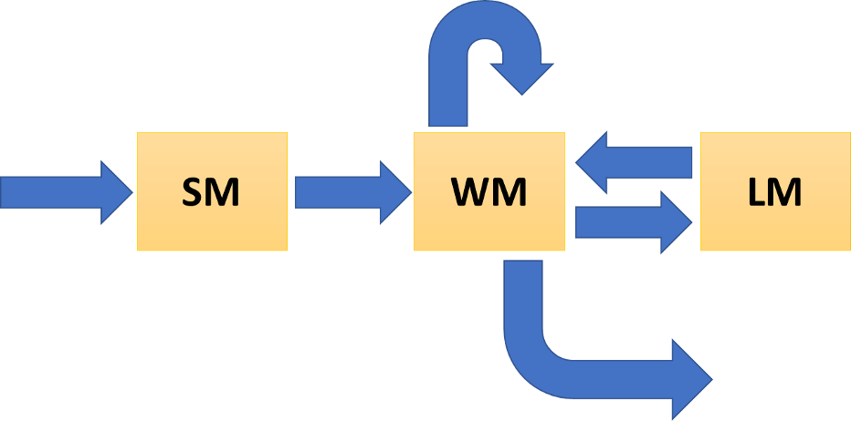

[← go back to the course main](README.md)

## Human Factors and Ergonomics (SIT22008)

### 3-1. Cognitive Ergonomics I: Information Processing Model

The information processing model (IPM) explains a lot of things related to how we live, including how we think, how we chose and decide, how we learn something, how we feel, how we move, and so forth. As information processing is happening in the human brain, it is related to cognitive work. 

The scope of Cognitive Ergonomics is: (1) understanding of how human cognitively behave, (2) improvement of  cognitive skills and human performances, and (3) ergonomic/human-centered design for reducing human mistakes as well as decreasing hazardous results can be caused by the human error.

The IPM is one of the basic understandings about human. Students need to be available to explaining human behaviors based on the IPM.

Keywords: `#information processing model`, `#information processing theory`, `#cognitive process model`, `#human information processing`, `#sensory memory`, `#short-term memory`, `#working memory`, `#long-term memory`, `#attention`, `#rehearsal`

#### [Video Lectures]

**A. Cognitive Ergonomics & Cognitive Engineering/Science**
- Human factors and related academic domains

<iframe src="https://www.youtube.com/embed/4VIYlxTowq8" frameborder="0" allow="autoplay; encrypted-media" allowfullscreen style="position: absolute; top: 0; left: 0; width: 100%; height: 100%;"></iframe>

- Human factors in NASA

<iframe src="https://www.youtube.com/embed/WlIoxcjMTew" frameborder="0" allow="autoplay; encrypted-media" allowfullscreen style="position: absolute; top: 0; left: 0; width: 100%; height: 100%;"></iframe>

- Cognitive ergonomics & medical research example

<iframe src="https://www.youtube.com/embed/fCg6B9SGsBI" frameborder="0" allow="autoplay; encrypted-media" allowfullscreen style="position: absolute; top: 0; left: 0; width: 100%; height: 100%;"></iframe>

- Cognitive science

<iframe src="https://www.youtube.com/embed/YOxmuNS6iV4" frameborder="0" allow="autoplay; encrypted-media" allowfullscreen style="position: absolute; top: 0; left: 0; width: 100%; height: 100%;"></iframe>

- NOTE. Human factors, cognitive engineering, and cognitive science are not the same academic domains, but there are some common understanding and shared knowledge among those fields.

- other videos/materials
	- [Cognitive Science Song (by Aarhus Universitet)](https://www.youtube.com/watch?v=XH42KFvnXyI)
	- [Introduction to cognitive engineer (Laura Major series)](https://www.youtube.com/watch?v=HYytuVIz9c4&list=PLApdl7sXvtv47yYRqi3J25ShT6aQCkEM6&index=1)

**B. Human Brain**

- Human Brain

<iframe src="https://www.youtube.com/embed/pRFXSjkpKWA" frameborder="0" allow="autoplay; encrypted-media" allowfullscreen style="position: absolute; top: 0; left: 0; width: 100%; height: 100%;"></iframe>

- How the brain works

<iframe src="https://www.youtube.com/embed/XSzsI5aGcK4" frameborder="0" allow="autoplay; encrypted-media" allowfullscreen style="position: absolute; top: 0; left: 0; width: 100%; height: 100%;"></iframe>

**C. Information Processing Model (IPM)**

- Introduction to IPM

<iframe src="https://www.youtube.com/embed/k5Dlsrs-85Y" frameborder="0" allow="autoplay; encrypted-media" allowfullscreen style="position: absolute; top: 0; left: 0; width: 100%; height: 100%;"></iframe>

- Other videos of explaining the IPM
	- [IPM](https://www.youtube.com/watch?v=aURqy9BEJO4)
	- [IPM by Khan Academy](https://www.youtube.com/watch?v=pMMRE4Q2FGk)
	- [IPM (in Korean)](https://www.youtube.com/watch?v=SXB8GWvfAo4)

- IPM 1: Sensation and perception I

<iframe src="https://www.youtube.com/embed/7n2PdngdNXk" frameborder="0" allow="autoplay; encrypted-media" allowfullscreen style="position: absolute; top: 0; left: 0; width: 100%; height: 100%;"></iframe>

- IPM 1: Sensation and perception II

<iframe src="https://www.youtube.com/embed/0SErqVGcAR0" frameborder="0" allow="autoplay; encrypted-media" allowfullscreen style="position: absolute; top: 0; left: 0; width: 100%; height: 100%;"></iframe>

- IPM 1: Limiataion of our brain & perception and attention

<iframe src="https://www.youtube.com/embed/9BdzhWdVaX0" frameborder="0" allow="autoplay; encrypted-media" allowfullscreen style="position: absolute; top: 0; left: 0; width: 100%; height: 100%;"></iframe>

- IPM 2: Attention - Selective attention

<iframe src="https://www.youtube.com/embed/qpsaHE_uZic" frameborder="0" allow="autoplay; encrypted-media" allowfullscreen style="position: absolute; top: 0; left: 0; width: 100%; height: 100%;"></iframe>

- IPM 2: Attention - Divided attention

<iframe src="https://www.youtube.com/embed/s4JBqLoY3tY" frameborder="0" allow="autoplay; encrypted-media" allowfullscreen style="position: absolute; top: 0; left: 0; width: 100%; height: 100%;"></iframe>

- IPM 2: Attention - Multi-tasking

<iframe src="https://www.youtube.com/embed/THJgaznSBu8" frameborder="0" allow="autoplay; encrypted-media" allowfullscreen style="position: absolute; top: 0; left: 0; width: 100%; height: 100%;"></iframe>

- IPM 3: Memory - Short-term memory

<iframe src="https://www.youtube.com/embed/_jdm2yH9M6c" frameborder="0" allow="autoplay; encrypted-media" allowfullscreen style="position: absolute; top: 0; left: 0; width: 100%; height: 100%;"></iframe>

- IPM 3: Memory - Long-term memory

<iframe src="https://www.youtube.com/embed/Yd95xXpbUas" frameborder="0" allow="autoplay; encrypted-media" allowfullscreen style="position: absolute; top: 0; left: 0; width: 100%; height: 100%;"></iframe>

- IPM 3: Memory - Movie, Inside Out

<iframe src="https://www.youtube.com/embed/xXYhua4IwoE" frameborder="0" allow="autoplay; encrypted-media" allowfullscreen style="position: absolute; top: 0; left: 0; width: 100%; height: 100%;"></iframe>

- other videos/materials
	- Watching the following videos helps for your understaning about attention
	- [Selective attention test](https://www.youtube.com/watch?v=_bnnmWYI0lM)
	- [Selective attention test](https://www.youtube.com/watch?v=U1saQoMRD8A)
	- [Divided attention training](https://www.youtube.com/watch?v=gZdej4rYfL0)
	- [Divided attention example: card game "SET"](https://www.youtube.com/watch?v=ZYx62PI46sA)

- Summary
	- Type of memories
		- sensory memory (SM): Human daily perceives a huge amount of information through 5 senses. But most of that information is quickly forgotten unless it is not attended.
		- working memory (WM): Also called short-term memory. Any information transferred from SM by the attention is processed for particular purposes such as calculation, comparison, estimation, creation, conceptualization, memorization, and so forth.
		- long-term memory (LM): Any treated information is saved/stored in LM if necessary to memorize. Any unsaved information is forgotten even it is once processed in WM.
	- Key processes
		- Perception
		- Attention: Transferring information from SM to WM (selective & divided attention)
		- Rehearsal: Repeated handling/treatment of attended information in order to prevent the quick disappearing of information from WM
		- Encoding: Saving information from WM to LM
		- Recall/Retrieval: Bringing stored information out from LM to WM
		- Reaction: Response of human behavior based on the results of the processed information
	- Link to human-centered design: A good design makes people's information processing quick and smooth. But a bad design such as unfamiliar interfaces, hard-to-use controllers, too many texts, unorganized data, complexity, incomplete functions will let people think a lot when they use it. 'Requiring a lot of thinking' means that any information is stuck in WM because it is uneasy to be treated in WM.

**D. Sleep and Cognitive Health**
I know students are very busy, and resting and sleeping are quite limited during the semester. I cannot easily request you to sleep more, but I want you to know that enough sleep makes the information processing quicker and smoother. Yes, as mentioned above, the IPM can explain every action that human does.

- Lack-of-sleep problem

<iframe src="https://www.youtube.com/embed/Y-8b99rGpkM" frameborder="0" allow="autoplay; encrypted-media" allowfullscreen style="position: absolute; top: 0; left: 0; width: 100%; height: 100%;"></iframe>

- Science of sleep

<iframe src="https://www.youtube.com/embed/qvnyUhGm4Mo" frameborder="0" allow="autoplay; encrypted-media" allowfullscreen style="position: absolute; top: 0; left: 0; width: 100%; height: 100%;"></iframe>

- Measurement of biosignals while sleeping

<iframe src="https://www.youtube.com/embed/GMV6Cd0jVzc" frameborder="0" allow="autoplay; encrypted-media" allowfullscreen style="position: absolute; top: 0; left: 0; width: 100%; height: 100%;"></iframe>

**E. (Optional) Power of Brain**
- 타고난 한계를 뛰어넘는 인간은 어떻게 만들어지는가?

<iframe src="https://www.youtube.com/embed/uLy1YOjxt4U" frameborder="0" allow="autoplay; encrypted-media" allowfullscreen style="position: absolute; top: 0; left: 0; width: 100%; height: 100%;"></iframe>

#### Assignments
- Find related essay assignment from [Here](HFE_Essays.md).
- NOTE. The assignment topic might be changed during the semester but not updated in this site. Please always check LMS.handong.edu.

#### List of Video Lectures
- [1. Introduction to HF/E](HFE01.md)
- [2-1. Physical Ergonomics I](HFE02_1.md): Biomechanics
- [2-2. Physical Ergonomics II](HFE02_2.md): Anthropometry, ergonomics at workplace, virtual ergonomics
- **3-1. Cognitive Ergonomics I: Information Processing Model**
- [3-2. Cognitive Ergonomics II](HFE03_2.md): Fight or flight response, human error, cognitive training
- [4-1. Emotional Ergonomics I](HFE04_1.md): Emotional Design
- [4-2. Emotional Ergonomics II](HFE04_2.md): Emotional Engineering, Measurement of Human Emotion
- [5-1. Usability Engineering I](HFE05_1.md): User-Centered Design Principles
- [5-2. Usability Engineering II](HFE05_2.md): Usability Evaluation, Build-Measure-Learn