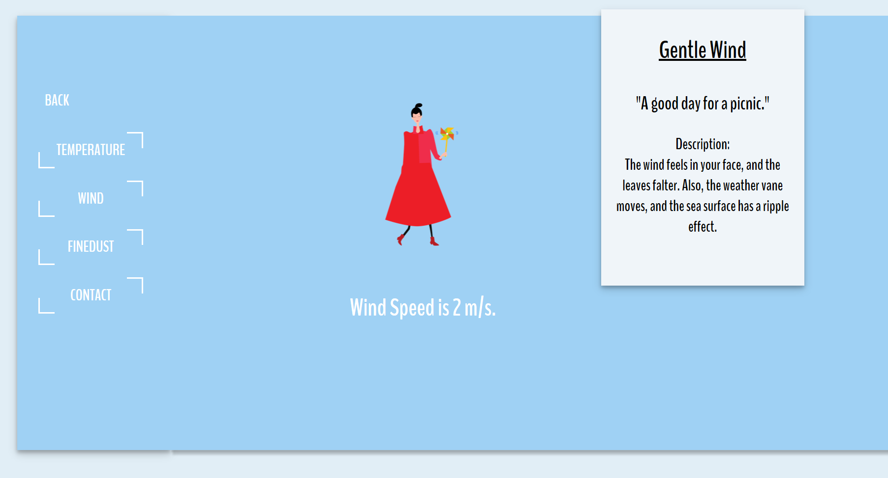
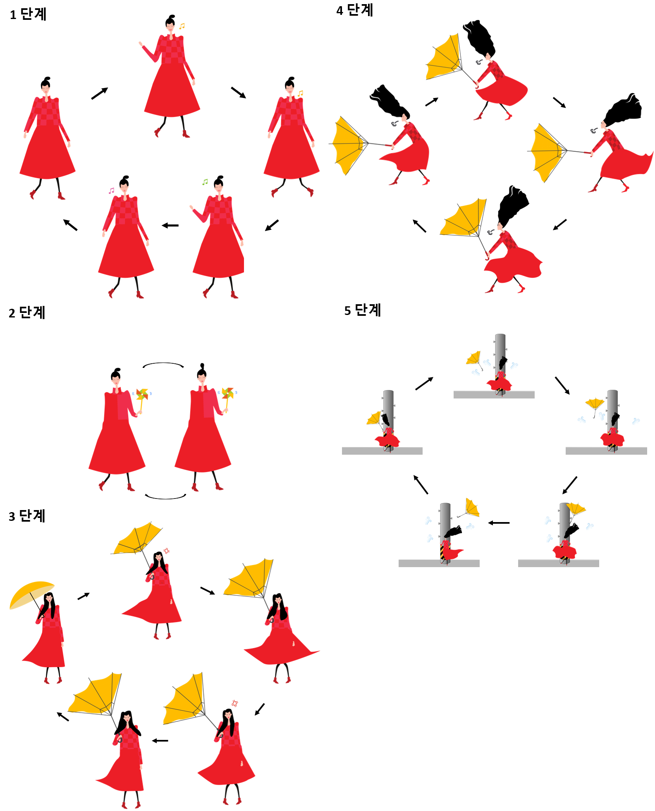
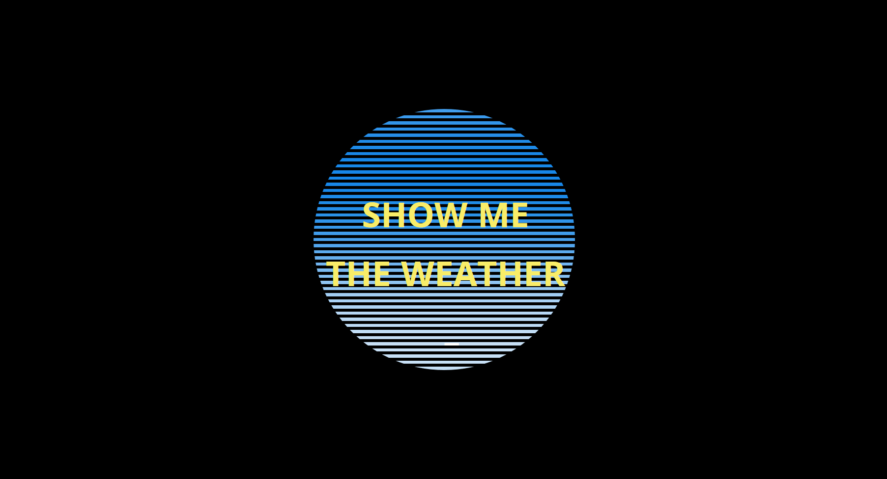
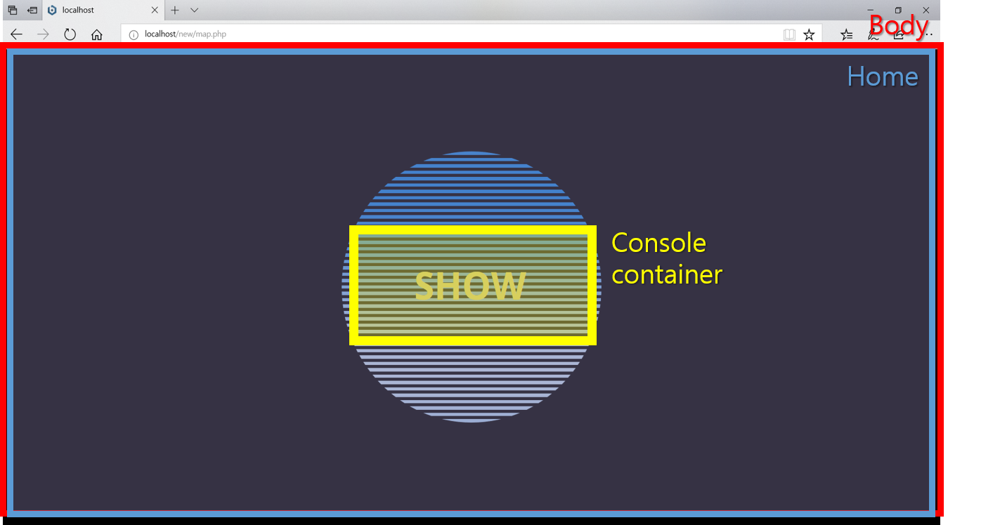
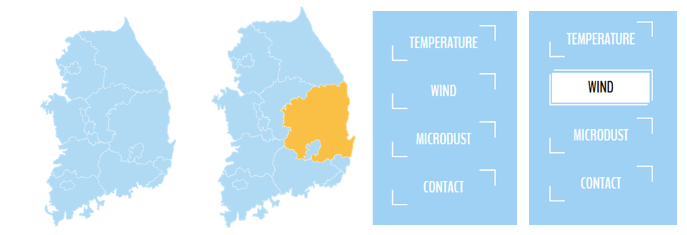

[← go back to the list](../../HCI.md)

# Interactive Media Art

## Introduction
“SHOW ME THE WEATHER”는 날씨를 시각적으로 보여주는 웹사이트로, 사용자가 날씨에 대한 정보를 읽지 않더라도 그림, 애니메이션 등으로 표현하여 직관적으로 알 수 있게 한다. 일반적인 날씨 알림 사이트/앱에서는 날씨를 숫자형 데이터와 간단한 기호로 알려준다. 예를 들어, 풍속  “7 m/s, → ” 와 같은 숫자와 방향기호를 보고 바람의 세기를 추측하기 쉽지 않다. 그래서 우리 팀은 날씨 데이터를 알려주는 것뿐만 아니라 시각적으로 보여줌으로써 사용자가 날씨 정보를 쉽게 인식할 수 있는 웹사이트를 만들기로 기획하였다. Javascript와 CSS를 이용하여 한 페이지 안에서 다양한 정보가 가시화될 수 있도록 하였다.



#### Members
- 김주은, 이예담, 정지원, 박예은, Ruth Nvoni, Smith Childreni


<br><br><br>
## 1. Research
웹사이트 구축의 첫 번째 단계는 자신의 사이트에 대해 어떤 것을 원하는지(그리고 원하지 않는지)를 확인하기 위해 최대한 많은 정보를 수집하는 것이었다. 다양한 interactive website, 지도 관련 사이트 그리고 경쟁업체들의 사이트(날씨 관련 사이트)들을 살펴보고 친구 및 교수님으로부터 피드백을 얻어 이러한 작업을 수행할 수 있었다.

### 1-1. 용도
SHOW ME THE WEATHER 사이트의 용도는 직관적으로 알기 어려운 데이터를 시각화하여 사용자로 하여금 알기 쉽게 하는 것이다. 또한 재미의 요소를 더하여 사용자와 상호작용하는 데에 목적이 있다. SHOW ME THE WEATHER에서 제공하는 것은 캐릭터를 이용한 날씨(바람) 정보이다.

### 1-2. 목표
방문자들이 SHOW ME THE WEATHER 사이트를 방문할 때 바람 데이터와 시각화된 캐릭터 애니메이션을 동시에 확인함으로써 실시간 바람 상황을 직관적으로 파악하는 것이 목표이다.

### 1-3. 대상
실시간 날씨와 바람 상황을 궁금해하는 전 연령층 

### 1-4. 콘텐츠
특정 지역에 대한 날씨 정보를 알고 싶은 사용자가 캐릭터 애니메이션을 통해 원하는 정보를 쉽게 확인할 수 있다. 


<br><br><br>
## 2. Planning
### 2-1. 웹페이지 이름
우리 팀은 사용자가 정보나 데이터를 쉽게 인식 할 수있는 웹 사이트를 만들고자 했다. 우리의 목표는 데이터를 알리는 것만이 아니라 사용자가 쉽고 빠르게 이해할 수 있도록 데이터를 표시하는 것이였다. 그래서, 우리의 웹 사이트 이름은 ‘Show me the Weather’로 정하였다. 우리는 목적은 단순히 날씨를 알려주는 것뿐만 아니라 사용자가 쉽게 받아 들일 수 있도록 날씨를 시각화해서 보여주고, 사용자가 사이트를 계속해서 사용하도록 흥미롭게 사이트를 만드는 것이였다. 우리 팀은 아직 개발 단계이기 때문에 바람 데이터에 집중하기로 기획했다.


### 2-2. 팀 분배
- Design: 정지원, 박예은
- Map Development: Ruth, Smith
- Web Desvelopment: 김주은, 이예담


## 3. Design
### 3-1. 풍속에 따른 데이터 시각화
- 풍속에 따라 바람을 5단계로 나누고, 단계에 따른 이름, 코멘트, 특징 정하기

단계 | 풍속 | 바람 이름 | 코멘트 | 특징
---- | ---- | -------- | ----- | -----
1 | 0 ~ 1.5 m/s | Breeze | "There is no wind today." | As the most windy wind, the sea surface has ripples in the form of fish scales.
2 | 1.6 ~ 5.4 m/s | Gentle wind | "A good day for a picnic" | The wind feels in your face, and the leaves falter. Also, the weather vane moves, and the sea surface has a ripple effect.
3 | 5.5 ~ 10.7 m/s | Biting Wind | "Oh! Today I give up my hair." | Trees with small leaf begins to shake, and a small wave of water is created in the lake.
4 | 10.8 ~ 17.1 m/s | Strong Wind | "I should cancel everything today." | The whole big tree shakes, and it is hard to walk toward the wind. At sea, the waves get rougher and the trough breaks
5 | 17.2 m/s 이상 | Typhoon | "If you want to fly, go outside."" | There is a slight damage to the building, such as a chimney cap and slate. At sea, the storm rises and the water spirals up.

<br><br>
- 단계에 따른 캐릭터 정하기: 스케치 & 벡터 이미지 제작


- 캐릭터를 애니메이션으로 만들기 위해 자세를 약간씩 편집: 위의 단계에서 만든 SVG 파일을 일러스트(Illustrator CC)를 사용하여 SVG 파일의 백터를 움직여 각 캐릭터의 행동을 수정하였다. 수정된 파일들을 연결하여 애니메이션을 만들 수 있도록 하였다.


<br><br>
### 3-2. 사이트 구조 및 세부사항 디자인


위의 그림과 같이, 사이트의 구조를 정하였다. 사이트는 크게 4개의 화면으로 구성되는데, 첫화면, 도로 나눠진 한국지도, 시/군/구로 나눠진 도별 지도 그리고 날씨예보 화면이다.

- 첫 화면

	첫 화면에는 사이트의 이름을 명시하기로 하였다. 그냥 명시만 한다면 사용자가 쉽게 지루하게 느낄 수도 있다고 판단하여 interactive한 디자인을 더하였다. 검정색 배경에 중간에 앱 이름을 넣을 원을 삽입하였다. 재미를 더하기 위해 계속해서 색이 하늘색(#1787EB)에서 탁한 흰색(#c3e1f7)로 변하는 원을 디자인하였다. 또한 사이트 이름은 철자 순서대로 작성하여 사용자가 사이트 이름에 집중할 수 있도록 하였다. 사이트 이름을 클릭하면 다음 화면으로 넘어가도록 하였다. 

- 우리나라 지도, 도별 지도

	배경은 연한 하늘색(#e1eef6), 지도는 하늘색(#b0daf4)로 설정하였고, 지도에 마우스 커서가 올라가면 주황색(#f9c045)로 변하게 하였다.

- 날씨 예보 화면

	이 화면의 배경은 연한 하늘색(#e1eef6)로 이전 화면과 어색함이 없도록 하였다. 왼쪽에는 메뉴, 중앙에는 날씨예보로 구성된다. 메뉴는 흰색이며 Temperature, wind, finedust 그리고 contact 4가지로 구성되고, 마우스 커서가 닿을때마다 interactive하게 반응한다. WIND를 누르면 하늘색(#9fd1f4) 박스와 그 오른쪽 위에 흰색 박스(information box)가 생긴다. 하늘색 박스 중앙에는 날씨에 해당하는 풍속에 따른 애니메이션이, 오른쪽 위에는 그 바람에 대한 설명이 위치한다. 애니메이션 밑에는 흰색으로 오늘의 풍속을 알려주며, information box에는 위에서 정했던 바람의 이름, 코멘트 그리고 특징을 알려준다.


## 4. Development
### 4-1. Setting
- 윈도우에 PHP 설치하기
	- PHP는 서버쪽에서 실행되는 프로그래밍 언어로서 주로 HTML코드를 프로그래밍적으로 생성하는데 쓰인다. 웹에 최적화된 언어이며 웹개발에 필요한 로직들을 함수의 형태로 제공하는 장점이 있다. 많은 공개소프트웨어가 PHP로 만들어진다.
	- PHP를 설치하는 방법은 여러가지가 있으나, Bitnami라는 설치 패키지를 통해 직접 서버를 컴퓨터에 설치하여 개발하는 것이 저장 및 수정에 용이하다.
	- 설치방법은 다음 링크를 참조하면 된다. [https://opentutorials.org/course/62/5103](https://opentutorials.org/course/62/5103)
- Server에 Web page hosting 하기
	- 만든 홈페이지를 PC에만 저장해 놓으면 인터넷상에서 실제 user는 해당 홈페이지를 인터넷 상에서 볼 수 없다.  따라서 인터넷에 연결된 웹 사이트를 실행하려면 서버 컴퓨터를 24시간 365일 항상 실행해야 하는데, 개인, 기업 및 조직이 서버 컴퓨터를 운영하기 위해서는 많은 비용이 든다. 또한 전문인이 관리하는 것이 아닐 경우 해킹이나 디도스 공격에도 매우 취약하다. 
	- 이러한 문제들을 해결하기 위해 전문 호스팅 업체가 미리 많은 서버 컴퓨터를 구축한 다음 일정 부분의 공간을 사용자에게 임대하고 그 대가를 받는 서비스가 생겨났는데 이것이 hosting이다. 따라서 웹을 hosting 해주는 서비스를 web hosting이라 부른다. (참고자료: [http://ozhome.co.kr/hosting/about.html](http://ozhome.co.kr/hosting/about.html) , [http://mildang7.tistory.com/5](http://mildang7.tistory.com/5))
	- 다양한 hosting 업체 들이 있는데 그 중 무료로 웹 hosting service를 제공하는 dothome을 사용하였다. (참고자료: [https://www.dothome.co.kr/index.php](https://www.dothome.co.kr/index.php) )
	- 과정은 다음과 같다.
		1. Dot home에 가입한다. 
		2. 무료 호스팅 탭을 들어간다.
		3. 무료 호스팅을 신청한다.
		4. 웹 호스팅 설정 정보를 입력한다. 입력하는 정보가 도메인 주소가 되며, FTP로 server에 hosting 시 정보가 되므로 잊어버리지 않도록 주의한다.
		5. 만들어진 기본 웹 홈페이지는 다음과 같다.

### 4-2. Initial Page
- 초기화면에서는 서비스의 이름을 알려준다. ‘SHOW ME THE WEATHER’라는 제목을 dynamic하게 표현하기 위해서 키보드로 타이핑하는 듯한 효과를 주었다. 텍스트를 클릭하면 다음페이지로 이동한다.
- 화면 구성



- 구조
	- `Home`: 초기화면을 나타내는 div
	- `Console-container`: 텍스트를 출력하는 div
	- `Container`: 선들을 보여주기 위한 div
	- `Line`: 선을 그리는 div
- 코드설명: HTML에서 텍스트 상자를 만들고 선을 여러 개 그렸다. 선들의 색을 시시각각으로 변화시키기 위해 CSS에서 animation 효과를 주었다. 그리고 JavaScript를 통해 텍스트를 입력하고 지우는 이벤트를 반복하도록 함수를 구현하였다.

### 4-3. MAP
- 홈화면에서 텍스트를 클릭하면 지도화면으로 이동한다. 지도화면은 남한지도를 띄우는데 이용자가 날씨를 확인하고자 하는 시⠂도를 마우스로 클릭하면 그 지역의 세부지도를 보여준다. 예를 들어, 경상북도를 클릭하면 남한지도는 사라지고 경상북도 지도가 나온다. 이 화면에서 다시 원하는 지역을 누르면 날씨 서비스 제공화면으로 이동한다. 왼쪽 상단의 뒤로가기 버튼을 통해 이전 단계로 되돌아갈 수 있다.
- 지도 이미지는 SVG format으로 제작된 것을 인터넷에서 다운로드 받았다. 이 파일의 point 들은 지도상의 지역들의 모양과 경계를 구분하고 형성한다.
- 화면구성


- 구조
	- `Menu`: 메뉴 구성을 위한 div
	- `Main`: 날씨 정보 제공을 위한 div
	- `Map`: 지도를 보여주는 div
- 코드 설명 : 지도의 화면전환을 위해 jQuery를 이용해 click, hide & fade-in(out) 효과를 주었다.

### 4-4. Menu (Wind)
- 바람의 세기에 따른 해당하는 level의 이미지들을 반복하여 겹쳐 보여줌으로써 마치 그림이 영상처럼 움직이는 듯한 효과를 준다. 
- 화면 구성

 
 - 구조
	- `windContentBox`: 바람에 해당하는 모든 정보를 담고 있는 div
	- `imgBox` (class): 각 level에 해당하는 그림이 나타나는 div. 반복적으로 보여지게 되는 img들이 저장되어 있다. 현재 5가지 레벨이 있으므로, `firstImgBox`, `secondImgBox`, `thridImgBox`, `fourthImgBox`, `fifthImgBox`가 있다. 
	- `textBox`: 실제 바람의 세기 정보를 보여주는 div
	- `windInfoBox`: 바람의 레벨에 대한 정보와 간략한 설명을 보여주는 div
- 코드 설명
	- menu의 `wind` button을 클릭하면 onClick event에 따라 reply_wind()함수를 실행시킨다.
	- `windContentBox`를 제외한 모든 div를 감춘다. (hide()함수 사용)
	- `windSpeed` 변수에 현재 바람의 세기 값을 저장한다.
	- `windSpeed`에 따라 해당 level의 div를 보여준다. (show() 함수 사용)
	- img 순서대로 차례차례 보이기와 감추기를 반복하는 함수를 만든다.
	```
	function fadeInLastImg() {
	      var backImg = $('#firstImageBox img:first');
	      $('.img').hide();
	      $('#firstImageBox').append(backImg);
	      backImg.show();
	};
	```
	- setInterval 함수를 반복한다.  
	- windbutton을 반복적으로 클릭 시 함수 호출 반복을 방지하기 위해 flag 변수를 update 시켜준다.

### 4-5. Menu (Temperature / Find Dust)
- 기상청에서 제공하는 1시간 간격으로 실시간 날씨 정보 데이터를 읽어온다. Temperature 에서는 오늘 날짜와 시간, 기온, 습도, 하늘 상태와 강수 확률에 대한 정보를 제공하고, fine dust에서는 현재 미세먼지 농도와 미세 먼지 농도 수준에 대한 정보를 시각적으로 보여준다.
- 코드 설명: [Google sheet에 기록된 RSS 공공 데이터](https://HandongHCI.github.io/Tutorials/ReadGoogleSheets.md)를 각 cell에 접근하여 읽는다. 각 조건문에 따라 정보를 해당 div로 보내준다.

### 4-6. Ways of Interaction
- one page web page: web page를 구성하는 파일을 여러 개로 구분하지 않고 1개 파일 안에서 다양한 레이아웃, 시각화, 정보를 표현하고 있다.

- Mouse hover: 마우스를 특정 위치에 올려놓으면 색상이나 모양이 바뀌는 등의 효과가 나타난다. 이용자는 자신의 움직임에 따라 실시간으로 변화하는 디자인을 통해 상호작용이 일어나고 있음을 인지한다.

  
- Animation: 이 웹사이트에서 모든 화면 전환간에는 animation 기능이 적용되어 있다. Fade-in, Fade-out 뿐만 아니라 Slide-up, Delay 등을 사용해 시간차를 두어 이용자가 감성적이고 편안하게 느끼도록 설계되었다.

- Gradient & Pastel Color: 전체적인 색상조합에서 그라디언트 컬러와 파스텔 컬러가 주를 이루었다. 그라디언트 컬러는 플랫 컬러에 비해 더욱 역동적이고 생동감 있다. 두개 이상의 다중 컬러로 구성되어 있어 보다 깊은 감정적 접근을 끌어낸다. 그라디언트와 파스텔이 조합될때 감정적 호소력은 더 강화된다.


## Demo & Source Codes
- <a href="https://github.com/HandongHCI/HandongHCI.github.io/tree/master/HCI2018S/InteractiveWeb/output" target="_blank">Demo</a>
- <a href="http://HandongHCI.github.io/HCI2018S/InteractiveWeb/output" target="_blank">Source Codes</a>

<div style="position: relative; padding-bottom: 56.25%; padding-top: 25px; height: 0;"><iframe src="https://www.youtube.com/embed/JUqfB8Ri_Q0" frameborder="0" allow="autoplay; encrypted-media" allowfullscreen style="position: absolute; top: 0; left: 0; width: 100%; height: 100%;"></iframe></div>


<br><br><br>
[← go back to the list](https://HandongHCI.github.io/STUdentProjects/HCI2018S)