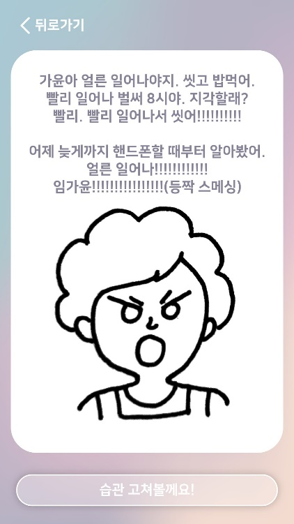
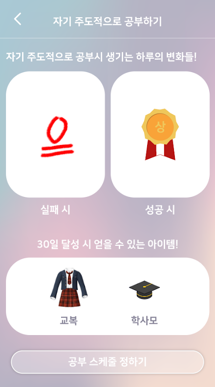
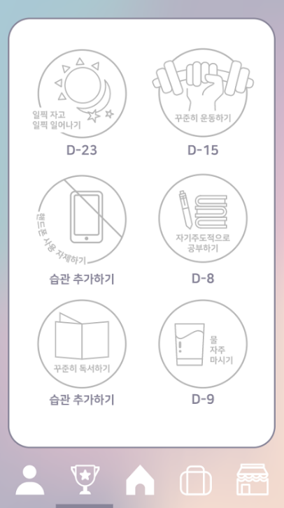
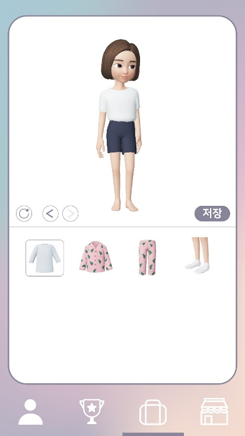

[← go back to the list](../README.md)

# 엄마잔소리
 

#### 다양한 요인으로 인해 늘어나고 있는 1인 가구를 대상으로 망가져가고 있는 생활 습관을 보상과 처벌을 통한 습관개선 동기부여 시스템으로 개선시켜주고 하자는 어플

#### Members

## Introduction
도시화와 고용 시장의 불안정화 등 사회적 변화로 인해 혼자 사는 사람들의 인구가 늘어나고 있습니다. 1인 가구는 자유로운 삶으로 인해 자신들의 생활습관을 망가뜨리는 경우가 많은데, 1인 가구가 늘어나고 있고, 이러한 상황 속에서 그들의 생활 습관을 개선할 수 있는 시스템이 있으면 좋을 것 같다는 생각과 1인 가구에 대한 자료를 조사해본 결과 1인 가구의 우려사항 2위가 건강으로 나타나 있는 것을 보고 1인 가구를 타겟으로 한 ‘생활 습관 개선 시스템’을 만들기로 구상했습니다. 생활 습관 개선 시스템으로 이루고 싶은 목표는 크게 3가지입니다. 꾸준한 관리, 눈에 바로 보이는 보상, 정확한 정보를 목표로 서비스를 구현하고자 합니다.

## Main Contents
엄마 잔소리 시스템의 최종 형태는 스마트폰을 기반으로 한 어플 형태로 제공될 계획입니다. 시스템에서 제공될 기초적인 기능과 사용자 편의성을 위한 UI/UX를 확인하고자 Adobe XD를 활용한 Paper Prototype을 구현하였습니다.

### A. 로그인 및 회원가입

사용자는 회원가입을 통해서 시스템을 이용할 수 있습니다. 사용자로부터 기본적인 정보를 입력 받아 기본정보를 기준으로 비슷한 환경을 가지고 있는 사용자가 이용하고 있는 습관을 추천해줍니다. 그렇기 때문에 회원가입에서는 성별, 생년월일, 직업, 취미와 같은 기본적인 정보를 입력 받아 아이디를 생성할 수 있습니다.

### B. 스토리(intro) 화면

회원가입을 마치면 본격적으로 어플을 사용하기 전 간단한 스토리 화면이 나타나게 됩니다. 어플의 스토리는 집에만 있는 자녀가 빈둥빈둥 대는 것을 본 어머니가 습관을 개선하면 보상을 해주겠다는 스토리입니다.

### C. 습관 선택 메뉴

어떠한 습관에 대한 서비스를 제공할지 결정하기 위해서 110명의 대학생들에게 설문조사를 받고 그 결과를 바탕으로 6가지 습관을 선정하였습니다. 일찍 자고 일찍 일어나기, 꾸준히 운동하기, 핸드폰 사용 자제하기, 자기주도적으로 공부하기, 꾸준히 독서하기, 물 자주 마시기가 있습니다.

### D. 습관 별 보상

습관별 보상 씬에서는 습관을 개선하면 캐릭터에게 주어지는 효과를 시각화 해놓았습니다. 또한 30일이상 습관을 지속할 시 캐릭터에게 지급되는 아이템들을 보여줍니다. 현재 보이는 씬은 일찍자고 일찍일어나기입니다. 씬마다 주어지는 아이템과 효과가 다릅니다. 운동의 경우는 캐릭터의 살이 빠지고, 트레이닝복 세트를 주며, 자기주도적으로 공부하기의 경우 상장과 교복, 학사모를 획득할 수 있습니다. 이렇게 각 습관의 특성에 어울리게 보상을 세분화 해 놓았습니다.

### E. 습관 세부 설정

개선하고 싶은 습관을 정했다면 습관 개선에 대한 세부사항을 설정할 수 있습니다. 먼저 습관을 어떤식으로 설정하면 좋은지 권장사항을 사용자들에게 알려줍니다. 그 밑으로는 사용자들이 습관을 수행하고 싶은 요일, 시간등을 설정할 수 있습니다. 저장 이후에는 다른 습관에 관심이 더 있다면 더 선택할 수 있도록 다시 습관선택화면으로 돌아옵니다. 습관을 더이상 추가하지 않고 저장하고 싶다면 하단에 저장하기 버튼을 눌러 진행할 수 있습니다.

### F. 메인 화면

습관을 설정하고 난 뒤 보여지는 어플의 메인화면입니다. 중앙에 있는 캐릭터의 경우 사용자에게 주어지는 어떠한 아이템도 착용하지 않은 기본 캐릭터입니다. 또한 메인화면에는 5가지 버튼을 볼 수 있습니다.

### G. 오늘의 습관 목록 및 시간 변경

종모양 버튼은 오늘의 습관 목록을 확인할 수 있는 버튼입니다. 클릭하면 오늘 하루 수행해야 하는 습관들의 목록을 볼 수 있습니다. 각 습관들마다 3가지 버튼이 있습니다. 가장 왼쪽에 있는 체크박스의 경우 습관의 수행 여부를 나타냅니다. 습관을 완료하였다면 체크박스가 채워집니다. 습관의 바로 옆 “지금”이라는 버튼은 습관을 지금 바로 수행한다는 것을 의미합니다. 하루의 일정이 바뀔 수 있기 때문에 만약 지금 당장 습관을 할 수 있는 환경이 된다면 저 버튼을 눌러 습관을 수행할 수 있습니다. 바로 오른쪽에 시계 모양의 버튼은 기존에 정해진 시간을 변경하고 싶을때 설정하는 것입니다. 역시 일정이 틀어질 수 있기 때문에 그런 상황을 대비하여 만들어진 버튼입니다.

### H. 습관 달성도 확인

가장 좌측에 사람모양의 버튼은 습관 달성도를 확인 할 수 있는 버튼입니다. 사용자의 기본 정보와 습관의 수행 정도를 그래프를 이용하여 시각화하여 제공합니다. 또한 습관 추가하기 버튼을 통해서 습관을 쉽게 추가할 수 있습니다.

### I. 업적 관리

좌측에서 두번째 트로피 모양의 버튼은 업적 관리 버튼입니다. 어플에서 제공하는 모든 습관을 확인해 볼 수 있습니다. 본인이 어떠한 습관을 수행하고 있으며 추가적으로 어떠한 습관을 수행할 수 있는지 확인이 가능합니다. 만약 수행하고 있지 않은 습관중에서 추가로 수행하고 싶은 습관이 있다면 습관 추가하기 버튼을 통해서 해당 습관의 설정 화면으로 바로 넘어가게 됩니다.

### J. 마이룸 및 상점

마지막 화면은 습관 수행을 통해서 얻은 코인과 보상을 확인할 수 있는 마이룸과 코인을 통해서 구매할 수 있는 아이템들이 나와 있는 상점 씬입니다.

### K. 습관 알리미

습관을 수행할 시간이 된다면 위의 화면과 같이 알림이 오게 되며, 사용자는 지금 바로 습관을 수행할지 아니면 나중에 선택할지 선택하게 됩니다.

### L. 습관 실행 인증

습관을 수행하는 것을 인증 할 수 있도록 스마트폰 카메라를 이용하여 상징적인 사물 또는 인물을 찍어야 합니다.

### M. 습관 실행 및 취소에 대한 결과

습관을 실행하면 칭찬의 말로 응원합니다. 하지만 사용자가 습관 실행을 취소하거나 시간안에 하지 않는다면 오른쪽과 같은 잔소리 화면이 나타나게 됩니다.

## Demo Video

<iframe src="https://www.youtube.com/embed/MEzwvKg8g9k" frameborder="0" allow="autoplay; encrypted-media" allowfullscreen style="position: absolute; top: 0; left: 0; width: 100%; height: 100%;"></iframe>

## Conclusion

### A. Limitations and feture studies

#### 1. 컨텐츠의 부족

위의 그래프는 엄마잔소리 어플이 장기적으로 사용할 수 있을 정도로 콘텐츠가 충분한지에 유저리서치 결과입니다. 그 결과 콘텐츠가 충분하지 못하다는 의견이 6명중 4명으로 과반수 이상이 부족함을 느끼고 있었습니다. 습관을 지속적으로 개선하기 위해서는 사용자들에게 지속적으로 충분한 동기를 부여해주어야만 했습니다. 하지만 아직 동기부여를 위한 콘텐츠로 코인과 아이템밖에 없기 때문에 사용자들이 충분하지 못하다고 느끼고 있었습니다. 이러한 콘텐츠 부족현상을 해소하기 위해서 미니게임, 랭킹 시스템 등 추가적인 콘텐츠를 구상 할 것입니다.

#### 2. 모든 습관을 인식할 수 있는 시스템 구축
현재 습관을 수행하였는지 판단하는 알고리즘은 사진을 통한 특정 사물이나 인물의 인식입니다. 예를들어 사용자가 공부를 했는지 시스템이 판단하기 위해서는 비슷한 사진을 지속적으로 학습하여 같은 책을 찍었는지 판단하는 것입니다.

하지만 이러한 시스템의 경우 모든 습관에 대해서 일반적으로 사용할 수 있는 시스템이 아닌 특정 습관에만 적용할 수 있는 판단 시스템입니다. 이러한 일반화 되지 못한 판단 시스템을 넘어서 모든 습관에 적용할 수 있는 일반적인 판단 시스템이 필요하다고 판단되었습니다. 예를들어, 인스타그램과 같이 단순히 시스템이 판단하는 것이 아니라 사용자가 수행한 습관을 다른 사용자들과 나누는 방법이 있습니다. 이러한 방법을 이용하면 시스템이 습관 이행 여부를 판단하는 것이 아닌 다른 사용자들과의 소통을 통해서 스스로 동기부여를 해주는 방법이 있습니다.

### B. The conclusion paragraph of the document

#### 1. 시스템 flow의 구체화
프로젝트를 진행함에 있어서 가장 신경을 많이 쓴 부분은 시스템의 flow를 구성하는 일입니다. 사용자들이 원하는 서비스를 제공함에 있어서 사용자들이 이해 가능하면서 편리하게 이용할 수 있도록 서비스를 제공하기 위해서 시스템의 흐름은 자연스럽고 쉽게 이해할 수 있어야 했습니다.

이러한 시스템의 흐름을 위해서 대부분의 기능과 설명들은 “글자”에서 아이콘으로 변경하여 사용자들이 읽어보지 않고 그림을 보는 것만으로 쉽게 이해할 수 있도록 했으며 시스템이 순차적으로 흘러갈 수 있도록 하였습니다.

#### 2. 중심 기능의 결정
Main 아이디어는 결정되었지만 아이디어를 뒷받침 하는 다양한 기능들 중에서 핵심적인 기능을 선택하는 것이 쉽지 않았습니다. 다양한 기능들 중에서 정말 사용자들이 필요하고 우리의 아이디어를 뒷받침 할 수 있는 기능들만을 선정하기 위해서 User Research를 통해서 사용자들의 의견을 반영하여 기능들을 선정하였습니다.

#### 3. 사용자들에 대한 이해
사용자들이 정말 원하는 서비스를 만들기 위해서는 예비 사용자들에 대한 이해가 필요했습니다. 또한 이해에서 그치지 않고 사용자들을 위한 기능과 개발자들이 이룩하고 싶은 목표 사이의 적절한 타협이 필요했습니다. 예를들어 사용자들은 자유롭게 습관을 추가하고 싶어하였지만 그러한 기능을 구축하기 위해서는 전체적인 시스템 자체를 변경해야 했기에 기회비용이 너무 막대했습니다. 그렇기 때문에 현실과 타협하여 사용자들이 원하는 습관을 설문조사를 통해서 결정하고 모든 습관을 판단할 수 있는 시스템을 후에 개발하도록 하였습니다.

## References
- 이연서, 윤다원, 권민정, 윤서경, 이한아, 윤재영. (2019). islet’s : 지속적인 제로웨이스트 생활 습관을 위한 게이미피케이션 서비스. 한국디자인학회 학술발표대회 논문집, 255-256.
- 임선영, 박준호, 장현국. (2018). 물 섭취 습관 행동 개선을 위한 IoT 디바이스. 한국HCI학회 학술대회, (), 598-601.
- 박지연, 김혜경. (2014). 생활습관개선 프로그램이 성인의 식이 행동과 신체활동 및 심혈관위험요인에 미치는 효과. 보건교육건강증진학회지, 31(4), 37-49.