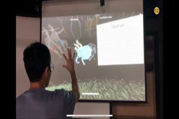
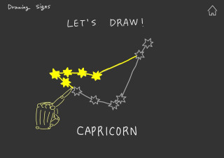

[← go back to the list](../README.md)

# SignZ*ONE Educational Contellations Program

#### A constellation education program that freely identifies constellations with simple hand gestures and provides the origins and information of constellations through leap motion.

#### Team Members
- Heesu Kim 
- Dongchan Park 
- Jihoon Kim 
- Minjoo Park 

## 1. Introduction: Background and goal of your research
### Background
We found it difficult to see the constellations due to urbanization and some problems of textbook-based constellation education. Because of the lighting that doesn't go out at night due to urbanization, children no longer have the chance to see the beautiful stars in the night sky. We have developed a constellation education program to provide opportunities to actually see numerous constellations in the night sky, rather than to check out flat constellations in books or textbooks. To maximize user interaction, our program wanted to use Leap Motion devices to increase the effectiveness of constellation training.

### Purpose of the program
- Make it interesting to be interested in the night sky and constellations.- Reveals myths and origins related to the location of constellations in the night sky.
- Make sure you know what your birthday sign is.
- Create your own constellation and develop your creativity.
- It makes you feel the beauty of constellations in the night sky by making you feel like you are actually looking at the night sky.

## 2. Main contents
### How to build our program
We used Maya to implement spheres, grass, constellation textures, etc. It was possible to efficiently generate various 3D objects through Maya and Unity interlocking systems.
Unity was used to align the object with layout and to implement the functions required for the program. We implemented various interventions such as smooth screen movement, laycast, zoom in/out, fade in/out, etc.

We conducted two user tests. Through user test, I could get positive feedback that I understood the program, had no difficulty in using it, and had a neat design. However, there was a lack of diversity in content, and I also received feedback that it would be nice to support Korean. We adjusted the direction of development by reflecting some of these feedbacks, and we decided to refer to them in future research in the future.

### Idea Sketches

 

### Paper Prototype

 

 

### Screen Capture of Program

 

 

### Explanation of program (visit [this site](https://github.com/HandongHCI/HandongHCI.github.io/tree/master/Courses/StudentProjects/HCI2020S/team12) if gif animations are not shown.)
#### [Start menu]

- We make users feel like they're going to see constellations by using night sky illust that shooting stars fall.
- Through fade-out, the screen naturally moves over to the main screen.

#### [Observing constellation]

- The main function of the SignZ*ONE program, Observing Constellation, consists of the Spread Mode and Constellation Mode.
- When the function is selected, the Spread mode is selected as the default setting.

#### [Spread Mode & zoom in/out]

- In the Spread Mode, you can observe countless stars scattered in the night sky, giving the illusion that the user is looking at the night sky.
- You can zoom in or out on the stars you want to see.

#### [Constellation mode]

- In Constellation Mode, you can look at various constellations in the night sky.
- You can find and check the constellation you want through moving the screen.

#### [Checking constellations' description]

- When the constellation is placed in the center of the screen, the constellation is activated to check the illustration and explanation of the constellation.
- Unactivated constellations appear opaque, allowing users to simultaneously check the shape and illustration of constellations.

#### [Home button, Setting, check my sign]

- Ppress the home button to return to the main screen.
- Setting allows users to set brightness, GPS, and position.
- Check my sign allows users to identify their constellations.

### Demo video

<iframe src="https://www.youtube.com/embed/nyjZu3eqUgc" frameborder="0" allow="autoplay; encrypted-media" allowfullscreen style="position: absolute; top: 0; left: 0; width: 100%; height: 100%;"></iframe>

## 3. Conclusion
Our project was expected to embody with leap motion. Firstly, we have realized the project skills with the keyboard and mouse. And then leap motion skills were required. However, because of technical and time constraints, we could not handle about this subjects. That is the biggest limitation of our project. 
      
Also, there are some limitations from user test. Some contents are insufficient to play, such as constellations are too close together in constellation mode, so it makes hard to get signs of each regions. Besides, several users wanted to feel sound and diverse effects (ex. shining stars) for the young target users. 
       
To commercialize our project, other languages are needed, and it would be nice to change the point of view, such as looking at the horizon when the user enters the spread mode.
       
Furthermore, we are going to develop more skills. Diverse of stars and signs are supplemented as well as the interactions. We just made the scroll bar that makes user can show the seosonal changes and GPS settings. It would be great to implement them. Also, we think about voice annoucement services. 
        
If we finally success the leap motion based project and supplement diverse skills, this software would be great educational program for young students and for whom are interested in constellation. 

### Github Link
- https://github.com/patience94/HCI_TeamProject_GroupNo2

### References
- [Unity core assets and modules for leap motion make it easy to design hands, user interfaces, and interactions. (LeapMotion, 2020)](https://code.tutsplus.com/tutorials/introduction-to-unity3d--mobile-107)
- [Graphic Renderer](https://leapmotion.github.io/UnityModules/graphic-renderer.html#shader-variants)
- [Leap Motion SDK for Unity](https://developer.leapmotion.com/unity)
- [Leap Motion is now part of Ultraleap](https://www.ultraleap.com/tracking/#how-it-works)
- [Leap Motion Unity Modules](https://github.com/leapmotion/UnityModules)
- [Leap Motion Unity Modules Leap Motion’s Unity SDK 4.4.0](https://leapmotion.github.io/UnityModules/index.html)
- [MAYA 3D computer animation, modeling, simulation, and rending software](https://www.autodesk.com/products/maya/overview)
- [Checkmysign image](http://woman.chosun.com/mobile/news/view.asp?cate=C04&mcate=M1004&nNewsNumb=20200465643)
- [Constellation image](https://blog.naver.com/washington22/221455419675)
- [Unity Ray casting](https://gyugyu.tistory.com/3)

### Source Code
- [download](souece/source.zip)