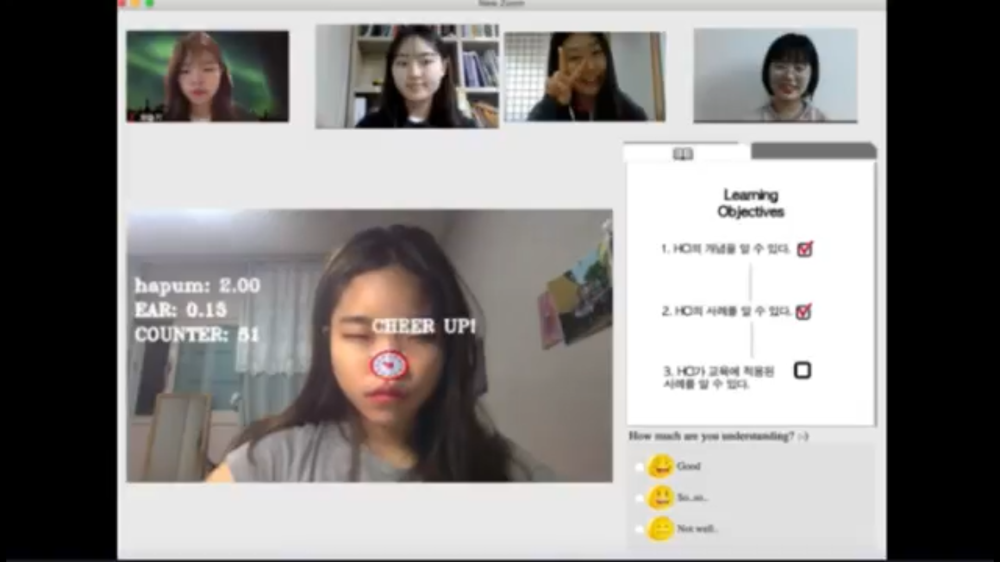
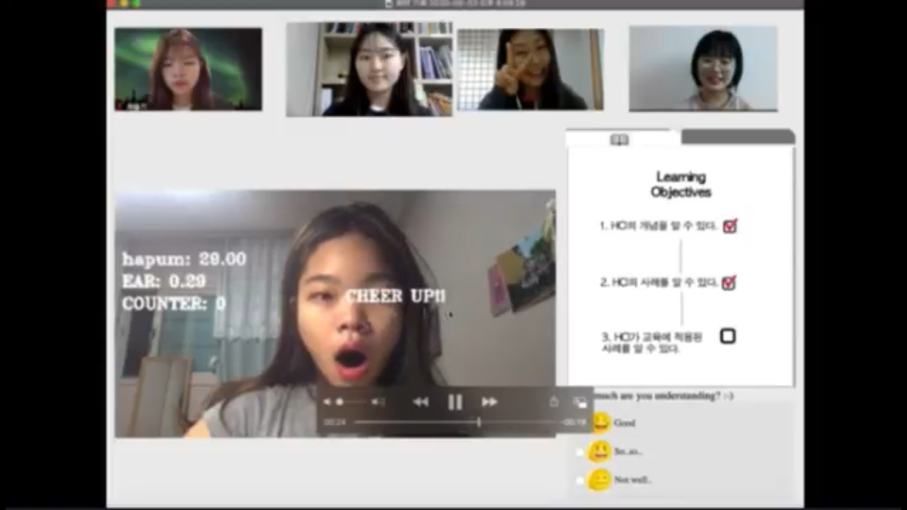

[← go back to the list](../README.md)

# Face Recognition-Based Interactive Online Lecture-Room

#### Increasing interaction between teacher-student of online learning using hand detection and face recognition in webcam
#### Members
박성경, 반수현, 최슬기, 장하리

## 1. Introduction 


### Background and goal of our research
코로나 사태로 인해 초등학교부터 대학교까지 많은 학교들이 온라인 수업으로 학기를 진행했다. 그러나 대면수업과는 달리 온라인 수업은 학생과 교사의 상호작용적인 수업이 아닌, 수업화면과 수업에 기반인 수업이 진행되었다. 그래서 기존 수업과는 달리 학생들과 교사들 사이의 상호작용이 원활하지 않다는 문제점을 발견하고, 이를 해소하기 위해 컴퓨터와 노트북에 흔히 내장되어 있는 웹캠을 이용하여 교사와 학생간의 상호작용을 높이고자 하였다. 내장된 웹캠을 손 인식과 얼굴 랜드마크 인식 기능을 이용할 것이다.
학생과 교사의 상호작용의 부족함을 해소하기 위해, 우리 조는 학생들의 집중도를 높일 수 있게 도와줄 시각적 효과와 교사들이 학생들의 집중도와 이해도를 알 수 있는 척도를 제공해주는 것이 목표이다.

Due to COVID 19's global trend, many schools and universities offer online classes. However, since online classes are currently centered on lectures, they have not enough interaction between students and teachers. Through this problem, out team decided to find and apply measures to stimulate insufficient interaction. As a method of activating interaction, the built-in webcam of the laptop and the desktop computer will be used with hand detection and face recognition. To resolve lack of interaction between teachers and students, we aim to raise students’ concentration by using visual effects to encourage students. also, we aim to enable teachers to know students’ concentration and understanding during lectures.

## 2. Main contents
### How to build our program
We use hand detection and face landmarks openCV and PyQt5 to build our program


### Paper prototype
We have two version of paper prototype, teachers and students


### Explanation of source code
1. git에서 해당되는 소스파일을 clone 해온다.
```
git clone https://github.com/csg17/HCI
```

2. 사용한 오픈소스 github주소에 들어가서 필요한 것들을 다운받는다.
- [Download](https://github.com/jaredvasquez/CNN-HowManyFingers)하여 img.tgz와 model_6cat.h5를 다운받아서 finger_counting에 넣어준다.
- [Downlaod](https://www.pyimagesearch.com/2017/05/08/drowsiness-detection-opencv/)하여 shape_predictor_68_landmarks.dat을 다운받아서 drowsiness&sleep폴더에 넣어준다.

3. pyqt 설치하기.
- [Download](https://mainia.tistory.com/5604)

4. 총 4가지의 폴더가 다운로드 받아진다. (drowsiness&sleep, zoom_version2_pyqt2, finger_counting, prof)
- 졸거나 하품할 때 알림이 나오는 코드를 실행하려면 drowsiness&sleep을 들어간다.
```
cd drowsiness&sleep
python drowsiness_sleep.py --shape-predictor shape_predictor_68_landmarks.dat --alarm alarm.wav
```

- 가상의 온라인 학습 창을 실행하기 위해서는 zoom_version2_pyqt 를 들어간다.
```
cd zoom_version2_pyqt
python app.py
```

- 손가락을 counting 해주고 정답인지 아닌지 알려주는 코드를 실행하려면 finger_counting을 들어간다. 
```
cd finger_counting
python application.py
```

- 교수님 입장의 인터페이스를 보여주는 코드를 실행하려면 prof를 들어간다.
```
cd prof
python prof.py
```

### Explanation of your program with images
#### [수업 중 학생이 졸고 있는 상황]
- 화면 왼쪽에 보이는 세개의 숫자는 순서대로 다음과 같다.

	1. hapum: 하품을 하면, 숫자가 커짐
	2. EAR: 눈을 감으면 숫자가 작아짐
	3. COUNTER: 눈이 감기는 것이 몇 프레임 이상 지속되는지 프레임 수를 기록한 것

- 졸고 있는 학생에게 소리와 함께 아래 화면처럼 아이콘이 뜬다. 


- 하품을 하는 학생에게 아래 화면처럼 문구가 뜬다.


#### [수업 중 퀴즈 푸는 상황]
- 다른 학생들의 화면은 가려지게 되고, 자신의 손가락으로 표시하면 웹캠을 통해 인식되고 답이 맞는지 틀렸는지 화면에 나오게 된다.
- 모든 수업은 기본적으로 오른쪽 학습목표가 기술되어 있고, 학습목표 후 퀴즈를 풀면 자동으로 체크되게 된다. 현재 어느 부분의 진도를 나갔는지 확인이 가능하다.


#### 수업 중 이해도 확인 방법
- 타임라인과 함께 이해도를 묻는 란이 오른쪽에 표시된다. 학생들은 각자 이해정도를 표시하면, 오른쪽에 색으로 표시되며 교수님께 전달된다.


### Demo video
<div style="position: relative; padding-bottom: 56.25%; padding-top: 0px; margin-bottom: 50px; height: 0;"><iframe src="https://www.youtube.com/embed/_-O_nURtmps" frameborder="0" allow="autoplay; encrypted-media" allowfullscreen style="position: absolute; top: 0; left: 0; width: 100%; height: 100%;"></iframe></div>

## 3. Conclusion
### Limitation
- 눈의 감김, 하품 외에도 학생의 집중도 및 참여도를 측정할 수 있는 척도의 다양화
- 학생들의 수업 참여도 및 집중도를 높이고 이를 확인하는 심화된 인터페이스 구현
- 온라인 수업과 같은 그룹 화상 회의 구현에 있어 기술적 제약 존재
- 사용자가 다양한 기능을 최대한 활용할 수 있도록 방향성 제시 필요

### Future Studies
- 팝퀴즈 기능에 부정행위 방지를 위한 시간 설정과 화면구성 대한 평가가 매우 좋았다. (코로나 사태로 부정행위에 무방비한 온라인 시험을 이와 연계시켜 발전시킬 수 있다고 기대한다.)
-  온라인 수업에서 웹캠으로 포착할 수 있는 학생의 집중도 및 참여도 측정 척도에 대한 연구가 필요하다.

### Conclusion
코로나 사태로 초등학교부터 대학교까지 전례 없는 온라인 강의로 학습이 이루어졌다. 온라인 수업 시 비대면 특성상 오프라인 수업에 비해 상대적으로 집중도와 참여도를 이끌 수 없음을 문제로 삼아 해결하고자 하였다. 별도의 기기 없이 웹캠을 이용해서 눈 감김 감지, 하품 감지, 손으로 푸는 팝퀴즈 등의 기능을 구현해 실시간 상호 소통을 활성화할 수 있었다. 추후에 수업 참여도와 집중도를 측정할 수 있는 다양한 척도가 연구된다면 미래 교육적 측면에서 장소와 시간에 구애 받지 않는 온라인 수업의 확장과 발전을 대비할 수 있을 것이라 기대한다.