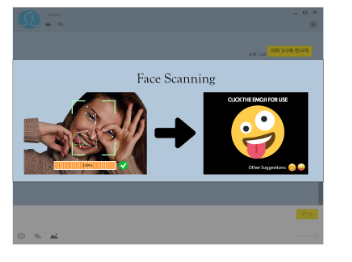

[← go back to the list](../README.md)

# Typing for ALL

#### Members

- Jihyun Lee
- Jaeho Jung
- Subeen Bae
- Sieun Shin

## 1. Introduction 

### Background
채팅 프로그램에는 손의 사용이 많이 요구되기 때문에, 손을 사용하는 것에 제약이 있는 사람들은 채팅에 불편함을 느낀다. 이러한 문제를 해결하기 위해 우리는 음성으로 text를 타이핑 해주고 얼굴 인식을 통해 얼굴표정을 이모지로 변환하여 타이핑해주는 프로그램을 기획하였다.

### Target User
손을 사용하는것이 불편한 사람들을 타겟 유저로 하여 프로그램을 기획하였다. 유저는 손가락을 사용하여 타이핑 할 필요 없이 목소리와 얼굴 표정만으로 원하는 말과 감정(이모지)를 전송할 수 있다.

### Goal
유저들이 손가락의 사용을 최소화하여 음성으로 text 를 입력하고 얼굴인식을 이용하여 다양한 이모지를 입력할 수 있도록 한다.

## 2. Images of our Program
### Main Screen

- 메인 화면은 채팅 내용이 보이는 화면 (초록색 화면),
- 메시지를 적는 창 (하얀색 화면), 
- 목소리 인식 버튼 (상단에 있는 버튼 중 왼쪽에 있는 마이크 모양 버튼),
- 얼굴 인식 버튼 (상단에 있는 버튼 중 오른쪽에 있는 얼굴 모양 버튼),
- SEND 버튼(우측 하단에 있는 노란색 버튼)

### Voice Recognition

- 메인 화면에서 얼굴 인식 버튼을 누르면 다음과 화면으로 전환된다.
- “Currently Recording…” 이라는 메시지가 뜨면, 타이핑 하고 싶은 말을 하여 목소리 인식을 한다.

- 목소리 인식이 완료 되면 메시지를 입력하는 창에 인식된 문장이 타이핑 된다.

### Voice Recognition

- 메인 화면에서 얼굴 인식 버튼을 누르면  “A picture will be automatically taken after 3 seconds” 라는 메시지가 뜬다.
-  메시지가 뜬 후, 3초뒤에 자동으로 사진이 찍힌다.

- 얼굴 표정을 인식하여, 비슷한 감정의 이모지들을 추천해 준다.
- tab키 또는 얼굴 인식 마우스를 이용하여 이모지를 하나 선택하면 메시지 입력창에 이모지가 입력된다.

### Send

- tab키 또는 얼굴 인식 마우스를 통해  SEND버튼을 선택하면, 입력된 문자와 이모지가 채팅방에 전송된다.

### Demo Video

<iframe src="https://www.youtube.com/embed/GHBKlXoNvwU" frameborder="0" allow="autoplay; encrypted-media" allowfullscreen style="position: absolute; top: 0; left: 0; width: 100%; height: 100%;"></iframe>

## 3. Implementation
### 초기 Idea sketch

### 최종 완성본

### Schedule

### What we use
1. Voice Recognition
	1. IBM Watson voice recognition
	2. https://www.ibm.com/kr-ko/cloud/watson-speech-to-text
2. Face Recognition
	1. Naver Facial emotion Recognition
	2. https://developers.naver.com/docs/clova/api/#/CFR/API_Guide.md
3. Web
	1. Framework - [django](https://www.djangoproject.com/)
	2. HTML, CSS, JavaScript

### How to build
1. Voice Recognition
	
	User의 음성파일을 IBM서버로 보내 text 형태로 Return 받는다.
2. Face Recognition
	
	User의 얼굴 이미지를 Clova ai. 서버로 보내, 감정을 분석 한 후 감정에 맞는 이모지를 추천한다.
3. 웹
	1. 본 채팅 프로토타입이 실제 채팅창처럼 보일 수 있도록, 채팅창 이미지와 관련 아이콘들로 HTML 화면을 구성하고, CSS로 디자인하는 작업을 하였다.
	2. 해당 채팅 아이콘 (음성인식 아이콘, 얼굴인식 아이콘)을 클릭하였을 때 관련 API (IBM, Clova)가 작동할 수 되도록 하는 Javascript 알고리즘을 구현하였다.
	3. 사용자가 마우스로 클릭하였을때, 이모지가 선택되거나 메시지가 전송되는 이벤트를 가시화해서 Interactive한 요소를 추가했다.
	4. 상기 항목들을 통해 본 채팅 프로토타입이 구현하고자 하는 일련의 채팅 과정을 사용자가 실제처럼 체험할 수 있도록 하였다.

### Github
- https://github.com/dlwlgus53/TypingForALL

## Limitation
- Clova 에서 제공되는 인식 가능한 얼굴 표정이 7가지 정도이기 때문에 유저들이 다양한 이모지를 사용하는 것이 어렵다.
- 음성인식을 사용할 때 소리를 내고 멈추면 음성인식이 자동으로 끝나는데, 이 정확한 종료 지점을 유저들에게 알려주기 어렵다.

## Future plan
- 얼굴인식 -> 이모지에 대한 아이디어가 좋다고 생각해서, 만약 기존 특허가 없다면 이 아이디어로 특허가 가능한지 알아 볼 예정이다.
- 깃헙페이지의 Read.md  페이지를 정돈하여, 우리의 프로젝트를 잘 기록할 수 있도록 할 것이다.
- 프로젝트를 진행하면서, 각자가 실력이 부족하다고 느껴진 부분이 있었다.(웹, 파이썬, 등등) 방학때 이 부분을 각자 공부할 예정이다.

## Review
- 지현 : 처음에는 우리가 계획한대로 구현하기 쉽지 않을것이라고 생각했다. 하지만 예상외로 ,각자의 결과물이 잘 합쳐졌고 생각대로 원하던 결과물을 만들 수 있었다. 자연스러운 구동이 되지 않았던것은 아쉽지만, 원격으로 진행하는 환경에서도 서로 맡은 일을 잘 해냈다.
- 재호: 하나부터 열까지 직접 구현하지 않더라도, 웹상에서 제공되는 API를 잘 활용하면 의미있는 프로토타입을 만들 수 있다는 사실을 깨달았다. 하지만 이러한 API들은 내가 구현하려는 시스템과 완전히 적합하지는 않기 때문에 프로토타입이 아닌 실제 시스템을 만들때에는 직접 알고리즘을 짤 필요가 있겠다는 생각이 들었다.
- 수빈 :  온라인상으로 프로젝트를 시작하고 각자 아이디어를 모으는 출발부터, 그리고 코드를 각각 작성하고 github에 올려서 합치는 협업 과정까지 어렵고 막막했다. 하지만 교수님과, 또 팀원들과 지속적인 대화와 미팅을 통해 만족도가 높은 프로그램을 만들어볼 수 있어서 뜻 깊고 좋은 경험이 되었다.
- 시은:  처음에는 아무것도 몰랐었지만,  다른 사람과 아이디어를 나누고 코딩을 하여 프로그램을 만드는 과정에서,  정말 많은 것을 배울 수 있었다. 또 지속적인 교수님의 피드백을 통해 좋은 Interaction 과  HCI기술에 대해 생각해 볼 수 있는 경험이었다.

## Reference
- [Watson Speech to Text](https://www.ibm.com/kr-ko/cloud/watson-speech-to-text)
- [Naver Face Recognition](https://developers.naver.com/docs/clova/api/#/CFR/API_Guide.md)
- [Open cv](https://opencv.org/)