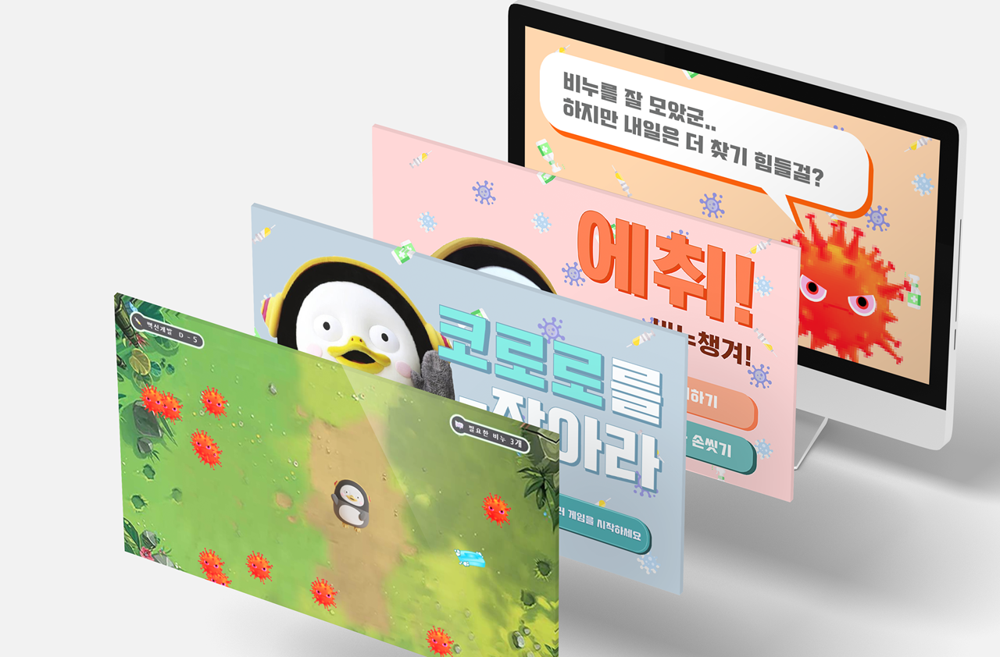
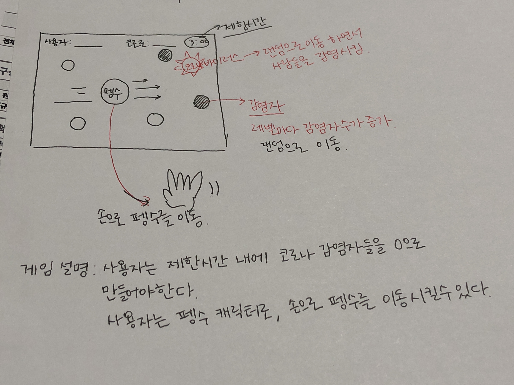
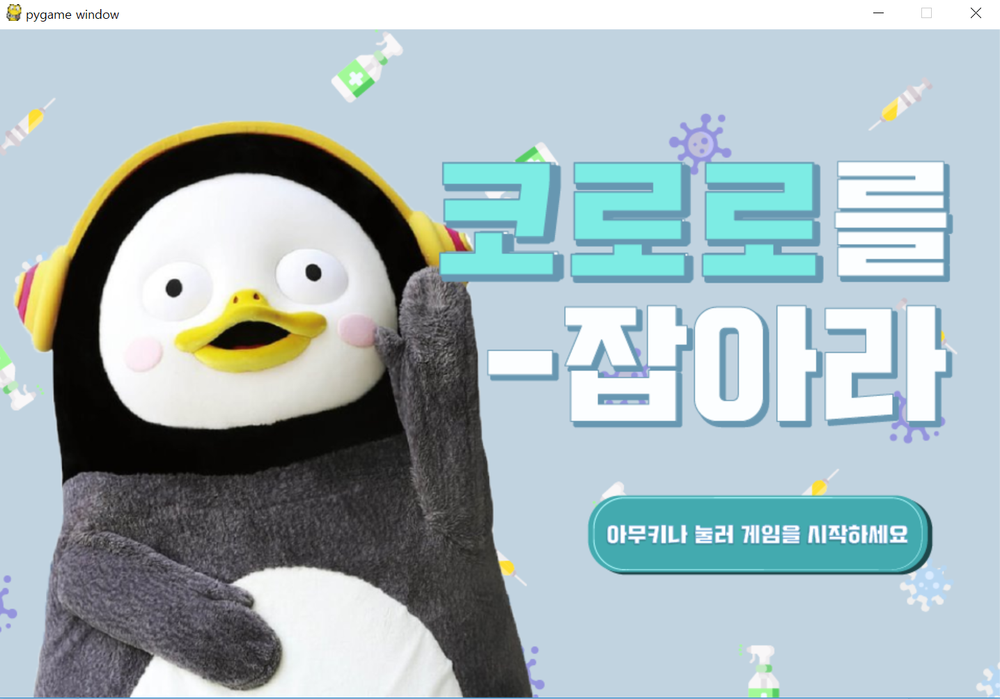
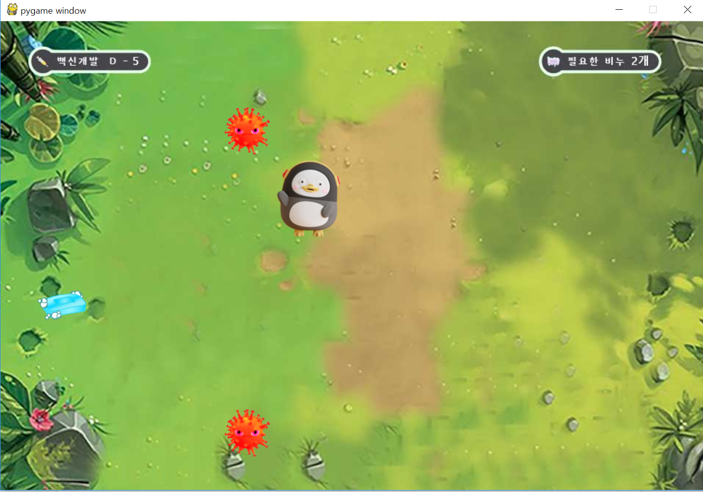
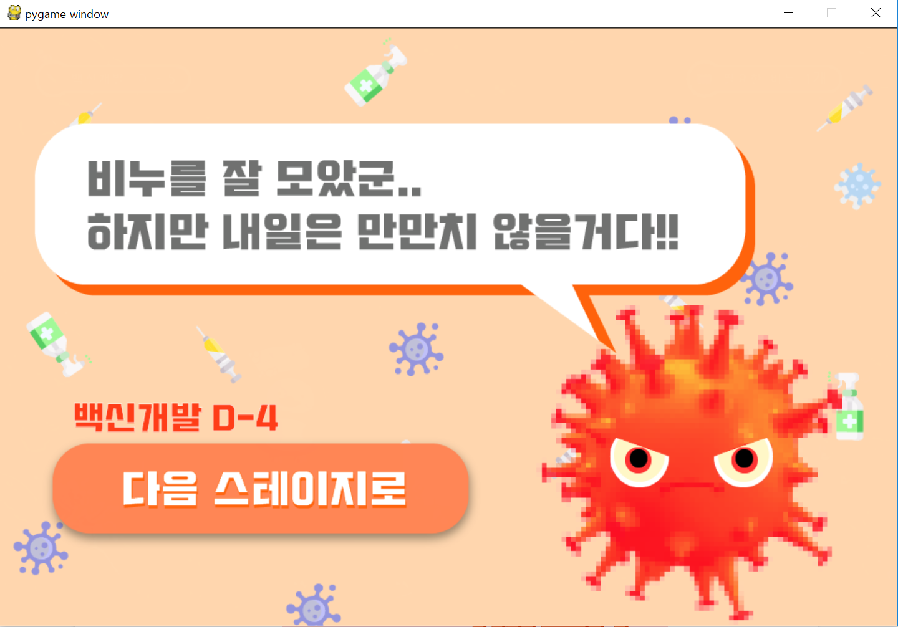
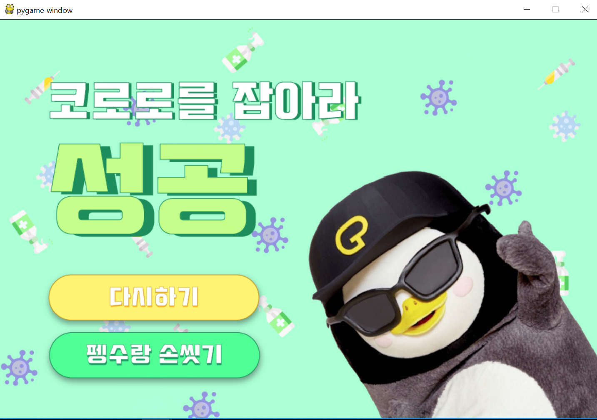
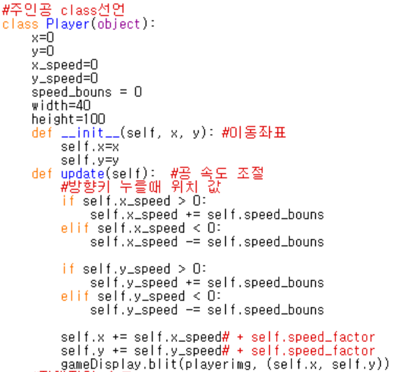
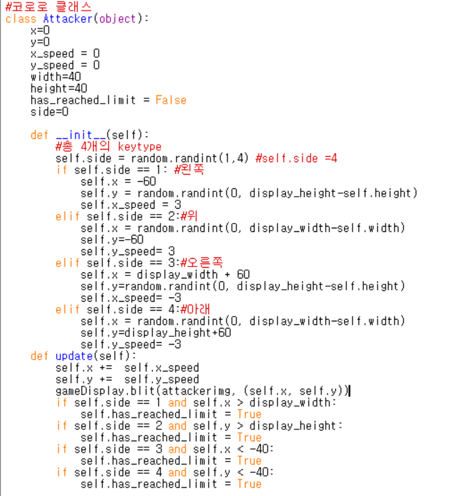
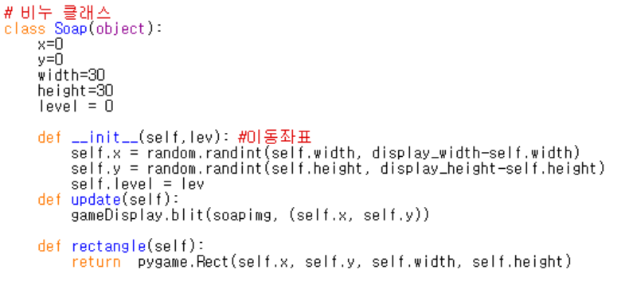

[← go back to the list](../../HCI.md)

# Serious Game to Educate How to Prevent Coronavirus

#### Members
이지선, 이지열, 김하진, 홍혜정

## 1. 주제 소개 

### 1.1. 배경
전세계적으로 코로나바이러스가 유행하고 있으며, 이를 예방하기 위한 다양한 움직임들이 이루어지고 있다. 바이러스 예방 방법은 전단, 카드뉴스, 캠페인 등의 다양한 형태로 사람들에게 교육되고 있다. 한편, 어린 아이들의 경우 이런 뉴스와 전단 형태로 접하는 예방 교육을 이해하거나 직접 실천하는데에 있어 어려움을 가지고 있다. 이에 대한 해결책으로 유투브에 어린이들을 겨냥한 예방법 영상이 제작되었고, 현재 ‘슈퍼잭과 함께 코로나바이러스를 예방해봐요!’라는 영상은 한 달만에 40만뷰 이상을 기록하였다.

그러나, 이런 영상물 형태의 예방 교육은 일방향성이 강하며, 단순 엔터테인먼트로 소비되고 끝나는 일회적인 특성을 가지고 있다는 한계점이 있다. 논문 ‘The Development of a Prototype of a Network Based Children's Walking Safety Game (Park So-soon, 2017)에 따르면, 어린이 예방 교육에 대한 관심은 급증했으나, 현재의 교육 콘텐츠들은 한계점을 가지고 있다고 증명되었고, 놀이나 게임 형태의 교육을 통해 아이들이 지속적이고 자연스럽게 예방법을 학습할 수 있도록 유도해야 한다고 주장하고 있다.

기존의 교육 게임들이 단순히 OX퀴즈와 같은 플래시 게임 형태였기 때문에, 실제 예방 안전 교육을 효과적으로 전달하는데에 있어 한계점을 가지고 있어서, 보다 예방 안전 교육을 효과적으로 할 수 있는 형태의 게임을 개발하고자 한다.

### 1.2. Goal
립모션을 이용한 인터렉티브한 손씻기 게임을 개발하여, 어린이들이 코로나바이러스를 예방하기 위한 손씻기를 쉽게 인식하고 실천할 수 있도록 유도한다.

## 2. 개발 내용
- How to build your program
	- 전체적인 프로그램의 개발은 파이썬의 Pygame 라이브러리를 이용해서 구현했습니다.
	- 코로로, 펭수, 비누와 같이 게임 속 등장하는 object들을 각각의 class로 설정해 객체지향 프로그래밍(OOP)으로 설계하였습니다.
- Necessary images (idea sketches, paper prototype, a screen capture of your program, …)
	a. Idea sketches

	

	b. A screen capture of program
	- 게임 시작 전 준비 사진

	

	- In-game

	

	- 스테이지 클리어 후 다음 스테이지  준비화면

	

	- 게임 승리 화면

	

	- 게임오버 화면

	

- Explanation of source code if necessary (or just share the source code as a file)
	- 소스코드 [download](source/source.zip)
	- 펭수 class

	

	펭수의 class 구조이다. x,y는 펭수의 위치를 업데이트하는데 사용되고 펭수의 width와 height를 설정해서 비누와 코로로와의 접촉시 원하는 동작을 하도록 구현했다. 또한 사용자가 입력하는 방향키값에 맞게 움직이도록 하기 위해 x,y좌표를 업데이트하여 펭수의 움직임을 조절했다.
 
	- 코로로 class

	

	기본적인 구조는 펭수 class와 동일하고 상하좌우 랜덤한 위치에서 코로로가 등장할 수 있도록 구현했다.

	- 비누 class

	

	비누 class또한 펭수 class와 구조는 동일하고 랜덤한 고정 위치에 비누를 생성하도록 했고, 펭수가 비누와 접촉하면 다른 랜덤한 위치에 다시 생성되도록 구현했다.

- Explanation of your program with images
	- 승리 조건

	

	화면에 보이는 빨간 바이러스가 코로로이다. 주인공인 펭수는 랜덤한 위치에서 등장하는 코로로를 피하면서 비누를 모으면 된다. 게임은 백신 개발이 이루어지기 위해 걸리는 시간인 총 5일동안 코로로를 피하면서 필요한 비누 개수를 모으면 게임에서 승리하게 된다. 시간이 지날수록, 백신 개발이 다가올수록 코로로의 개체수와 속도가 증가하여 게임의 난이도가 증가한다.

	화면 왼쪽 상단에 표시된 인터페이스는 백신 개발까지 남은 일수이다. 남은 일수가 0이 될때까지 살아남아 백신이 개발되면 게임에서 승리한다.

	화면 오른쪽 상단에 표시된 인터페이스는 코로로가 해당 스테이지를 클리어하기 위해 모아야하는 남은 비누의 개수를 실시간으로 표시한다.

- Demo video

	<video width="480" height="320" controls="controls"><source src="demo video.mp4" type="video/mp4"></video>

## 3. 결론과 제언

### 3.1. 한계

본 연구는 기존 질병예방 교육들과 차별화 될 수 있는 다양한 인터렉티브 요소들을 도입하고자 계획하였다. 그 중 핵심적인 요소는 립모션 장비의 도입이며 '손 씻기 모션'을 게임 내에 사용자가 시뮬레이션한다는 가정으로 시나리오를 구성하였다. 하지만 손씻기 교육을 위한 '손바닥을 마주대고 문지른다.' , '손등과 손바닥을 마주대고 문지른다.', '엄지 손가락을 돌려 문지른다.', '손톱 밑을 손바닥에 놓고 문지른다.' 등의 지시는 립모션으로 구현하기에 매우 정밀한 동작이 요구 되어 구현에 한계가 생겼다. 따라서 본 연구에서는 손씻기 교육을 아이들이 흥미를 느끼는 펭수 영상으로 대체하게 되었다.

### 3.2. 추후 연구

2차 유저 테스트를 통하여 게임의 지속적인 효용을 위하여 흥미 요소들이 추가적으로 필요함이 논의 되었다. 따라서 비누 뿐만 아니라 마스크나 휴대용 손세정제와 같은 아이템을 다양하게 배치하고, 전체적인 디자인도 질병 재난 상황에 적절한 여러가지 테마로 구성하도록 한다. 또한 설계 초기에 구상한 립모션의 활용이 손씻기 모션을 구현하기에 한계가 있으므로 추후에 추가될 마스크 아이템에 따른 시그니처 모션을 개발하여 사용자가 감염병 예방 수칙을 잘 습득할 수 있도록 돕는다. 마지막으로 게임 시작 전 전체적인 게임 설명과 방법을 정리한 화면을 제공하여 사용자가 게임을 진행하기에 용이하도록 구성한다.

### 3.3. 연구 의의

교육용 기능성 게임은 학습에 재미를 결합하여 학습 동기나 학습 효과를 높이고자 하는 목적을 갖고 있으며 이는 질병 예방 교육으로 확장되기에 매우 적절하였다. 단순히 게임을 즐기려는 목적에서 벗어나 게임을 통해 질병 재난 상황을 간접 경험하고, 예방 수칙에 관한 필요 지식을 습득하는 과정은 어린 아이들을 대상으로 하였을 때 집중력과 흥미 향상에 큰 도움이 될 것이라 기대된다.

### 3.4. 애로 사항

본 프로젝트는 팩맨 게임을 모티브로 진행되었었다. 하지만 일차 유저 테스트를 통해 주 타겟층인 아동들은 팩맨 게임을 알지 못하고, 게임적 흥미를 느끼기 어렵다는 한계점을 받아들여 새로운 게임 컨셉과 새로운 디자인으로 프로젝트를 재설계하는 과정을 걸쳤다. 이 과정에서 시간적인 부담이 가장 큰 어려움이었던 것 같다. 또한 untact로 진행하였던 10주차까지는 팀원들간에 서로 의견을 공유할 때 각자의 아이디어를 정확히 표현하기에 효과적인 의사 전달 방법을 찾는 것에도 어려움이 있었다.

개발적인 측면에서는 pygame자체에 동영상을 넣을 수 있는 기능이 없어서 감염병 예방에 관련된 동영상을 함께 재생하여 교육적인 목적에 더욱 부합하도록 설계하고 싶었지만 그러지 못해 아쉬웠고, 펭수가 움직이거나 코로로가 움직일때 애니메이션 효과를 주어서 좀 더 생동감 있는 게임을 구현해보고 싶었지만 시간적 제약과 구현의 난이도 때문에 해내지 못해서 아쉬웠다.

마지막으로 UT과정에서도 어린이 사용자들의 생생한 의견을 듣고 싶었으나 직접 대면이 꺼려지는 현상황속에서 진행하기 어려웠던 것이 가장 큰 아쉬움으로 남는다.

### 3.5. References
- https://stackoverflow.com/questions/28005641/how-to-add-a-background-image-into-pygame
- https://www.youtube.com/watch?v=IMbzfR02tI8
- https://github.com/TechnoVisual/Pygame-Zero/tree/master/pacman1/images