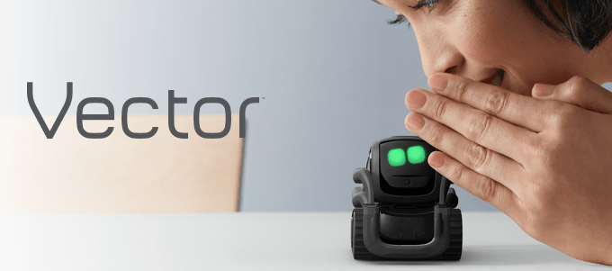
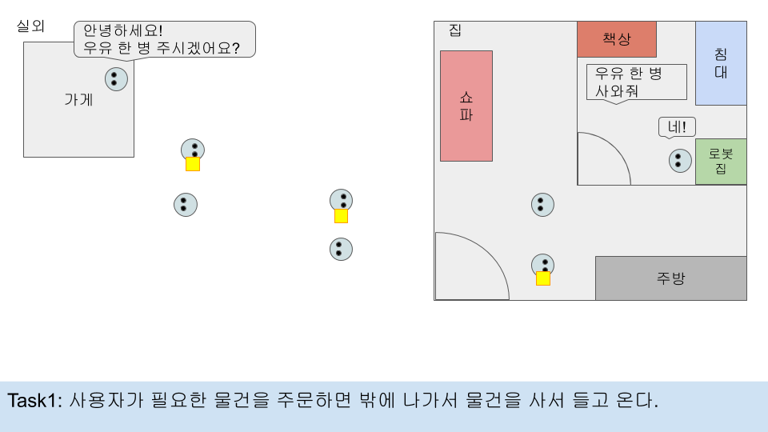
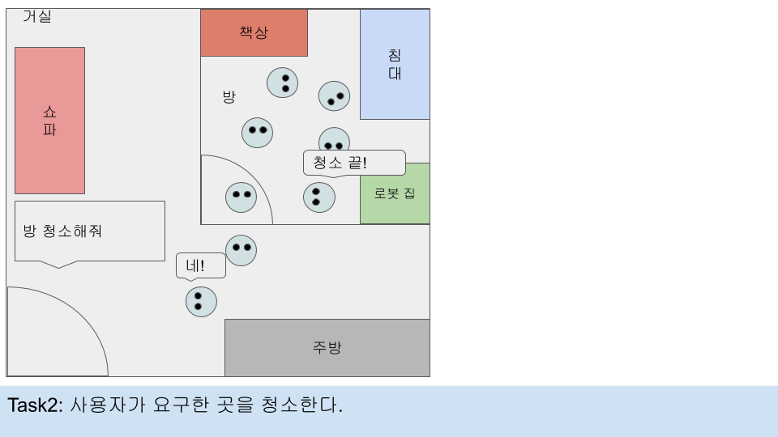
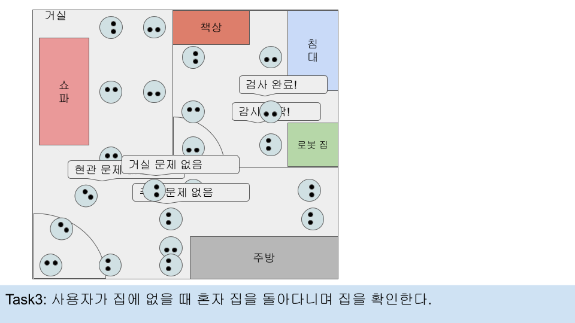
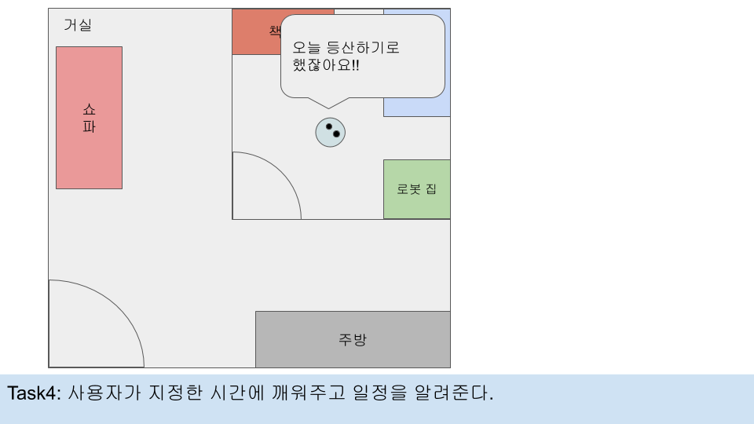

[← go back to the list](../README.md)

# 미래의 가정용 로봇 호마


#### Members
류기범, 임은택, 우지원

## 1. Introduction 

### Background & Goal
가정용 로봇의 시장은 성장하고 있으며 앞으로도 계속 성장할 전망입니다. 하지만 현재 사용되는 가정용 로봇들은 기능과 사람과의 상호작용면인 측면에서 많은 한계점이 있으며 제한이 있습니다. 따라서 우리는 미래의 가정용 로봇이 할 수 있는 일들에 대해서 생각해 보고 상호작용면에서도 현재의 가정용 로봇에서 더 발전된 모습을 보여주고 싶었습니다.

우리의 목적은 다음과 같습니다. 먼저 가정용 로봇과 사람이 상호작용 가능한 범위를 확장시킬 것입니다. 다음으로 다양한 상호작용을 통해 가정용 로봇이 전보다 더 많은 것들을 할 수 있다는 것을 보여줄 것입니다. 마지막으로 가정용 로봇이 생활화 된 미래의 모습을 보여줄 것입니다.

## 2. Main contents
### 1. Scenario
미래의 가정용 로봇이 인간과 어떻게 상호작용하고 어떠한 일들을 할 수 있는지에 대해 보여주기 위하여 그에 맞는 시나리오를 작성했습니다.


첫번째 시나리오는 사용자가 로봇에게 심부름을 시키는 상황입니다. 사용자는 음성으로 로봇에게 명령을 내릴 수 있으며 로봇은 사용자의 음성을 인식하여 명령을 수행합니다. 특히 미래의 가정용 로봇은 집 안에서 뿐만 아니라 집 외부까지 심부름을 보낼 수 있는 기능이 있다는 것을 보여주려고 했습니다. 사용자는 스마트폰 어플을 통해 로봇의 현재위치를 확인할 수 있기 때문에 로봇을 집 밖으로 심부름을 보낸다고 하더라도 안심할 수 있습니다.


두번째 시나리오는 로봇이 사용자를 대신하여 집 안을 청소해주는 상황입니다. 기존의 청소 로봇은 사용자와의 특별한 상호작용 없이 알아서 청소를 했다면 미래의 가정용 로봇은 사용자와의 상호작용을 통해 동작할 수 있습니다. 사용자는 특정한 곳을 지정하여 청소를 시킬 수 있으며 로봇은 청소가 다 끝나면 청소가 끝난 것을 알려줍니다.


세번째 시나리오는 미래의 가정용 로봇이 홈 시큐리티의 역할을 수행하는 상황을 보여주고자 했습니다. 사용자가 외출했을 경우, 로봇의 홈 시큐리티 기능이 활성화되고 로봇은 집 안을 돌아다니며 문제가 생기지는 않았는지, 외부인이 출입했는지를 확인할 수 있습니다. 또한 사용자는 스마트폰 어플을 통해 멀리서도 로봇의 시야를 볼 수 있기 때문에 집 안을 확인할 수 있습니다.


네번째 시나리오는 사용자의 일정알림 기능을 가지고 있는 로봇을 보여주려고 했습니다. 이 기능을 통해 미래의 가정용 로봇은 사용자의 비서와도 같은 역할을 수행할 수 있습니다. 로봇에게 특정 시간에 사용자가 해야할 일들을 설정하거나 스마트폰 어플에 등록하면 로봇은 사용자의 일정에 맞게 기상시간에 깨워주고 사용자의 일정을 알려줄 수 있습니다.

### 2. Smartphone application prototype
로봇과의 상호작용을 더 다양하게 하기 위해 스마트폰 어플을 프로토타입의 형태로 만들었습니다. 이 스마트폰 어플을 통해서 기본적인 로봇의 상태(배터리 잔량, 현재 위치, 현재 하고 있는 일 등)를 확인할 수 있고 사용자가 자신의 일정을 등록해두고 로봇이 알림을 해주도록 설정해놓을 수 있습니다. 또한 사용자가 로봇이 같이 있지 않을 때에도 로봇이 특정 시간에 어떤 일을 할 수 있도록 로봇이 할 일들을 등록할 수 있고 로봇의 카메라 시야를 볼 수 있는 기능도 제공합니다.

- [어플 시연 영상](https://drive.google.com/file/d/1zE9__IC03LUmsb_ZjvKhtT6bytxym9oZ/view?usp=sharing)

### 3. Source code
#### SDK 설치
벡터 SDK를 사용하기 위해서는 먼저 컴퓨터에 설치를 해야합니다. 설치의 전제 조건은 다음과 같습니다.
1. 벡터가 켜져 있어야 합니다.
2. 안키의 계정을 만들어야 합니다.
3. 벡터의 app을 다운로드 받아야 합니다.
4. 벡터의 앱과 벡터가 현재 연결 상태가 아니어야 합니다.
5. 벡터는 조작할 컴퓨터와 같은 네트워크를 사용하여야 합니다.
6. 벡터의 눈 화면에서 연결된 IP주소를 확인할 수 있어야 합니다.
7. 벡터 SDK를 사용하기 위한 파이썬 버전은 3.6.1 또는 그 후 버전을 설치 해야 합니다.

SDK를 설치하려면 명령 프롬프트 창에 아래의 내용을 입력해야 합니다.
```
py -3 -m pip install --user anki_vector
```

#### Vector 인증
벡터를 인증하기 위해서 명령 프롬프트 창에 아래의 내용을 입력해야 합니다.
```
py -m anki_vector.configure
```

입력 후 로봇의 이름, IP 주소 및 serial number를 묻는 메시지가 나타납니다. 또한 Anki 로그인 및 비밀번호를 묻는 메시지가 표시되는데 이 때 벡터를 설정하는데 사용한 것과 동일한 계정을 사용해야합니다. 이 내용이 성공적으로 완료 되면 “SUCCESS!”가 표시됩니다.

#### Vector 기본 조작
```
args = anki_vector.util.parse_command_args()
```

#### Vector 대사 설정
```
with anki_vector.Robot(args.serial) as robot:
   robot.behavior.say_text("대사")
```
 
#### Vector 이동 및 방향 전환
```
from anki_vector.util import degrees, distance_mm,speed_mmps
with anki_vector.Robot(args.serial) as robot:
   robot.behavior.drive_straight(distance_mm(거리), speed_mmps(속도))
   robot.behavior.turn_in_place(degrees(각도))
```

#### Vector 손 제어
```
with anki_vector.Robot(args.serial) as robot:
   anki_vector.behavior.MAX_LIFT_HEIGHT=거리
   anki_vector.behavior.MIN_LIFT_HEIGHT=거리
   anki_vector.behavior.set_lift_height(0 or 1)
```

#### Vector 감정표현
```
with anki_vector.Robot(args.serial) as robot:
   robot.anim.play_animation_trigger('GreetAfterLongTime')
```

#### Vector 카메라 화면
```
with anki_vector.Robot(args.serial, show_viewer = True, show_3d_viewer = True, enable_face_detection = True, enable_custom_object_detection = True, enable_nav_map_feed = True):
```
#### [Demo video](https://drive.google.com/file/d/1WRkExbGfxuPEFxZn6AsWggE7-FzRNN7V/view?usp=sharing)


## 3. Discussion
### Limitations and future studies
- 사람과 함께 행동을 하는 방식의 상호작용이 나타나지 않고 명령을 통해서 가정용 로봇 혼자서 일을 수행하는 경우만 나타났습니다. 가정용 로봇과 사람이 함께 행동하는 부분도 보여주었다면  보다 더 질 높은 상호작용을 나타낼 수 있었을 것입니다.
- 예약된 작업을 수행하는 부분에서는 가정용 로봇에게 할 일을 예약 했을 때 예약된 작업의 수행 예상 시간이 나타나지 않았다는 부분에서 사용자와의 상호작용에서 불편한 점을 찾을 수 있었습니다.
- 로봇의 홈 시큐리티 기능이 활성화 되었을 때, 집 안에서 문제가 발견되었을 경우에 대한 시나리오가 부족했다고 생각됩니다. 로봇이 문제를 발견했을 때 사용자에게 알리고 문제를 어떻게 해결할 것인지에 대한 프로세스가 추가되어야 합니다.
- 어플을 실제로 만들어 연동 시킨 것이 아니었기 때문에 실제로 어플 개발을 통하여 vector와 연동시켜 작동 시킬 수 있도록 하는 것이 필요합니다.

### Conclusion
프로토타입의 한계점들과 더 개선할 부분들이 있지만 이 프로토타입을 통해 미래의 가정용 로봇의 발전가능성을 보여줄 수 있었습니다. 스마트폰을 어플을 통하여 사용자와 로봇이 상호작용하고 현재 가정용 로봇이 할 수 없는 기능들을 프로토타입의 로봇이 수행하여  앞으로 미래의 가정용 로봇이 어떠한 일들을 할 수 있는지를 보여주는 것으로 미래의 가정용로봇에 대한 기대를 높일 수 있었습니다. 실제로 데모 영상을 보여주고 얻은 사용자 조사의 결과를 보면, 해당 프로토타입의 로봇을 보고 85% 이상의 사람들이 프로토타입 로봇과의 상호작용 및 기능에 대해 긍정적으로 평가하였고 나아가 미래 가정용 로봇에 대해 기대한다고 응답하였습니다. 이를 통하여 미래 가정용 로봇에 대한 전망이 밝을 것이라 예측해 볼 수 있었습니다.

이번 프로젝트를 진행하면서 아쉬웠던 점은, 우선 COVID-19로 인해 팀원이 모일 수 없어 공동 작업으로 했었다면 더 잘 만들 수 있었던 부분이 개인으로 작업하게 되어 부족한 부분들이 나타나 아쉬움을 느꼈습니다. 또한, Vector 로봇 자체가 애완로봇으로 설계되어 로봇이 할 수 있는 기능과 추가할 수 있는 기능이 제한적이었기 때문에 제한된 기능 안에서 제공되는 코드를 이용하여 Vector로 구현할 수 있는 기능의 한계가 있던 점도 아쉬웠습니다.

## Reference
- https://developer.anki.com/vector/docs