[← go back to the list](../README.md)

# Sprout 
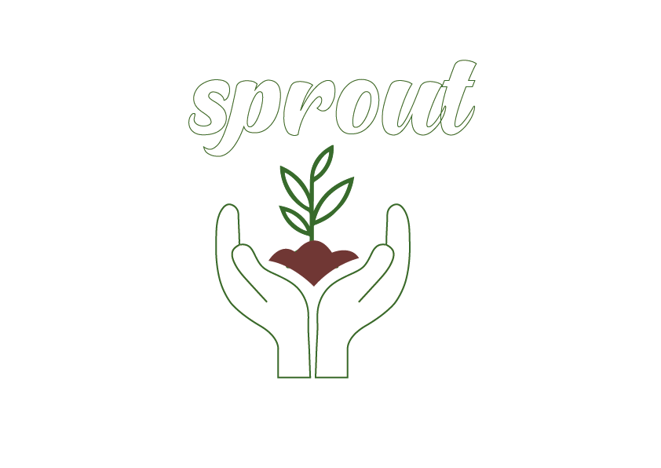

#### Welcome to our project, Sprout! Our project aims to help users maintain and grow healthy habits. Grow a healthy habit to grow a healthy garden! 

#### Members
- 임성빈
- 노은솔
- 손지인
- 황단열

## 1. Introduction 
### Background & Goal
People living in modern society have a difficult time maintaining good habits. 
There are a lot of apps in the markets that offer functions such as scheduling or forming positive habits. However, they do not provide enough motivation for the user.  
For this reason, we developed a program that motivates the user to maintain a healthy habit to cultivate a healthy lifestyle. We did this by adding elements that provide entertainment such as growing one flower a day. 
We received our motifs from the study app , Forest. 

## 2. Main Contents
#### 1. Building Sprout
Our team used Leap Motion and Unity to implement our program. 

#### 2. Sketch
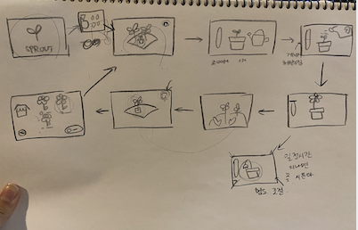

Our 1st Rough Draft Sketches for Sprout 

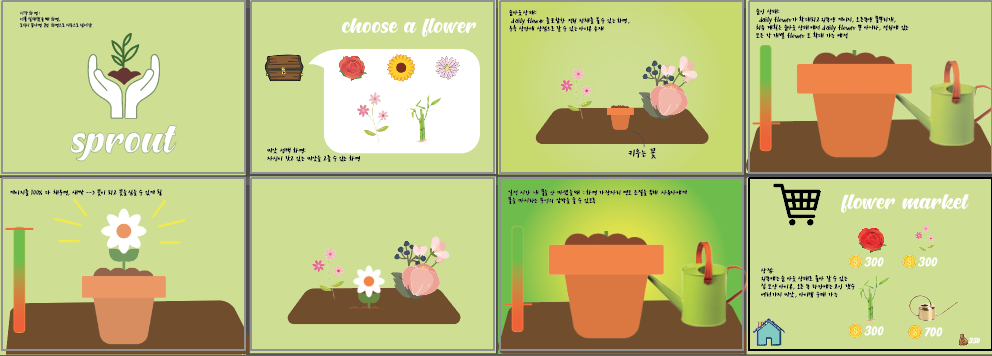

2nd Draft for Sprout 

#### 3. Explanation of Sprout
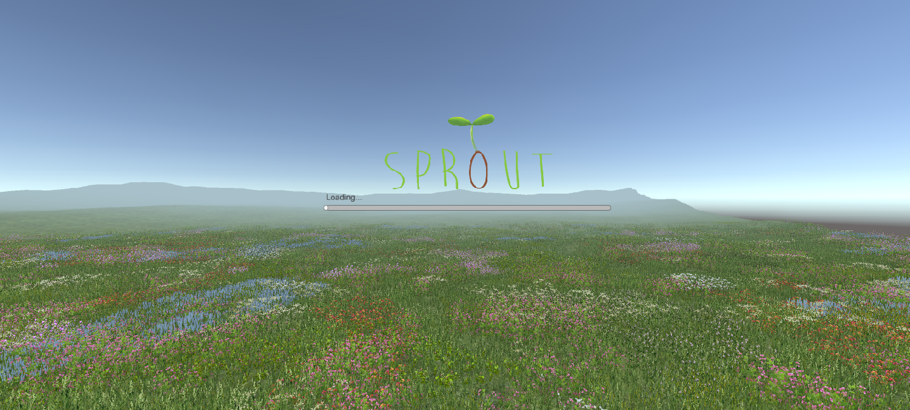

This is our starting screen 

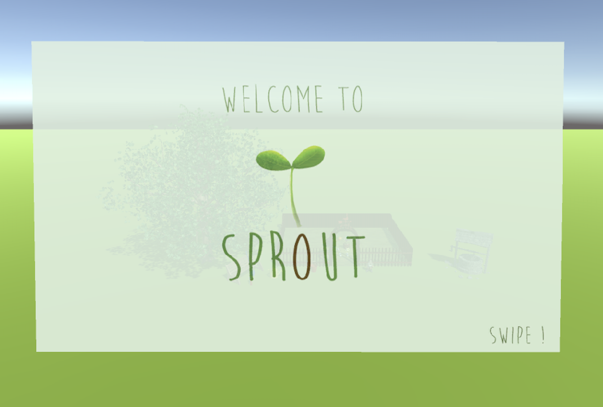
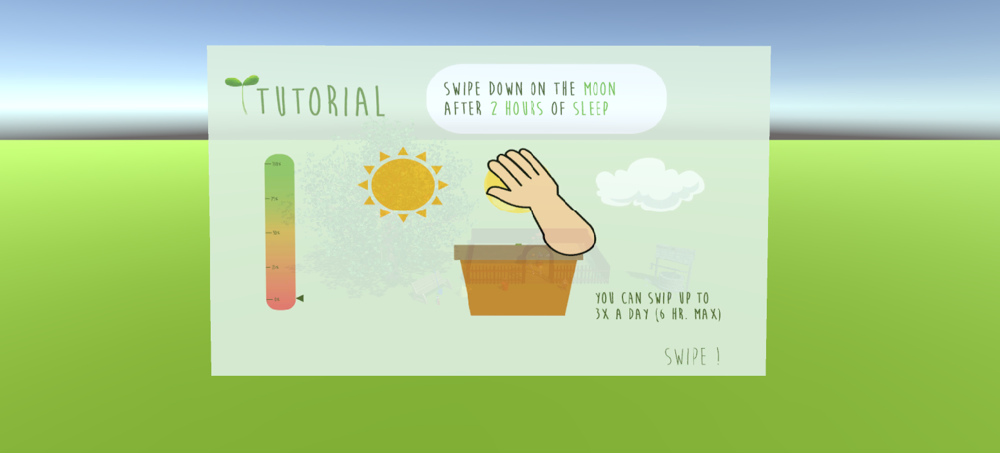

Our tutorial begins with this slide.

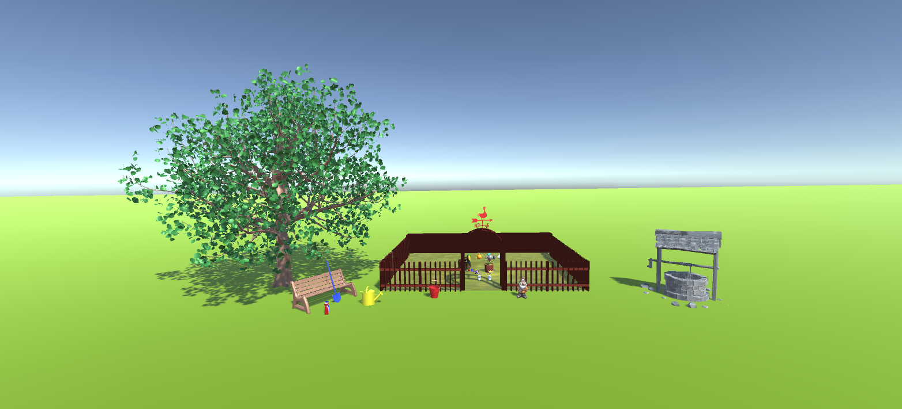

This is an overview of your garden. 

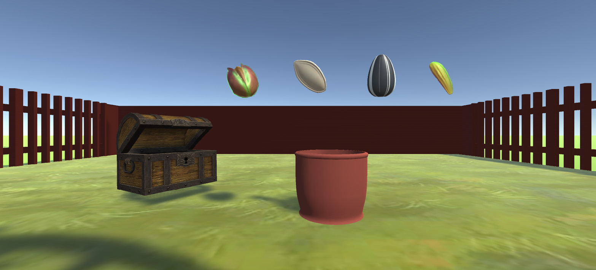

Choose a seed that you wish to plant. 

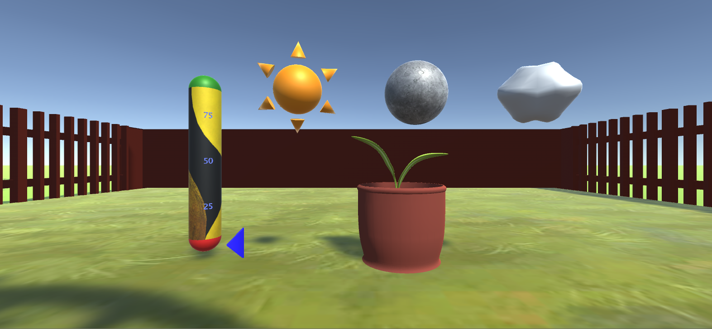

We provided 3 icons (sun, moon, and cloud) as a default. The sun represents the amount of exercise. The moon represents the amount of sleep. The cloud represents the amount of water you drank. 

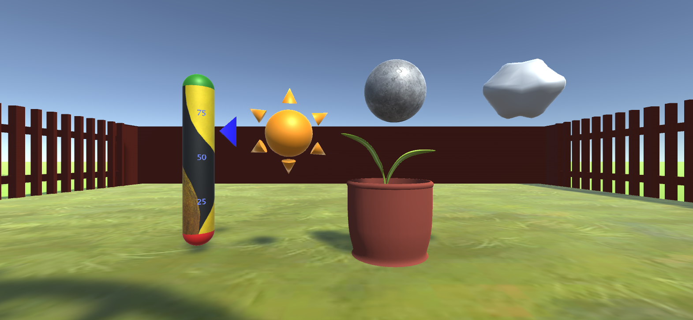

The gauge on the left rises everytime you complete a task/mission. You can slide down on each icon up to 3 times per day. 

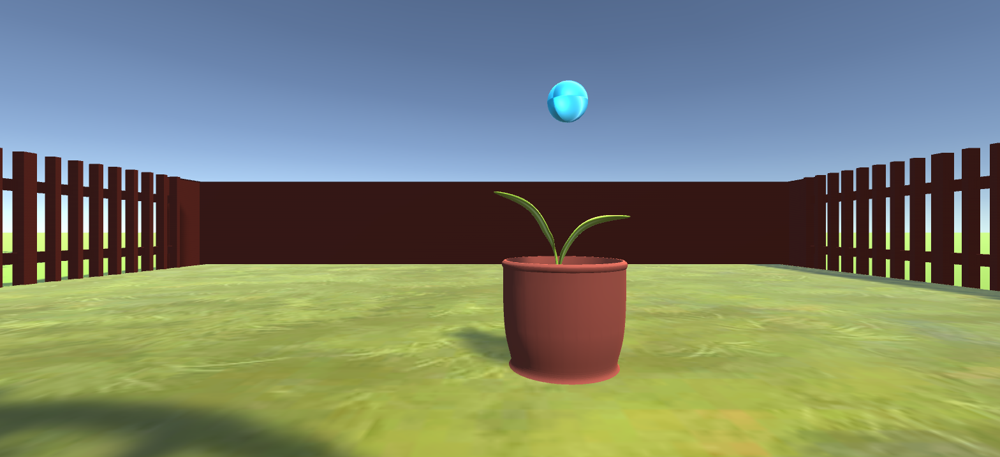

Slide down on the blue bulb 

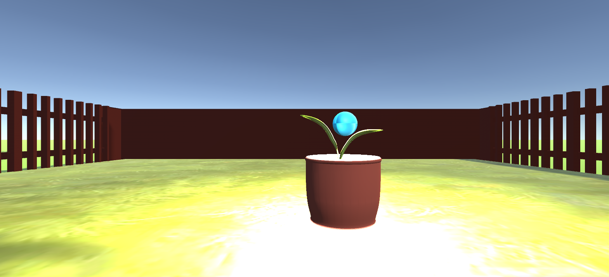

The blue bulb starts glowing indicating that you've succesfully completed your daily mission. 

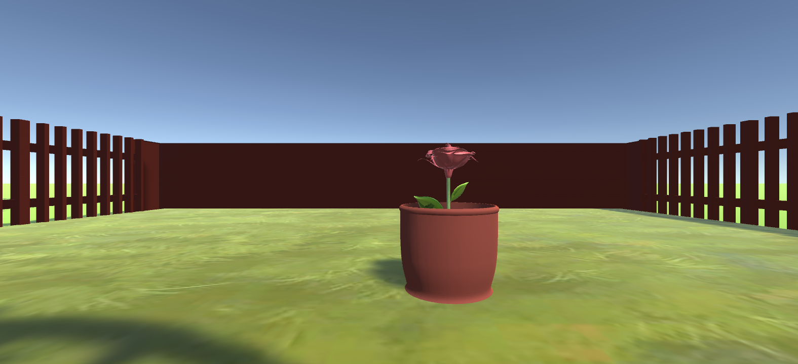

Your flower is fully grown! 

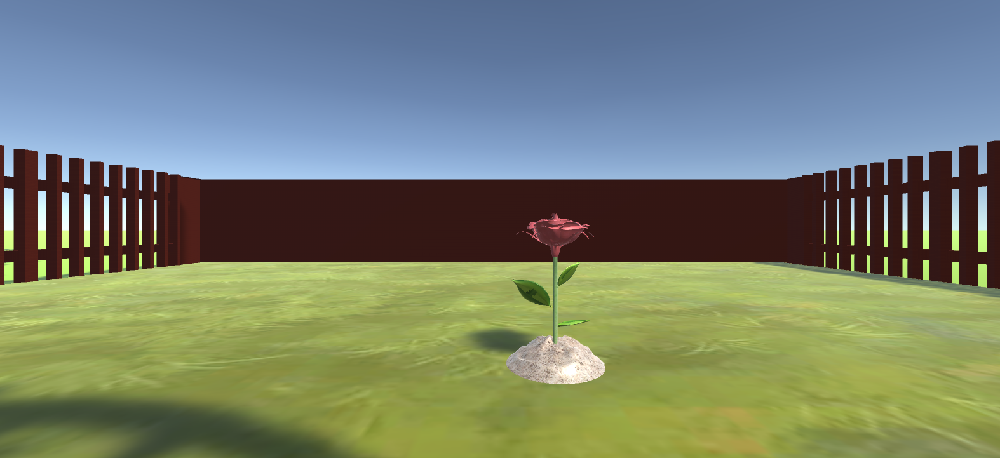

Your Rose is planted in your garden! Complete your mission every day to grow your garden. 

#### 4. Source Code File
Find our source code files from [[here]](source/source.docx)

#### 5.Demo Video
View our [Demo Video](https://drive.google.com/file/d/1uxQTkJAahFRxnK7z2ckBsBdYkmXt-AMt/view?usp=sharing)

## 3. User Research
For our mid-term evaluation, we generally received positive reviews. 
However, our team received negative feedback in regards to Error Tolerance, Feedback, and Documentation. The main reasons for the negative response was because we did not provide sufficient information with respect to how the user should act in the case of an error, lack of function for undoing, lack of explanation for how the game works, and etc. To address these feedbacks, we added a warning message and a tutorial explaining the controls and how the app functions. We voluntarily received additional feedback on Documentation and earned positive reviews on nearly every category. We received further constructive criticism asking us to diversify our design and add additional walkthroughs when other errors occur. 

## 4. Limitations and Future Studies
Due to time constraints, we could not implement many functions such as an item shop. 
We also had some trouble with having our Leap Motion recognize our hand motions correctly.
For our future studies, we plan on experimenting with our Leap Motion so that we have different types of interaction to provide more functions and easier navigation. 

## References 
- [https://assetstore.unity.com/?gclid=CjwKCAjwqdn1BRBREiwAEbZcR90icfCNhmNPQRWAi6stoJbXlsQMGRdE7RZWM-4jjV51m9WDZD4YvRoC7rkQAvD_BwE](https://assetstore.unity.com/?gclid=CjwKCAjwqdn1BRBREiwAEbZcR90icfCNhmNPQRWAi6stoJbXlsQMGRdE7RZWM-4jjV51m9WDZD4YvRoC7rkQAvD_BwE)
- [https://www.youtube.com/watch?v=wKFDvj2ATRg&t=1281s](https://www.youtube.com/watch?v=wKFDvj2ATRg&t=1281s)
- [https://www.youtube.com/watch?v=IW2Fhoi1qIU&list=PLLy27HWGLrB0-aePDUVQ8VUGIAFTyTtg1&index=3](https://www.youtube.com/watch?v=IW2Fhoi1qIU&list=PLLy27HWGLrB0-aePDUVQ8VUGIAFTyTtg1&index=3)
- [https://cpp11.tistory.com/13](https://cpp11.tistory.com/13)
- [https://www.turbosquid.com/Search/Index.cfm?FuseAction=SEOTokenizeSearchURL&stgURlFragment=3D-Models/garden/obj&page_num=2](https://www.turbosquid.com/Search/Index.cfm?FuseAction=SEOTokenizeSearchURL&stgURlFragment=3D-Models/garden/obj&page_num=2)
- [https://free3d.com/3d-models/tree](https://free3d.com/3d-models/tree)
- [https://www.turbosquid.com/Search/3D-Models/vane](https://www.turbosquid.com/Search/3D-Models/vane)
- [https://free3d.com/3d-models/well](https://free3d.com/3d-models/well)
- [https://www.turbosquid.com/Search/3D-Models/free/garden](https://www.turbosquid.com/Search/3D-Models/free/garden)
- [https://uheeworld.tistory.com/35](https://uheeworld.tistory.com/35)

## [Source Code](source/source.docx)