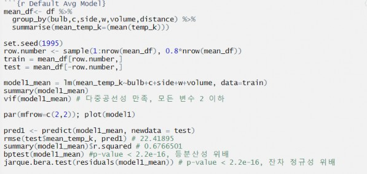
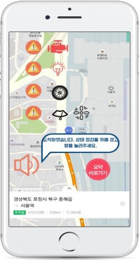

[← go back to the list](../../HCI.md)

# InCarTech : Interaction Model based on Car Condition Prediction System

#### Members
- Jung Haejun, Jeong Pil Won, Choi Yeabin, Choi Yun Seo

## 1. Introduction: Background and goal of your research
"Do you still go to the garage one by one? Ask the car about its condition!"

Inside and outside of the vehicle contains various parts and systems: engines, lamps, tires, and air conditioners, and the management of these components is also directly related to the life of the vehicle; however, managing the car is not simple, for sure. Of course, you need to go to the car center for regular inspections and it could often embarrass the driver by causing problems in unexpected situations.

To reduce this inconvenience, we are developing our own system, ‘InCarTech’. InCarTech not only represents the current state of existing internal and external parts of the car, but also efficiently helps to manage the car by predicting the problems and situations. Most of all, the interaction between people and cars gives users more easier access to the car system and more efficient management of the car.

## 2. How to Build
From now on, we would like to show you the development process of InCarTech system. In this section, we would like to share idea sketches, paper sketches, program screenshots, overall program descriptions, and finally, development materials. Now let's take a look at the development process of the InCarTech program.

### 2.1. Necessary Images
First of all, we would like to help the users to understand how we have sketched the program development process before we developed the program. We prepared several images of idea sketches, paper prototypes, and our final prototypes.

#### 2.1.1. Idea Sketches

When we first started this project, we tried to generate our ideas through idea sketches. As a result, we planned to develop our system through four main parts. The 4 parts are:
1. Car Data Collection
2. Data Analysis
3. Building Model
4. Interaction Model with Car

#### 2.1.2. paper prototype

The picture above is a paper prototype which is made to further shape our prototype development after the idea sketch. Through the process of creating paper prototypes, we had time to think about how to plan and execute prototypes in more detailed ways.

<iframe src="https://www.youtube.com/embed/kvqU4ViWzmM" frameborder="0" allow="autoplay; encrypted-media" allowfullscreen style="position: absolute; top: 0; left: 0; width: 100%; height: 100%;"></iframe>

### 2.2 User Research
The next thing what we've done is user research. If the function of the system actually doesn’t lead to a high standard of experiential innovation, it will be hard to drive into better results. Based on the prototype, we looked for the empirical values of real users who can evaluate the process of using the system. The results are as follows:

|       | 사용자 1 | 사용자 2 | 사용자 3 | 사용자 4 | 사용자 5 |
|-------|---------|----------|---------|----------|---------|
| 성명  | 최예찬   | 신겸     | 박아나   | 최효영    | 권준혁  |
| 나이  | 29       | 25      | 21      | 51        | 27     |
| #1 응답 | 4 | 5 | 4 | 5 | 3 |
| #2 응답 | 2 | 2 | 1 | 4 | 1 |
| #3 응답 | 5 | 4 | 3 | 4 | 4 |
| #4 응답 | 5 | 5 | 4 | 5 | 4 |
| #5 응답 | 5 | 5 | 4 | 5 | 4 |
| #6 응답 | 폰으로 바로 연동이 되면 좋을것같아요. | 제가 교체를 했던 시기까지 폰이 인지하고 있으면 좋겠어요. 최대한 실질적인 조언을 주는게 키포인트일 것 같아요. | I don't have much technological knowledge, so I would prefer the report to be short and simple. | 차는 획일화 되어있는 것이 아니기 때문에 단순히 시스템으로 다양한 기능, 차종, 회사들을 제어한다는 것에는 많은 장벽들이 존재할 것이다. | 실제 인간과 대화하는 것 처럼 자연스러운 상호작용이 일어날 수 있다면 좋겠음 |

#### Main Question
- 이용자 본인이 생각할 때 자동차 관리(정비 포함)를 잘 한다(또는 못한다)라고 생각하십니까?

- 자동차 관리 및 정비 보조 시스템의 필요성을 느끼십니까?

#### Insights
- Most drivers feel they are not effectively taking care of their automobiles.
- Most drivers are in need of a system which can assist and communicate with drivers about automobile cares.
- Requests from User Research:
- The application should provide realistically useful advices.
- The interaction should be natural like just talking with a person.

### 2.3. The Model of InCarTech
#### 2.3.1. Data Exploration

#### Variable Description
- x,y,z-coordinate: x, y, z distance Box-x,y,z: x, y, z of box
- Bulb: type of bulb
- C: Environmental temperature
- Side: the side the temperature is getting measured W: Bulb watt

- Wall-temp-out-surf: Temperature Data size:
- The dataset contains around 1.48 million rows containing information of test- produced temperature. We started with around 150,000 in the beginning and continued to receive to more data to make the model stronger.

#### 2.3.2. Machine Learning
#### 1) Multiple Linear Regression Source code (brief)

**Equation**

 

**Result**

The model was approached in two different perspectives, by individual temperature and mean temperature. Individual temperature modelling was running the algorithm simply on the data itself with no particular work done on. The problem was that the modelling took a long time and produced unsatisfying results with RMSE 14.957 and R-squared 0.7752.

Therefore, we tried to decrease the size of the dataset by calculating the mean temperature of rows that shared the identical data for all variables other than the temperature. However, the mean temperature modelling also did not produce satisfying results. RMSE was recorded as 14.735 and R-squared was recorded as 0.770, which was only a small improvement from the former individual temperature model.

As the result, multiple linear regression was concluded as not fit for this project. The main problem was that the data was created in a laboratory test condition and not normalized, which led to statistical problems in residual analysis.

#### 2) Random Forest (xg-boost)

The train and test dataset ratios were 8:2 and used cloud based machine learning. The parameters were Ntrees =1000, learning rate=0.01, max_depth=7, num_folds= 3.

The model showed relatively better score than multiple linear regression, with the test RMSE scoring 8.5, but we realized that this was only strong against seen data. The model failed to predict temperatures for conditions that it has not seen, which was critical because in actual service, there will always be new kinds of data.

Again, the fundamental problem was that the data was not normalized. Although the data showed a standard mean increase accordingly to type of watt as shown below, failure of data normalization forced the model to not appropriately accept the relationship and to only see the instant relationship in the seen data.

Therefore, we quickly wrapped up the random foresting model and the source code is not shown because the model was falsely ineffective and did not give any insights to the project. Accordingly, the next approach was deep learning using h2o.

#### 2.3.3. Deep Learning

The package we used for deep learning was h2o, which is a java based open source known for its web browser GUI and grid search to find the best model. The best hyperparameters were:

As shown in the left, the RMSE was brought down to 0.27 in our best models. The best hyperparameter sets were (128, 128, 64) for hidden neural networks and 0.01 for learning rate.

#### Limits
1. Weak zones
The model showed a very high accuracy in terms of low RMSE for the dataset overall. However, there were particular weak points that the model showed very poor performance. The size of those weak zones were similar to other zones and also showed similar statistical reviews, so in the given time, we failed to recognize why this “weak zone” problem was occurring.

2. Time
Each grid search took a minimum of 10 hours and some over 20 hours depending on the combinations of hyperparameters we passed for the grid search. This was a severe problem because while we were running the grid search, the laptop couldn’t do anything else and therefore we were unable to use our laptop for other purposes during the model runtime. This led to limited trials of the grid search, which was a pain point for us because we wanted to attempt as many trials as possible to find the ultimate best grid for the model.

### 2.4. Explanation of source code if necessary
The source codes of the models were followed according to the official document of the open source libraries we used, which are Metrics, xgboost, and h2o.

The core value of InCarTech system operation lies in elaborated data analysis. Therefore, over the past 14 weeks, we tend to focus a little more on data analysis than focusing on the program development. As a result, the development did not last longer than we thought. However, we tried to make up for our shortcomings by finding ways to prototype our system in an effective way. The following is a description of the tools we used for the prototype.

https://www.mangoboard.net/

Mango Board is a web-based design-making platform which provides templates, design elements, and editing tools for online images. Moreover, it supplies offline print function when there’s internet connection. Therefore, we thought mango board platforms can be a great design tool for developing application prototypes.

#### Explanation of your program with images

**Main Screen**

When you start InCarTech, you will see the main screen as shown in the picture above. If you turn on the app and talk, InCarTech will recognize your voice. You can experience a wide range of value by interacting with InCarTech.

**Path Search**

When you tell InCarTech about your destination, it will navigate through the path. At the same time, it predicts and notifies the driver of the various situations that exist between the departure and destination.

**Notify car status after arrival**

When you arrive at your destination, InCarTech will brief you on the condition of your vehicle. This allows the driver to determine if there are any problems within the vehicle system that they are not aware of or if there are other considerations.

**Main Functions of InCarTech**

InCarTech has 4 main functions. The functions are as follows.

First, Check Conditions of Wipers and Air Conditions. Second check the Conditions of Tires. Third function is Check Conditions of Lamps. The fourth function is Check Conditions of Engines.

## 3. Demo video

<iframe src="https://www.youtube.com/embed/VBaXt9CIArA" frameborder="0" allow="autoplay; encrypted-media" allowfullscreen style="position: absolute; top: 0; left: 0; width: 100%; height: 100%;"></iframe>

## 4. Conclusion
As we mentioned earlier, there are various parts and systems inside and outside of the vehicle. Including engines, lamps, tires, and air conditioners, and the management of these parts are so important. They are also directly related to the life of the car. However, as we can see from this survey, many drivers are not aware of the timing of component replacement. There may be a variety of factors, but the lack of easy access to and handling of automotive internal and external systems seems to be the main reason why the users are not aware of when to replace the car components. This is the key basis for supporting why our system InCarTech is needed.

Due to the rapid development of technology, users think that there would be no major inconvenience in communicating with machines. In fact, the survey showed that users were determined to use the system to address a number of previous difficult problems such as identifying the automotive system. This element strongly suggests that there will be a positive outcome in the future in terms of value creation through the interaction of cars and people that InCarTech pursue.

This will ultimately help to develop the InCarTech system to be more sophisicated. We want to develop user centered incites to provide an effective way to make it easier for users to access the automotive system. Furthermore, and, in turn, we’d like to create value through the interaction between cars and people.

## 5. Limitations and future studies
There are certain limitations in this user survey. Since we conducted a user survey based on a smaller sample, we couldn't produce a detailed result. The more user research survey of people, the more detailed implications will be provided. It will be possible to reach to a high standard of experiential innovation if we commercialize InCarTech system through the actual developing process. It would be better if there are more functions inside the car

that need to be managed. Yet, we’ve only applied the key features of the car, such as wipers and tires into InCarTech System. If we apply various functions of the car, it will be improved into a better model for sure. We will work hard on creating new values through the connection between human and car.

## 6. Conclusion paragraph of the document (including how the project was, what was difficult)

### Jung Haejun
First of all, I am very proud to have achieved beautiful results with my team members even in a COVID19 situation where we could not meet physically. Of course, I'd be lying if I didn't have any difficulties. It wasn't easy to communicate directly because of the COVID19, and to carry out the project elaborately in this process. Nevertheless, it was a time of gratitude that the team members worked so hard under guidance of Professor Lee that we were able to finish this project well.

### Jeong Pil Won
Before anything, I would like to leave a comment to give a praise to ourselves and the Professor for not giving up and continuing despite the COVID19 outbreak. Other than adapting to the new style of online team meeting, the main difficulty was modelling machine learning algorithms. The dataset was excessively large and running the model took sometimes took 20 hours, so we had to wait a long time each time to discuss about the model. However, we shared the work by splitting the dataset and each of running the model on segments and were able to produce a satisfying deep learning model to predict temperature.

### Choi Yeabin
Working as a team was quite a challenge for me as our team’s subject for the project was dealing with the human interactions with automobiles. Furthermore, with the novel corona virus separating us, we had to meet online using Zoom and it wasn’t easy at first. However, with efficient delegation of tasks and great teamwork, we could successfully produce satisfying outcome and productivity. The different points of views and aspects from my teammates helped me gain a new aspect of my own in the end.

### Choi Yun Seo
I am actually not a person who is familiar with working as a team. Because of my personality, it was challenging for me at first. It was even harder due to COVID 19. We always had to meet through Zoom, which is online meeting application and sometimes it was hard for us to adjust each other’s schedule. Furthermore, it was hard for me to get detailed knowledges of car itself; However, I could not only learn about there are definitely interactions between human beings and computers, but also the way of cooperating with others. This experience will be a catalyst of developing and improving myself to be a both better person and better computer scientist in near future.

## References
- [https://docs.h2o.ai/h2o/latest-stable/h2o-docs/grid-search.html](https://docs.h2o.ai/h2o/latest-stable/h2o-docs/grid-search.html)
- [https://docs.h2o.ai/h2o/latest-stable/h2o-docs/save-and-load-model.html](https://docs.h2o.ai/h2o/latest-stable/h2o-docs/save-and-load-model.html)
- [https://docs.h2o.ai/h2o/latest-stable/h2o-docs/checkpointing-models.html](https://docs.h2o.ai/h2o/latest-stable/h2o-docs/checkpointing-models.html)
- [https://h2o-release.s3.amazonaws.com/h2o/rel-ueno/2/docs-website/h2o-docs/grid-search.html](https://h2o-release.s3.amazonaws.com/h2o/rel-ueno/2/docs-website/h2o-docs/grid-search.html)
- [https://datascienceplus.com/how-do-neural-nets-learn-a-step-by-step-explanation-using-the-h2o-deep-learning-algorithm/](https://datascienceplus.com/how-do-neural-nets-learn-a-step-by-step-explanation-using-the-h2o-deep-learning-algorithm/)
- [https://www.kdnuggets.com/2018/01/deep-learning-h2o-using-r.html](https://www.kdnuggets.com/2018/01/deep-learning-h2o-using-r.html)

## [Source Code](source/source.html)