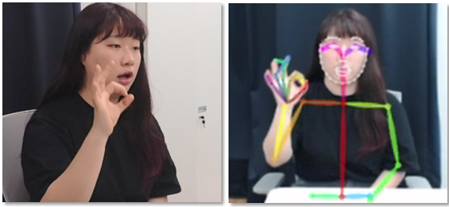
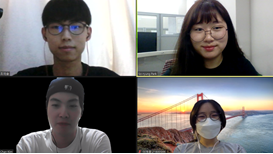
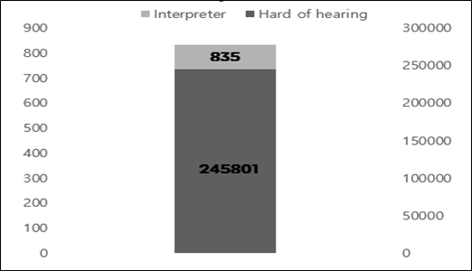
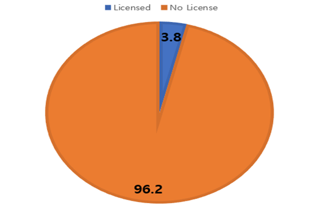
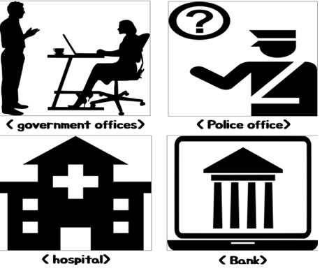
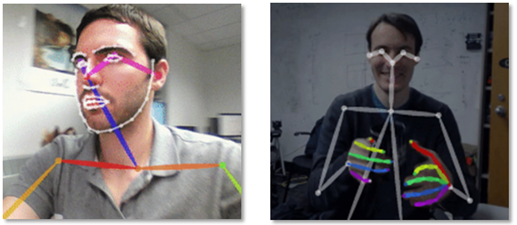
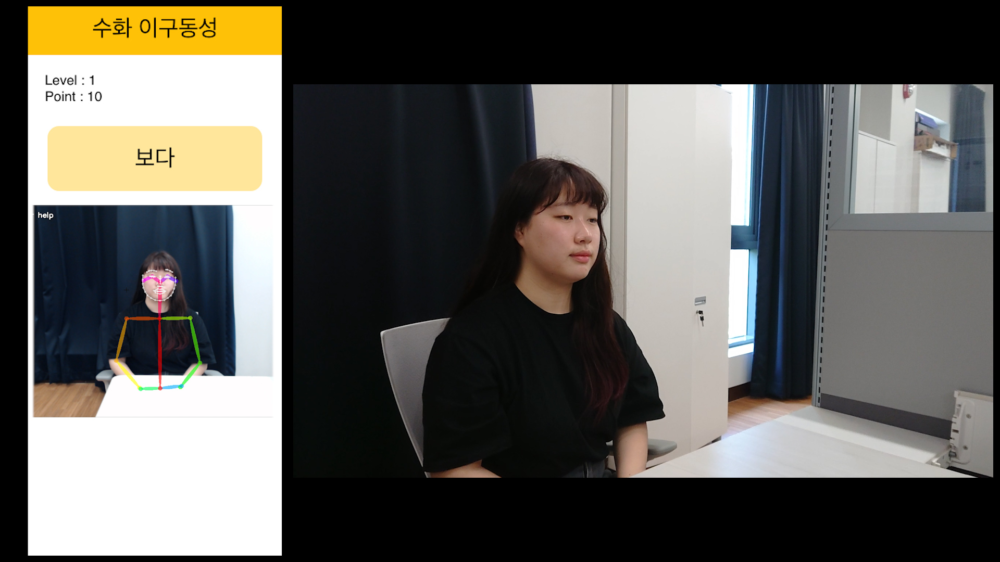
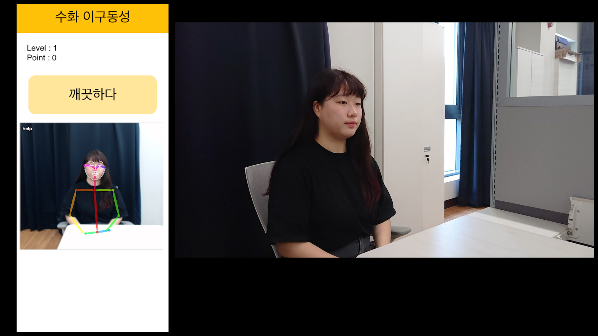

[← go back to the list](../README.md)

# Sign Language Education for the Non-Disabled Using Motion Recognition


#### Members
Chan Kim, So-ryung Park, Ye-sol Cho, Ye-won Lee


## 1. Introduction
### Project’s Background    
#### Sign Language


Sign language is second statutory official language with the Korean Sign Language Act of 2016

Sign language is divided into fingerspelling and sign language.Fingerspelling is to represent consonant and vowel by expressing each alphabet.Sign language is the thing we usually know in common.Simply overall, sign language is a 'hand-to-hand conversation.'

However, not only the hand is used in sign language, but the meaning can be varied by gesture or expression. Just as the meaning depends on the accent when we speak, the meaning of the sign language also depends on the gesture or facial expression, so we should use the gesture and facial expression to convey our message to the other person.

#### commonization/licensing of sign language


In 1997, the sign language interpreter qualification system was implemented by the Korea Peasants Association, and in 2005, it was promoted to a state-certified position. In particular, the Korean Sign Language Act, enacted in 2016, made Korean sign language the official language of Korean farmers. 

#### Current situation/problem

Photo 1. number of national Deaf & Sign Language Interpreter

According to statistics from the Ministry of Health and Welfare, the number of deaf and speech-impaired people in the country is estimated to be 245,801, and the combined number of unregistered people may reach 350,000. On the other hand, the number of national certified sign language interpreters was 835 which is significantly insufficient.


Photo 2. Percentage of special school teachers who have a sign language interpreter certificate

Among 548 teachers at special schools with hearing impairments nationwide, only 21 teachers have sign language translation certificates(National Human Rights Commission, 2005). Only 3.8 percent of teachers at special schools with hearing impairments have sign language and interpretation certificates, making it urgent to improve the educational environment for deaf children.

### Project’s Goal
#### Diversification of sign language education
- First, improve the current situation in which there is a lack of systematic and appropriate materials and video materials, and there is few textbook explaining the structure and style of Korean sign language.
- Second, change the classes which focus on only listing words method
- Third, increase sign language staff because of lack of systematic knowledge of sign language as well as language teaching methods.
- Fourth, develop efficient programs for sign language education because there is no standard guidance or guideline on how to teach and what to teach.

#### Training of sign language manpower


Providing personnel to government offices, banks, hospitals, police stations, etc. that are urgently needed because there is not enough communicational support for disabled people in daily life.
- Public  administration office
- Police office
- Post office
- Hospital
- University
- Social welfare work

## 2. Main Contents
### How to Set-up the program
#### Determine CPU and GPU suitability
Motion recognition was possible in both CPU and GPU. At first, it started setting up a motion recognition environment through CPU, but many errors occurred. When I searched for the cause of the error, I found that there was a lot of video data that had to be processed to increase the accuracy of motion recognition. Therefore, it is in charge of controlling various computer functions, and it is overloaded with CPU by proceeding image processing simultaneously.

However, GPU is faster than CPU because they work in parallel with repetitive and similar large operations. Therefore, GPU was used because it was optimized for graphic processing. In addition, three programs (Cuda, CUDNN, and CMake) were used to configure the program with GPU.

#### Cuda, CUDNN, and CMake
First, 'Cuda' is a program that helps GPU to be used in various programs as well as graphics processing. Because GPU is designed to be used for simple and repetitive processing, additional help is needed to be utilized in a variety of areas, such as CPU.

Next, "CUDNN" is a program that utilizes artificial intelligence so that computers can recognize models when they recognize motion, and helps them to optimize artificial intelligence in GPU.

However, Cuda and CUDNN do not work on Windows operating systems. That's why we finished building the environment using a separate build program called 'CMake' to suit the Windows operating system.

### Explanation of source code
We used the openpose library of the Perceptual-Computing Lab of Carnegie Mellon University (CMU). Link:  https://github.com/CMU-Perceptual-Computing-Lab/openpose

#### What is different Openpose and Opencv?
Openpose and OpenCV are both Python libraries that process data related to images. OpenCV provides analytics while processing images and videos in real-time. Based on these OpenCV, OpenPose was created. OpenPose uses data from deep learning called Caffe to estimate a person's body part in real-time. Because it can detect both single and multiple models, its utilization is high.

#### Three models of openpose
There are three versions available in OpenPose: 'MPI_15', 'COCO_18', and 'Body_25'. 'MPI_15' only shows the entire body's skeleton position because it has the lowest version of motion recognition. On the other hand, wh1en you become 'COCO_18', you can see the movement of your fingers by bone. 'Body_25' also details all areas of the eye, lips, jawline, and eyebrows.

#### What we used? Why we used?
The models we used were 'COCO_18' and 'Body_25'. This is because 'MPI_25' is not suitable for recognizing sign language by providing only a simple form, and the computer has shown many errors. On the other hand, 'COCO_18' was appropriate to represent the shape of the hand in a line that would not strain the computer. And 'Body_25' was turned to the desktop because it was not available on a regular laptop, and it was an optimized model for sign recognition because of its facial expression.


Photo3. Body_25(left) and COCO_18(right)

#### How to run it

Photo4. Windows PowerShell Running

First, specify the location value of the folders where the environment is built through Windows PowerShell. Afterwards, execute Python code that recognizes the area you want to know, such as the hand or face, from a video or photo. Select one of the models ("MPI_15", "COCO_18", and "Body_25") that recognize and output the area.

Ex) Running Python Code for hand

```python
# From Python
# It requires OpenCV installed for Python
import sys
import cv2
import os
from sys import platform
import argparse
import time
 
try:
    # Import Openpose (Windows/Ubuntu/OSX)
    dir_path = os.path.dirname(os.path.realpath(__file__))
    try:
        # Windows Import
        if platform == "win32":
            # Change these variables to point to the correct folder (Release/x64 etc.)
            sys.path.append(dir_path + '/../../python/openpose/Release');
            os.environ['PATH']  = os.environ['PATH'] + ';' + dir_path + '/../../x64/Release;' +  dir_path + '/../../bin;'
            import pyopenpose as op
        else:
            # Change these variables to point to the correct folder (Release/x64 etc.)
            sys.path.append('../../python');
            # If you run `make install` (default path is `/usr/local/python` for Ubuntu), you can also access the OpenPose/python module from there. This will install OpenPose and the python library at your desired installation path. Ensure that this is in your python path in order to use it.
            # sys.path.append('/usr/local/python')
            from openpose import pyopenpose as op
    except ImportError as e:
        print('Error: OpenPose library could not be found. Did you enable `BUILD_PYTHON` in CMake and have this Python script in the right folder?')
        raise e
 
    # Flags
    parser = argparse.ArgumentParser()
    parser.add_argument("--image_path", default="../../../examples/media/COCO_val2014_000000000241.png", help="Process an image. Read all standard formats (jpg, png, bmp, etc.).")
    args = parser.parse_known_args()
 
    # Custom Params (refer to include/openpose/flags.hpp for more parameters)
    params = dict()
    params["model_folder"] = "../../../models/"
    params["hand"] = True
    params["hand_detector"] = 2
    params["body"] = 0
 
    # Add others in path?
    for i in range(0, len(args[1])):
        curr_item = args[1][i]
        if i != len(args[1])-1: next_item = args[1][i+1]
        else: next_item = "1"
        if "--" in curr_item and "--" in next_item:
            key = curr_item.replace('-','')
            if key not in params:  params[key] = "1"
        elif "--" in curr_item and "--" not in next_item:
            key = curr_item.replace('-','')
            if key not in params: params[key] = next_item
 
    # Construct it from system arguments
    # op.init_argv(args[1])
    # oppython = op.OpenposePython()
 
    # Starting OpenPose
    opWrapper = op.WrapperPython()
    opWrapper.configure(params)
    opWrapper.start()
 
    # Read image and face rectangle locations
    imageToProcess = cv2.imread(args[0].image_path)
    handRectangles = [
        # Left/Right hands person 0
        [
        op.Rectangle(320.035889, 377.675049, 69.300949, 69.300949),
        op.Rectangle(0., 0., 0., 0.),
        ],
        # Left/Right hands person 1
        [
        op.Rectangle(80.155792, 407.673492, 80.812706, 80.812706),
        op.Rectangle(46.449715, 404.559753, 98.898178, 98.898178),
        ],
        # Left/Right hands person 2
        [
        op.Rectangle(185.692673, 303.112244, 157.587555, 157.587555),
        op.Rectangle(88.984360, 268.866547, 117.818230, 117.818230),
        ]
    ]
 
    # Create new datum
    datum = op.Datum()
    datum.cvInputData = imageToProcess
    datum.handRectangles = handRectangles
 
    # Process and display image
    opWrapper.emplaceAndPop([datum])
    print("Left hand keypoints: \n" + str(datum.handKeypoints[0]))
    print("Right hand keypoints: \n" + str(datum.handKeypoints[1]))
    cv2.imshow("OpenPose 1.6.0 - Tutorial Python API", datum.cvOutputData)
    cv2.waitKey(0)
except Exception as e:
    print(e)
    sys.exit(-1)
``` 

### Idea development process (Necessary images)
#### Sketch


Although we set a topic for sign language education that recognized "motion," we thought that each member would have different ideas about the design or function of the app. So we decided to sketch and collect the ideas of each app. We collected the sketches and collected good ideas from my team members such as the big design frame of the app, how to study, and games.

#### Prototype


Prototyping was completed in three steps, largely through two stages of development. At first, ideas collected from sketches were simply prototyped with ppt and sigma.


After that, the app prototype was created through Adobe XD by devolving screen layout and screen movement. Then, we tried to clarify how to study through motion recognition and how to review through games.


We unified slightly different layouts such as photo size and location, the app has been organized so that the photos can be placed in the same location and the same size. Furthermore, we discussed and applied some of the feedback from the user research to app prototyping. First of all, we put mirror mode in the video after accepting feedback that 'I wish there was a mirror mode.' And we took feedback that the game didn't make sense and made the game more concrete.

### Explanation of program with images
#### Main

<br>


These are the main pages that pop up when you start an app. You can see the app's name and logo design. And you can check your finger position. There are five icons below, each representing home, table of studying contents, favorites, games, and My Page. When you press the home icon, the image on the right comes up.

#### Study


If you touch 'Studying Contents', you can see the screen on the left. You can learn the consonants and vowels of sign language if you click '지화'. If you choose '일상', you can learn various everyday sentences.


   

Let's study consonants first. You can study by watching videos. Click "View in mirror mode" to view the video in mirror mode, which is better for studying. If you touch 'follow', you can follow the sign language through motion recognition and get feedback on how accurate it is.


Studying sentences is also possible to watch in mirror mode and to follow the motion.

#### Game
You can review what you studied through two games. They are '지화 끝말잇기' and ‘수화 이구동성’. When you click on the game button, the game description appears. You can look at the game description and play the game as instructed.


When you start the ‘Jihwa Word Chain game’, Jihwa's picture appears. Then, you should recognize the word represented by the picture and then take the word that comes after it in motion. The computer will recognize your motion to check the matching rate, check if you have done the right motion and give you a score.


If you click the 'sign language's one-mouth game', you can see the sentence above the app. After three seconds, you should do sign language with a sentence meaning. The computer will recognize your motion and give you a score.




It's the app's screens of the game when you do motion.

#### Favorites & My page


As you study, you can add favorite sentences or words. You can see the sentences you added as favorites at the 'Favorites icon' below. Also, You can check the progress of your studies on My Page. The app tells you how much you have studied and what grades you have in the game.

#### Demo video
<div style="position: relative; padding-bottom: 56.25%; padding-top: 0px; margin-bottom: 50px; height: 0;"><iframe src="https://www.youtube.com/embed/crlFGZVZ_zU" frameborder="0" allow="autoplay; encrypted-media" allowfullscreen style="position: absolute; top: 0; left: 0; width: 100%; height: 100%;"></iframe></div>

## 3. Conclusion
### Limitations and Future studies
We implemented motion recognition on high-performance desktops. Thus, users are needed desktop and webcam to use this product for their learning. To make it easier for users to use this product, motion recognition needs to be implemented on low-end computers, or smartphones. While there will be technical issues, this would contribute improving user convenience for education. In addition, we omitted to technically implement the motion estimation after motion recognition, which requires the implementation of technologies using Deep Learning. Because we determined that estimating the user’s motion accuracy is not important factor in this project.

Also, Further improvements in user-centered design for non-disabled sign language education based on the results of the user test will be possible. The first is to analyze user’s learning words and recommend frequently used words associated with them. It would be possible to provide effective sign language learning by assigning the correlation between words provided in the application based on an algorithm and then analyzing the user’s word learning history. In particular, providing sign language education as shown above, will improve the ‘flexibility’ of the product in terms of customizing. In addition, analyzing words that have been learned, then identifying the user’s learning level and providing a learning that meets the appropriate level will enable the user to perceive their self-learning level, and this could be used a function that can give clarity of learning purpose in terms of education purpose.

### The conclusion paragraph of the document
Now that non-face-to-face activities have increased due to COVID-19, various activities using webcams are being carried out. Online classes, meetings and gatherings such as education, as well as spectators at sporting events are watching through webcams. During this time, the project was also conducted on non-face-to-face, and there were some unfamiliar things happened. It was difficult to deal with problems caused by different PC operating systems, and implementing the technology on a laptop for quite a long time because no one had high-performance PCs to access real-time image processing.

Due to these difficulties, it is a pity that could not to spend a relatively sufficient amount of time to think about how education can be done more effectively using games and interactions. Although there is also a regret that we could not experience and test the actual education through the final prototype, it was a meaningful project in that education can be had non-face-to-face using webcam and motion recognition even in this situation. If non-face-to-face training can be carried out effectively using motion recognition and webcam as this product provides, users will be able to benefit from sign language education comfortably by using their leisure time, and this will be able to contribute to problems such as lack of sign language specialists in public institutions.

## 4. References
### Introduction
- Project’s Background
	- 수화의 공용화/라이센스화
	- 수어통역사 활성화 방안 연구,한국장애인개발원,2018
	- [현상황/문제,사진1,사진2](http://www.bokjinews.com/news/articleView.html?idxno=40626)
- Project’s Goal
	- 우리나라 수어 교육 실태와 개선 방안,국립국어원,원성옥,2017

### Main Contents
- How to Set-up and Run the program
	- [CPU와 GPU의 차이](https://sdc-james.gitbook.io/onebook/1./1.1.-artificial-intelligence/1.1.1.-cpu-gpu)
	- [Cuda란 무엇인가](https://m.blog.naver.com/PostView.nhn?blogId=msamhh&logNo=221462435395&proxyReferer=https:%2F%2Fwww.google.com%2F)
	- [윈도우 cuDNN 설치하기](https://blog.naver.com/PostView.nhn?blogId=rickman2&logNo=221598229096&redirect=Dlog&widgetTypeCall=true&directAccess=false)
	- [CMake란 무엇인가?](https://gtrfx.github.io/2019/03/07/what-is-cmake.html)
- Explanation of source code
	- [파이썬과 OpenCV를 이용한 성별 및 연령 판별하기](https://sungwookkang.com/1404)
	- [OpenPose 란?](https://m.blog.naver.com/ekbae98/221353193865)

### Conclusion
- Limitations and Future studies
- The conclusion paragraph of the document

## [Source Code](source/source.zip)