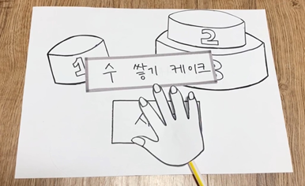

[← go back to the list](../README.md)

# 초등학교 저학년을 위한 유니티를 이용한 수학게임

#### Members
나경민, 정승아, 김효진

## 1. 개요
### 1.1 목적
립모션을 이용한 게임을 통해 자연스럽게 수학적 능력을 향상한다.

### 1.2 기대효과
우리 팀은 leap motion을 이용한 아이디어를 논의하며 블록 놀이나 가베 놀이와 같은 유아용 교구를 만들기로 결정하였다. Leap motion을 이용하면 아동의 흥미를 유발할 수 있으며 컨텐츠를 확장하고 업데이트가 가능하다는 장점을 가진다. 단순한 흥미유발 차원이 아닌 학습에 ‘재미’요소를 부가하여 학습동기를 강화하고 학습효과를 높일 수 있다. 게임형태이기에 사용자는 프로그램에 적극적으로 참여해야 하며 그에 따른 결과가 달라지는 것이 큰 특징이다. 게임을 통해 자연스럽게 교육적 효과를 달성할 수 있다. 또한, 사용자의 손동작을 인식해서 스크린 속 물체와 상호작용할하는 경험을 통해 감각과 두뇌발달에 도움이 된다.

또한 아동들이 3D 블럭놀이, 가베 놀이를 통해 공간지각능력과 기하도형에 대한 감각과 사고력을 발달시킬 수 있다. 사용자는 손동작을 통해 도형을 뒤집거나 돌리고,  화면상 사용자의 시야 이동으로 도형을 여러 방향, 각도에서 보는 경험을 하게 되는데, 공간지각 대상에 대해 을 추론하며  기하도형에 대한 감각과 사고력을 발달시킨다. 그리고 문제를  분석하여 문제 해결 능력인 입체적 사고와 수학적 추론 능력, 수학 기하학적 사고를 기를 수 있다. 집중력과 인내심이 향상 되며 성취감과 도전의식이 고무된다. 문제를 해결하기 위해 논리적으로 관찰, 분석, 비교, 추리하는 동안 문제해결능력이 향상된다. 도형의 이동, 회전, 대칭을 관찰을 통해 손과 눈의 협응력을 길러준다. 사물에 대한 변별력과 대응에 대한 개념을 이해할 수 있다.

### 1.3 배경
전 세계 인터넷 이용자의 3분의 1이 어린이와 청소년이다. 수많은 아동들이 디지털 기술의 혜택을 누리고 있다. 이는 디지털 기기의 사용에 익숙한 아동이 leap motion에도 잘 적응할 수 있을 것이라는 기대를 할 수 있다. 또한, 이미 다양한 박물관들은 디지털 시대에 맞게 스마트 박물관이라는 주제를 갖고 흥미를 유발하고 감성을 풍부하게 만들겠다라는 목표를 갖고 변화하고 있다. 그리고 교육 분야에서 증강현실 또는 가상현실을 이용한 흥미로운 교육 컨텐츠들이 등장하고 있다. 그러나 에듀테인먼트 형식으로 교과과정 내의 학습개념을 익힐 수 있도록 돕는 컨텐츠는 미비하다.

교육과 오락의 합성어인 에듀테인먼트는 게임을 하는 것처럼 즐기면서 학습할 수 있도록 하는 교육형태를 말한다. 에듀테인먼트는 학습과정에서 게임과 같은 오락성 즉, 도전성, 몰입성, 모험성 등이 중요한 요소로 고려된다. 우리 팀은 에듀테인먼트의 기본적인 속성이 포함된 학습용 콘텐츠를 만들고자 한다.

### 1.4 사용 대상자
사용 대상자는 초등학교 저학년이다.

유치원생 혹은 초등학교 저학년 아동은 유아교육의 대산 연령 범주(0-8세_에 속하며 발달심리학적으로 연계적 특징이 비슷한 사고 및 행동특성을 보인다. 따라서 이들을 대상으로 실시하는 모든 교육활동은 유사한 목표와 내용, 방법으로 연계성 있게 이루어져야 교육의 효과를 높일 수 있다. 특히 수학교육은 학문구조상 체계적이고 계속성과 계열성이 요구되는 교과영역으로 연계교육의 필요성이 더욱 강조된다. 스스로 환경의 변화를 보고 즐거워하는 특성을 고려하면 즉각적인 반응이 제공되는 교구가 흥미를 이끌 수 있을 것이며, 아동을 소극적인 청자 혹은 관람자로 만드는 상황보다 행동에 따른 상호작용이 이루어지는 상황이 효과적인 교육적 맥락이 될 것이다.

초등학교 저학년 대상이 에듀테인먼트적 요소가 포함된 학습 컨텐츠를 이용하면서 수학적 개념들을 딱딱한 교과내용이 아닌 호기심이 가는, 재미를 느끼는 대상으로 만드는 것을 목표로 한다. 요즘 교육 콘텐츠는 모바일 기기나 PC로 보는 디지털 영상으로 일방적인 소통이 대부분이다. 그래서 상호작용 할 수 있는 교육 컨텐츠에 대한 잠재적인 니즈가 있다고 볼 수 있다. 위의 표를 통해 0-14세 인구의 구성비가 감소하고 있다는 것을 알 수 있다. 대상자의 인구수가 줄어드는 것이 부정적이지만은 않다. 같은 자원으로 적은 대상자의 질 좋은 교육에 더욱 집중시킬 수 있기 때문에 흥미롭고 유익한 컨텐츠를 개발해야 할 동기가 된다.

### 1.5  범위 및 기능(역할)
다음은 2015학년도 교과서 개정에 따른 학년별 수학 교과서의 목차이다.

표 1 초등 저학년 수학교과 목차

| 1-1 | 1-2 | 2-1 | 2-2 | 3-1 | 3-2 |
|-----|-----|-----|-----|---------|-|
| 9까지의 수(1~9까지의 수 읽고 쓰기, 몇째 인지 알아보기, 수의 순서, 1 큰수와 1 작은 수, 0 알아보기, 두수의 크기 비교 | 100까지의 수 (몇십 알아보기, 99까지의 수 알아보기, 수의 순서 알아보기, 수의 므기 비교하기, 짝수와 홀수 알아보기 | 세 자리 수(90보다 10큰 수, 몇백, 세 자리 수, 각 자리 숫자가 나타내는 값, 뛰어 세기, 두 수의 크기 비교 | 네 자리 수 (100이 10인 수, 몇천 알아보기, 네 자리 수, 각 자리의 숫자가 나타내는 값 뛰어 세기, 두 수의 크기 비교하기) | 덧셈과 뺼셈 (세 자리 수의 덧셈, 세 자리 수의 뺄셈) | 곱셈구구 (2~9단 곱셈구구, 1의 단 곱셈구구, 0의 곱, 곱셈표 만들기, 곱셈표를 이용하여 문제 해결하기) |
| 여러 가지 모양 (여러 가지 모양 찾기, 여러 가지 모양 알아보기, 여러 가지 모양으로 만들기) | 덧셈과 뺄셈(1) ((몇십 몇)+(몇),(몇십)+(몇십), (몇십 몇)+(몇십 몇), (몇십 몇)-(몇), (몇십)-(몇십), (몇십 몇)-(몇십 몇) 여러가지 방법으로 덧셈/뺄셈하기) | 여러 가지 도형(원, 삼각형, 사각형, 오각형, 육각형 알아보기, 칠교판으로 모양 만들기, 똑같은 모양으로 쌓기, 여러 가지 모양으로 쌓기) | 곱셈구구 (2~9단 곱셈구구, 1의 단 곱셈구구, 0의 곱, 곱셈표 만들기, 곱셈표를 이용하며 문제 해결하기) | 평면 도형 (선의 종류, 각, 직각, 직각삼각형, 직사각형, 정사각형 알아보기) | 길이 재기 (cm보다 더 큰 단위, 자로 길이 재기, 길이의 합과 차 구하기, 길이 어림하기)
| 덧셈과 뺄셈 (모으기와 가르기, 이야기 만들기, 덧셈식, 뺄셈식 쓰고 읽기, 덧셈하기, 뺌셀하기, 0을 더하거나 뺴기, 덧셈과 뺼셈하기) | 여러 가지 모양 (여러 가지 모양 쌓기, 여러 가지 모양 알아보기, 여러 가지 모양을 꾸미기) | 덧셈과 뺄셈(두 자리 수)+(한 자리 수), (두 자리 수)+(두 자리 수), (두 자리 수)-(한 자리 수), (몇십)-(몇십몇), (두 자리 수)-(두 자리 수), 𑂽의 값 구하기, 세 수의 계산 | 길이 재기 (cm보다 더 큰 단위 , 자로 길이 재기, 길이의 합과 차 구하기, 길이 어림하기) | 
나눗셈(똑같이 나누기, 곱셈과 나눗셈의 관계, 나눗셈의 몫 구하기) | 시각과 시간 (몇 시 몇 분 알기, 시각 읽기, 1시간 알기, 하루의 시간 알기, 달력 알기) |
| 비교하기(길이, 무게, 넓이 비교하기, 담을 수 있는 양 비교하기) | 덧셈과 뺄셈(2)(세 수의 덧셈, 뺼셈, 두 수 더하기, 10이 되는 더하기, 10에서 빼기, 10을 만들어 세 수 더하기) | 길이 재기 (여러 가지 단위로 길이 재기, 1cm 알아보기, 자로 길이 재기, 길이 어림하기) | 시각과 시간(몇 시 몇 분 알기, 시각 읽기, 1시간 알기, 하루의 시간 알기, 달력 알기) | 곱셈 ((몇십)*(몇), 올림이 없는 (몇십몇)*(몇), 십의자리/일의 자리에서 올림이 있는 (몇십몇)*(몇), 십의 자리와 일의 자리에서 올림이 있는 (몇십몇)*(몇)) | 표와 그래프 (자료를 보고 표로 나타내기, 그래프로 나타내기)
| 50까지의 수 (9다음 수, 십몇 알아보기, 모으기와 가르기, 10개씩 묶어 세기, 50까지의 수 세기, 50까지의 수의 순서, 두 수의 크기 비교 | 시계 보기와 규칙 찾기 (몇시, 몇시 30분 알아보기, 규칙을 찾고 말해 보기, 규칙 만들어 무늬 꾸미기, 수 배열, 배열표에서 규칙 찾기) | 분류하기 (기준에 따라 분류하기, 분류하여 세기, 분류한 결과 말하기) | 표와 그래프 (자료를 보고 표로 나타내기, 그래프로 나타내기) | 길이와 시간 (1cm보다 작은 단위, 1m보다 큰 단위, 길이와 거리를 어림하고 재어보기, 길이의 합/차, 1분보다 작은 단위, 시간의 합/차) | 규칙 찾기 (덧셈표, 곱셈표에서 규칙 찾기, 문의, 쌓은 모양에서 규칙 찾기) |
| | 덧셈과 뺄셈(3) (10을 이용한 모으기와 가르기, (몇)+(몇)=(십몇), 덧셈하기, (십몇)-(몇)=(몇), 뺼셈하기 | 곱셈 (여러가지 방법으로 세어 보기, 묶어 세기, 몇의 몇 배 알아보기, 곱셈식 알아보기, 곱셈식으로 나타내기 |  규칙 찾기 (덧셈표, 곱셈표에서 규칙 찾기, 무늬, 쌓은 모양에서 규칙 찾기) | 분수와 소수 (똑같이 나누기, 분수 알아보기, 분모가 같은 분수의 크기 비교, 단위분수의 크기 비교, 소수 알아보기, 소수의 크기 비교하기) | |

위의 목차를 정리해보면 초등학교 저학년의 경우, 두 수의 크기 비교, 덧셈/ 뺄셈, 곱셈/나눗셈, 모으기와 가르기(묶어서 계산하기), 시각과 시간, 시간의 합/차, 단위에 대한 개념, 여러가지 도형, 분수와 소수로 요약할 수 있다.

케이크 쌓기 게임을 통해서 여러 가지 수의 크기 비교를 할 수 있으며, 합/차/곱셈/나눗셈의 개념을 적용할 수도 있으며, 시간과 시각, 시간의 합/차, 단위에 대한 개념, 여러가지 도형의 특성에 대한 개념, 분수와 소수 개념을 적용하여 문제를 만들 수 있다.

양팔저울 게임에서는 양팔을 평형으로 맞추기 위해 등호와 부등호의 개념을 배우게 된다. 그러면서 케이크 쌓기에서 사용된 개념은 물론이며 그에 더해서 모으기와 가르기, 묶어서 계산하기에 대한 개념을 적용하여 문제를 만들 수 있다.

### 1.6 관련 기술
Leap motion은 ultraleap에서 개발한 제스쳐 기반 인터페이스(입력장치)이다. leap motion은 2013년도에 출시되었고, 다양한 분야에서 활용되고 있다. Leap motion controller는 정확하게 손의 움직임을 포착하는 광학 핸드 트래킹 모듈로 low processing, a wide field of view, and near-zero latency를 가지며 디지털 세계에서 인간의 상호작용을 자연스럽고 쉽게 만든다.

Leap motion은 배움과 훈련에서 컴퓨터에 연결하여 사용자의 손동작을 통해 디지털 시스템과 상호작용할 수 있으며 물리적인 접촉 없이 제스처로 상호작용할 수 있다. 이 장치는 훌륭한 도구로 학생들은 가상 현실 속에서 몰입적 경험을 하거나 간단한 인터페이스를 통해 직관적으로 기기를 제어할 수 있는 human interface device이다. 게임을 통해 학습하는 것은 교육의 미래를 위한 유망한 분야이기도 하다.

### 1.7 선행 연구
초등학교의 소규모 학생그룹과 현장 연구를 한 결과를 통해 학교교육에 leap motion을 사용할 가능성이 크다는 점을 시사한다. 기능성 게임의 입증된 효과를 통해 다양한 분야에서 활용되고 있다. 기능성 게임은 광범위한 분야의 목표를 포괄하거나 학습과 훈련의 과정을 돕는다. 국내 기능성 게임의 대표적인 게임은 한자마루, 오디션 잉글리시 등이 있다. 기능성 게임은 학습자의 흥미유발을 통해 학습자의 자기주도의 학습능률을 높이고, 현대 사회에 교육도구를 연계시켜 개임 개발이 가능하다는 점을 시사하고 있다. 학습자가 주도적이고 적극적으로 신체감각을 이용한 교육형 게임으로 발전할 수 있는 가능성을 제안한다. 컴퓨터에 연결된 립모션 센서로 아동의 손동작을 3차원으로 인식하여 구현하고, 이를 이용해 게임이 실행하는 소프트웨어를 사용했다.

## 2.  프로젝트 과정
### 2.1 게임 종류 선정
에듀테인먼트라는 프로젝트의 목적에 부합하는 블럭, 가베놀이 위주의 아날로그 게임 중 3D화면, Leap motion 사용에 적합 게임을 먼저 선정했고, ‘케이크 쌓기 게임’, ‘양팔 저울 게임’, ‘펜토미노’, ‘소마큐브’를 선정하였다. 그리고 초등학교 저학년의 수학 교과 교육 과정에서 배우는 개념에 대해 알아 본 후에 교과 개념들을 적용할 수 있는 있는 게임을 다시 선정하였고 ‘케이크 쌓기 게임’과 ‘양팔 저울 게임’이 적합하고 판단되어 두 가지 게임을 중점적으로 개발하기로 계획했다. 특히 케이크 쌓기 게임은 크기 비교의 개념을 효과적으로 수학할 수 있는 게임이다. 케이크의 각 단마다 초등학교 저학년에서 배우는 합/차/곱셈/나눗셈의 개념과 시간과 시각, 시간의 합/차, 단위에 대한 개념, 여러가지 도형의 특성에 대한 개념, 분수와 소수 개념을 적용할 수 있다. 이러한 개념들이 적용된 각 케이크 단을 비교하면서 여러 가지 수의 크기를 비교하는 연습을 할 수 있다.

그리고 양팔저울 평형 맞추기 게임을 통해 게임등호와 부등호의 개념을 효과적으로 수학할 수 있다.  케이크 쌓기에서 적용된 여러가지 개념은 물론이고, 사용자가 저울의 평형을 맞추는 과정에서 모으기와 가르기, 묶어서 계산하기에 대한 개념을 자연스럽게 익힐 수 있다.

### 2.2 프로토타입 만들기(Concept and detailed ideas)
#### 2.2.1 케이크 쌓기 게임

#### 2.2.2 홈화면과 양팔저울 게임

#### 2.2.3 펜토미노

### 2.3 1차 사용자 조사
1차 사용자 조사는 먼저 우리 프로젝트의 배경과 목적을 소개한 후 페이퍼 프로토 타입을 통해 컨텐츠의 세부사항들을 소개 후 인터뷰 목적에 맞게 준비된 질문에 대한 반응을 기록하는 방식으로 진행되었다.

사용자 조사 진행 목적은 립모션을 통해 아이들에게 몰입감 있는 블록게임을 제공하고 에듀테인먼트라는 의도와 맞는 적절한 컨텐츠를 제안했는지, 또한 삭제하거나 추가해야 하는 어플리케이션이 있는지, 혹은 기능의 불편함은 있는지, 립모션을 이용한 블록게임에 대한 사용자 의견은 무엇인지, 이 컨텐츠가 다른 컨텐츠들에 비해 충분한 차별화 요소가 있는지, 초등학생들에게 충분히 관심을 끌만큼 컨텐츠가 흥미로운지 알고자 진행한 첫번째 사용자 조사(참여자: 7명, 일시: 4월 18일~4월 27일)에서 다음과 같은 피드백을 얻었다.

콘텐츠의 목적과 주제가 적절하고 긍정적으로 평가됨을 알 수 있었다. 그리고 립모션이라는 상호작용 기기는 유저들에게 참신하고 신기하게 다가갔음을 느낄 수 있었다. 하지만 교육과 재미를 추구하는 에듀테이먼트 컨텐츠에서 재미의 측면은 많이 떨어진다는 평을 많이 들었다.

첫 번째 솔루션은 컨텐츠에 재미요소를 추가하는 것이다. 이 컨텐츠가 오프라인 컨텐츠를 온라인에서 대신하는 시뮬레이터 정도의 역할만을 하고 있다는 점이 문제점으로 나타났다.  따라서 이후에 플레이어에게 동기를 부여하거나 흥미를 느낄 수 있는 컨텐츠들을 추가할 필요성을 느낀다. 이러한 게임성을 강화할 수 있는 방법은 여러가지가 있을 것이다. 게임에 스토리를 추가하여 흥미를 유발하거나 레벨 디자인의 적절함. 또한 문제 해결 시 보상을 주는 방식으로 컨텐츠의 재미요소를 추가할 수 있다.

두 번째 솔루션은 사용자 범위의 축소이다. 우리의 컨텐츠는 청소년 중에서도 초등학생 전체를 타겟으로 지정하고 있다. 몇몇 게임은 저학년을 위한 컨텐츠로, 또 몇몇 게임은 고학년을 위한 컨텐츠로 기획하여 초등학생 전체를 수용할 수 있는 게임을 목표로 하였다. 하지만 이번 인터뷰를 통해 이러한 방식은 자칫 저학년과 고학년 모두를 잡지 못하는 애매한 컨텐츠가 될 수 있다는 위험성을 느꼈다. 만약 초등학생 전체를 범위로 잡는다면 고학년에게는 유치하고 저학년에게는 난해한 컨텐츠가 될 수 있다. 따라서 타겟층을 초등학교 저학년으로 줄이기로 했다.

세 번째 솔루션은  립모션의 특성을 보완, 활용이다. 립모션이 아직 대중적으로 이용되고 있지 않은 만큼 많은 이들이 매우 신기하고 흥미롭게 반응하였다. 하지만 반대로 기기가 익숙하지 않기 때문에 동작하는데 있어서 우려를 표했다. 또한 사용자가 익숙치 않은 기기를 사용하는 만큼 이 장비의 장점을 충분히 활용할 수 있도록 컨텐츠를 디자인 하는게 좋겠다는 의견을 받았다. 소마큐브 같은 경우 여러 류의 블록을 모양에 맞게 쌓는 작업을 해야 하기 때문에 보다 정교한 동작을 필요로 한다. 때문에 립모션으로 이러한 동작을 플레이어에게 맡기는 것은 무책임할 수 있음을 느꼈다. 따라서 블록 위치의 자동완성, 다른 보조 기구의 추가와 같이 동작을 보조해줄 수 있는 여러가지 시스템이나 장치들을 추가하고자 한다.

### 2.4 스토리 및 레벨 디자인
#### 2.4.1 스토리 디자인
1차 유저 리서치를 통해 저학년이라는 나이적 특성을 감안하였을 때 수학교구로써 흥미를 유발할 수 있는 요소가 부족하다는 피드백이 많았다. 이를 고려해서 게임의 전체적인 흐름에 스토리를 넣었다.

#### (1) 케이크 쌓기
평화롭던 쿠키나라에 쿠키왕과 백성들은 행복하게 지내고 있었습니다. 어느 날, 옆 나라인 감자나라의 감자 칩 장군이 쳐들어왔습니다. 감자나라의 감자왕은 쿠키왕국의 달달함을 짭짤함으로 바꾸고 싶어했어요. 감자 칩 장군은 쿠키왕을 잡기 위해 쿠키나라를 쑥대밭으로 만들었어요. 쿠키왕이 살아남기 위해서는 젤리나라로 통하는 케이크 계단을 통해 도망쳐야 합니다. 쿠키왕이 젤리나라로 가기 위해 거쳐야 하는 계단은 총 n개! n개의 계단 쌓기 미션을 순서대로 완성해야 쿠키왕이 무사히 건널 수 있어요. 계단을 쌓는 규칙은 다음과 같습니다. 큰 수가 적힌 케이크 단일수록 아래에 놓아야 합니다. 쿠키왕이 무사히 젤리나라로 갈 수 있도록 케이크를 쌓아주세요.

#### (2) 양팔 저울
케이크 계단을 통해 젤리나라에 도착한 쿠키왕에게 문제가 생겼어요. 쿠키왕이 떠난 쿠키나라에 남아있는 쿠키 장병들이 포로로 잡혔기 때문입니다. 이 소식을 들은 젤리왕은 쿠키왕에게 한가지 제안을 합니다. 젤리나라에는 200년간 잠겨 있는 젤리 창고가 있어요. 이 창고는 n개의 문으로 꽁꽁 닫혀 지금까지 아무도 이 문을 열 수 없었습니다. 젤리왕은 젤리창고를 열 수 있다면 쿠키 장병들을 구하기 위한 지원군을 보내주겠다고 쿠키왕에게 제안했어요. 젤리창고의 문을 열기 위해서는 n개의 문을 차례로 열어야 합니다. 문을 여는 방법은 다음과 같습니다. 양팔저울이 기울지 않고 평평한 상태일 때 문이 열립니다. 양팔저울에 젤리를 올려 평평하게 만들어 쿠키왕이 창고 문을 열 수 있도록 도와주세요.

#### 2.4.2 레벨 디자인
#### (1) 케이크 쌓기 게임
초등학교 수학 교과 과정 목차를 참고하여 작성하였다. 문제는 자연수(0 포함)끼리의 덧셈/뺄셈/곱셈/ 나눗셈, 시간의 합/차, 측정 단위, 도형의 특성(꼭지점, 변, 직각의 개수)의 개념을 적용하여 그 개념을 알고 있어야 풀 수 있으며 크기를 비교하여 대소관계를 학습할 수 있도록 하는 문제로 구성하였다. 편의를 위해 ‘/’로 각 케이크 단에 쓰여진 수식을 구분했다. 예를 들어, 첫 번째 문제에서 ‘3, 6, 9, 0’은  4개의 케이크 단으로 이루어져 있으며 각각 ‘3’, ‘6’, ‘9’, ‘0’이라고 쓰여져 있게 구성한다는 의미이다.
1) 3, 6, 9, 0
2) 20, 30, 50, 80
3) 5+7, 7+6, 2+9, 2+8
4) 5+5+5, 5+5+5+5, 5+5+5+5+5+5
5) 10-2, 10+2, 10+3, 10-3
6) 98+2, 90+20
7) 9/3, 12/3, 15/3, 3*5
8) 110, 130, 150, 170
9) 310, 410, 510, 610
10) 243, 143, 240, 340
11) 630, 450, 380, 290
12) 7+2, 20+40, 300+100, 7+2+20+40, 7+2+300+100
13) 36분, 1시간-25분, 25분, 1시간-36분
14) 1m, 80cm, 300mm, 900mm
15) 오각형의 꼭짓점의 개수, 육각형의 변 개수, 정사각형의 직각인 꼭짓점의 개수, 직각 삼각형의 직각인 꼭짓점의 개수

#### (2)   양팔 저울 게임
1) 1, 2, 2, 2, 3 => 8
2) 1, 2, 3, 4, 5 =>10
3) 2, 2, 3, 5, 1=> 35/5
4) 10, 5, 3, 6, 1 => 18
5) 6, 5, 4, 3 => 42
6) 7, 8, 20, 25, 40, 50 => 75
7) 40, 20, 10, 5, 3, 1, 9=> 9*6
8) 200, 100, 1, 300, 40, 2 => 342
9) 250, 100, 80, 30, 20 => 400
10) 27, 42, 300, 100, 242=> 327+142
11) 50, 80, 30, 1, 11=> 333/3
12) 5, 3, 4, 1, 2 => 144/12

### 2.5 인터페이스
설계한 스토리를 바탕으로 유저 인터페이스를 더 자세하게 작성했다.

쿠키왕의 모험

  # 0 게임 로고(음악, 음성)

 

 

 

 

케이크쌓기

양팔저울 게임

펜토미노

소마큐브

나가기

#1 게임메뉴(클릭하면 색이 바뀜) +나가기 버튼 클릭 시 #1-1 창 뜸

 

 

 

 

케이크쌓기

양팔저울 게임

펜토미노

소마큐브

나가기

정말 나가시겠습니까?

아니오

예

#1-1)

 

 

 

 

#2) 첫 접속 시 스토리 설명 (재접속 시 #4화면으로 넘어감)

 음악, 음성과 삽화

‘스토리 넘어가기’ 버튼이 5초간 뜬다.

‘스토리 넘어가기’를 클릭하면 #3(규칙 소개)로 넘어가도록 함.

어느 날 평화롭던 쿠키나라에 쿠키왕과 백성들은 행복하게 지내고 있습니다.

(평화로운 왕국의 백성들의 모습)

스토리 넘어가기

감자왕국의 감자왕은 쿠키왕국의 달달함을 짭짤함으로 바꾸고 싶어했어요. 감자왕은 쿠키왕을 잡으려고 왕국을 쑥대밭으로 만들었어요. 

 

 쿠키왕이 젤리나라로 가기 위해 올라가야 하는 계단은 총 m개! m개의 계단 쌓기 미션을 순서대로 완성해야 쿠키왕이 무사히 건널 수 있어요. 그런데 계단을 쌓는 규칙이 있다구?

 

규칙 알아보기

옆 나라, 감자나라의 감자칩 장군이 쳐들어왔습니다.

(감자칩 장군이 들어오고 백성들이 겁에 질린 모습)

 

쿠키왕이 살아남기 위해서는 젤리나라로 통하는 케이크 계단을 타고 도망쳐야 해요.

(널브러져 있는 케이크 단들, 떨고 있는 쿠키왕의 뒷모습)

 

 

 

 

 

 

 

 

 

 

 

 

#3 규칙 소개(규칙 알아보기를 한 번 누르면 그 다음에 접속할 때는 #4로 바로 넘어가도록 하기). ‘케이크 쌓기’를 누르면 #4로 넘어가기

 이 규칙을 기억하세요.

큰 수가 적힌 케이크 단일수록 아래에 놓이게 하는 것! 한 번 해볼까요?

(간단한 예시로 할 수 있게 함)

 

 

 쿠키왕이 무사히 도망칠 수 있도록 케이크를 쌓아주세요

케이크 쌓기

규칙 다시 보기

 

 

 

 

두 번째 케이크, 할 수 있겠어?

홈

첫 번째 케이크, 이제 시작이다!

홈

양 옆 화살표로 넘길 수 있으나 이전 단계를 깨지 못하면 그 다음 레벨을 실행할 수 없음

 

 

 

 

#6 완성 시 영상(쿠키왕이 케이크 단을 뛰어넘어 다리를 건너가는 모습을 보여준다. (5~7초)

 

 

 

 

 

 

스톱워치 기능이 있어서 게임을 시작하고 성공할 때 시간 기록을 보여줌

‘두 번째 다리 건너기’를 클릭하면 다음 레벨 게임화면(#5)으로 넘어감

04분 23초만에 쿠키왕이

첫 번째 케이크 다리를 건넜어요!

최고기록: 03분 12초

홈

두 번째 다리 건너기

다른 다리 건너기

‘다른 다리 건너기’를 클릭하면 #4(레벨 선택)화면으로 넘어감

 

 

 

 

 

#7 마지막 레벨을 완성 -> 영상

쿠키왕이 기뻐하는 모습

 

케이크쌓기

양팔저울 게임

펜토미노

소마큐브

나가기

 

 

 

 

#9) ‘양팔저울 게임’ 처음 클릭 시 스토리 설명 (재 접속 시 #4화면으로 넘어감)

 음악, 음성과 삽화

‘스토리 넘어가기’ 버튼이 5초간 뜬다.

‘스토리 넘어가기’를 클릭하면 #10(규칙 소개)로 넘어가도록 함.

 

젤리나라에 다다른 쿠키왕!

그런데… 문제가 생겼어요! (fade in, 무서운 음악으로 바뀜)

스토리 넘어가기

젤리나라에는 200년간 잠겨 있는 젤리창고가 있어요. 이 창고는 n개의 문으로 꽁꽁 닫혀 있어서 지금까지 아무도 이 문을 열 수 없었어요.

(젤리창고의 모습, 장엄한 음악)

 

젤리창고의 문을 열기 위해서는 n개의 문을 차례로 열어야 한답니다!

그런데 문을 여는 방법이 따로 있다구?

 

규칙 알아보기 ㅇ알아알아보기

쿠키왕이 떠난 쿠키나라에 쿠키 장병들이 포로로 잡혔다는 소식이 들렸어요. 그 소식을 안타깝게 여긴 젤리왕은 쿠키왕에게 한 가지 제안을 했어요.

(쿠키장병들이 포로로 잡힌 모습)

 

 

젤리왕은 쿠키왕에게 젤리창고를 열 수 있다면 쿠키 장병들을 구하기 위한 지원군을 보내주겠다고 제안했어요.

(젤리왕이 보낸 편지에 적힌 제안을 읽고 있는 쿠키왕)

 

 

 

 

 

 

 

 

 

 

 

 

 

 

#10 규칙 소개(규칙 알아보기를 한 번 누르면 그 다음에 접속할 때는 #11로 바로 넘어가도록 하기)

‘양팔 저울 게임’을 누르면 #11로 넘어가기

양팔저울이 기울지 않고 평평한 상태일 때 문이 열린답니다! 양팔저울 팔에 젤리추를 올려 평평하게 만들어보세요! 한 번 해볼까요~?

(간단한 예시로 할 수 있게 함)

 

 

쿠키왕이 창고문들을 열 수 있게 도와주세요!

양팔 저울 게임

규칙 다시 보기

 

 

 

 

 

#11 양팔저울 게임 레벨선택

레벨이 선택되면 게임시작

양 옆 화살표로 넘길 수 있으나 이전 단계를 깨지 못하면 그 다음 레벨을 실행할 수 없음

 이번에도 과연 성공할까??

홈

시작이 반이다!

홈

 

#12 게임 실행

중도포기자들을 위해 홈버튼이 있어야 함.

 

#13 완성 시 영상(젤리창고 문이 열리고 쿠키왕이 걸어 들어가는 영상). (5~7초)

 

 

 

 

 

 

 

스톱워치 기능이 있어서 게임을 시작하고 성공할 때 시간 기록을 보여줌

‘두 번째 문 열기’를 클릭하면 다음 레벨 게임화면(#12)으로 넘어감

‘다른 문 열기’를 클릭하면 #11(레벨 선택)화면으로 넘어감

03분 41초만에 쿠키왕이

첫 번째 문을 열었어어요!

최고기록: 03분 41초

홈

두 번째 문 열기

다른 문 열기

 

 

 

 

 

 

 

 

 

 

 

2.6  소스코드 및 3d 이미지 파일
2.6.1  소스 코드
(1) UI 및 메뉴 인터렉션

모든 상호작용을 립모션으로 하기 위해 커서 아이콘을 만들고 이 아이콘이 손의 특정한 부위를 따라가게 한다. (이 프로젝트의 경우 검지를 따라가게 했다.)

 

손동작을 따라 움직이는 커서가 스크립트가 적용된 버튼의 범위에 접할 경우, count 를 세고 일정시간동안 유지할 경우, 다음 화면으로 넘어가도록 한다.

 

-       icon : 커서

-       b_target : 비활성화되는 메뉴

-       b_target2 : 활성화되는 메뉴

 

게임에 들어갈 경우, 먼저 모든 게임 오브젝트의 초기 위치를 변수에 저장한다. 그 후 게임을 마치거나 새로고침 할 경우, reset() 함수를 호출하여 모든 오브젝트의 위치를 처음으로 되돌린다.

 

(2) 케이크 게임

 

케이크 게임 중 만약 올바른 케이크를 대상 케이크에 올려놓았다면 올바른 케이크를 대상 케이크 위 포지션에 고정시켜 준다. 하나의 케이크 순서를 맞춘 것을 표시해주되, 다른 스크립트와 이 정보를 서로 공유하기 위해 public 으로 gate_cube 라는 게임 오브젝트를 만들어 이 큐브의 위치에 따라 게임의 성공여부를 판단하게 한다. 만약 게임이 끝났을 경우, 이에 맞는 메뉴를 화면에 띄울 수 있도록 한다.

-       target : 대상 케이크

-       gate_cube : 게임의 진행여부를 저장하는 큐브 오브젝트

-       b_target : 게임 성공 시 화면에 띄우는 메뉴화면

 

(2) 저울 게임

만약 젤리가 저울판의 영역에 들어간다면, 각 젤리에 적용된 무게값 변수 ‘down’ 만큼 저울의 기울기를 움직입니다. 이때 void update() 는 실시간으로 계속 코드를 돌리기 때문에 한번만 기울여지도록 if 문으로 이중으로 사용하고 gate 변수를 활용합니다. 반대로 젤리가 저울판의 영역을 벗어난다면, 변수 ‘down’ 만큼 기울기를 되돌립니다.

 

-       target : 저울 기울기 막대

-       targat2 : 저울 접시

-       gate_cube : 게임의 진행여부를 저장하는 큐브 오브젝트

-       down : 각 젤리들의 무게를 저장하는 변수

 

eulerAngles 의 값은 왼쪽회전과 오른쪽 회전을 판별하지 못하기 때문에 180도가 넘어갔을 경우에는 변수를 재구성 합니다.

각각의 접시들은 저울의 기울기에 따라 위치를 재구성할 수 있도록 하고, 만약 평행에 맞는 값이 gate_cube에 들어갔다면, 게임을 마치는 UI가 뜨도록 합니다.

 

-       target : 저울 기울기 막대

-       b_target : 게임 성공 시 화면에 띄우는 메뉴화면

-       gate_cube : 게임의 진행여부를 저장하는 큐브 오브젝트

-       result : 각각의 스테이지에 지정된 성공값

 

 

 

2.6.2  3D 이미지 파일
[초기 디자인]

사용자가 케이크를 차례로 쌓으면 쿠키왕이 케이크 계단을 통해 탈출하는 장면

젤리 광산에서 젤리를 채굴하는 장면

[최종]

케이크 쌓기 게임에서 이용되는 케이크 모델

양팔 저울 게임에서 이용되는 젤리 모델

양팔 저울 게임에서 이용되는 양팔저울 모델

 

2.7  2차 사용자 조사
1차 사용자 조사와 비슷한 방법으로 8명의 참여자를 대상으로 2차 사용자 조사를 시작하였다. 조사기간은 6월 2일에서 6월 3일이며 각자 팀 멤버들이 거주하는 지역에서 진행되었다. 조사 진행 방법은 다음과 같다. 먼저 설문 참여자에게 이 게임의 기획 배경과 목적을 소개하고, 게임을 실행하기 위해 사용하는 립모션과 립모션을 이용한 교육에 대해 설명한다. 케이크 쌓기 게임과 양팔저울 게임을 시연하는 영상을 보여준다. 영상을 시청한 후 구글 폼으로 질문에 대한 응답을 얻는다.

질문은 다음으로 구성되어 있다.

-       목적과 배경에 대해 어떻게 생각하시나요?

-       사용자의 니즈를 잘 파악했다고 생각하시나요?

-       본 컨텐츠가 목적에 잘 어울린다고 생각하시나요?

-       불편하다고 생각하는 점이 있나요? 있다면 어떤 점이 불편한가요?

-       추가되거나 삭제되어야 하는 부분이 있다고 생각하시나요?

-       실제 블록게임 컨텐츠와 립모션을 이용한 3D 블록게임 중 교육적 목적에 도달하기 위해서는 어떤 것이 더 효과적이라고 생각하시나요? 그 이유는 무엇인가요?

-       이 컨텐츠가 흥미로운 것 같나요?

-       마지막으로 하고 싶은 말이 있으신가요?

 

3. 프로그램 설치 방법 및 게임 이용법
3.1 프로그램 설치(유니티와 립모션)
1) 립모션 홈페이지에 접속

2) 유니티 코어 에셋 설치

2) Orion Beta 설치

 

3)  Leap motion 설치

4) 립모션의 필름을 떼어내고 컴퓨터에 연결

초록색 불빛이 향하는 방향이 사용자가 앞을 바라보는 방향과 같도록 둔다.

 

5) Leap Motion Control Panel을 열어 Device Status의 항목이 초록색인지 확인한다. 만약 빨간색이라면 다시 설치해야 한다.

 

6) 유니티를 설치

-  유니티 창을 연다

-  유니티 계정 생성

-  Get started 클릭

-  Individual 탭에서  Get started 클릭

- 처음 사용하는 사용자의 경우에는 First-time Users 선택하면 되지만 사용하는데 약간의 제약이 있기 때문에 Returning Users 선택

(Returning Users 선택 시 튜토리얼이 없음)

- 이용약관에 동의한후에 Download Unity Hub 클릭

- unity setup 파일 저장, 그리고 실행하기, 설치 -> Unity hub설치 완료

 

-  Unity Hub열기 -> 오른쪽 위에 프로필 아이콘 클릭 하여 유니티 계정 입력

- 새 라이선스 활성화 버튼 클릭 후 ‘Unity Personal’을 선택 (Unity 무료로 이용하는 라이센스)

- 설치 탭에서  추가 버튼 클릭

 

- 버전 선택 > 설치

- 프로젝트 탭에서 오른쪽 상단 ‘새로 생성’ 클릭

- 템플릿 선택, 프로젝트 이름 및 저장위치 선택

 

7) 유니티의 새프로젝트 연다.

 

8) 패키지를 불러온다.

 

9) 프로젝트 화면에서 Assets>LeapMotion> Core> Example> Capsule Hand (Desktop) 클릭

 

3.2 본 게임 이용방법
3.2.1 시연 영상과 설명
이 영상은 시연에 관한 영상이다. 사용자가 게임을 할 때 어떻게 인터랙션을 하는 지와 게임의 유저 인터페이스, 실제 시행하는 모습을 보여주며 설명한다.

전체 영상: https://www.youtube.com/watch

1) 손동작을 인식해서 커서를 움직일 수 있다. 커서를 ‘시작하기’버튼 중앙에 유지를 시키면 해당 아이콘을 클릭한 것으로 인식한다. .

2) 게임의 전체적인 스토리와 관련한 영상 또는 사진과 스토리설명이 나온다. 화살표 버튼을 버튼을 누르면 다음 스토리가 진행된다.

왼쪽 화살표 아이콘을 클릭하면 이전의 화면으로 돌아갈 수 있다.

 

3) 사용자가 스토리를 충분히 봤다고 생각하여 더 이상 보고 싶지 않을 경우, 오른쪽 위의 홈버튼을 눌러 게임 선택 화면(메뉴화면)으로 전환한다. 케이크 쌓기 게임을 실행하고 싶을 경우에, 해당 게임을 클릭한다. 

4) 실행하고 싶은 게임을 클릭한 후에 나타나는 화면은 다음과 같다. ‘스토리’를 클릭하여 게임의 스토리를 볼 수 있고, ‘시작하기’를 클릭하여여 게임을 바로 시작할 수도 있다. 게임을 처음 접하는 사용자는 스토리를 보기 위해서는 스토리를 클릭할 수 있다.

 

5) ‘스토리’를 클릭하면 케이크 게임의 미션이 완수해야 하는 이유가 되는 배경을 스토리로 볼 수 있다. 오른쪽 화살표 버튼을 누르면 스토리를 진행하여 볼 수 있다. 스토리의 마지막부분에서 오른쪽 화살표를 클릭하면 다시 스테이지 선택화면(시작화면)으로 돌아온다.

 

6) 첫번째 스테이지 선택화면(시작화면)이 등장하고 다음 스테이지 선택화면(시작화면)을 보기 위해서는 오른쪽 화살표를 통해 이동할 수 있다.

7)다음은 두번째 스테이지 선택화면(시작화면)이다. 왼쪽 화살표 클릭으로 이전 스테이지 선택화면(시작화면)으로 돌아올 수 있다.

 

8) 첫번쨰 스테이지 선택화면(시작화면)에서 시작하기 버튼을 선택하면 다음 화면과 같이 케이크 단이 하늘에서 떨어진다. 첫 번째 스테이지에서는 1,2,3이 입력된 케이크 단이 있으며 사용자는 큰 숫자가 적힌 케이크 단을 아래로 쌓아야 한다.

9) 다음 화면과 같이 케이크 단을 손으로 집어서 다른 케이크 단 위에 쌓을 수 있다.

 

10) 알맞은 순서대로 케이크 단을 쌓으면 STAGE 성공이라는 글이 사용자에게 보이게 되며 ‘돌아가기’를 클릭하여 스테이지 선택화면(시작화면)으로 다시 돌아갈 수 있다.

11) 스테이지 선택화면(시작화면)으로 돌아온 사용자는 다음 스테이지를 선택하여 시작할 수 있다.

 

12) 다음 스테이지를 시작하면, 마찬가지로 케이크 단에 적혀있는 수식의 크기 대로 쌓는 것이 사용자의 미션이다. 오른쪽 위에 있는 홈버튼을 클릭하면 스테이지 선택화면(시작화면)으로 돌아갈 수 있다.

 

13) 스테이지 선택화면(시작화면)에서 홈버튼을 다시 누르게 되면 게임 선택 화면(메뉴화면)으로 돌아가게 된다.

14) 게임 선택 화면(메뉴화면)에서 양팔저울 게임을 클릭하면 첫번째 스테이지 선택 화면(시작화면)으로 넘어가게 된다.

15) 저울 게임 시작화면에서는 케이크 쌓기 게임과 마찬가지로 ‘스토리’를 클릭함으로써 저울게임의 미션이 주어지게 되는 스토리를 볼 수 있고, 바로 게임을 시작할 수 있다.

16) ‘시작하기’를 누르면 첫 번째 게임 시작화면이 나온다. 오른쪽 화살표를 누르면 다음 스테이지 선택화면(시작화면)으로 넘어갈 수 있다.

 

17) 두번째 스테이지 선택화면에서 시작하기를 클릭하면 게임화면이 등장한다. 양팔저울의 한 쪽 팔에는 특정한 무게의 추가 올라가져 있고, 한 쪽 팔에 같은 무게가 되도록 추를 올리면 성공하는 게임이다.

18) 게임 도중에 추가 날라가거나 다시 시작하고 싶을 때는 왼쪽 위에 있는 구부러진 화살표 아이콘을 클릭함으로써 리셋할 수 있다.

19) 게임의 미션을 완성했을 경우에는 STAGE 성공이라는 문구가 사용자의 화면에 보이게 된다. 돌아가기를 누르면 스테이지 선택화면(시작화면)으로 돌아가게 된다.

20) 스테이지 선택화면(시작화면)에서 다시 홈버튼을 누르면 게임 선택 화면(메뉴화면)으로 돌아간다.

 

4. 문제점과 개선방안 및 결론
4.1 문제점 및 개선 방안
립모션의 장점을 활용하며 단점을 최소화할 수 있는 방향으로 수정해야 할 필요성이 있다. 립모션 사용 목적에 대해 응답자 대부분이 긍정적인 의견을 밝혔고 컴퓨터에 친숙한 사용자들이 컴퓨터로 학습할 수 있다는 점에 대해 긍정적인 의견이 대부분이었으나, 실제 세계에서 블록게임을 하는 것보다 효과적일 것이라고 응답한 사용자는 4명뿐이었다. 그 이유는 대부분 사용자들이 응답했듯이, 실제 교구를 만지고 집어 올리며 느낄 수 있는 것을 립모션 게임으로는 느낄 수 없기 때문이다. 립모션의 강점을 최대한 활용할 수 있으며 실제 블록게임과의 차별화를 줄 수 있는 요소를 더 고려해야 한다.

게임의 구성을 더 구체적이고 사용자의 동기를 유발하는 방향으로 발전시켜야 한다. 게임의 구성이 단순하다는 의견이 있었다. 따라서 스토리와 레벨 디자인을 좀 더 구체적으로 수정해야 할 필요성이 있다. 추가되거나 삭제되어야 하는 부분에서 더 구체적인 의견을 들을 수 있었는데, 스테이지 별로 스토리텔링을 진행하고 보상을 제공하는 것과 엔딩에도 스토리를 두는 것, 다른 사용자와의 점수 경쟁이 가능하도록 하는 것을 제안했다. 이 의견을 참고해서 사용자의 동기를 유발할 수 있는 게임의 구체화가 필요할 것으로 보인다.

화면전환 방식을 바꾸어야 하고 기기의 손동작 인식을 더 용이하게 해야 한다. 불편한 점을 묻는 응답에서 손을 일정시간동안 아이콘 위에 올려 두면 다음 화면으로 넘어가는 방식이 의도치 않은 화면의 전환을 가능하게 하기 때문에 사용자에게 불편함을 줄 수 있다는 것을 알게 되었다. 따라서 화면 전환 방법에 있어 손동작을 이용한 화면전환이나 다른 방법으로의 수정이 필요하다. 또 손동작이 잘 인식되지 않는 것에 대한 우려를 표한 사용자도 있었기 때문에 이 점도 개선해야 한다.

또한 향후 인터페이스를 단순한 실험용 게임이 아닌 상업화된 다양한 종류의 수학 게임에 접목하기 위해, 각 게임에 필요한 기능을 수행할 수 있도록 손동작을 이용한 조작 방법의 형태나 규모를 세분화, 확대하고 정확성 및 편의성을 개선하는 등의 추가적인 연구가 필요하다. 세밀한 조작을 필요로 할 경우, 립모션은 0.01mm 정도의 작은 손의 움직임도 인식할 수 있기 때문에 제안된 인터페이스를 활용하여 세밀한 움직임을 용이하게 조작할 수 있을 것으로 기대된다. 향후 이와 관련된 추가 실험 및 평가가 추가되어야 할 것이다.

 

4.2. 결론
본 프로그램은 립모션을 활용한 수학 교구 게임 '쿠키왕의 모험'이다. 본 게임은 초등학교 저학년들이 3D로 체험할 수 있도록 구현했다. 놀이를 통해 자연스럽게 컴퓨터, 공간, 기하학적 사고력을 기를 수 있도록 장려한다. 사용자는 문제해결 능력을 향상시킬 수 있고, 손과 눈의 협응력을 기를 수 있다. 

 

립모션을 이용한 손 제스처 인식, 3D 렌더링을 결합하여 오프라인 게임을 3D로 옮겼다는 점에서 그 의의가 있다. 컨셉과 프로토타입 사용자 조사를 통해 받은 피드백을 바탕으로 프로그램을 수정하고 발전시킨다면 저학년을 위한 수학게임 교구로 사용될 수 있을 것이라고 기대한다. 

 

프로젝트 진행 과정은 아래와 같다. 

3주차 : idea development 

4주차 : idea development 

5주차 : 유니티 기초 공부 및 게임 컨텐츠  구상

6주차 : 유니티 기초 공부 및 UX & UI 인터페이스 구상

7주차 : 페이터 프로토타입 제작 및 1차 사용자 조사, 사용자 조사 결과 분석

8주차 : 중간 평가 자료 제작 및 프레젠테이션 준비, 발표 후 검토 및 수정

9주차 : UI 필드 및 컨텐츠 초안 제작

10주차 : 게임 제작 및 스토리 구상

11주차 : 게임 제작, 모델링, 스토리 구상

12주차 : 게임 제작, 모델링, 스토리 

13주차 : 게임 제작 및 모델링

14주차 : 발표 자료 제작 및 프레젠테이션 준비, 2차 사용자 조사 및 결과 분석

 

립모션은 화면 아래에 위치하여 키넥트와 비교하여 200배 높은 감도를 가지며 약 100만분의 1밀리미터의 움직임을 감지한다고 한다. 게임을 제작하며 제스처를 정교하게 인식하지 못하는 점이 어려웠다.  손의 제스처를 인식할 때 오류가 생기기도 하고, 인식을 위해 일정 높이 이상 손을 올려야 하며 동작에 익숙해져야 한다는 점이 어려웠다. 

향후 과제로는 구현하지 않은 두 게임을 구현하고 사용자의 익숙한 사용을 위해 립모션 성능을 향상시키며 사용자가 쉽게 게임을 이해할 수 있도록 튜토리얼을 추가하는 것이다.

 

 

 

5. Reference
https://www.ultraleap.com/product/leap-motion-controller/

https://adolescentsourfuture.com/

https://www.museum.go.kr/site/main/archive/report/article_15375

https://www.scienceall.com/%EC%97%90%EB%93%80%ED%85%8C%EC%9D%B8%EB%A8%BC%ED%8A%B8edutainment/

https://www.researchgate.net/publication/317153654_Leap_Motion_Technology_In_Learning

https://www.researchgate.net/publication/283082543_Game-Based_Learning_with_the_Leap_Motion_Controller

http://www.dbpia.co.kr/journal/articleDetail?nodeId=NODE06229024

http://daily.hankooki.com/lpage/society/201611/dh20161129105629137810.htm

Kosis 주요 인구지표

http://www.dbpia.co.kr/journal/articleDetail?nodeId=NODE07013518

http://www.dbpia.co.kr/journal/articleDetail?nodeId=NODE06374934

 

 