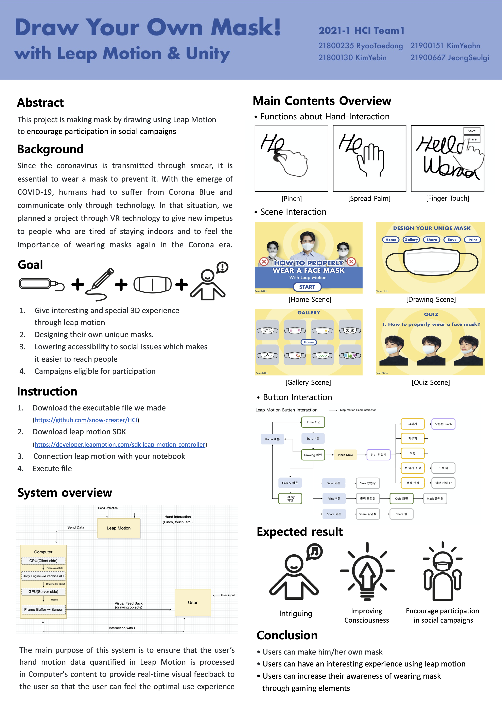

[← go back to the list](../../HCI.md)

# Draw Your Own Mask! (Leap Motion, Unity) 

## Members
김예빈, 김예안, 류태동, 정슬기

## Abstract
이 프로젝트는 Leap Motion으로 자신만의 마스크를 3차원 공간에서 디자인하는 과정을 통해 사용자가 공익 캠페인에 자연스럽게 참여하게 해줍니다.

## Background 
코로나가 전세계에 퍼지면서 비말을 통해 번지는 바이러스의 특성상 공공장소에서 마스크를 쓰고 사람들이 많이 모이는 곳에 최대한 가지 않는 것은 당연한 것이 되었습니다. 그렇기 때문에 사람들은 통신 기술을 통해서만 소통을 하고 코로나 블루같은 우울증에 시달리기도 하였습니다. 그런 상황이기에 저희는 VR 기술을 이용해 집안에만 있는 것에 지친 사람들에게 새로운 자극도 주고 코로나가 창궐하는 시대에 마스크를 착용하는 것이 얼마나 중요한지 다시 한번 느끼게 하는 프로젝트를 계획하였습니다.

## Goal 
Leap Motion을 통해 3차원 공간에서 자신의 손을 이용하는 흥미로운 경험을 준다
자신만의 마스크를 디자인할 수 있다
사회적 문제들에 대해 사람들이 쉽게 접근할 수 있도록 진입 장벽을 낮춘다
직접 참여할 수 있는 캠페인을 만든다

## Main Contents 
**Hand Interaction**  
   
    
    
    립모션의 모션인식 기능 중에 pinch, spread palm, finger touch를 주로 사용합니다. 
    
    pinch는 엄지 손가락과 집게 손가락을 오므리는 동작으로 그림을 그리는 기능을 위해 사용됩니다. 
    
    pinch상태일 때는 손가락 끝에서 펜이 나오고, spread palm 상태일 때는 멈춥니다. finger touch는 한 손가락으로 터치하는 동작으로 버튼을 누를 때 사용됩니다.

**Scene Interaction**

* Home Scene   
   

    간략한 프로그램의 설명이 적혀 있는 main scene입니다.
    (start 버튼 -> drawing scene으로 이동) 

* Drawing Scene   
   

    나만의 마스크를 디자인하는 drawing scene입니다.

    (home 버튼 -> home scene으로 이동
    gallery 버튼 -> gallery scene으로 이동 
    share 버튼 -> 공유할지 묻는 팝업창
    save 버튼 -> 저장할지 묻는 팝업창 
    print -> 프린트 할지 묻는 팝업창 -> 퀴즈)  

* Gallery Scene   
   

    디자인 한 마스크가 저장되어 갤러리처럼 볼 수 있는 gallery scene입니다.
    (home 버튼 -> home scene) 

* Quiz Scene   
   

    디자인 한 마스크를 프린트하기 전에 퀴즈를 풀 게 하는 quiz scene입니다.      
   
**Button Interaction**
   

    앞서 설명한 scene interaction과 관련해서 button과 scene의 관계를 그림으로 나타냈습니다.

## Step by step instructions
1. [실행 파일 다운로드](https://github.com/snow-creater/HCI)
3. [립모션 다운로드 및 연결](https://developer.leapmotion.com/sdk-leap-motion-controller)
4. 실행 파일 실행

## Results
* [Demo Video](https://user-images.githubusercontent.com/48082551/120884830-7048bb80-c620-11eb-98e2-b942de5bbc4e.mp4)

* Poster

* [Source codes](https://github.com/duidong/HCI2021_Team01.git)

## Conclusion 
초기 유저 테스트에서 마스크를 꾸밀 수 있다고 해서 캠페인의 주제 의식을 높일 수 없다는 의견을 받아들여 마스크 착용에 대한 올바른 인식을 위한 퀴즈를 추가하였다. 
립모션이라는 핸드 디텍션 센서와의 인터랙션과 입체적이고 증강현실적인 인터페이스는 흔하지 않아 많은 사람들의 호기심과 관심을 이끌 수 있을 것이며, 
이러한 점을 이용하여 우리의 마스크 캠페인도 널리 알리고 제창할 수 있을 것이라 최종적으로 기대한다.

## References
1. 김영애, 장지웅, 허수진, 박구만. (2015). 립모션을 이용한 Unity3D 기반의 인터랙티브 미디어 아트 콘텐츠 개발. 한국정보과학회 학술발표논문집, (), 1969-1971.
2. 박선희, 이정배, 신현호. (2015). 립모션 장치를 활용한 에듀테인먼트 콘텐츠 제작. 한국콘텐츠학회 종합학술대회 논문집, (), 345-346.
3. 유준영, 김덕연, 이진호, 조요한. (2018). VR, AR을 이용한 립모션 아티스트. 한국정보과학회 학술발표논문집, (), 2369-2370.
4. [LeapMotion Unity Module Documentation](https://leapmotion.github.io/UnityModules/)
5. [Ultraleap-developer](https://developer-archive.leapmotion.com/documentation/v2/unity/unity/Unity_UIInput_Setup.html)
