[← go back to the list](../../HCI.md)

# APT (AI Personal Trainer)


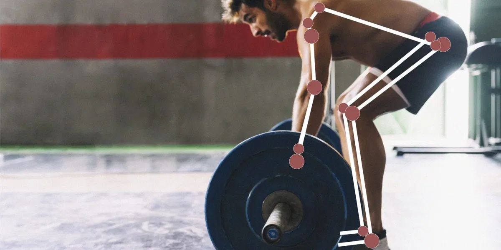
<b><p align="center">
WELCOME TO AI-FITNESS FRIEND  <br>
YOUR PERSONAL AI TRAINING ASSITANT  
</b></p>

<br>


-------------------
### Member
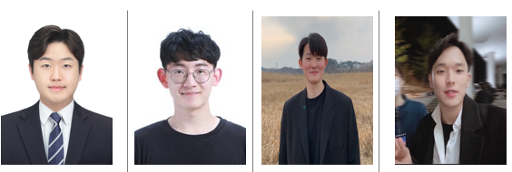  

>　　　___Jemin Rhee　　　　　　　　　Minsik Kim　　　　　　　　　Inseon Choi　　　　　　　　Jun Park___
  
------------------
<br><br><br><br>
  

# Background

### 1) Problems

<br> 

__1.1) Due to the COVID-19, there are problems with fitness and outdoor exercise. It is difficult to exercise in the public indoor space and feels uncomfortable to exercise outdoors which requires contact with other people.__  

This data is the result of <Awareness Survey on the Relationship between COVID-19 and Exercise> conducted in December 2020 by the market research company, Embrain Trend Monitor. (For 1,000 men and women aged 19 to 59)

<p align="center">
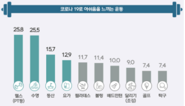  
 </P>
  
<p align="center"> Exercise survey results with difficulties due to COVID-19 (Embrain, 2020) </P>  

As you can see from the results of the survey, it was confirmed that COVID-19 significantly increased people's fear and discomfort about indoor fitness and outdoor exercise that need to do with a partner.


__1.2) People’s new lifestyle and effects of COVID-19 increase interest in Home Training.__
<p align="center">
  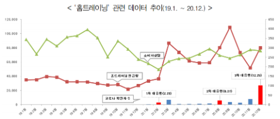
</p>
<p align="center">
Increasing the amount of social mentions and consumer counseling related to home training (Korea Consumer Agency, 2021)  
 </p>
Consumer’s interest in Home Training is increasing, and as a result, needs for various new Home Training services is also increasing. In this situation, we want to provide an interesting home training service through AI, voice functions, and additional interactions.


<br>


### 2) Target User

1) People who often exercise at home   
2) People who cannot go to the gym due to COVID-19   
3) People who need help because they do not know how to exercise alone (ex. exercise routine, correct posture...)   
4) People who are bored when exercising alone at home or need fun elements (motivation)  

<br>


### 3) Goal  
__App Goal__  
AI-FITNESS FRIEND (AFF)’s goal is to help our users when they have
difficulty doing fitness, training, or doing exercise. To be specific, we want to offer a
personalized fitness training that can be done anytime, anywhere. It can guide our
users full body posture information, which shows the exact current posture of their
exercises, especially sit-ups, push-ups, squats, and lunges.
1. Be active and healthy with AI-Fitness Friend (AFF)
2. AI-FITNESS FRIEND (AFF) can make home fitness highly effective and can
provide you a great motivation
3. AI-FITNESS FRIEND (AFF) can give you guidance for your exercise posture and
motions  

__Our Goal__  
Throughout this semester, we want to build an application - AI-FITNESS FRIEND -
that can check a user's body posture. As people accelerate more into more digital
forms of fitness guide, our application is expected to become more increasingly
relevant. Users can use their computer or smartphone camera to
recognize their exercise postures and movements, while this app can guide you
through the correct postures with voice helpers. Whether your fitness goals are to build muscle, get toned or lose weight fast, AI-FITNESS FRIEND Training will be the simplest way to do fitness training exercises. 

<br>

# Main Contents

### 1) Modeling

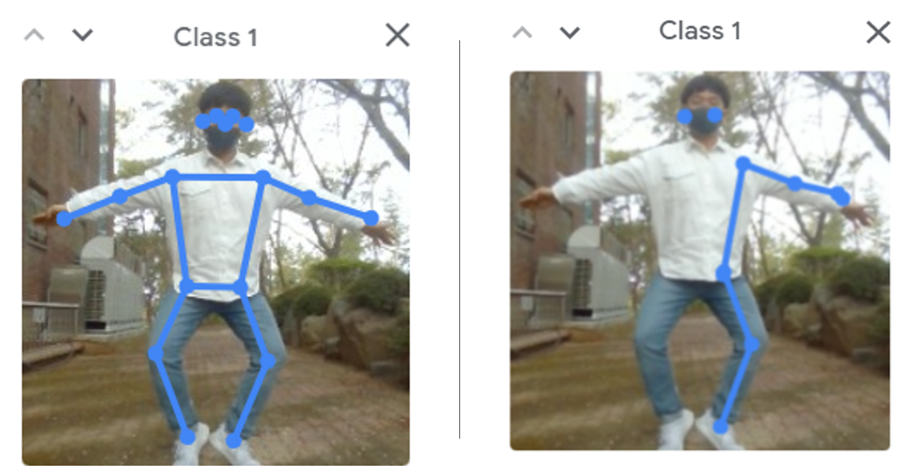  

__Good Image for Modeling(LEFT)__  
- The model learns through accurate image recognition photography. 
- The model learns about 300 to 500 correct data for each posture.

__Bad Image for Modeling(RIGHT)__  
- If the image is not properly recognized, remove it.
- It will negatively affect the accuracy of the model.


<br></br>

__System Modeling Design__

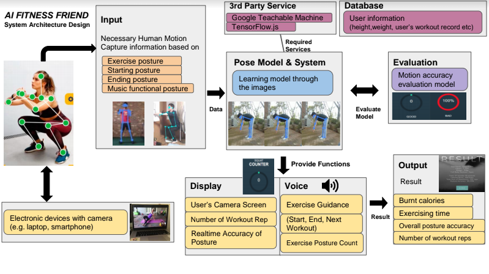  


<br></br>

### 2) Demo Video  

<div style="position: relative; padding-bottom: 56.25%; padding-top: 25px; height: 0;"><iframe src="https://www.youtube.com/embed/7oBzAVE5DWU" frameborder="0" allow="autoplay; encrypted-media" allowfullscreen style="position: absolute; top: 0; left: 0; width: 100%; height: 100%;"></iframe></div>


<div style="position: relative; padding-bottom: 56.25%; padding-top: 25px; height: 0;"><iframe src="https://www.youtube.com/embed/16XCzTlxD2s" frameborder="0" allow="autoplay; encrypted-media" allowfullscreen style="position: absolute; top: 0; left: 0; width: 100%; height: 100%;"></iframe></div>


### 3) Screens Definition  


- 3-1) Select Language  
  
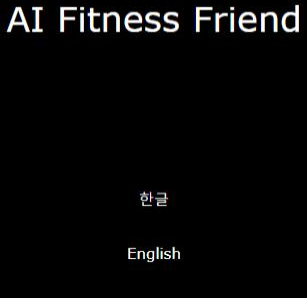  

Before starting the exercise, a user can
select the language of the 'voice' that is
used in the service. (Korean/English).


- 3-2) Select Personal Trainer’s Voice

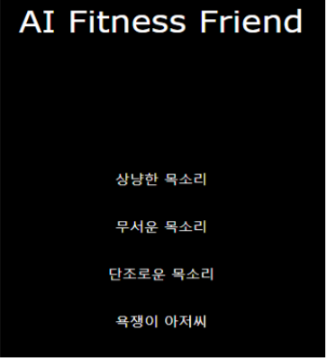  

Allows the user to select the concept
of AI trainer voice from multiple
concepts (e.g. sweet, scary,
swearing version).


- 3-3) Select Exercise Course
    
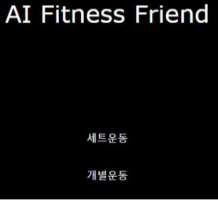  

Allows the user to select the exercise
method and exercise routines.
Method selection: (set or individual) exercise.
Routine selection: exercise course selections.


<br>


- 3-4) Full Body Workout

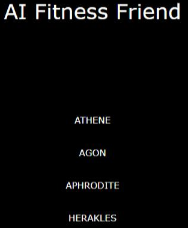   

Allows the user to select the type of full body
workouts.
* Select exercise difficulties
Allows the user to select the exercise intensity
ATHENE : Level1
AGON : Level2
APHRODITE : Level3
HERAKLES : Level4


<br>


- 3-5) Partial Exercise

  
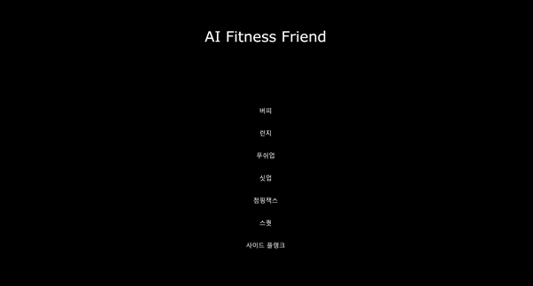  

Allows the user to select the partial exercise.


<br>


- 3-6) Full Body Workout Instructions
    
  

When the user select full body workout,
it guides the exercise routines.
There is the ‘Start’ button on the bottom

<br>


- 3-7) Count exercise rep


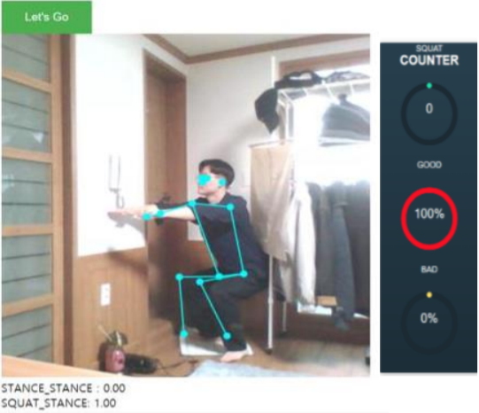  
  
AI-FITNESS FRIEND counts the number when the user is doing the exercise.
Check exercise postures. AI-FITNESS FRIEND ensures that the user is
performing the selected exercise in the correct position. Correct exercise postures.
- AI-FITNESS FRIEND lets you know that If the exercise posture is not going right, it sends out a warning tone to correct its posture.
- AI-FITNESS FRIEND shows the numerical value that tells the user how much the exercise posture is correctly done.
  
  
<br>


- 3-8) Encouraging Messages

  

After the user reaches to the goal
number of repetitions, it automatically
redirects to the encouraging message
page before the result page. The user
can select whether go back to the
homepage or do workout more.
*There is a background song playing in
the encouraging message page.


<br>


- 3-9)  Exercise Result

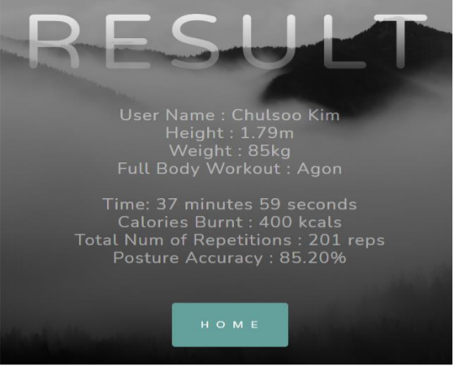  

It shows exercise time, number of
repetitions, and calories burned etc

<br>


- 3-10)  Workout Recommendation

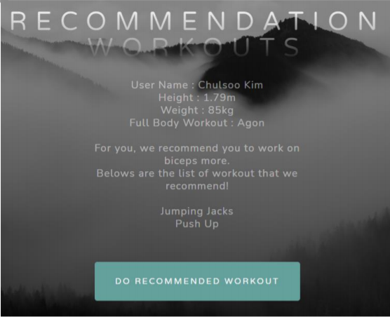 

On the screen, a user can see list of
recommended exercises.

<br>

### 4) User test

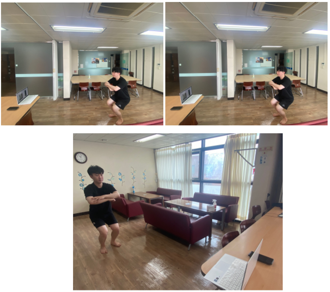 

__Result__  
User’s Opinion :
- It is good that he can see his workout posture and posture accuracy while
working out alone at home.
- He likes that workout assistants function like rep counters and
encouraging voices.
- It motivates me to workout since it keeps counting until I finish it.
- It is pretty slow when its internet connection is bad. I want a solution when
its internet connection is bad.  
Lesson Learned Timer: It does not have a timer function, while it counts till the number of reps
that users set. We can add a timer function so a user can workout for a fixed time.


<br></br>


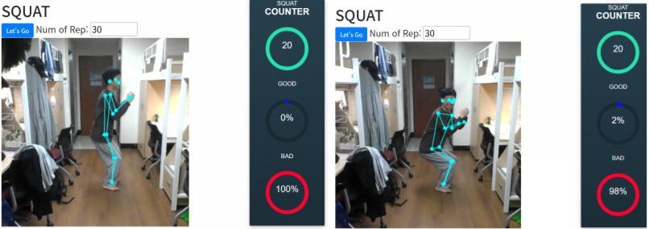 


__Result__  
User’s Opinion :
- It is fun listening to AI voiceover counting.
- It has pretty decent AI workout models that perform good accuracy.
- It is pretty slow when its internet connection is bad. I want a solution when its internet connection is bad.
- Mission Alarm: There is a mobile alarm app that requires a wake-up mission (e.g. solving math problems, shaking for a certain number of times) to turn off the alarm. I think I can add doing squat/jumping jacks/lunges for a certain number of times as a wake-up mission as well.


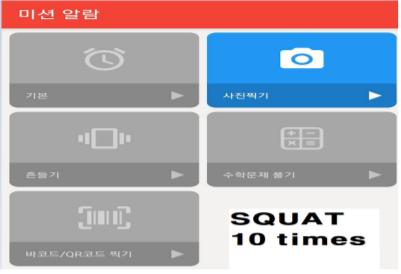 


<br><br><br><br>


# Conclusion

## Limitation
Jemin Rhee:    
1) Since we imported and implemented models made using Google Teacheable Machine, it cannot detect subtle pose differences. 
2) Since everything is hosted online server for now, it may take time if user's internet connection is not stable  

Minsik Kim:  
1) We haven't learned all the exercises in the model yet.  
2) The screen is small to proceed with with the cell phone, so it may not be visible.
   
Inseon Choi :  
- At this point, only two separate exercises (squats, jumping jacks) have been implemented.  
- In the final model with additional functions, I feel the recognition accuracy is a bit lower. (Compared to the model that only learned exercise posture recognition)  
   
Jun Park :  
- Due to time constraints, we could not implement more exercises postures. It was time consuming when we had to remove the dirty data because it could not detect our poses.  


## Future Plan
Jemin Rhee:  
1) In order to improve pose-detecting model, I will study PyTorch, and OpenCV (so it can detect even subtle differences).
2) I found that pose model can be also trained with position vector values. Using position vector values can reduce training/testing time at the same time it is easy to maintain. I will try using the method later on.
3) We are planning to release the service distributable so that everyone can enjoy it offlie as well. 

Minsik :   
1) We will conduct interviews with people who exercise a lot and look for new functions.  
2) We will have time to add a number of features that we have planned before.  

Inseon Choi :  
- I tried it outdoors during User Research, and it was positive than I expected. It would be good to plan for use in places. (not only home training but also gym, park etc.)  


Jun PARK :
- For our future studies, we plan on experimenting with our ai-fitness friend app so that we have different types of interaction with the users in different places and they can give us more feedbacks. 


## Review
Jemin Rhee :   
- Since we have only 8 weeks to implement the whole service from zero to one, it was not enough to collect, preprocess, train, test, implement, hosting, user test, and everything perfectly within the limited time. I wish I had a faster desktop during the project because I wanted to train/test, and implement faster as well. Plus, I realized that creating an app was not as difficult as I expected!  

Minsik Kim:  
- I think it was easy for us to create because we used a function called Teachable Machine. However, it is difficult to accomplish what we want in details.It was a simple prototype now, but I felt that when I had to make a product like this, I had to embody it directly.  

Inseon Choi :  
- It was helpful for me to have various experiences such as setting targets, implementing services, and considering HCI elements in a short time. I expect that this experience will remain as an important learning when creating services in the future.  


Jun Park :  
- Overall, I had a joy of making this app with my team members. Everything went well smoothly than I expected.  Through this course, I learnt a valuable lesson for me creating this kind of services in the future  


------------------------------

## Our Progress
- [Proposal Writing](https://drive.google.com/file/d/1pEoPPCt36UKADAJdx5IqUf4Vuq_qEnYO/view?usp=sharing)
- [System Requirement](https://drive.google.com/file/d/1IWdFfeAiEZahiah-xVK_3B4RaLW6f9-B/view?usp=sharing)
- [System Design](https://drive.google.com/file/d/1eE9Yk5YtMaVo1Io81t-JQtwonypES4Ob/view?usp=sharing)
- [User Research Report](https://docs.google.com/document/d/1jqc1s6sToKwdoI7mRpGyhH1XZ-IPq1BXANixW069v0M/edit?usp=sharing)


## Reference
- [LIFTR: A Virtual Personal Fitness Trainer - Powered by Computer Vision & AI](https://www.youtube.com/watch?v=tZcRYcjTwWA)
- [Teachable Machine github](https://github.com/googlecreativelab/teachablemachine-community)
- [Teachable Machine 생활코딩](https://opentutorials.org/course/4548/28897)
- [Teachable Machine 공식 홈페이지](https://teachablemachine.withgoogle.com/)
- [Teachable Machine으로 AI 헬스 트레이너 만들기](https://www.youtube.com/watch?v=9SwdGFzFb5Y)
- [Teachable Machine으로 과일도감 만들기](https://www.youtube.com/watch?v=USQGTW34lO8)

## Reference News
[1] 한국소비자원. (2021). 코로나19로 인한 홈트레이닝 가속화와 소비자 이슈  
[2] 한재원. (2020). [스포츠] 유튜브로 운동 배우는 ‘홈트레이닝 시대’. 월간 샘터, 99-99.  
[3] 김다원, 남희조, 이승연, 함유경, 서오석, 이형준. (2019). 웨어러블 디바이스와 키넥트 센서를 활용한 다중 사용자 홈트레이닝 헬스케어 시스템. 한국통신학회논문지, 44(4), 719-727.  
[4] 홍주표, 김다희, 이나경, 이수빈, 이혜빈. (2018). 홈트레이닝을 돕는 AI 디바이스. 한국디자인학회 학술발표대회 논문집, 282-283.  
[5] 이원욱, 이연주, 임동현, 최성호, 이채원, 김현주, 원종서, 김현동, 국중진, 이지항, 김진우. (2018). FUFU 와 함께 운동을. 한국HCI학회 학술대회, 518-523.  
[6] 김유진, 곽규훈. (2021). 빅데이터를 활용한 시대별 홈 트레이닝 키워드 분석. 한국체육과학회지, 30(1), 103-115.  
[7] 이원희, 강보윤, 김윤정, 김현경, 박정규, 박수이. (2017). Kinect 센서를 활용하는 노인 하체 근력 강화 시스템 연구. 한국정보통신학회논문지, 21(11), 2095-2102.  


### Source Code for LOADING A WORKOUT MODEL

```
코드 설명 #01

// the link to your model provided by Teachable Machine export panel
        const URL = "./models/SQUAT_MODEL/my-pose-model/";
        let model, webcam, ctx, labelContainer, maxPredictions;

        
        async function init() {
            const modelURL = URL + "model.json";
            const metadataURL = URL + "metadata.json";

            var audio = new Audio('./data/Voice/English/AreYouReady.mp3')
            audio.play()
            
            // load the model and metadata
            // Refer to tmImage.loadFromFiles() in the API to support files from a file picker
            // Note: the pose library adds a tmPose object to your window (window.tmPose)
            model = await tmPose.load(modelURL, metadataURL);
            maxPredictions = model.getTotalClasses();

            // Convenience function to setup a webcam
            const size = 500;  // WebCam Size
            const flip = true; // whether to flip the webcam
            webcam = new tmPose.Webcam(size, size, flip); // width, height, flip
            await webcam.setup(); // request access to the webcam
            await webcam.play();
            window.requestAnimationFrame(loop);

            // append/get elements to the DOM
            const canvas = document.getElementById("canvas");
            canvas.width = size; canvas.height = size;
            ctx = canvas.getContext("2d");
            labelContainer = document.getElementById("label-container");
            for (let i = 0; i < maxPredictions; i++) { // and class labels
                labelContainer.appendChild(document.createElement("div"));
            }
        }
```


### Source Code for PREDICTING AND COUNTING

```
코드 설명 #02

// Prediction #1: run input through posenet
            // estimatePose can take in an image, video or canvas html element
            // GOOD POSTURE
            if (prediction[0].probability.toFixed(2) >= 0.90) {
                if (status == "squat") {
                    count++
                    var audio = new Audio('./data/Voice/한글/유학생/' + count%10 +'_유학생.mp3');
                    audio.play();

                    progress = progress-32.7
                    if(progress <= 0) {
                        progress = 327-32.7
                    }
                    $('.progress').css('stroke-dashoffset', progress);
                    $('#counter').html(count);

                    if((count >= 10) && (count % 10==0)){
                        var audio = new Audio('./data/Voice/English/VeryGood_UK.mp3')
                        audio.play()    
                    }
                }
                status = "stand"
            } else if (prediction[1].probability.toFixed(2) >= 0.90) {
                status = "squat"
            } 

            // BAD POSTURE
            if (prediction[2].probability.toFixed(2) >= 0.90) {
                if (count % 2 == 0){
                   if (count > 10){
                      covar audio = new Audio('./data/Voice/한글/유학생/한글_장난치세요.mp3');
                      audio.play();   
                   } else {
                      covar audio = new Audio('./data/Voice/한글/유학생/일본_장난치세요.mp3');
                      audio.play();   
                   }
                } else {
                   covar audio = new Audio('./data/Voice/한글/유학생/장난쳐_유학생.mp3');
                   audio.play();
                }
            }

            // QUIT
            if (prediction[3].probability.toFixed(2) >= 0.91) {
                await sleep(330);
                if (prediction[3].probability.toFixed(2) >= 0.90) {
                   if (count % 2 == 0){
                      var audio = new Audio('./data/Voice/한글/유학생/한글_열정없구나.mp3');
                      audio.play();
                  } else {
                     var audio = new Audio('./data/Voice/한글/유학생/일본_열정없구나.mp3');
                      audio.play();
                  }
                }
            }

            // MUSIC_PLAY
            if (prediction[4].probability.toFixed(2) >= 0.75) {
               await sleep(500);
                if (prediction[4].probability.toFixed(2) >= 0.80) {
                   var audio = new Audio('./data/Voice/HoldOn.mp3');
                   audio.play();
                }
            }
```


### Source Code for DRAWING POSE ON WEB CAM
  
```
코드 설명 #03

function drawPose(pose) {
            if (webcam.canvas) {
                ctx.drawImage(webcam.canvas, 0, 0);
                // draw the keypoints and skeleton
                if (pose) {
                    const minPartConfidence = 0.5;
                    tmPose.drawKeypoints(pose.keypoints, minPartConfidence, ctx);
                    tmPose.drawSkeleton(pose.keypoints, minPartConfidence, ctx);
                }
            }
        }
        
```


### Source Code for UPDATING

```
코드 설명 #04

// It lets a web page keeps update web cam frame
        async function loop(timestamp) {
            webcam.update(); // update the webcam frame
            await predict();
            window.requestAnimationFrame(loop);
        }

```


### Source Code for TERMINATION CONDITION

```
코드 설명 #05

// When the user reaches the number of reps that the user set,
            // it directs to 'Result.html'
            if(document.getElementById("MaxRepHa").value == count){
                var audio = new Audio('./data/Voice/한글/유학생/고생했어요.mp3');
                audio.play();
                count++;
                location.replace("Result.html");
            }
```
