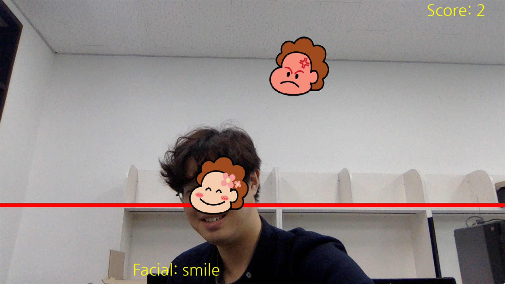

[← go back to the list](../../HCI.md)

# Emo Game Challenge

### Memebers
-21600171 김평안
-21700194 김하휼
-21700566 이주연
-21800815 이요한


## 1. Introduction

### 1-1. Project Background
We were thinking about developing products in the entertainment field and decided to make a game using face detection. The goal of this game is to allow people to enjoy playing games simply through camera recognition. 

Many things have changed, from classroom methods to various ways of communicating with people. The communication media in the middle of the changed way is video chatting. Many people can participate in meetings in real time and use them for various purposes. We thought about what's fun and easy to do in Zoom, and now that many people have adapted to Zoom, we thought it would be fun to play games using Zoom's real-time video communication.

Our target users are all customers who use Zoom. The final goal of the game we develop is to play games that can be used in Zoom or another video chat, but I think it's too much for undergraduates to develop this game, so we'll develop this semester's goal into a game that they can play alone. However, our final goal is to create games that can be played on video media such as zoom or Kakao video chat, so our target users is who use video-based communication media.

### 1-2. Project Objective
Our goal is to develop a game called emo game to entertain people. The emo game matches the emotional state written on the floating face on the screen, and scores by matching the position. In addition, the fever time in the middle of the game will allow people to enjoy more exciting visual effects and provide a variety of games to enter the fever game. So many people thought that having fun games that can be played from zoom to burn would help us get closer. we also thought it would be good to go further and develop into a "challenge."

In order to develop this game, we will use two api, CRF api from naver clova and kakao vision api, the open source of face detection technology. We will use eyes/nose/mouth position and facial value recognition from Clova CRF and will use face position and angle(add accuracy utilization) from kakao vision api

## 2. Preparation

1) Hardware
- Computer(Windows, Mac Os operating system
- Web Cam

2) Download Project
- Open terminal programs (terminal, cmd, or powershell), and type as below 
``` 
$ cd ~
$ git clone https://github.com/iyohan/EmoChallenge.git
```
3) Install libraries
- Python 3.7x or above must be installed. If not installed, 
- then go to https://www.python.org/downloads for download.
```
$ pip install requests
$ pip install pygame
$ pip install opencv-python
```
* Troubleshooting

    1) If there are errors installing libraries, then try putting ‘sudo’ (in Mac) before commands or opening terminals in administrator mode. 

    2) With the environment issue, try downgrading the Python version.

4) Run
```
$ cd ~ 
$ python main.py
```


## 3. System Design


## 4. Game Progress
### The final form of EMO challenge will be a computer-based game. 
### 4-1. START Game (select character, difficulty and music)
Users can select character, levels of difficulty, and music from the game’s start screen. It allows users to enter information that suits their preferences and play the game they want according to their personal preferences. After selecting the options users want, click the ‘GAME START’ button to start the game. 

 

### 4-2. MAIN GAME
When the game starts, face with various emotions fall from top to bottom. At this time, if you make an expression that fits this emotion and bring it to the corresponding position, it will be evaluated how exact it is. And added to the score according to the emotion accuracy in the Naver api (face recognition api) 
 

### 4-3. MINI GAME (FEVER MISSION)
if the score exceeds 10 points, you will face the FEVER MISSION. This mission is to decide whether to go to FEVER TIME. If you fail, you will return to the game again but if you succeed, you can enter FEVER TIME where you can get extra points. There are three FEVER MISSION and it comes randomly.


### 4-4. FEVER TIME MODE
If you come to Fever mode after a Fever mission, you can get twice the score if you express your emotions faster and make the right expression. The Fever game lasts for 30 seconds and returns to the original game after the Fever game.


## 5. Expectation effectiveness
- Evolve into a game applicable to existing video conferencing platforms
- Like the Google Chrome dinosaur game, it can be used as a time-consuming game.
- Establish a foundation for developing a variety of games for webcam and video services
- Emo Challenge can evolve into a pandemic game

## Source code

[Here](https://github.com/iyohan/EmoChallenge)

