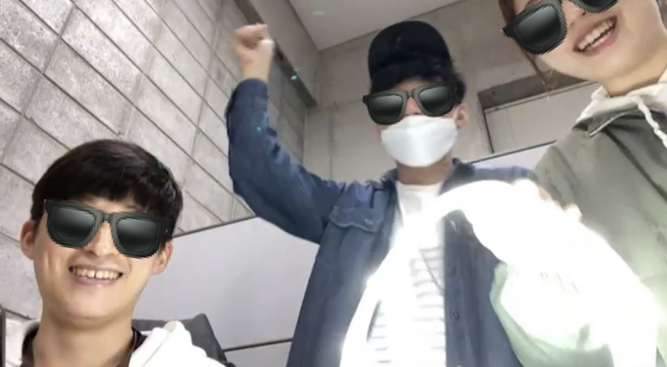
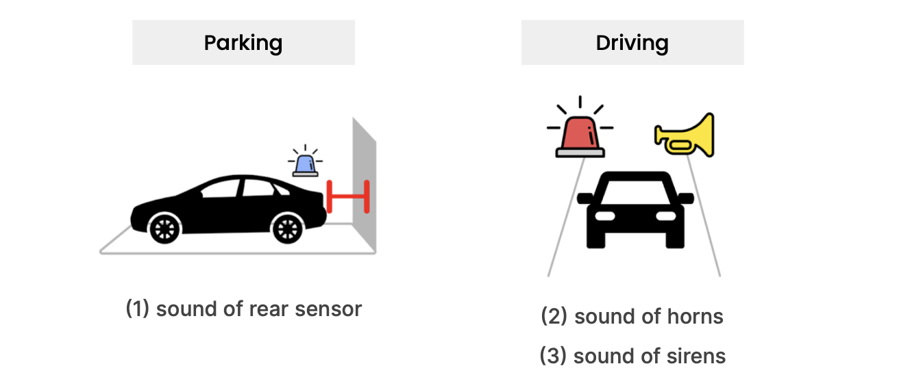
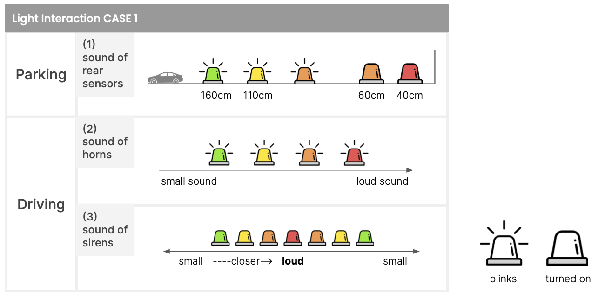
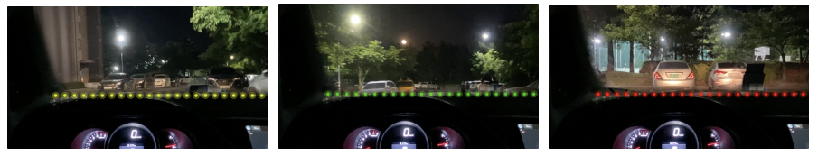
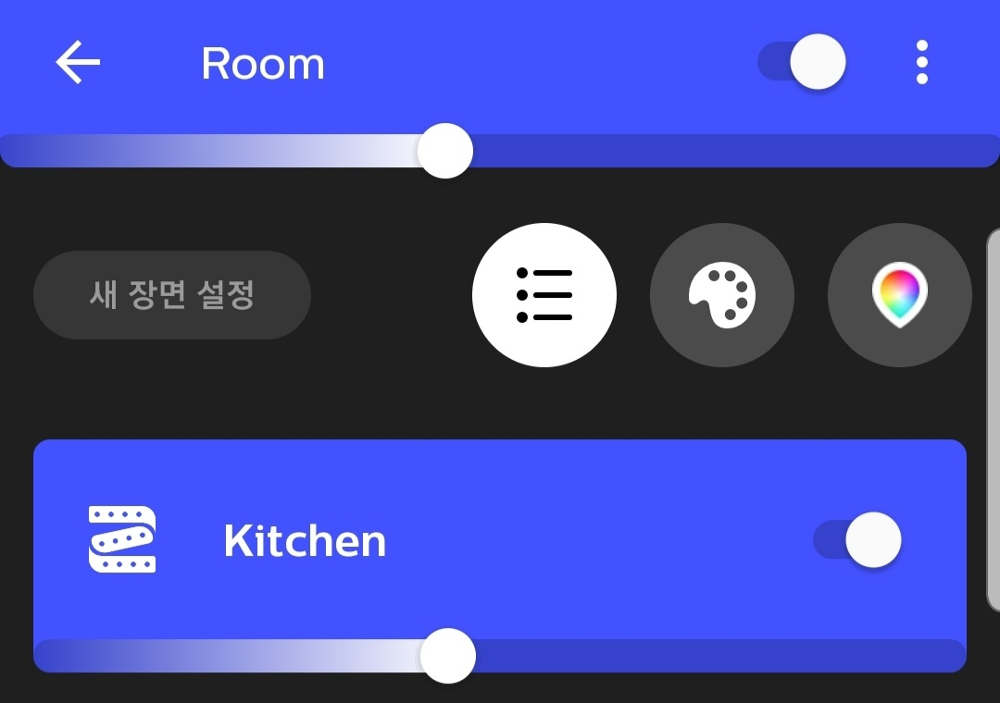
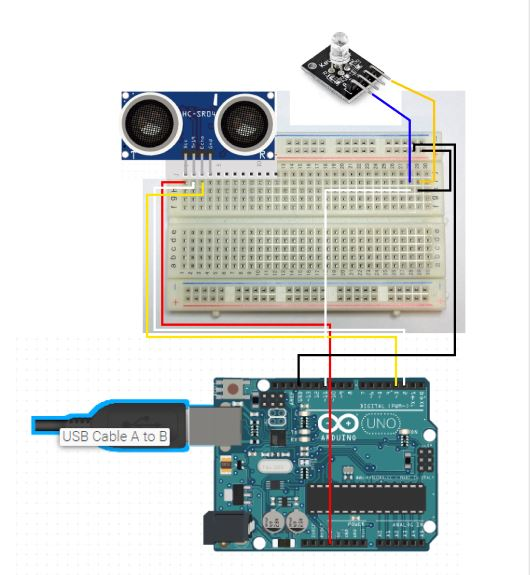
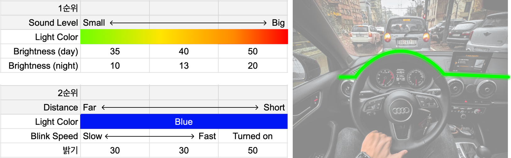
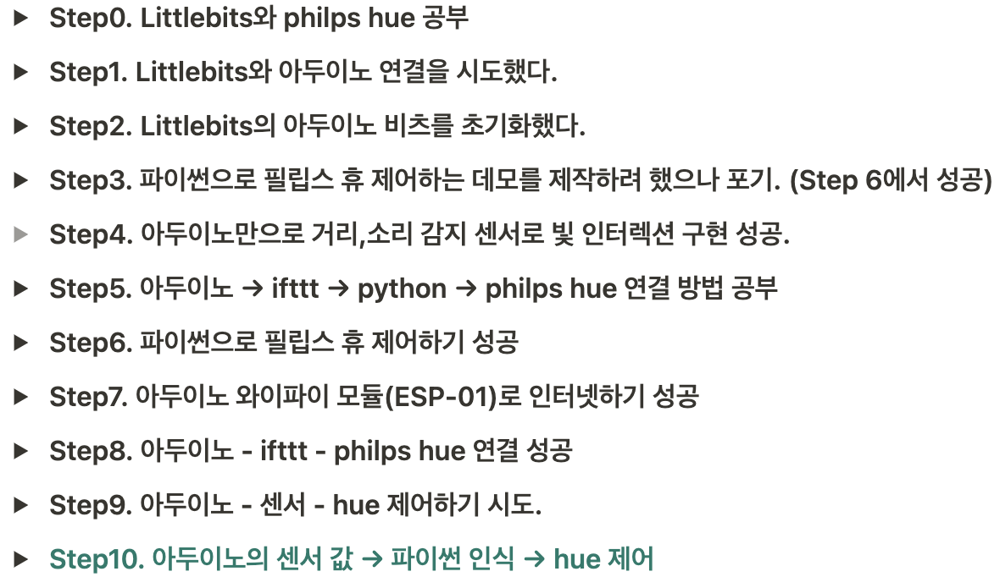

# Light Interaction Assistance for Hard of Hearing Drivers

상태: 학부생 차맑은샘, 주환 김, 선주 조
속성: Team 2 Clear Light



😎 **Members**

김주환 조선주 차맑은샘

## 1. Introduction

---

### 1.1  Background

한국교통장애인협회에 따르면, 청각 장애인의 경우 보청기를 착용하였을 경우 40dB이상 들을 수 있으면 운전면허증을 취득할 수 있는 조건을 충족한다. 보청기을 착용해도 40dB 미만으로 듣는다면, 1종 및 특수면허를 제외하고 운전면허를 취득할 수 있는 조건을 충족하며 면허를 취득하였을 경우 차량에 볼록거울과 청각 장애인 표지를 부착해야 한다. 운전 시 여러 감각 정보를 바탕으로 상황판단이 필요하지만, 청각장애인 운전자는 시각 정보에 더 의존할 수 밖에 없다. 청각장애인 운전자는 우리나라의 전체 운전자 수 중에서 1%에 해당하며 그들이 도로에서 안전하게 주행할 수 있기 위한 제도나 시스템이 부족하다.

### 1.2 Goal

운전 중 청각 정보는 안전과 직결된 매우 중요한 정보이다. 본 연구에서는 중요한 소리를 청각장애인들이 놓치지 않고 인지할 수 있는 시스템을 만들고자한다. 따라서, 중요한 소리 정보 3가지인 자동차의 크락션 소리, 각종 사이렌 소리 그리고 주차할 때의 후방 거리 감지 센서에서 나오는 소리 정보를 빛 인터렉션으로 표현한다.



그림 1. 중요한 청각 정보 3가지

## 2. Main contents

---

### **How to build your program**

전체적인 프로그램 개발은 arduino와 python을 이용하여 구현하였다. 이 시스템에서 가장 중요한 것은 소리 정보를 빛 정보로 표현하는 것이다. 아두이노의 초음파 센서와 사운드 센서를 통해 소리정보를 파악하고 philips hue를 통해서 빛을 나타내 운전자가 상황을 빠르게 인지하고 대처할 수 있도록 돕는다. 데이터롤 전송하고 읽어서 빛 정보를 출력하는 방법으로 다음과 같은 방법을 시도하였다. 

**Plan A. arduino → iftt → philips hue**

Arduino에서 얻은 데이터를 바탕으로 ifttt를 통해서 philips hue를 제어하는 방식이다. 

**Plan B. arduino → philips hue**

Arduino에서 센서 값을 바로 python에서 읽어서 python code로 philips hue를 제어하는 방식이다. 

**Plan C. arduino file write → python file read → philips hue**

Arduino에서 센서 값을 파일에 쓰고 그 값을 python code가 읽어서 philips hue를 제어하는 방식이다. 

### Necessary images

**a. Idea sketches**



그림2. 초기에 설계한 빛 인터렉션

b. A screen capture of program



그림3. 사운드 센서에 따른 빛의 변화

### Explanation of source code

- Connect Hue to Python

    ```python
    '''
    * 다음 코드는 python과 philips hue를 연동한 후  python으로 philips hue를 제어하는 것이다.
    * 우선 philips hue을 연결을 하고 ip 주소를 받아와 bridge를 누르고 프로그램을 실행하면 연동이 된다.
    * 주의할 점은 동일한 네트워크여야 연결이 된다.
    '''
    # In[1]:
    from phue import Bridge
    import random as r
    from time import sleep
    import logging
    logging.basicConfig()
    #hue의 ip주소를 받아와서 연결한다. 
    bridge = Bridge("192.168.0.34")
    #연결을 할 때 bridge의 버튼을 누르고 코드를 돌려야 연결이 된다.   
    bridge.connect()
    lights = bridge.get_light_objects('name')

    # 다음은 상황에 따라 philips hue를 제어한 것이다.
    # In[2]:
    lights['Kitchen'].brightness = 50
    #bridge.set_light('Kitchen', 'bri', 70)
    while True:
        data = input("choose situation: ")
    		# 사운드 센서가 멀리있는 소리를 인식했을 경우
        if data == 1: #slow green
            i=0
            while True:
                if i==5:
                    break
                lights["Kitchen"].on = True
                lights["Kitchen"].hue = 46000
                sleep(0.7)
                lights["Kitchen"].on = False
                sleep(0.7)
                i +=1
        elif data == 2: #fast yellow
            i=0
            while True:
                if i==5:
                    break
                lights["Kitchen"].on = True
                lights["Kitchen"].hue = 46000
                sleep(0.5)
                lights["Kitchen"].on = False
                sleep(0.5)
                i +=1
        elif data == 3: #fast red
            i=0
            while True:
                if i==10:
                    break
                lights["Kitchen"].on = True
                lights["Kitchen"].hue = 46000
                sleep(0.5)
                lights["Kitchen"].on = False
                sleep(0.5)
                i +=1
        elif data == 4: #fast red
            lights["Kitchen"].on = True
            lights["Kitchen"].hue = 1000
            sleep(10)
            lights["Kitchen"].on = False

        elif data == 5:
            for i in range(1,3):
                lights["Kitchen"].on = True
                lights["Kitchen"].hue = 1000
                sleep(1)
                lights["Kitchen"].hue = 15000
                sleep(1)
                lights["Kitchen"].hue = 25000
                sleep(1)
                lights["Kitchen"].hue = 25000
                sleep(1)
                lights["Kitchen"].hue = 15000
                sleep(1)
                lights["Kitchen"].hue = 1000
                sleep(1)
            lights["Kitchen"].on = False
        
        elif data == 6:
            lights['Kitchen'].brightness = 70
            lights["Kitchen"].on = True
            lights["Kitchen"].hue = 25000
            sleep(1)
            lights['Kitchen'].brightness =50
            lights["Kitchen"].on = False

        elif data == 7:
            lights['Kitchen'].brightness = 70
            lights["Kitchen"].on = True
            lights["Kitchen"].hue = 15000
            sleep(1)
            lights['Kitchen'].brightness =50
            lights["Kitchen"].on = False

        elif data == 8:
            lights['Kitchen'].brightness = 70
            lights["Kitchen"].on = True
            lights["Kitchen"].hue = 1000
            sleep(1)
            lights['Kitchen'].brightness =50
            lights["Kitchen"].on = False

        else:
            print("Bye!\n") 
            break

    ```

    

    그림4. 조명 이름을 Kitchen으로 설정하였다.

- Arduino with ultrasonic sensor

    ```arduino
    void setup() {
      pinMode(2, OUTPUT);
      pinMode(3, INPUT);
    }

    void loop() {
      analogWrite(11, 0);
      analogWrite(10, 0);
      analogWrite(9, 0);

      digitalWrite(2, HIGH);
      delayMicroseconds(10);
      digitalWrite(2, LOW);

      long duration = pulseIn(3, HIGH);

      if (duration == 0) {
        return;
      }

      long distance = duration / 58.2;

      while (distance < 5) {
        analogWrite(11, 255);
        long duration = pulseIn(3, HIGH);
        if (duration == 0) {
          return;
        }
        long distance = duration / 58.2;
      }

      while (distance < 15) {
        analogWrite(11, 255);
        delay(50);
        analogWrite(11, 0);
        delay(20);
        long duration = pulseIn(3, HIGH);
        if (duration == 0) {
          return;
        }
        long distance = duration / 58.2;
      }
      
      while (distance < 22 and distance >= 15) {
        analogWrite(11, 255);
        delay(100);
        analogWrite(11, 0);
        delay(100 );
        long duration = pulseIn(3, HIGH);
        if (duration == 0) {
          return;
        }
        long distance = duration / 58.2;
      }
      
      while (distance < 30 and distance >= 22) {
        analogWrite(11, 255);
        delay(100);
        analogWrite(11, 0);
        delay(200);
        long duration = pulseIn(3, HIGH);
        if (duration == 0) {
          return;
        }
        long distance = duration / 58.2
    ```



그림5. 아두이노 배선

### Explanation of your program with images



그림6. 사용자 테스트를 바탕으로 개선한 빛 인터렉션

이 시스템에서 가장 중요한 interaction은 운전자가 얻는 소리 정보를 빛으로 나타내줘야 한다는 것이다. 빛 정보가 출력되는 상황은 주행 중(D)이거나 차가 후진(R)하거나, 주차된 상황(P)이다. 주행을 하는 경우에는 초음파 센서는 작동하지 않으며, 사이렌 소리나 차량 경적 소리의 크기에 따라서 빛이 표현된다. 즉, 소리 정보만 파악하는 것이다. 소리는  40dB이상일 경우 인식된다. 제일 작은 소리는 녹색부터 그라데이션으로 제일 큰 소리는 빨간색으로 표현된다. 사이렌이 지나갈 경우, 소리의 크기 변화에 따라 빛의 변화가 있고, 주변 차량의 경적 소리의 경우 경적이 지속되는 동안 경적 소리 크기에 따라 빛이 표현된다. 

추가적으로, 사용자 테스트 후 빛의 경우 색에 따라 인식되는 정도가 다르다는 것을 알 수 있었다. 예를 들어, 빨간색의 경우 다른 색보다 더 밝아야 빛을 더 잘 인식할 수 있었다. 이에 사용자 테스트 후 색에 따라 빛의 세기를 다르게 하였다. 또한 아직 구현은 되지 않았지만 낮과 밤, 외부의 날씨나 환경에 따라 빛의 세기를 조절한다면 빛을 더 쉽게 인지할 수 있을 것이다. 

차가 parking(P)상태 이거나, 후진(R)하는 상황에서는 사운드 센서와 더불어 초음파 센서(거리 감지 센서)가 작동한다. 차가 후진하는 상황에서 거리에 따라 소리로 물체와의 거리를 나타내주는데 이를 빛 정보로 나타낸다. 이때에 빛은 한가지 색인 파란색을 통해서만 나타낸다. 그림2에 나와있는 거리에 따른 빛 변화에서 알 수 있듯이, 일정한 거리에 따라서 빛의 깜빡이는 빠르기가 변하도록 하였다. 마지막 차가 물체와 40cm 미만으로 가까워졌을 때에는 빛이 깜빡이지 않고 계속 켜지며 밝기가 기존의 밝기에 비해 밝아진다. 

P나 R의 상황의 경우, 사운드 센서와 초음파 센서가 동시에 작동하도록 하였다. 만약 이 상황에서 사운드 센서와 초음파 센서가 동시에 작동하는 상황이 생겼을 때 2가지 방법을 생각해보았다. 첫번째는 여기에서 사운드 센서에 prority가 있는 것이다. 후진을 하거나 parking의 상황에서도 큰 소리가 나타난다면 우선순위에 따라 빛의 색이 사운드 센서에 따라 나타나는 색으로 변한다. 그러나 이 방법은 사운드 센서와 초음파 센서가 동시에 필요한 상황이 발생한다면 좋은 방법이 아니게 된다. 이에 대한 대안으로 빛의 색은 사운드 센서를 인식했을 때의 색으로 바뀌면서 초음파 센서에 따라 깜빡이는 정도는 유지하는 것이다. 즉, 물체에 따라 깜빡이는 정도는 보여지면서 빛의 색이 파란색에서 그라데이션 색으로 변화하는 것이다. 

### Demo video

- 사용자 조사 시뮬레이션 영상 (1차)

[https://youtu.be/m2o4yAEOqio](https://youtu.be/m2o4yAEOqio)

- 최종 빛 인터렉션 영상 (2차)

[https://youtu.be/3lyrodTpypQ](https://youtu.be/3lyrodTpypQ)

- Arduino ultrasonic sensor demo

[https://youtu.be/SQhSHADl9tE](https://youtu.be/SQhSHADl9tE)

- Philips hue siren demo

[https://youtu.be/CNDfqKGPuew](https://youtu.be/CNDfqKGPuew)

## 3. Conclusion

---

본 연구는 청각장애인의 운전 보조를 위해 빛 인터렉션을 도입하고자 계획되었다. 설계한 빛 인터렉션 시뮬레이션 영상으로 사용자 테스트를 진행하였고 이를 통해 도출된 결과로 인터렉션을 개선하였다. 그 결과, 

하지만, arduino에 장착된 소리와 거리 센서를 통해 philips hue를 제어하기 위해 많은 방법을 시도했음에도 최종적으로 구현해내지 못했다. 또한 빛 인터렉션을 검증하기 위한 사용자 조사 단계에서 청각장애인 유저가 아닌 비장애인이 소리 없이 영상을 시청한다는 실험 조건만으로 진행하였다.

본 연구에서 설계된 빛 인터렉션은 상황을 정확히 이해할 수 있는 심볼이나 텍스트가 없기 때문에 상황을 정확히 구분하기보다 주변 상황에 주의를 기울이라는 신호로서의 의의가 있다. 본 연구의 빛 인터렉션을 기반해서 심볼과 텍스트가 조합된 시각 신호의 개발에 활용될 수 있다. 2차 유저 테스트를 통해 청각장애인의 실제 운전 상황에서의 사용성, 인지용이성, 효과성, 안전성의 검토가 필요할 것으로 예상된다. 또한 사용자 선호에 따라 상황별 빛 색상 및 인터렉션을 설정할 수 있는 인터페이스의 개발도 고려할 수 있다.

추후 적절한 인터렉션 및 사용성이 개선된다면 청각장애인의 안전한 운전을 돕는 장치로 역할할 수 있을 것이다. 또한 이러한 빛 인터렉션은 운전 상황뿐만 아니라 스마트홈 시스템에 적용되는 등 청각장애인들의 불편한 일상을 개선 시킬 수 있는 가능성을 가지고 있다.

## 4. Difficulties

---

빛 인터랙션을 구현하는 데에 있어서 프로세스는 다음과 같이 동일했다. 센서 입력 → 인터넷 연결 → 필립스 휴. 하지만 이 프로세스를 구현하는데에 많은 어려움을 겪었고 3가지가 동시 다발적으로 연결되서 우리가 원하는 인터렉션을 구현하는 것에는 실패하였다. 

**Plan A. arduino → iftt → philips hue**

IFTTT에서는 우리가 원하는 인터렉션의 폭이 너무 적었다. 센서 값에 따른 다양한 인터렉션을 원했지만, IFTTT에서 Phillips Hue를 제어할 수 있는 인터렉션은 매우 한정적이었다. 불 꺼짐, 켜짐, 그리고 일정한 깜빡임 정도의 정해진 Setting 값의 인터렉션을 보내야 했기 때문에 우리가 원하는 인터렉션을 구현하기에는 불가능했다.

**Plan B. arduino → philips hue**

Arduino Sensor 값을 Python code로 읽질 못함. Arduino에서 나오는 input 값들을 Serial을 통해서 읽어야 했는데 Serial을 읽는 library가 Python 상에서 실행이 안 되었다. 따라서 개발에 있어서 어려움을 겪었고 다른 방법을 모색해보았다.

**Plan C. arduino file write → python file read → philips hue**

Arduino write file와 Python read file 상호작용이 원활히 안 이루어짐. Arduino에서 파일을 쓰고 Python에서 파일을 읽은 다음에 Phillips Hue로 보내는 것은 가능했으나 실시간으로 진행하는 것은 불가능했다. Arduino에서 실행을 시켜야 읽어온 데이터들을 한번에 파일에 작성이 되었고 지속적인 실시간 파일 업데이트는 방법을 찾을 수가 없었다.



그림 7. hue 제어를 위한 시도 history

## 5. References

---

**Plan A. arduino → iftt → philips hue**

[Arduino - HTTP Request | Arduino Tutorial](https://arduinogetstarted.com/tutorials/arduino-http-request)

[Connect Arduino to IFTTT for IoT Projects](https://www.learnrobotics.org/blog/connect-arduino-to-ifttt-for-iot-projects/)

[Controlling a Philips Hue via a Arduino](https://create.arduino.cc/projecthub/iotsky/controlling-a-philips-hue-via-a-arduino-b56620)

[Link Python code to IFTTT!](https://www.youtube.com/watch?v=fmjFO5d2AsM)

[Rupakpoddar/Trigger-Events](https://github.com/Rupakpoddar/Trigger-Events)

**Plan B. arduino → philips hue**

[Philips Hue Light Control Using Arduino | Home Automation | Smart IoT | Nodemcu](https://www.youtube.com/watch?v=pNoH4MPkhZk)

[Get Started - Philips Hue Developer Program](https://developers.meethue.com/develop/get-started-2/)

**Plan C. arduino file write → python file read → philips hue**

[studioimaginaire/phue](https://github.com/studioimaginaire/phue)

[No handlers could be found for logger "phue" · Issue #53 · studioimaginaire/phue](https://github.com/studioimaginaire/phue/issues/53)

[Can't Connect to Bridge · Issue #121 · studioimaginaire/phue](https://github.com/studioimaginaire/phue/issues/121)