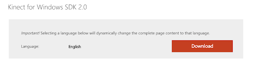
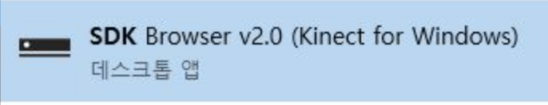
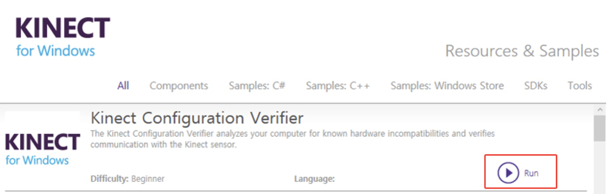
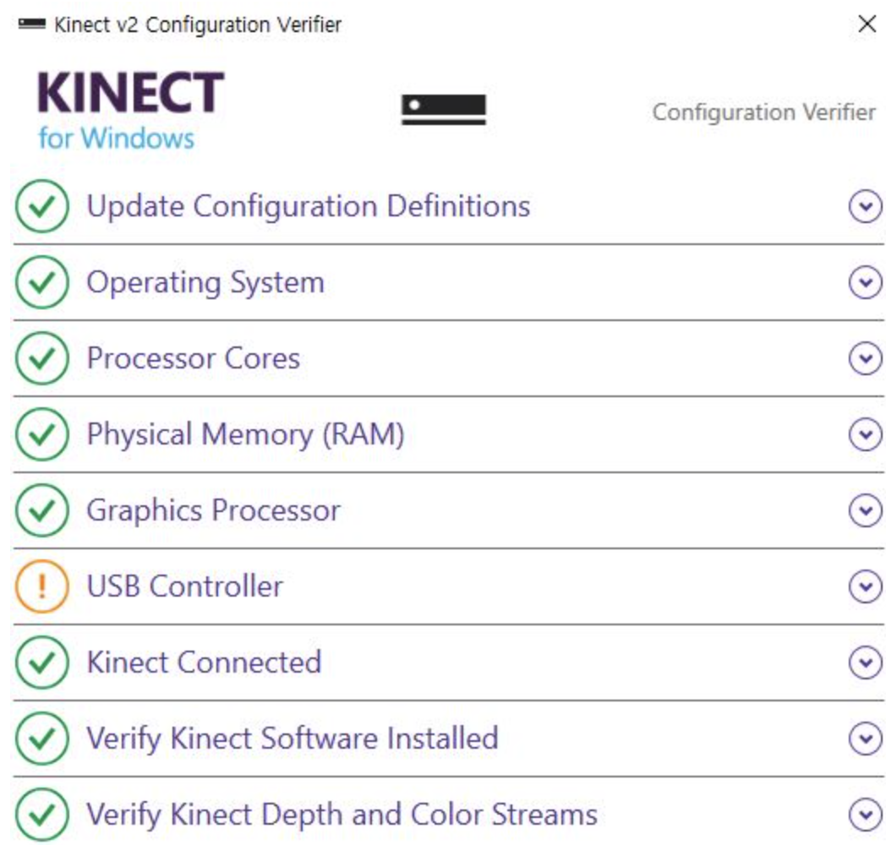
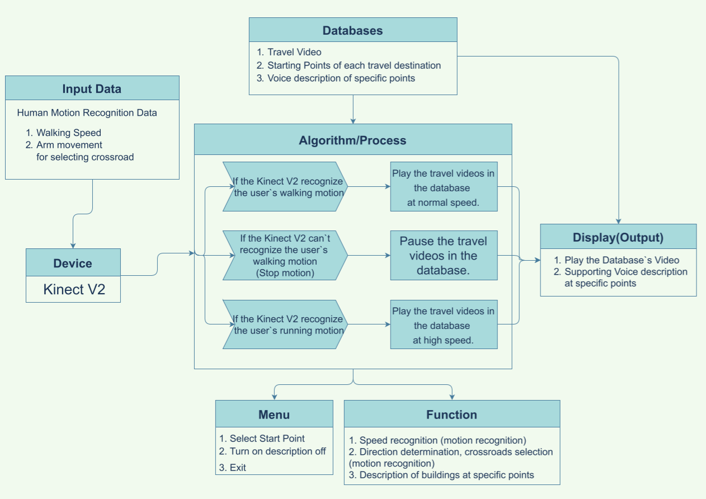

[← go back to the list](../../HCI.md)

# Virtual Tour Guide

### Team 3 Travelers Members
박규호, 황재연, 신예은, 임시은

## Step-by-step Tutorial
### Introduction 

오늘날은 COVID-19 사태로 인하여 그 어느 때보다 세상을 왕래하기 힘든 시대가 되었습니다. 이 여파로 한동대학교로 진학하기를 희망하는 고등학생들과 학생들의 부모님들이 학구열 고취를 위하여 한동대학교의 캠퍼스를 탐방하길 원하더라도 COVID-19 감염 위험성, 먼 물리적 거리와 시간적 한계로 인하여 직접 한동대학교를 방문하여 캠퍼스를 탐방하기 매우 힘들어졌습니다.  이런 문제점을 파악한 저희 팀은 방 안에서도 실감나게 한동대학교를 탐방할 수 있는 가상 캠퍼스 투어 어플리케이션이 필요하다고 생각했습니다. 이 어플리케이션을 통하여  한동대학교를 진학하기 희망하는 고등학생들과 학생들의 부모님들을 비롯하여 한동대학교 캠퍼스 탐방을 원하는 모든 사람들에게 가상 캠퍼스 투어라는 경험을 제공하고자 합니다. 

이러한 어플리케이션을 통해 작게는 한동대학교 캠퍼스 투어를 희망하는 이들에게 시간적, 공간적 제약 없이 실감나는 캠퍼스 투어 경험을 제공할 수 있으며, 크게는 이른바 ‘방구석 여행’에 질리고 실감나는 여행에 목마른 사람들에게 오아시스와 같이 갈증을 해소해줄 수 있습니다. 즉, 저희는 이 프로그램을 한동대학교 뿐만 아니라 여러 유명관광지를 걸어다니며 구석구석 자신이 원하는 방향으로 돌아다니며 사용자들이 운동할 뿐만 아니라 공간적 제약 없이 여러 장소를 실감나게 돌아다닐 수 있는 프로그램을 만드는 것이 저희의 목표입니다.

### Main contents

#### 2-1) How to build? (키넥트와 유니티를 선정한 간단한 설명? 어떤 원리로 구현했는가?) 

##### 준비물
- Kinect V2, Desktop
- 키넥트: 키넥트는 특수한 컨트롤러 없이 사용자의 모션을 인식할 수 있는 기기이기 때문에 키넥트를 이용하여 사용자가 걷거나 뛰는 모션을 인식하기 위해서 키넥트 사용하기로 하였습니다. 
- 유니티: 동영상을 연결하고 동영상 마다 특정 Script를 통해 해야할 일을 다르게 지정할 수 있고, 키넥트를 연결하여 특정 모션을 지정하여 프로그램을 진행 할 수 있어서 유니티를  사용하였습니다.

#### 2-2) 프로그램 설치 및 프로그램 실행 (키넥트 설치 방법, 프로그램 실행방법에 대해 설명)
키넥트 설치방법
1. kinect v2 SDK를 다운받는다. 
- [링크](https://www.microsoft.com/en-us/download/details.aspx?id=44561)

- 

2. 다운로드 한 SDK 설치

3. 설치한 SDK browser v2.0(Kinect for Windows) 실행 

4. 실행된 SDK Browser에서 Kinect Configuration Verifier의 Run을 클릭하여 실행

5. USB Controller의 느낌표 표시 빼고 모드 체크가 되어있다면 Kinect V2 설치 완료

##### [프로그램 실행 방법](https://drive.google.com/file/d/1ajzA5AmhQ0iBd5nvTbwY3qFzsLuSGKwe/view?usp=sharing)
위의 주소를 통해 파일을 다운받고 kinect motion.exe를 실행시켜 프로그램을 실행시키면 프로그램이 시작됩니다.

	
#### 2-3) System architecture design

시스템 인풋은 사람의 움직임 데이터입니다. 걷는 움직임, 걷는 속도, 그리고 방향 선택할 때 팔의 움직임을 Kinect V2를 이용하여 인식합니다. 인식한 데이터를 Unity 알고리즘을 이용하여 운동하고 있는 상태에 따라서 동영상 재생속도를 다르게 설정합니다. 예를 들어 걷고 있으면 앞의 영상이 1배 속으로 재생되고, 빠른 속도로 걷게 되면 영상이 더 빠르게 재생됩니다. 걸음을 멈추면 영상은 즉시 재생을 멈추어 마치 운동하다가 멈추는 느낌을 줄 수 있습니다.

#### 2-4) Main function
Virtual Tour Guide 시스템의 최종 형태는 실행 파일을 통해서 제공될 계획으로 , 처음에 시작, 옵션, 나가도록 하는 것과 시작 지점 선택은 마우스를 통해서 가능하며 이 외에는 사람들의 모션을 통해서 사용이 가능한 형태로 구현하였습니다.

##### 1) 메인화면

- Start를 통해서 투어를 시작할 수 있습니다.
- Option을 통해서 자신이 원하는 옵션을 선택할 수 있습니다.
- Exit을 통해서 프로그램을 끝낼 수 있습니다.

##### 2) 유저의 움직임 인식

- 밑에 나오는 노란색 인체모형을 통해 움직임을 인식하고 있다는 것을 알 수 있습니다. 화면은 무릎이 어느정도 올라갔을 때 걷는 다는 모션으로 인식하고 화면이 움직이도록 하였습니다. 

##### 3) 시작 지점 선택

- 어느 장소를 투어할지 선택하여 원하는 장소를 정할 수 있습니다.
- 시작지점을 정하여 어디서 시작할지 사용자가 선택할 수 있습니다.

##### 4) 갈림길 선택

- 직진을 원할 경우 걷는 모션을 통해서 선택할 수 있습니다.
- 오른쪽으로 가길 원하는 경우 팔을 왼쪽에서 오른쪽으로(->이런 방향으로) 움직임을 통해서 선택할 수 있습니다.
- 왼쪽으로 가기를 원할경우 팔을 오른쪽에서 왼쪽으로 (<-)움직임을 통해서 선택할 수 있습니다.
- 화면 왼쪽 상단에 나오는 칼로리를 통해서 현재 어느정도의 칼로리가 소모되었는지 볼 수 있습니다.

##### 5)설명 옵션 선택

옵션 선택 기능에서는 투어 중 지원하는 기능인 Tour Guide, Minimap, Calorie Indicator을 끄고 킬 수 있습니다.

##### 6) 끝내기 기능 

걷다가 T포즈를 취하면 투어 종료를 묻는 메세지가 뜨고 Yes를 선택하면 투어를 종료하고, No를 선택하면 투어를 계속 진행합니다. 

#### 2-5) [Source Code](https://github.com/woduseh/HCI_2021-1_Team3)

### Conclusion

#### Limitation

맥북에서는 키넥트를 지원하지 않기 때문에 맥북에서 위 프로그램을 사용할 수 없습니다.

프로그램을 실행하면 많은 연산 능력을 필요로 하기 때문에 사양이 높은 데스크탑에서 원활하게 실행이 됩니다. 그렇기 때문에 노트북에서 프로그램을 실행시키면 상대적으로 프로그램이 더디게 실행되거나 모션인식의 인식이 늦어질 수 있습니다.

#### Future study
- 노트북에서도 프로그램이 모션을 잘 인식하여 실행하도록 노력하고 공부할 것 입니다.
- 한동대 뿐만 아니라 다른 장소나 지역을 옮겨 다니면서 장소에 대한 설명과 함께 구석구석 찍으며 사람들이 더 넓은 장소를 운동과 함께 걸어다니며 구경할 수 있도록 할 것입니다.
- 사용자가 쉽게 이용할 수 있도록 처음에 사용방법에 대해서 알려줄 것입니다. 
- 360도 카메라를 이용하여 VR로 사용이 가능하도록 할 것입니다.
- 한 장소 안에서도 다양한 컨셉의 영상을 통해서 사용자들이 그 장소에 대한 여러가지 버전을 선택할 수 있도록 할 것입니다.

### Reference
- [키넥트 사용방법 출처](https://ctkim.tistory.com/89)