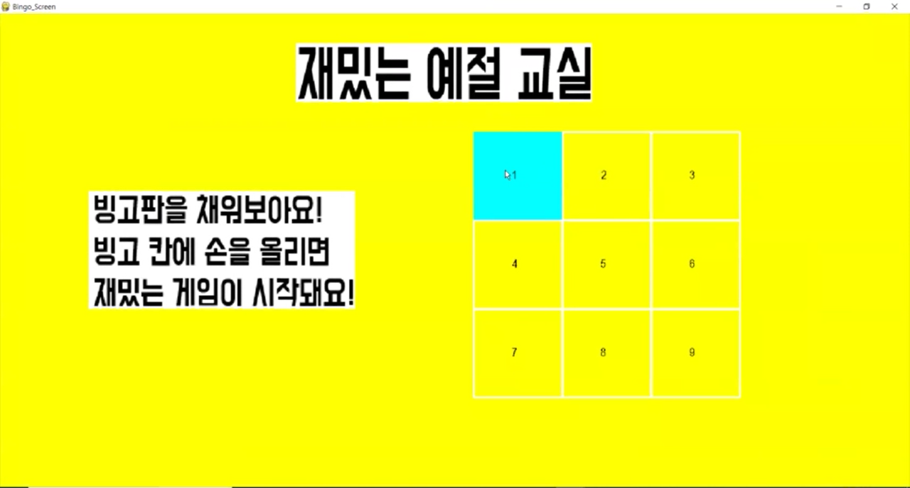
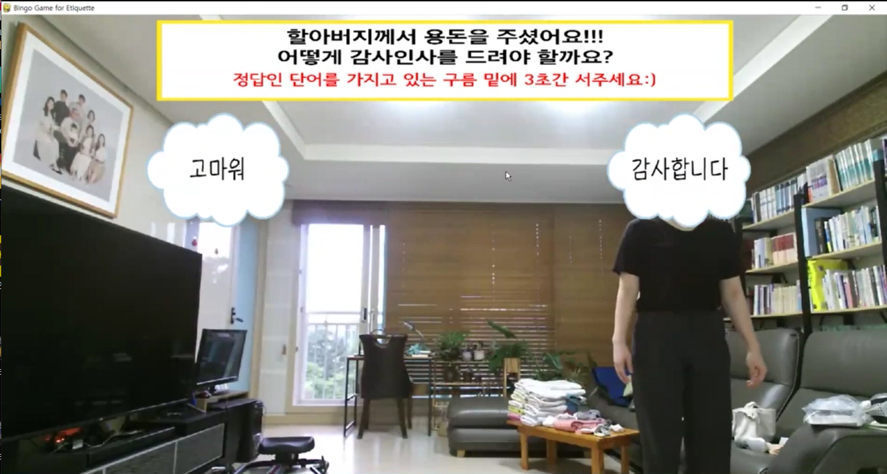
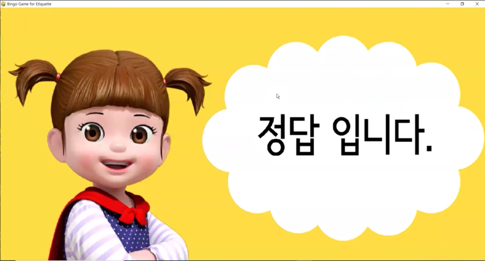
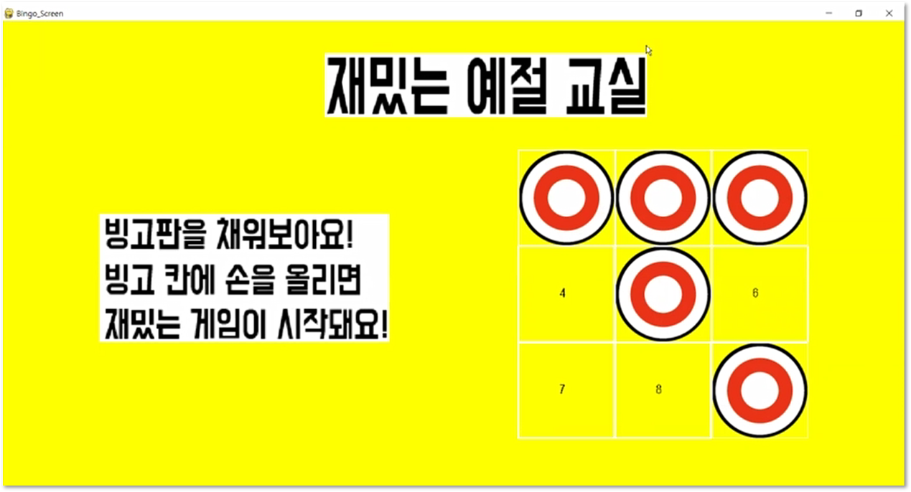
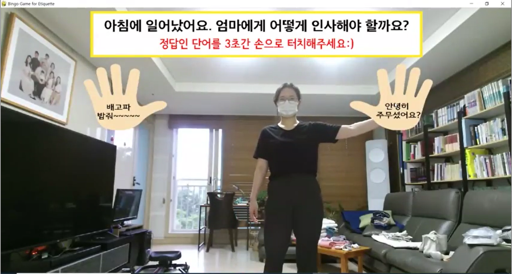
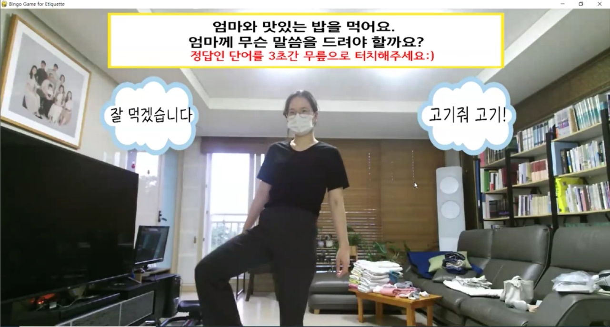
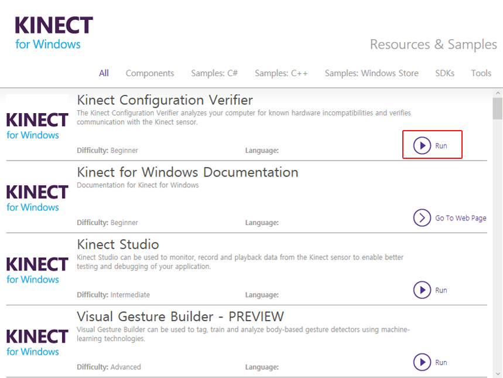
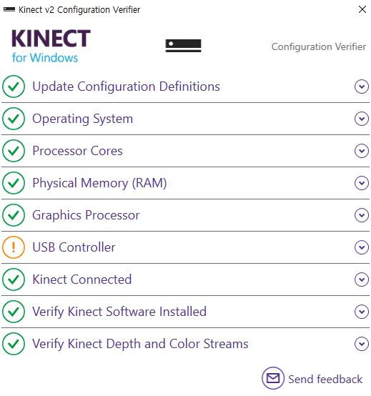
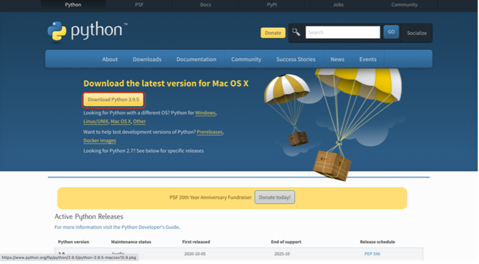
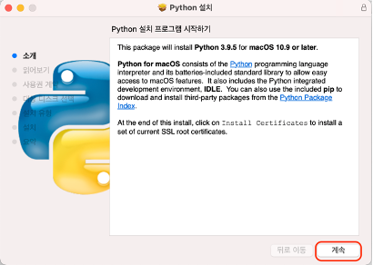

[← go back to the list](../../HCI.md)

# Bingo Game for Etiquette

### Manners Maketh Man members    
강하영, 강진, 김해린, 지서영, 유수정

### 목차
1. [Introduction](#1introduction-) 
2. [Background & Objective](#2background--objective-)
3. [Main Function](#3main-function-)
4. [Demonstration Video](#4demonstration-video-)
5. [Step by Step Instruction](#5step-by-step-instruction-)
6. [Code](#6code-)

## 1.Introduction [🔝](#bingo-game-for-etiquette-kinectpython)
해당 프로젝트는 **모션인식을 이용한 어린이 언어습관 교정 게임**이다. 어린이가 존댓말, 감사표현 등 상황에 맞는 언어 습관을 구사할 수 있도록 모션 인식 기술을 이용해 게임으로 재미있게 공부할 수 있도록 돕는다. 빙고게임이라는 게임 포맷을 사용함으로써 어린이가 빙고판을 채워나가는 성취감을 주어 학습효과를 더욱 향상시키고자 한다.   


## 2.Background & Objective [🔝](#bingo-game-for-etiquette-kinectpython)

### 2.1 Target User 
> 6-7세의 어린이를 대상으로 설정했다. 초등학교 입학 전 필요한 올바른 언어에 대한 학습을 할 수 있는 프로그램이므로 미취학 아동 중 글을 읽을 수 있는 나이인 6-7세의 어린이로 설정했다. 

### 2.2 Their Problems 
>바른 언어습관 형성을 위해서는 공동체 속에서 학습하는 것이 필요하다. 과거에는 대가족을 형성해 많은 가족 구성원이 함께함으로써 예절을 배울 기회가 많았다면 현재는 점점 핵가족화 되어가 예절교육에 소홀해지는 경향이 있고, 더욱이 현재 Covid-19와 같은 펜데믹상황이 발생하여 사회적 거리두기로 인해 공동체를 이루는 것이 어려워졌다. 따라서 어린이들이 다양한 상황에 따른 바른 언어 습관을 형성할 수 있도록 돕는 새로운 방법을 고안했다.

### 2.3  Project Goal 
>Kinect V2와 pygame을 이용한 모션인식 게임을 통해 어린이가 직접 몸을 움직이면서 다양한 상황에 해당하는 올바른 언어예절을 학습을 할 수 있는 빙고게임을 개발한다.


## 3.Main Function [🔝](#bingo-game-for-etiquette-kinectpython)

### 3.1 Bingo Game
1. 3x3 빙고판을 채우는 것이 과제다. 각각의 빙고 칸마다 각기 다른 스토리로 언어예절 게임이 존재한다.
2. User가 선택한 칸에 해당하는 게임의 문제를 읽고 지시사항대로 모션을 취한다.  
  
  
  
3. 정답맞추기에 성공하면 정답화면으로 넘어간다.
4. 빙고판에 동그라미가 표시되고 같은 방식으로 다른 게임들을 진행해 빙고판을 완성한다.
5. 정답을 맞추지 못하면 오답화면에 나오고 빙고판에 변화가 없다. 



### 3.2 Motion in Game 
1. Kinect V2 카메라를 통해 사람 몸의 Joint를 인식한다.  
2. 게임별로 사용되는 Joint가 각각 다른데 미리 설정한 Joint가 정해진 위치에 닿으면 정답 유무를 인식하는 알고리즘을 적용한다.
3. 이를 통해 여러 정답 선택지들을 마우스가 아닌 Body Joints를 사용해 정답을 선택한다.  
Ex) 손, 팔꿈치, 무릎, 머리 등  



## 4.Demonstration Video [🔝](#bingo-game-for-etiquette-kinectpython)

- https://user-images.githubusercontent.com/55008881/120818246-632ebc80-c58d-11eb-95ae-9e0707814542.mp4


## 5.Step by Step Instruction [🔝](#bingo-game-for-etiquette-kinectpython)

### 5.1 Kinect for Windows SDK v2 Installation

[Microsoft Download Center](https://www.microsoft.com/ko-kr/download/)에서 설치 파일 [Kinect for Windows SDK v2](https://developer.microsoft.com/ko-kr/windows/kinect/)을 다운 받는다. 


최신버전 사용을 추천합니다.

##### 시스템 요구 사항:
- 지원되는 운영 체제 (Embedded 8 Standard, Windows8, Window 8.1)(사용자:Window10, 64-bit)
- 권장 하드웨어 구성 : 64-bit (x64) 프로세서 / 4 GB 메모리 (이상) / Physical dual-core 3.1 GHz (2 logical cores per physical) 이상 프로세서 /  Kinect for Windows v2 센서 전용 USB 3.0 controller* / DX11 capable graphics adapter** / 전원 허브 및 USB 케이블이 포함 된 Microsoft Kinect v2 케이블


- Softerware 요구 사항: Visual 2012 또는 [Visual Studio2013](https://www.microsoft.com/ko-kr/download/details.aspx?id=40784) 

설치 진행 순서 상세 :
  1. kinect 센서가 컴퓨터 USB 포트에 연결되어 있지 않은지 확인합니다.
  2. 다운로드 위치에서 KinectSDK_v2.0_1409-Setup.exe를 두 번 클릭합니다.


  4. 설치가 완료되면 Kinect 센서가 전원 허브에 연결되어 있고 전원 허브가 콘센트에 연결되어 있는지 확인합니다. 전원 허브의 USB 케이블을 PC의 USB 3.0 포트에 연결합니다. 드라이버 설치가 자동으로 시작됩니다.
  5. 드라이버 설치 후 장치 관리자를 실행하여 확인할 수 있으며 장치 목록에 "KinectSensor Device"가 존재합니다.
  


  6. 실행된 Kinect for Window에 위와 같이 체크가 되어 있어야 합니다. (USB Controller의 느낌표가 표시되어 있지만 사용하는데 문제는 없습니다.)
  7. 설치가 완료되었습니다.


### 5.2 Python Installation 

   1. 사이트에서 [Python](https://www.python.org/downloads/) 설치 파일을 다운 받습니다. 



   2. 다운받은 python-3-X.pkg 파일을 실행하여 파이썬 설치를 완료합니다.



   3. 터미널에서 아래의 명령어를 입력하면, 설치한 파이썬 버전을 확인할 수 있습니다.
   ```
   python3 -V 
   ```


### 5.3 Pykinect2 package Installation  

터미널 또는 CMD창에서 아래의 명령어를 통해 패키지를 설치합니다.
   ```
   pip install pykinect2
   ```

### 5.4 NumPy package Installation (1,2번중 선택) 

   1. Anaconda 32-bit 버전에 NumPy가 포함되어 있기 때문에 [Anaconda](https://www.anaconda.com/products/individual)다운 받으면 됩니다. 
   2. 터미널 또는 CMD창에서 아래의 명령어를 통해 패키지를 설치합니다.
   
   ```
    pip install numpy
   ```
    
### 5.5 comtypes package Installation 
터미널 또는 CMD창에서 아래의 명령어를 통해 패키지를 설치합니다.
```
pip install comtypes
```
    
### 5.6 pygame package Installation 
1. Python 버전과 같은 [pygame 2.0](https://github.com/pygame/pygame/releases/tag/2.0.0) 파일을 다운 받습니다. (예 python35 / pygame-2.0.0-cp35-cp35m-win_amd64.whl) 
2. 터미널 또는 CMD창에서 아래의 명령어를 통해 패키지를 설치합니다.
    
```
C:\Users\name\> cd Downloads
C:\Users\name\Downloads> pip install pygame-2.0.0-cp35-cp35m-win_amd64.whl
```

## 6.Code [🔝](#bingo-game-for-etiquette-kinectpython)
### 6.1 Main code

게임 화면과 필수 요소 설정
```Python
#이 게임에서 없어서는 안 될 클래스
 class PyKinectCollect(object):
     def __init__(self, title, width = 1400, height=800, fill=YELLOW):
         self._clock = pygame.time.Clock()

         #스크린의 사이즈 설정; 가로, 세로
         self._infoObject = pygame.display.Info()
         self._screen = pygame.display.set_mode((self._infoObject.current_w >> 1, self._infoObject.current_h >> 1),pygame.HWSURFACE|pygame.DOUBLEBUF|pygame.RESIZABLE)                  
         #사용자가 close 버튼을 누르지 않는다면
         self._done = False
         
         #Kinect runtime object 
         self._kinect = PyKinectRuntime.PyKinectRuntime(PyKinectV2.FrameSourceTypes_Color | PyKinectV2.FrameSourceTypes_Body)
         
         #Kinect color frames, 32비트 색깔, 가로, 그리고 세로를 담을 공간(surface)
         self._frame_surface = pygame.Surface((self._kinect.color_frame_desc.Width, self._kinect.color_frame_desc.Height), 0, 32)

         #골격 정보를 담는 공간 
         self._bodies = None
         self.current = False
         self.title = title
         self.width = width
         self.height = height
         self.fill = fill        
```

사용자의 몸이 화면에 보이도록 하고, 사용자의 관절을 인식하는 원리 [🔝](#bingo-game-for-etiquette-kinectpython)
```Python
     #사용자의 몸이 화면에 보이도록 하고, 게임 작동 원리를 담고 있는 매서드
     def draw_body_bone(self, joints, jointPoints, color, joint0, joint1, boardN):
         joint0State = joints[joint0].TrackingState;
         joint1State = joints[joint1].TrackingState;

         #사용자의 관절이 부분적으로 인식될 때 
         if (joint0State == PyKinectV2.TrackingState_NotTracked) or (joint1State == PyKinectV2.TrackingState_NotTracked):
             return

         #사용자의 관절이 전혀 인식되지 않을 때 
         if (joint0State == PyKinectV2.TrackingState_Inferred) and (joint1State == PyKinectV2.TrackingState_Inferred):
             return
         start = (0, 0)
         end = (0, 0)
         global starttime
         global flag
         
         #사용자의 머리를 인식하는 경우
         if (boardN == 1):
            
            #사용자의 머리 인식을 위해 x, y 좌표 정의 
            JointX = jointPoints[PyKinectV2.JointType_Head].x
            JointY = jointPoints[PyKinectV2.JointType_Head].y
            
            #사용자의 머리가 주어진 범위 안에 있을 때 
            if (1400 <= JointX) and (1000 >= JointY):
                
                #처음 
                if (starttime == 0):
                    timestamp = datetime.datetime.now().timestamp()
                    fts = timestamp
                    starttime = fts
                    print('time start!!!!!!!!!!!!!!!!!!!!!!!!!')
                    pygame.display.update()
                    print (starttime)
                else:
                    timestamp = datetime.datetime.now().timestamp()
                    fts2 = timestamp
                    print('right', fts2)
                    if (starttime+2 < fts2):
                        print('touch1')
                        flag = 0
```

메인 빙고 화면 설정 및 화면 전환 [🔝](#bingo-game-for-etiquette-kinectpython)
```Python
#이 게임이 작동되도록 하는 함수 
def w_game():
    pygame.font.init()
    game = PyKinectCollect("Bingo Game for Etiquette")
    b_screen = Screen("Bingo_Screen")
    win = b_screen.makeCurrent()
    done = False
    returnButton = Button(1000, 650, 300, 100,3, colours["Black"], colours["Cyan"], "arial", 20, colours["Black"], "RETURN")
    bingo_1 = Button(800,200,150,150,3, colours["White"], colours["Cyan"],"arial", 20, colours["Black"], "1")
    toggle = False
    while not done:
        b_screen.screenUpdate()
        b_screen.show_middle_img()
        b_screen.show_left_img()
        game.screenUpdate()
        mouse_pos = pygame.mouse.get_pos()
        mouse_click = pygame.mouse.get_pressed()
        keys = pygame.key.get_pressed()
         
    #3x3 빙고 표에서의 좌표(행과 열)에 따라 page에 숫자를 부여했다 
    #b_1(행: 1, 열: 1)
    
        #빙고 판이 있는 메인 화면에서 각 게임 화면으로 전환
        if b_screen.checkUpdate():
            screen2button = bingo_1.focusCheck(mouse_pos, mouse_click)
            bingo_1.showButton(b_screen.returnTitle(),buttonlist[0])
            if screen2button:
                win = game.makeCurrent()
                g_screen=game.playGame(1)
                b_screen.endCurrent()
                
        #각 게임 화면에서 빙고 판이 있는 메인 화면으로 전환
        elif game.checkUpdate():
            b_screen.show_return_img()
            returnm = returnButton.focusCheck(mouse_pos, mouse_click)
            returnButton.showButton(game.returnTitle(),0)
            if returnm:
                win = b_screen.makeCurrent()
                game.endCurrent()      
```

### 6.2 Detailed code
[Game Source Code](source.md)
[Game Source Code - Zip](source.zip)

 [🔝](#bingo-game-for-etiquette-kinectpython)
