[← go back to the list](../../HCI.md)

# FORONE

"A diet management application for healthy eating habits of single-person households in their 20s"

## Members

Moon Kiwon / Lee Soui / Kim Sooyeon / Jeon Jongseok

## 1. Introduction
 ### background
 
 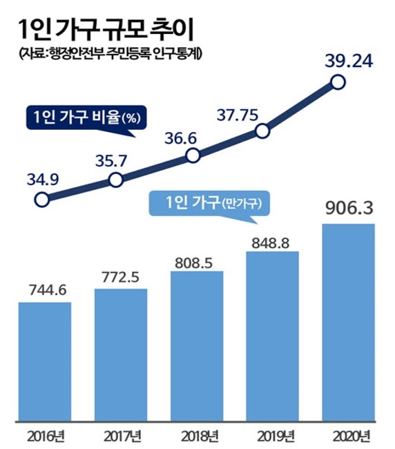 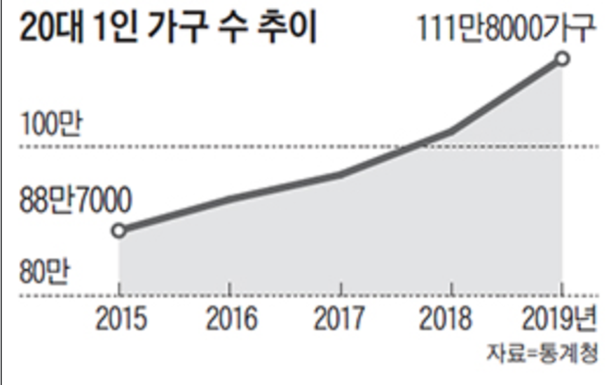 
 
  Single-person households are households that make a living by cooking and sleeping in independent spaces alone, and according to the Ministry of Public Administration and Security's resident registration demographics, the proportion of single-person households is increasing every year from 34.9% in 2016 to 39.24% in 2020. Among them, the proportion of young people in their 20s and 30s living alone, especially for school and work, increased 1.26 times in four years from 887,000 in 2015 to 1.18 million in 2019.
  

  As the number of single-person households increases, more and more studies are being done on food consumption and food expenditure patterns of single-person households, and the results show that single-person households have different characteristics and consequent problems.

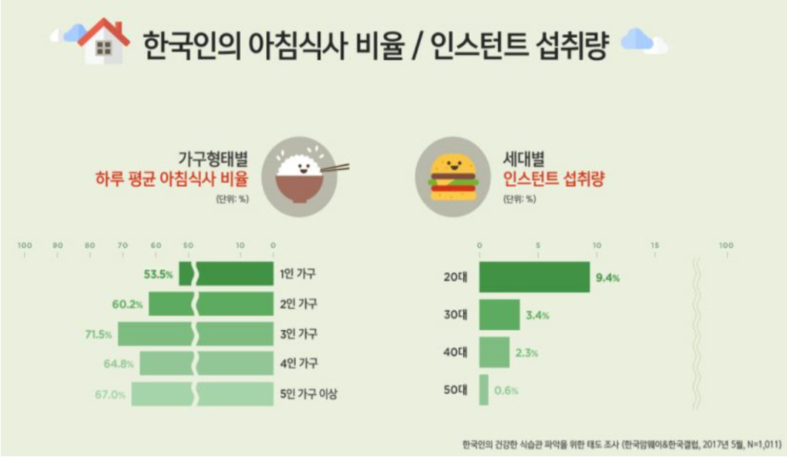 

  1)Single-person households have shorter meal-related hours except for snacks and drinks compared to multi-person households, and irregular meal times, with the lowest breakfast rate.

  2)When you eat alone, you will have incorrect eating habits, such as fasting, eating out, nutritional imbalance, and the possibility of obesity. The percentage of single-person households eating alone is 90%, more than four times higher than that of multi-person households, which is about 20%.The word ’family meals’ is not just about family eating together, but they have an important impact on family members' formation and maintenance of proper eating habits by encountering various foods together and providing balanced meals, and the biggest problem when eating alone is poor eating.
  It can also be expected that people in their 20s prefer consumption of instant or simple foods for convenience and economic reasons, and that nutrition is also not balanced.

  We found out through background research that single-person households in their 20s have problems with their eating habits compared to other households, and created a health care app to solve them.

### target user
The app's target users are one-person households in their 20s. 
According to statistics such as diet habits by household type, age, or nutrient intake, single-person households in their 20s had the most irregular diet and uneven nutrition intake. For these reasons, we want to help single households in their 20s interact with healthcare apps to have the right eating habits, improve their eating habits in the long run, and lead a healthy life.

### Goal
The ForOne app provides information on proper eating habits and diets for single-person households in 20s with disproportionate diets and helps with continued use.
Users can analyze and manage their diets through photographs rather than through them. When the application analyzes the calories and nutrients in the food and informs users of their eating habits, users can correct their eating habits and take care of their health according to the analysis.
In addition, since food habits are not formed in a short period of time, we motivate users to eat the right meals by providing notification services so that people can use the application consistently.


## 2. Main contents

### System architecture

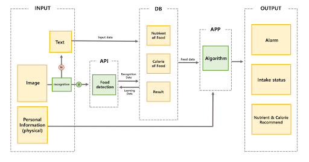 

### Main Function

 1) Login(User information and goal of App)

Choose the user's information (name, height, weight) and the purpose of using the app (weight retention, weight loss, weight gain).

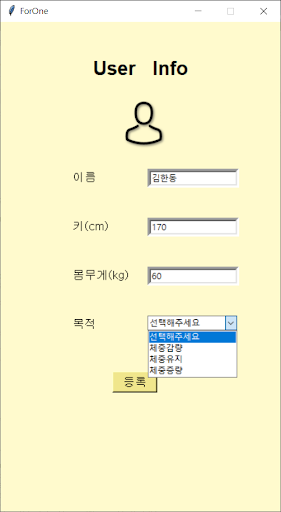 


 2) Food recognition

When a user takes a picture of a food or enters a picture of the food, the user recognizes the food. Food recognition uses label detection from the Google Cloud Vision API. If you don't recognize food properly with pictures, you can type the name of the food in text.

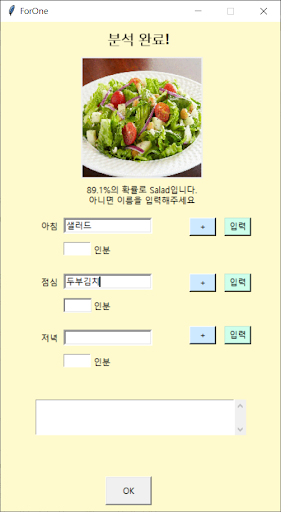 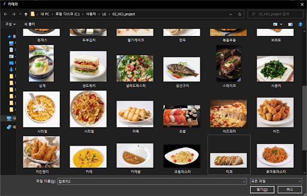 


This is a code that uses Google cloud vision api to recognize the user-selected photos in a photo file and to read description and scores of the food labels.
```
os.environ['GOOGLE_APPLICATION_CREDENTIALS'] = 'my first API-2020dd811d20.json'
def openFile():
  global filename
  filename = askopenfilename(title='카메라', filetypes=(("모든 파일", "*.*"), ("GIF파일", "*.gif")))
  photo = Image.open(filename)
  photo = photo.resize((170, 170))
  ph = ImageTk.PhotoImage(photo)
  imglabel1 = tk.Label(self, image=ph)
  imglabel1.image = ph
  imglabel1.place(x=115, y=50)
  print(filename)
  client = vision.ImageAnnotatorClient()
  #이미지 읽기
  with io.open(filename, 'rb') as image_file:
      content = image_file.read()
  image = types.Image()
  image = vision.Image(content=content)
  response = client.label_detection(image=image)
for label in response.label_annotations:
   global food
  global foodscore
  print("Label: ", label.description, "/ score: ", label.score)
  if label.description in foodlist:
    
      food = label.description
      foodscore = round(label.score*100, 1)
      print(food)
      print(label.score)
      print(foodscore)
  ```


 3) Calculating Calories

When a user enters food and quantity, it calculates the calories consumed by the user based on the food and amount recognized. Calories are shown to be the same as the calories consumed in the meal and the accumulated calories per day.

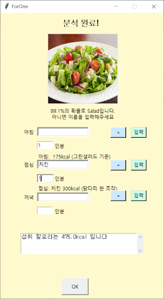 

This is a code that takes the name of the food and returns calories to update the total calories.
```
label2.configure(text='점심: ' + food2.get() + ' 360kcal (한 조각)')
totalCal += 360 * float(howDish2)
st.delete(1.0, END)
st.insert(END, '섭취 칼로리는 ' + str(totalCal) + 'kcal 입니다')
```


 4) Past Report

It shows how many calories users have consumed in the past. In addition, the target calories are set differently depending on the goals set by the user when logging in, showing them as the calories consumed by the user.


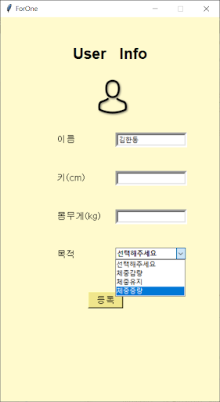 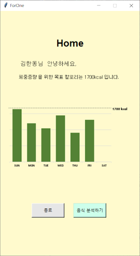 


 5) Notification

It is a function that helps users not forget to input food. If there is anything that has not been registered, the notification allows the user to enter the food without forgetting it.

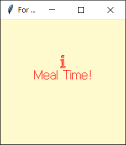 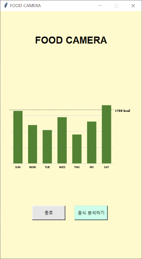 

We build a Python GUI Application with Tkinter in this project, and this is a code that implements destroy and notification windows popping up through the “try finally” syntax.
```
def restart():
  global self
  try:
      if ('normal' == self.state()):
          self.destroy()
  finally:
alarm = tk.Tk()
alarm.title("For one Alarm")
alarm['bg'] = '#FFFACD'
alarm.geometry("200x200+500+300")
label2 = Label(alarm, text='Meal Time!', width=120, height=150, fg='red', background='#FFFACD',
             bitmap='info', compound='top', font=45)
label2.pack()
#label2.place(x=50,y=50)
time.sleep(1)
self.mainloop()
```

### Demo video

## 3. Conclusion 
### Experimental methods, experimental results.

#### Experimental Methods, Subjects
Experimental methods: Experimental methods were conducted in the form of face-to-face interviews. The subjects were students in their early to mid-20s at Handong University, who currently live in dormitories or live outside and have problems managing their diet.
Date: 2021.05.24-2021.05.25 Dinner time zone
Venue: Student council office, Dormitory, Nehemiah Hall.
User information: Handong University male and female ages 20 to 26.
The experiment was conducted when the moderator ordered the user. Quantitative data were measured during the experiment, such as the time taken by the user, hesitation, etc., and qualitative data was obtained as numerical data through interviews with the user after the experiment.


#### Data
- Quantitative Data

The difference in time between when the user has done all the work alone and through the app.
The difference in time when the user selects a photo and types it.
The time the user responded to the alarm

- Qualitative data

The difference between doing everything alone and through an app.
The difference between the score and satisfaction of entering a picture of a meal and typing through a typewriter
Comments on alarm functionality
Satisfaction score for overall app functionality
Changes in satisfaction if there is an error in the recognition function.
Satisfaction score for overall design
Comments on whether you think you'll use this app for diet management in the future


### Result
#### Interpreting Data
Most students could feel greater benefits when managing their diet with the app than when they did it alone. This can be confirmed by the opinion that time has been reduced by half quantitatively and improved qualitatively. 
In both input through typing and input through photography, both quantitative and qualitative data showed greater benefits of input through photography.
Although the response to the alarm function was later than expected, the user's satisfaction was high.
There was an evaluation that the overall design of the app was insufficient, and a good evaluation was made of its function.
However, if the recognition rate was low, there were many negative opinions about using the app. 
Overall, users were optimistic about using the app.

#### Insight
 - Our team was able to identify what users thought was important about design.
It was possible to understand that users value design more than they thought when using apps.
 - If it was not based on high recognition rates, the app would be less useful.
If the API's recognition rate was not high, i.e., the user's benefits were sharply reduced if the food was not recognized well.
 - Easy and simple UI/UX is important as it's not usually a bother.
It was confirmed that users should provide a clear UI so that they could experience a good UX when using it.
 - People did not respond easily to the alarm. We felt that we should design the sound and design of alarms more like alarms.
Users did not easily recognize the alarm, so in order to increase usability, they could see that the alarm should be clearly recognized by adding sound or effect to the alarm.

### Problems and Directions
 1) Problems and improvement plans
 	- Full Design/UI Reconfiguration
As a whole, problems with design and UI have been raised.
 	-  Easy to create and use data stores.
It is necessary to create a data store, store user's data, and make it easier to utilize.
	 - Increase awareness with a variety of data
Through various data, I realized that recognition rate should be increased.
 	- Add sound or graphics to alerts to help users understand better.
Sound and graphics should make it easier for users to understand.
 	- Process and provide information that users can easily understand and utilize. (e.g., showing calories, what exercise you need to do to lose weight, and what problems you may have if you lack the nutrients)
Nutrition information and calorie information can be difficult to understand for users. Information should be processed and provided to users for easy understanding and utilization.

 2) Future Developments Directions
			- User friendly and fashionable UI
  	- Provides high profile through extensive data
  	- Provides information that is easy for users to understand and use.


## 4. Reference

[삼성전자 뛰쳐나와 만든 앱, 찍는 순간 칼로리가 나온다]
https://news.joins.com/article/22973973


두잉랩 다이어트 카메라 AI
http://www.doinglab.com/theme/s007/index/company_02.php

["사진만 찍으면 바로 식단 분석" KT 당뇨병 AI 솔루션 선봬]
https://cm.asiae.co.kr/article/2020060909252341959

[서울 20~30대 1인가구, 식사 불규칙…영양섭취도 부실]
https://www.donga.com/news/Society/article/all/20200404/100496932/1

[1인가구 연령대별 식생활은 어떠한가?]
https://www.si.re.kr/node/63175

[1인가구, 식사 불규칙, 영양 섭취 부실]
https://www.yna.co.kr/view/AKR20160308155800030

[2020년 모바일 현황 보고서, 한국은 건강 및 피트니스 앱 2년전 보다 570% 더 많이 사용]
http://digitalchosun.dizzo.com/site/data/html_dir/2020/01/16/2020011680096.html

김유경 (2018). 1인가구 근로자의 식사 관련 시간 분석 다인가구와의 비교 및 성별연령대별 차이를 중심으로. 한국가정관리학회 학술발표대회 자료집, 208-208.

최미경, 박은선, 김미현 (2019). 1인 가구 성인의 가정간편식 이용과 식습관 실태. 대한지역사회영양학회지, 24(6), 476-484

조필규, 오유진 (2019). 1인가구의 고용형태 및 연령별 혼자 식사(혼밥) 관련 식행동 비교. 대한지역사회영양학회지,  24(5), 408-421

남소영, 이수경 (2018). 성연령별 1인가구와 다인가구의 식생활 및 영양상태 차이분석. 한국가정관리학회 학술발표대회 자료집, 87-87

문희운, 양난미 (2019). 성인애착, 자기결정적 고독동기, 외로움의 수준에 따른 집단 분류와 우울, 스트레스 대처방식, 삶의 만족도의 집단 간 차이. 한국심리학회지: 상담 및 심리치료, 31(1), 129-154

이남의, 김성연 (2014). 20~30대 1인 가구를 위한 인간미 있는 세탁기 디자인 연구. 한국HCI학회학술대회, 279-282


#### Statistic
Korea Amway Korea Gallup
Ministry of Public Administration and Security's resident registration demographics 
National Statistical Office


- Google vision https://cloud.google.com/vision/docs/features-list
