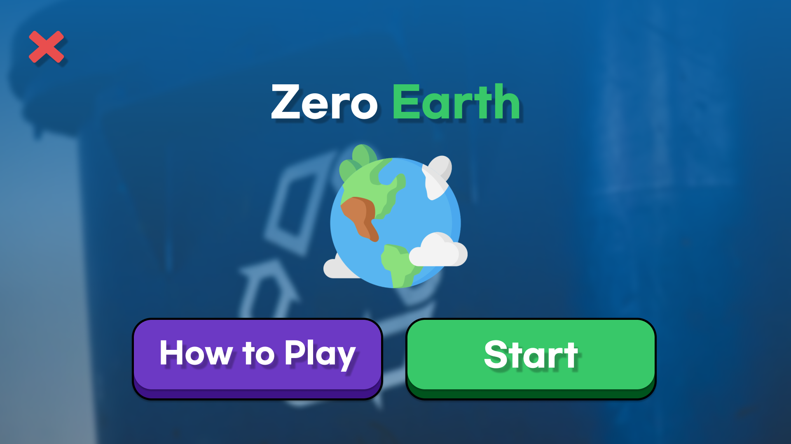
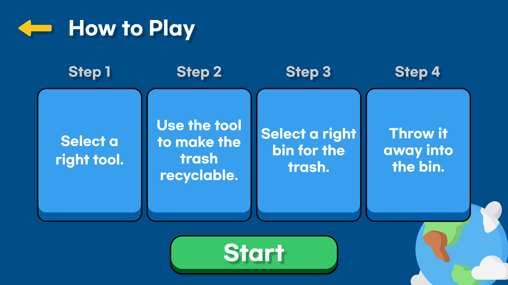
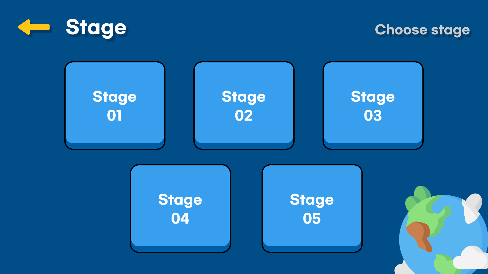
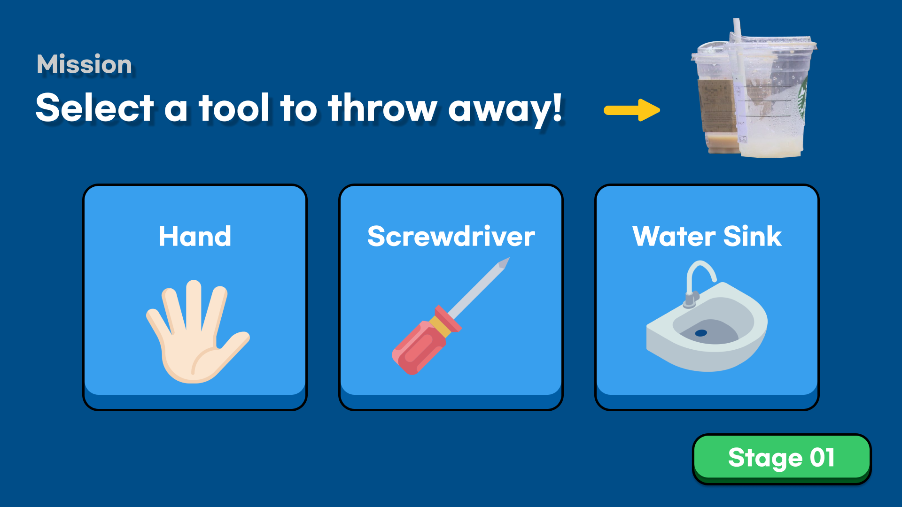
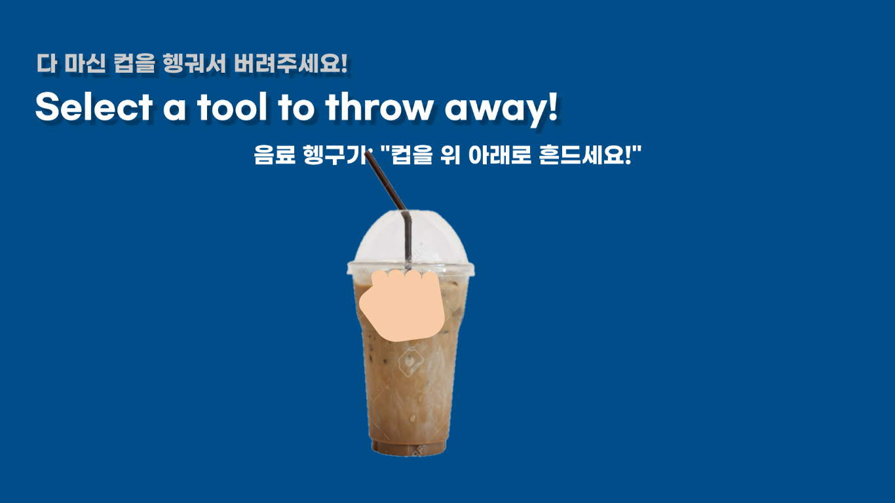
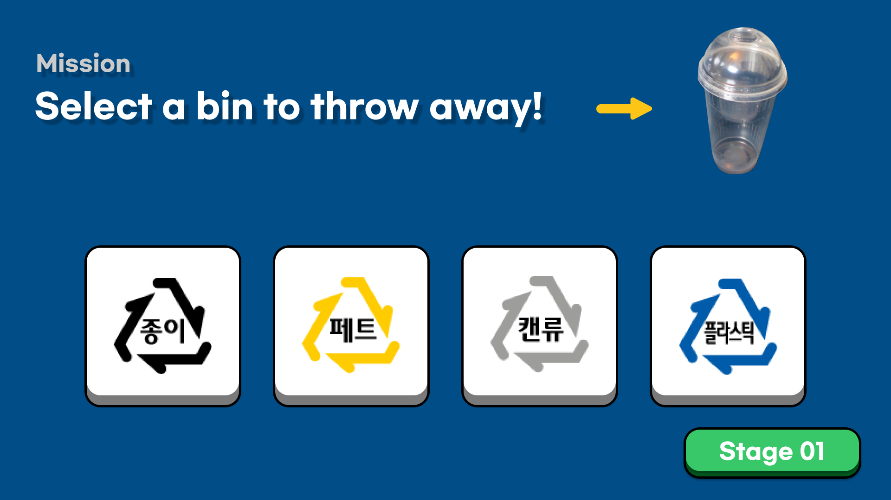
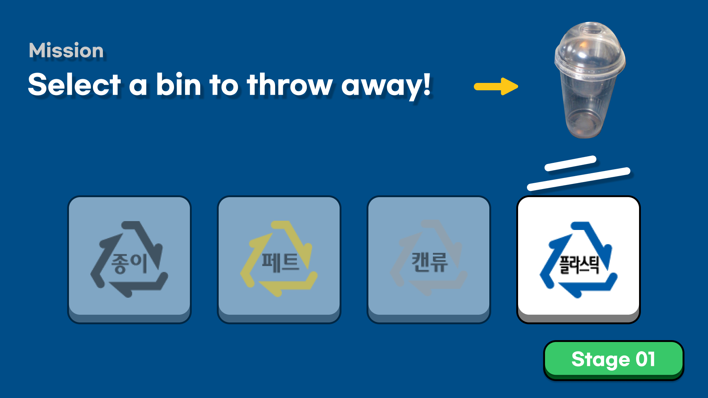
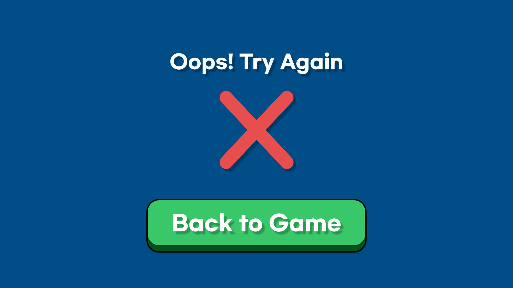
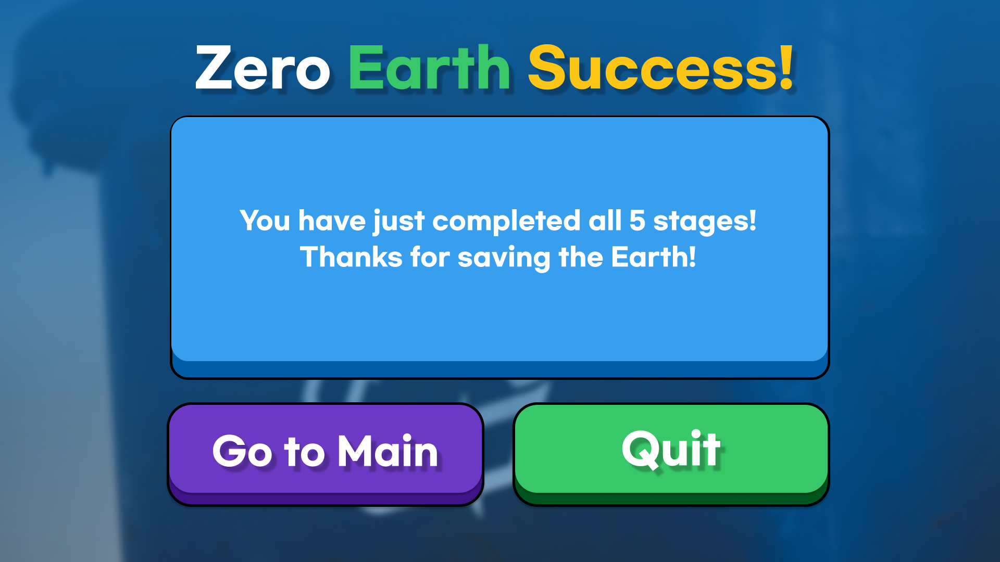
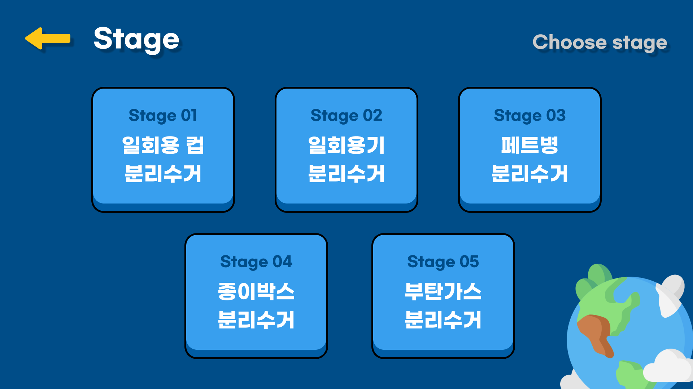

# 환경 교육 기능성게임 : "Zero-Earth"
## 1. Introduction
### 1.1 Background
   - 한국은 2020년 2월부터 분리수거 배출 방법이 변경되었다. 기존에는 플라스틱, 종이, 캔 등 간단한 분류 방식으로 분리수거가 진행되었지만 현재는 플라스틱의 경우 폴리프로필렌(PP), 폴리에틸렌, 테레프탈레이트(PET), 일반 스티로폼, 압축 스티로폼 등 전부 분리해서 버려야한다. 또한 페트병의 경우 붙어있는 비닐을 떼어내고 안에 있는 공기를 빼고 압축하여 뚜껑을 닫고 버려야한다. 플라스틱 외에도 복잡한 수거 방식을 가지거나 분리수거가 될 것 같지만 실제로는 그렇지 못한 물품들도 많다. 예를 들어 음식물을 담고있던 종이팩이나 금속 캔의 경우 안에 있는 내용물을 깨끗이 씻어 버려야하며 부탄가스를 버릴 때에는 용기에 구멍을 뚫어 잔존 가스를 빼내고 버려야한다. 분리수거가 되지 않는 제품 중에는 즉석밥 용기나 다회용 플라스틱 용기에 해당하는 OTHER 플라스틱, 배달용 진공포장 용기에 해당하는 비닐이 붙어있는 플라스틱, 종이컵과 컵라면 용기에 사용되는 비닐이 접합된 종이는 분리 배출을 하더라도 재활용 되지 않으며 이러한 제품을 분리수거 했을 경우 분리수거 업체에서 골머리를 앓는 경우가 많다. 
이처럼 분리수거 방식이 시민들에게 혼란함을 주고 복잡해진 만큼 올바른 분리수거가 행해지고 있지 않은 경우가 많다. 통계청에서 한국 시민들에게 분리배출 방법 인지에 대해 설문조사를 한 결과 43%의 시민들이 자세히 알고 있고, 48%의 시민들이 대략적으로 알고 있고, 10%의 시민들이 잘 모른다고 대답하였다. 이 통계를 보았을 때 실질적으로 올바른 분리수거를 하고 있는 사람은 43% 미만이라고 볼 수 있다. 대략적으로 알고 있다는 것은 실질적으로는 올바른 분리수거 방법을 잘 모르고 있다는 것을 의미한다. 또한 자세히 알고 있다고 해도 대부분의 시민들은 구체적인 분리배출 방법 잘 모르는 경우가 많기 때문에 측정된 비율보다 더 적을 확률이 크다. 

- 이렇게 올바른 분리수거가 제대로 시행되지 않을 경우 국가적으로나 환경적으로나 큰 손실을 가져온다. 먼저 국가적인 손실에 첫번째는 경제적인 손실이다. 페트병의 경우 재활용 과정에서 다시 페트병으로 만들 수 있는 플라스틱 원재료를 얻는 과정에 사용된다. 하지만 기존에 만든 만큼 다시 수거되지 못한다면 이를 충당하기 위해 나머지 원재료를 타국으로부터 수입할 수 밖에 없다. 한국은 지난 2019년
10만 톤의 PET를 수입하였으며 2017년부터 2019년 점점 증가하고 있는 추세이다. 수입을 할 때 많은 국가 세금이 사용되며, 이는 국가의 경제에 큰 손실을 가져오게 된다. 

	

- 다른 경제적인 손실로 쓰레기 처리 비용이 있다. 음식물이 묻거나 불순물이 포함된 제품들이 분리수거 되면, 재활용 되지 못하고 쓰레기 매립지나 소각장으로 향하게 된다. 이 과정에서 다른 재활용품을 오염시키는 등의 일이 발생할 경우 다른 쓰레기들까지 같이 재활용 되지 못하고 쓰레기로 분류되어 처리 과정에서 경제적인 손실을 가져온다. 

- 두번째 국가적인 손실에는 공간적 손실이 있다. 한국의 국토는 100,210km2로써 그리 크지 못하지만 인구가 5천만에 달해 국토에 비해 배출되는 쓰레기 양이 많다. 그 중에서 전체 인구의 2/5를 차지하는 서울과 수도권의 경우 그 정도가 매우 심하여 주변 매립지가 곧 포화될것으로 예측된다. 현재 서울의 쓰레기는 인천광역시 매립지에 매립되고 있으며 더 이상 매립할 곳이 없어서 인천시는 서울의 쓰레기를 2025년 이후로 더 이상 받지 않겠다고 선언하였다. 더불어 이런 매립지는 공간적인 문제뿐만 아니라 쓰레기로 인한 침출수가 주변 땅이나 지하수를 오염시켜 큰 환경적인 문제를 일으키고 이는 주변에 살고 있는 이웃에게 건강적인 문제를 발생시킬 수 있다. 이런 매립을 막자고 소각장을 많이 짓게 되면 소각에 의해 발생하는 다이옥신 등의 환경 호르몬이 암을 유발하거나 내분비계에 문제를 발생시키기 때문에 문제를 전혀 해결해주지 못한다. 따라서 현재 올바른 분리수거 교육이 요구되며 이를 통한 실천이 필요한 상황이다.

### 1.2 Purpose
- 본 프로젝트의 목적은 사람들에게 올바른 분리수거 방법을 알려주는 것이다. 물론 현재 지자체에서도 분리수거 방법을 시민들에게 알려주고 있다. 하지만 지금 분리수거 공고 방식에는 문제가 있다. 바로 접근성이다. 현재 지자체에서는 장문의 글과 간단한 그림으로만 분리수거 방법을 제공하고 있다. 이러한 방식은 시민들에게 전혀 흥미를 줄 수 없으며 오히려 거리감만 두게 만드는 방식이라고 볼 수 있다. 특히 아이들의 경우 글을 읽는 습관이 제대로 되어 있지 않아 접근성이 부족하고 어른들이 읽어도 어려운 내용인 경우가 대부분이기 때문에 아이들의 경우 글로만 접하고 이를 시행하기에는 무리가 있다. 현재 이런 문제를 해결하기 위해 저희는 아이들이 자신의 손을 통해 직접 분리수거를 진행하게 하면서 분리수거 방법을 익힐 수 있게 계획하였다. 또한 기존 방식의 가장 큰 문제였던 접근성을 해결하기 위해 분리수거를 마치 게임처럼 느끼도록 만들어 아이들이 흥미를 가지게 할 것이다. 이를 통해 미래를 이끌어갈 아이들에게 환경의 중요성을 알려주고 각자의 집에서도 올바른 분리수거를 시행하게 하는 것이 최종 목표이다.

## 2. Main Contents
### 2.1 Scenario

- 아이들이 재활용 분리수거에 사용되는 동작들을 통해 게임과 인터랙션 하며, 자연스럽게 재미와 올바른 재활용 방법을 습득할 수 있도록 시나리오를 구상하였다.
- 총 다섯개의 스테이지로 구성되어 있으며, 각 스테이지는 ‘1) 미션 수행을 위한 올바른 도구 선택 2) 미션 동작 수행 3) 재활용품을 올바르게 분리 배출’의 순서로 구성되어 있다.

- 화면 시나리오 피그마 링크 : https://www.figma.com/file/HCuLYlAGr2PVJUb5rXfqtk/HCI_2021_Team6_Zero-Earth?node-id=14%3A3 

(미리보기) 


#### 2.1.1 Pre-Stage
1. 게임을 실행
2. [How to Play] 선택을 통해 게임 수행 방법을 알아봄
3. 순차적 게임 진행을 위해 [Stage 1]을 선택	

#### 2.1.2 Stage 1
1. 미션 “다 마신 컵을 헹궈서 버려주세요!”를 수행하기 위해 [Water Sink]를 선택.
2. "컵을 위 아래로 흔드세요!"라는 설명을 읽고, 컵을 움켜쥐고 위아래로 흔드는 제스처 수행.
3. 컵이 비워지는 것을 확인.
4. 비워진 컵을 잡고 [플라스틱]에 놓음으로써 분리 배출.
5. 미션 성공을 확인하고, [Next Stage]를 선택하여 다음 스테이지로 이동.

#### 2.1.3 Stage 2
1.	미션 “내용물이 남은 포장 용기를 씻어서 버려주세요!”를 수행하기 위해 [Water Sink]를 선택.
2.	"용기를 앞뒤로 흔드세요!"라는 설명을 읽고, 용기를 움켜쥐고 앞뒤로 흔드는 제스처 수행.
3.	용기가 비워지는 것을 확인.
4.	비워진 용기를 잡고 [플라스틱]에 놓음으로써 분리 배출.
5.	미션 성공을 확인하고, [Next Stage]를 선택하여 다음 스테이지로 이동

#### 2.1.4 Stage 3
1.	미션 “페트병의 비닐을 뜯어서 버려주세요!”를 수행하기 위해 [Cutter]를 선택.
2.	"칼을 집어서, 페트병 위에 올려 놓으세요!"라는 설명을 읽고, 커터칼을 잡고 페트병 위에 가져다 댐.
3.	페트병 위 라벨이 제거되는 것을 확인.
4.	라벨이 없는 페트병을 잡고 [페트]에 놓음으로써 분리 배출.
5.	미션 성공을 확인하고, [Next Stage]를 선택하여 다음 스테이지로 이동


#### 2.1.5 Stage 3
1.	미션 “테이프를 떼어내 박스를 버려주세요!”를 수행하기 위해 [Cutter]를 선택.
2.	"칼을 들어서, 상자 위에 올려 놓으세요!"라는 설명을 읽고, 커터칼을 잡고 상자 위에 가져다 댐.
3.	상자 위 테이프가 제거되는 것을 확인.
4.	테이프가 없는 상자를 잡고 [종이]에 놓음으로써 분리 배출.
5.	미션 성공을 확인하고, [Next Stage]를 선택하여 다음 스테이지로 이동

#### 2.1.6 Stage 4
1.	미션 “남아있는 가스를 내보낸 뒤 버려주세요!”를 수행하기 위해 [Screwdriver]를 선택.
2.	"손을 위 모양으로 만들고, 가스통 위에 올려 놓으세요!" 라는 설명을 읽고, 화면의 이미지를 참고하여 뾰족한 손가락을 만든 뒤, 부탄가스 위에 가져다 댐.
3.	부탄가스에서 가스가 나가는 것을 확인.
4.	가스가 없는 부탄가스 통을 잡고 [캔류]에 놓음으로써 분리 배출.
5.	미션 성공을 확인하고, [Next Stage]를 선택 
6.	Zero Earth Success 화면에 도달하고, 게임 종료를 위해 [Quit]를 선택. (*추후 스테이지 추가 가능. 현재 최고 스테이지.)


### 2.2 Prototype
#### 2.2.1 첫 화면
첫 화면에서 How to Play 버튼을 통해 전체 게임의 흐름을 알 수 있고, Start 버튼을 통해 Stage 선택 화면으로 이동한다. 


#### 2.2.2 How to Play
게임의 전체적인 진행 순서를 설명한다. 
Start 버튼을 통해 Stage 선택 화면으로 이동한다. 


#### 2.2.3 Stage 선택
사용자가 각 스테이지를 선택하여 플레이 할 수 있다. 


#### 2.2.4 Stage 1 ~ 5 : 도구 선택 
각 스테이지의 쓰레기를 분리수거 하기 위한 도구를 선택한다.


#### 2.2.5 Stage 1 ~ 5 : 분리수거를 위한 전처리
각 스테이지의 쓰레기를 분리수거 하기 위한 행동을 한다. 


#### 2.2.6 Stage 1 ~ 5 : 쓰레기통 선택
각 스테이지의 쓰레기를 버리기 위한 쓰레기통을 선택한다. 



#### 2.2.7 잘못된 선택지를 고른 경우
잘못된 선택지를 고른 경우 에러 화면이 뜨고, Back to Game 버튼을 누르면 이전 화면으로 되돌아간다. 


#### 2.2.8 게임 종료
모든 스테이지를 완료했으면, 스테이지를 완료했다는 안내 화면을 띄운다.
Go to Main 버튼을 통해 첫 화면으로 돌아가거나, Quit 버튼을 통해 게임을 종료한다.



### 2.3 User Test
- 해당 게임의 사용성을 개선하고자 사용자 테스트를 진행했다.
- 유저 인사이트를 기반으로 수정 가능한 에러나 피드백을 적용하여 코드, 네이밍, 디자인을 개선했다.
 


#### 2.3.1 Date, Time, Place
-	일시: 2021.05.26
-	시간: 오후 8시 30분
-	장소: 에벤에셀관 헤브론 홀

#### 2.3.2 Participants
- 8명

#### 2.3.3 What to See
-	디자인 직관성
-	기능 학습 수준
-	콘텐츠, 시나리오 이해도

#### 2.3.4 수정 적용된 인사이트/피드백
-	쓰레기가 쓰레기통에 들어가는 모습에 대한 인터랙션 구현
-	‘Stage’에 대한 컨셉 이해도 향상을 위해 Stage 선택 화면에 미션 제목 노출



-	‘How to Play’ 버튼 에러 수정

#### 2.3.5 추후 수정 예정인 인사이트/피드백
-	‘선택’ 제스처 입력 방식을 현재 ‘잡기 동작’에서 ‘검지 펴서 가르키기’로 변경
-	높은 난이도의 미션 제공
-	제스처 입력에 대해 더욱 physical한 피드백 추가
-	잘못된 옵션 선택 시 이유에 대한 설명 추가


### 2.4 Source Code
#### 2.4.1 기본 움직임
- 주 움직임: 손가락 굽혔다 폄. 'bool finger.IsExtended' method 사용
- `bool finger[n].IsExtended` : Whether or not this Finger is in an extended posture. True, if the pointable is extended.
- 굽힘 -> 요소 선택, 잡고 요소 이동

Leap motion을 통해 인식되는 손(Hand)과 손가락(Finger) Import.
```c#
controller = new Controller();
Frame frame = controller.Frame();
List<Hand> hands = frame.Hands;
List<Finger> fingers = hands[0].Fingers;
```

leapmotion 연결 -> `controller.IsConnected`가 ture일 경우 
손 움직임에 따라 Hand Object 위치 이동

```c#
if (controller.IsConnected){
	this.transform.position = new Vector3(hands[0].PalmPosition[0] / 30, -hands[0].PalmPosition[2] / 30, 0);
        }
else this.transform.position = new Vector3(0, 0, 0);
```

'fingers[n]' : n번째 손가락 인식

손가락 접히는 것 인식하면 "Sprites/hand" 폴더의 0번째 이미지로 변경 (주먹) , 
그 외 "Sprites/hand"폴더의 1번째 이미지로 변경 (손 펼침)
```c#
if (fingers[1].IsExtended == false &
    fingers[2].IsExtended == false &
    fingers[3].IsExtended == false){
    	SpriteRenderer spriteR = gameObject.GetComponent<SpriteRenderer>(); // gameObject의 SpriteRenderer
	Sprite[] sprites = Resources.LoadAll<Sprite>("Sprites/hand");
	spriteR.sprite = sprites[0];
        }
else {
	SpriteRenderer spriteR = gameObject.GetComponent<SpriteRenderer>();
	Sprite[] sprites = Resources.LoadAll<Sprite>("Sprites/hand");
	spriteR.sprite = sprites[1];
}
```

gameObject(=this)(사용자 손)의 위치가 'target1' object의 범위 안에 있으면서 손가락을 굽히면 'How to play' Scene으로 씬 전환 
```c#
if (this.transform.position.y > target1.transform.position.y - 0.5f &
    this.transform.position.y < target1.transform.position.y + 0.5f &
    this.transform.position.x > target1.transform.position.x - 1.0f &
    this.transform.position.x < target1.transform.position.x + 1.0f &
    fingers[1].IsExtended == false){
    	SceneManager.LoadScene("How to play"); // 씬 전환
        }
```
--------
#### 2.4.2 Stage 1 미션 주요 움직임
- 미션에서 사용되는 주요 움직임만 기재하였음.

`hand.ParmVelocity` : The speed and movement direction of the palm in millimeters per second.

`hands[0].PalmVelocity.y' : y축에 대해 손 움직임의 속도를 측정.

-3500 이하일 때 'full' object의 이미지가 "Sprites/stage1" 폴더에 있는 이미지 요소로 변경
```c#
if (hands[0].PalmVelocity.y < -3500){
	SpriteRenderer spriteR = full.GetComponent<SpriteRenderer>();
	Sprite[] sprites = Resources.LoadAll<Sprite>("Sprites/stage1");
	spriteR.sprite = sprites[0];
        Invoke("Scenechange", 3); // 3초 뒤 Scenechange 함수 실행
	}
```
--------
#### 2.4.3 Stage 2 미션 주요 움직임

`hands[0].PalmVelocity.z' : z축에 대해 손 움직임의 속도를 측정.

-2500 이하일 때 'waste' object의 이미지가 "Sprites/stage2" 폴더에 있는 이미지 요소로 변경
```c#
if (hands[0].PalmVelocity.z < -2500){
	SpriteRenderer spriteR = waste.GetComponent<SpriteRenderer>();
	Sprite[] sprites = Resources.LoadAll<Sprite>("Sprites/stage2");
	spriteR.sprite = sprites[0];
        Invoke("Scenechange", 3); // 3초 뒤 Scenechange 함수 실행
	}
```
--------
#### 2.4.4 Stage 3, 4 미션 주요 움직임

'cutter' object가 'rabel' object 위에 위치하면서 손을 펴면 
'rabel'의 이미지가 "Sprites/norabel" 폴더의 이미지로 변경됨.

- flag로 한 번만 생성될 수 있도록 설정하지 않으면 무한 copy됨. 

```c#
if (rabel.transform.position.y > cutter.transform.position.y - 1.0f &
    rabel.transform.position.y < cutter.transform.position.y + 1.0f &
    rabel.transform.position.x > cutter.transform.position.x - 1.0f &
    rabel.transform.position.x < cutter.transform.position.x + 1.0f &
    fingers[1].IsExtended == true){
    	SpriteRenderer spriteR = rabel.GetComponent<SpriteRenderer>();
	Sprite[] sprites = Resources.LoadAll<Sprite>("Sprites/norabel");
	spriteR.sprite = sprites[0];
        
	if (flag == 0){ // object가 한 번만 생성될 수 있도록 함. 
		Invoke("Vinyl", 0.01f); // Vinyl 함수 실행
        }
      	Invoke("Scenechange", 5);
}

void Vinyl(){
	Instantiate(vinyl, new Vector3 (0.8f, -1.6f, 0), Quaternion.identity); // object 생성 함수: Instantiate(object, location, rotation)
        flag = 1;
}
```
--------
#### 2.4.5 Stage 5 미션 주요 움직임

검지 폄 + 중지, 약지 구부리면 손 이미지를 "Sprites/stage5" 폴더의 이미지로 변경

```c#
if (fingers[1].IsExtended == true &
    fingers[2].IsExtended == false &
    fingers[3].IsExtended == false) {
    	SpriteRenderer spriteR = gameObject.GetComponent<SpriteRenderer>();
	Sprite[] sprites = Resources.LoadAll<Sprite>("Sprites/stage5");
	spriteR.sprite = sprites[0];
        }
```
--------


## 3. Discussion
### 3.1 Limitations and future studies
본 연구는 기존의 환경교육 방법의 문제를 해결하기위해 기능성 게임을 기획하였다. 5가지의 분리배출 미션을 통해 방법을 익히고 립모션을 활용하여 게임을 즐기게 되면서 긍정적인 학습경험을 제공하고 교육 효과를 극대화할 수 있다는 점에서 본 연구는 유의미한 가치를 전달해주었다. 초기 설계와 달리 Zero-earth를 개발하고 유저테스트를 통해 우리는 대표적으로 다음과 같은 한계를 발견할 수 있었다.

• 게임의 난이도가 쉬워서 초기 타겟으로 설정했던 성인들의 접근성이 떨어질 수 있다.
• 버튼을 클릭 시 ‘딸깍’ 소리와 같은 흥미요소가 추가되지 않았다.
• UX/UI 인터페이스가 대체적으로 직관적이기는 하나 결과에 대한 설명 및 방법에 대한 상세 정보가 필요하다.
• 립모션의 감도가 높아 손의 미세한 움직임에도 쉽게 반응한다. 화면이 빠르게 넘어가 게임 중간중간 어려움을 겪었다.

우리는 위와 같은 한계를 극복하기 위해 사용자들이 플로우를 이해할 수 있도록 직관적으로 인터페이스를 수정하였으며, 화면이 빠르게 넘어가는 에러를 방지하기 위해 화면을 추가하는 등 사용자가 기능을 이용하는데 어려움이 없도록 계속 고민하고 개발하였다. 전 세대가 Zero-earth를 활용할 수 있도록 다양한 컨텐츠를 추가한다면 환경 교육현장에 또 다른 가치를 가져다 줄 수 있을 것이다.

### 3.2 Conclusion


_**[그림] 다양한 기능성 게임 컨텐츠, 출처: https://www.etnews.com/201107150084?m=1**_

환경보전에 대한 관심이 높아지면서 환경교육은 선택이 아닌 기본으로 교육현장에서 이루어지고 있다. 환경교육이 활성화되면서도 학습자가 재미있게 배우고 학습하기 위한 교육 방법은 지속적인 연구가 필요한 부분이다. Leap motion을 이용한 환경교육 기능성게임은 기존 교육방법의 한계를 깨고, 환경보전의 중요성에 대해 인식할 수 있도록 하는 효과적인 방법이 될 것이라 생각한다.

더 나아가서, 생태환경체험관이나 숲유치원 같은 교육시설에서도 Zero-earth를 유용하게 활용할 수 있을 것이다. 따라서, 어린이들에게 립모션을 통한 환경 게임을 경험하도록 하고, 자연의 소중함과 환경생태 감수성을 높일 수 있도록 해당 게임을 제안한고자 한다. 목적이 명확한 기능성 게임이 현실에서 해결하기 어려운 환경 문제를 게임 메커니즘으로 쉽게 풀어낼 수 있기 때문에 더욱이 교육적 효과가 있을 것이다. 또한 기능성 게임이라고 단순히 기능적인 부분만 치우치는 것이 아닌 보상을 주거나, 재미 요소를 더욱 부여하는 등 완성도를 높인다면 전국의 교육현장에서 다양하게 활용이 가능하리라 생각한다. 

### 3.3. Reference
https://developer-archive.leapmotion.com/documentation/csharp/api/Leap.Finger.html#extension-functions 
