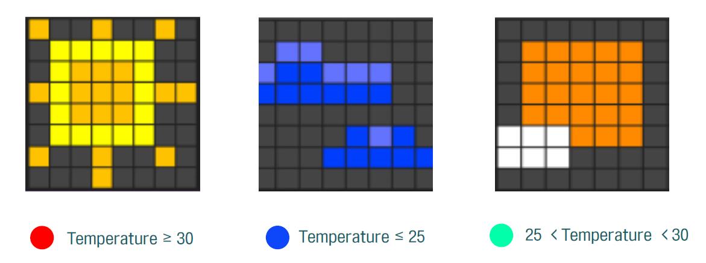

[← go back to the list](https://HandongHCI.github.io/HCI2018S)

# Internet of Things

#### Members
- Team A. 김하영, 최용규, 한선우
- Team B. 김은빈, 송다혜, 이지선


<br><br><br>
## 주제1. I-House


<br><br><br>
## 주제2. Ryamp
### 개발 배경
매일 아침, 사람들은 집 밖을 나가기 전에 일정이나 옷차림을 정하기 위해 날씨를 확인한다. 기술이 발전되면서, 현대사회 사람들은 창밖을 바라보거나 직접 밖에 나가지 않아도 TV의 날씨뉴스나 스마트폰 어플을 통해 일상에서 중요한 날씨 정보를 즉각적으로 알 수 있다. 이와 같이 전자기기에서 정적인 날씨정보를 얻고 있는 상황에서, IoT 기술을 이용해 사용자에게 기존과 달리 날씨정보를 좀 더 직관적이고 감성적으로 전달할 수 있을지 고민해보았다. 그 결과 LED Matrix와 Panel을 통해 날씨를 시각적으로 전달하는 ‘Weather Ryamp’를 (카카오 프렌즈 캐릭터 중 하나인 ‘라이언(Ryan)’과‘Lamp’의 합성어)를 제작하게 되었다.

### 개발 목표
일상생활에 중요한 영향을 미치는 날씨 정보를 기존의 날씨 정보 전달방식과 달리 시각적 상호작용을 통해 직관적이고 감성적으로 사용자에게 전달하는 것을 목표로 한다. 또한 리틀 빗(Little bits)과 아두이노(Arduino) 키트를 사용해 프로그래밍이 생소한 사람들도 IoT를 접할 수 있게 한다.

### 개발 내용

#### 개발과정


#### Temperature LED Matrix 
'Weather Ryamp'의 첫 번째 상호작용은 LED Matrix를 통한 온도 알리미이다. 이를 위해 사용된 하드웨어는 input인 리틀 빗 온도센서와 코드 빗(code bit)과 output인 LED Matrix(8x8)이고, 소프트웨어는 리틀 빗에서 지원하는 코드 키트 어플리케이션(code kit application)이다.


날씨의 중요 요소 중 하나인 온도를 효과적으로 표현하기 위해 일정 온도 범위에 따라 LED Matrix 위에 세가지 다른 온도 색상과 이미지를 반영한다.


App inventor와 유사한 code kit application의 code block을 살펴보면, 우선 온도를 input 변수 temp로 받는다. 그런 다음 if문을 통해 25도 이하, 25도 초과 30도 미만, 30도 이상을 판별하고, output으로 25도 이하일 때에는 비교적 서늘함을 나타내는 파란색에 구름 이미지, 25도 초과 30도 미만일 때는 보통을 나타내는 초록색과 구름 낀 해 이미지를, 30도 이상일 때는 뜨거움을 나타내는 빨간색과 해의 이미지를 출력한다.


#### Arduino
1. 온도와 비, 눈 외의 좀 더 다양한 날씨의 경우를 나타내었다. 온도와 습도는 마찬가지로 아날로그 신호로 받으며, 아날로그 신호의 설정 범위에 따라 ON-OFF의 아웃풋을 낸다. 두개의 디머를 활용하여 디머가 출력해내는 범위내에서 날씨에 맞는 구간을 설정하였다. 이때 리틀 빗의 디머와 아두이노를 호환하기 위해 리틀 빗인 프로토 빗을 사용했다. 이에 디머에 따라 각각 ‘맑음-미세먼지’와 ‘눈-비’를 출력한다. 우선, 미세먼지는 대체로 습도가 거의 없어 대기 중에 미세먼지가 많이 존재한다는 것이므로 습도와 상관없이 미세먼지 수치가 일정 이상(디머 44 이상)이 되면 미세먼지의 led가 켜진다. 디머 44 미만일 경우는 맑은 경우 혹은 일반적인 경우이므로 이 때에는 캐릭터에만 led가 켜진다. 하지만 이는 습도 데이터에 따라 결정된다. 습도 데이터를 입력해주는 또 다른 디머는 맑은 경우(혹은 일반적인 경우)에만 작용하게 되는데 이 습도 수치가 60 이상이면 비, 40 미만이면 눈을 나타난다. 40 이상 60 미만일 경우에는 습하지 않은 즉, 맑은 경우를 표현해준다.

```arduino
int dust = A0;
int moist = A5;
int dust_dim = 0;
int moist = 0;

void setup() {
	pinMode(dust, INPUT);
	pinMode(moist, INPUT);
	pinMode(7, OUTPUT); //미세먼지
	pinMode(8, OUTPUT); //맑음
	pinMode(2, OUTPUT); //눈
	pinMode(4, OUTPUT); //비
	Serial.begin(230400)
}

void loop() {
	dust_dim = analogRead(dust);
	moist_dim = analogRead(moist);
	dust_dim = map(dust_dim, 0, 999, 0, 99);
	moist_dim = map(moist_dim, 0, 999, 0, 99);
	digitalWrite(8, HIGH); //캐릭터 항상 on

	//미세먼지
	if(temperature >= 44){
		digitalWrite(7, HIGH);
		digitalWrite(2, LOW);
		digitalWrite(4, LOW);
		delay(500);
		digitalWrite(7, LOW);
	}
	//미세먼지없음
	else{
		digitalWrite(7, LOW);

		//비
		if(moist_dim >= 60){
			digitalWrite(2, HIGH);
			digitalWrite(4, LOW);
			delay(500);
			digitalWrite(2, LOW);
		}

		//눈
		else if(moist_dim < 40){
			digitalWrite(2, LOW);
			digitalWrite(4, HIGH);
			delay(500);
			digitalWrite(4, LOW);
		}

		//맑음
		else{
			digitalWrite(4, LOW);
			digitalWrite(2, LOW);
		}
		Serial.printIn(moist_dim);
	}
	delay(1000);
}
```

2. 필요 개념
- 저항


- LED에 따른 저항 계산
`필요 저항값 = (입력 전압 - LED 전압) / LED 전류`
사용한 LED의 전압은 3[V], 전류는 20[mA]이다. 아두이노의 입력 전압은 5V이므로 이를 넣어 계산한 필요 저항값은 100[Ω]이다. 전체 사용하는 LED의 밝기를 세게 하기 위하여 전압을 일정하도록 하기 위해 각 라인의 LED는 병렬로 연결한다.

3. Making Case
초기에는 3D 프린팅을 활용을 계획했으나 즉각적인 수정 보완이 어렵다는 한계로 인해 하드보드지를 이용하여 케이스 작업을 진행하였다. 최대한 빛에 영향을 덜 받기 위하여 검정색 하드보드지를 선택하였으며 제품에 사용된 하드보드지는 총 3장으로 아두이노 케이스, 디머 케이스, 전체 구성품 케이스, 아크릴 케이스로 나뉘어 작업하였다.
- Arduino Case: 서로 다른 빛을 쏘는 발광 다이오드가 서로에게 미치는 영향을 최소화하기 위하여 각 칸마다 칸막이를 설치하였다.


- Dimmer Case: 사용자의 직접적인 interaction이 이루어지는 부분으로 외부 전원 장치의 연결과 내부 구성품들을 고려하여 제작되었다.
- 전체 구성품 케이스: 내부에 담기는 구성품들은 아두이노, 빵판, LED 매트릭스, 전원장치, 코드 빗으로 각 크기와 케이블 길이를 고려하여 크기를 결정하였고 LED 매트릭스를 외부로 꺼내기 위하여 구멍을 뚫어 제작하였다.


- 아크릴 케이스: 총 4가지 색 변화에 맞는 아크릴 판넬을 발광 다이오드 위치를 고려하여 고정하였다. 최대한 빛이 잘 보이게 하기 위하여 발광 다이오드와 밀착되도록 하였으며 내부 구성품 중간 수정이 용이하도록 뚜껑 형식 대신 밀어 넣어 끼우는 형식으로 제작하였다.


- Laser Cutting: 총 네 종류의 아크릴 판넬을 구성하였다. 기본 값인 캐릭터는 항상 고정되어 있고 condition에 따라 발광 다이오드에 빛이 들어오면 그에 맞는 아이템이 캐릭터 위에 입혀지는 방식으로 작동한다. 아크릴 판넬은 시중에서 판매하는 1.3t를 사용하였고, 레이저 프린팅으로 작업하였다. 파워 값을 80으로 설정했던 초기에는 스크래치 된 부분이 진해, 아크릴 판넬에 불이 들어오지 않는 상태에서도 서로 겹쳐버리는 오류점이 있었기에 시행착오 끝에 가장 안정적으로 옅은 값(스피드 19, 파워 40)을 실험적으로 찾아내어 프린팅 작업을 하였다.


   
### 결론 및 한계 논의
1. 결론
사물인터넷(ioT)를 활용하여 여러 주어진 상황과의 상호작용을 확인하였다. 날씨에 관한 정보를 보다 시각적으로 파악할 수 있어 흥미와 정보 모두 제공해 주는 제품이다. 라이언 캐릭터에게 서로 다른 LED 불빛을 ON-OFF함으로써 마스크, 우산(비), 눈을 씌워 사용자로 하여금 바로 눈으로 볼 수 있으며, LED matrix로는 실제적인 온도와 구름의 정도를 확인할 수 있다.

 
2. 한계 논의
- 데이터 불러오기: 실제 기상청에서 정보를 불러오는 것에서 많은 어려움이 있었다. 아두이노를 통하여 정보를 불러오는 코딩 소스는 있었으나 오렌지 보드 등 추가적으로 필요한 부품을 구하기가 어려웠으며, 해당 데이터를 활용하기에는 능력이 부족하였다. 이에 우리는 먼저 데이터를 불러오는 것을 시도하기 보다 임의의 데이터를 우리가 조절하여 즉각적으로 확인할 수 있도록 하였다.
- 3D 프린팅과 레이저 프린팅: 3D 프린팅을 하기 위해서는 전체적인 계획과 도면이 필요하였는데 이 모든 것을 표현하기에 어려움이 있었다. 각 부품들이 맞춰질 수 있는 공간만이 아니라 두께, 크기 등 고려해야 할 것이 많았다. 이에 우리는 임시방편으로 하드보드지를 활용하여 제품 틀을 만들었다.
그리고 아크릴 보드에 우리의 그림을 레이저 프린팅으로 표현하고자 하였는데 교내의 기술로는 보일 듯 말 듯한 아주 연함을 표현하기가 어려워 안정적으로 프린팅 할 수 있는 가장 연한 정도로 프린팅하였다. 그렇지만 아쉽게도 진하기는 거의 변함이 없었다.
- 가지고 있는 센서의 종류와 코딩능력: 우리는 Little bits라는 직관적인 센서 부품들을 활용하여 프로젝트를 진행하였다. 하지만 소지하고 있는 것들 중에서는 부족함이 많아 매번 진행할 때마다 막힘이 있었다. 이로 인해 부품 주문만 여러 번 하게 되었다. Little bits와 아두이노를 함께 사용할 때에도 연결 문제, 부품 부족 문제 등으로 인해 많이 헤맸다. 또한, 아두이노를 익히는 데에도 시간이 걸렸다. 아두이노와 브레드보드, LED를 연결하는 과정 중에서 이해하고 활용하는 데에 시간이 필요하였다.


<br><br><br>
[← go back to the list](https://HandongHCI.github.io/HCI2018S)
