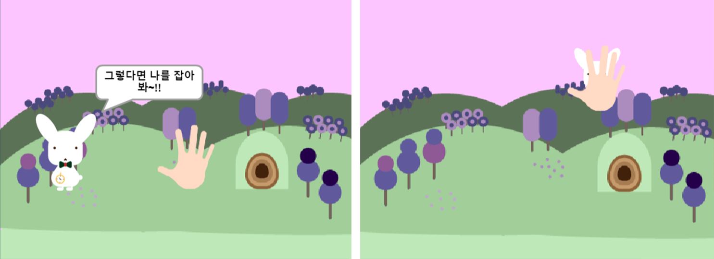
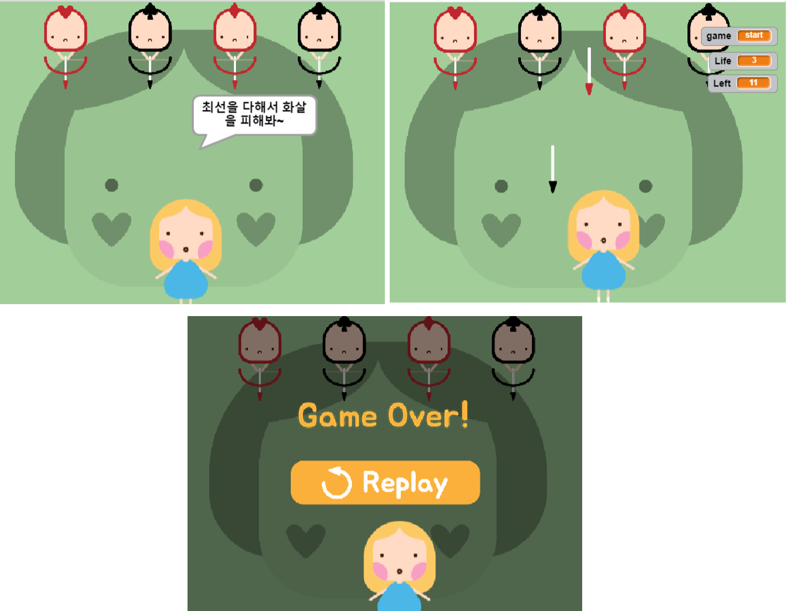

[← go back to the list](https://HandongHCI.github.io/HCI2018S)

# Interactive Media Art

#### Members
- 이재호, 박현주, 문주혜, 서충모, 여주은, 김동주, 정지민

#### Agenda
- ScratchX를 이용한 Kinect 애니메이션 제작
- 주제1. 동화 Visual Novel: 이상한 나라의 엘리스
- 주제2: 공익 광고 게임: 북한이탈주민 인남이의 상처되는 말 피하기
- 주제3: 영화 홍보 게임: 아이언맨

   
## ScratchX를 이용한 Kinect 애니메이션 제작

## 주제1. 동화 Visual Novel: 이상한 나라의 엘리스
### 아이디어 선정 과정
키넥트를 가장 신기하고 흥미롭게 사용할 수 있을 대상은 어린이라고 생각하였다. 어린이 교육을 위해 동화를 실제로 체험할 수 있는 시나리오를 설정하였다. 동화 중에서 가장 신비롭다고 할 수 있는 “이상한 나라의 앨리스”를 주제로 3단계의 게임을 제작하였다

###실행방안
- 시작 화면: 앨리스가 이상한 나라의 문을 여는 장면을 통해 사용자가 본인이 동화 속의 앨리스가 되었다는 것을 인식할 수 있도록 하였다.
	1. 사용자의 손의 위치가 인식
	2. 열쇠 이미지에 사용자의 손이 닿으면 열쇠가 손의 위치를 따라가게 설정
	3. 열쇠가 넣어질 공간의 x,y 좌표가 열쇠의 좌표와 같아지면 성공을 알리는 효과음과 함께 다음 장면으로 넘어간다.

- 1단계 게임: 동화 속에서 앨리스가 토끼를 만나는 장면을 빠르게 움직이는 동화 속의 토끼를 사용자가 손으로 잡는 것으로 설정하였다.
	1. npc 토끼: 진행될 게임의 방식을 설명한다
	2. 토끼의 x,y 좌표를 0.6 초 간격으로 화면 이미지에 맞게 랜덤으로 설정한다
	3. 토끼가 움직일 때 마다 게임적인 흥미 요소를 추가시키기 위해 효과음을 추가
	4. 토끼의 이미지에 사용자의 손이 닿으면 토끼 이미지가 멈추고 게임 성공을 알리며 다음 화면으로 전환

- 2단계 게임: 동화 속 엉망진창 다과회 장면을 모티브로 하여 제시되는 음계와 똑같이 사용자가 손으로 컵 이미지를 터치하여 연주하면 게임에 성공하도록 설정하였다.
	1. npc 모자장수: 게임 진행 방식을 설명
	2. 사용자가 동일하게 연주할 음악 과제 들려줌
	3. 모자장수가 음악이 끝났음을 알리고 사용자의 게임 시작을 유도
	4. 사용자의 손이 각 각 컵 이미지에 닿을 때마다 지정된 음계가 들림
	5. 음계가 맞으면 옆 Music List에 음계가 표시되고, 틀리면 모자장수로 하여금 틀린 음계라는 것을 말해주고 사용자의 재시도를 유도
	6. 모든 음계가 맞을 시 모자장수는 게임 성공을 알리며 다음 장면으로 전환

- 3단계 게임: 붉은 여왕과 병사들이 쏘는 화살을 앨리스가 완벽히 피하면 최종적으로 게임에 승리하도록 설정하였다.
	1. npc 붉은 여왕: 붉은 여왕이 게임의 마지막 단계임을 알리며 게임 방식 설명
	2. 화살이미지가 랜덤의 위치에서 glide 된다
	3. 화살은 총 20개가 떨어지며 사용자(앨리스)에게는 3번의 기회가 주어진다
	4. 앨리스 이미지 위치는 사용자의 움직임에 따라 달라지며 화살이미지가 앨리스 이미지에 닿았을 경우 기회를 표시하는 Life가 1씩 감소된다
	5. 화살 20개를 다 피하기 전에 3번의 기회를 모두 써버리면 게임의 재시도를 위한 창이 표시
	6. 사용자의 손 이미지를 통해 replay 버튼을 누르게 되면 게임은 재시작된다
	7. 화살 20개를 피하게 되면 효과음과 함께 붉은 여왕이 게임의 성공을 알리며 엔딩 장면으로 전환된다

- 모든 게임에 성공하였을 때 앨리스가 꿈에서 깨는 장면을 통해 엔딩을 보여준다.

## 주제2: 공익 광고 게임: 북한이탈주민 인남이의 상처되는 말 피하기

## 주제3: 영화 홍보 게임: 아이언맨

### Source Code
- download from <a href="https://github.com/HandongHCI/HandongHCI.github.io/tree/master/HCI2018S/MediaArt/download" target="_blank">here</a>

   
[← go back to the list](https://HandongHCI.github.io/HCI2018S)
