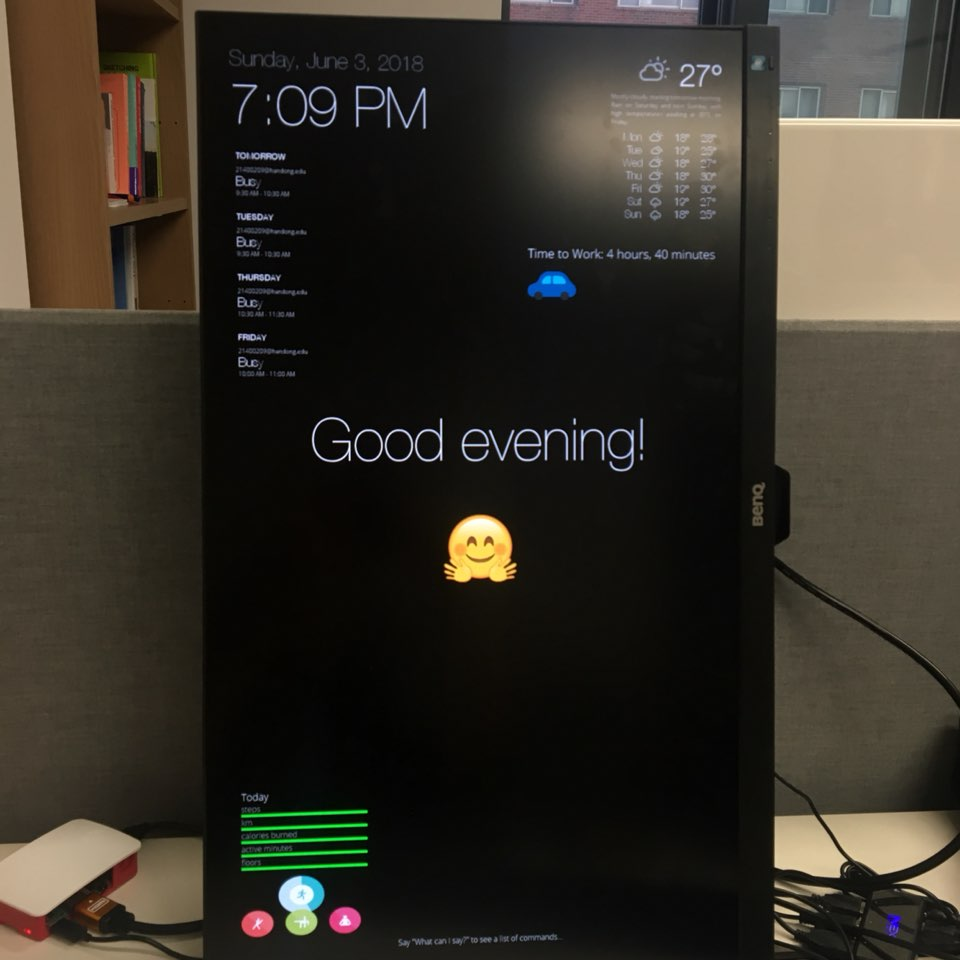

[← go back to the list](https://HandongHCI.github.io/HCI2018S)

# Smart Mirror

Introduction Video<br>
[](https://www.youtube.com/watch?v=XpDLMKQtfx4 "Smart Mirror")


#### Members
- 박종욱, 이상규, 김진이, 노진기, 한진영, M. Janet Mwanjiwa

#### Agenda
- Smart Mirror 제작 준비
- Smart Mirror 설치 및 설정
- Smart Mirror 서비스 연결
- Smart Mirror UI 디자인 및 frame 제작


<br><br><br>
## Preparation
### 부품 목록
- Raspberry Pi 3
- Monitor (밝을수록 좋음)
- 스피커 (또는 스피커가 내장된 모니터에 HDMI로 연결)
- Raspberry와 호환되는 USB microphone (예: <a href="http://lkqf.asdf.comtong.co.kr/product/detail.html?product_no=1652585" target="_blank">http://lkqf.asdf.comtong.co.kr/product/detail.html?product_no=1652585</a>)
- 유전원 USB 허브 (예: <a href="http://item.gmarket.co.kr/Item?goodscode=205565531" target="_blank">http://item.gmarket.co.kr/Item?goodscode=205565531</a>)
- Philips HUE
- Fitbit smart band
- USB keyboard and mouse
- Wooden frame, glass, two-way mirror film

### Raspbian 설치 및 기본 설정
- <a href="https://handonghci.github.io/Tutorials/Raspbian.html" target="_blank">https://handonghci.github.io/Tutorials/Raspbian.html</a> 참고
- Raspbian에 Smart Mirror 외에 다른 것은 설치하지 않는 것이 좋다. 특히 음성인식 관련하여 sound 관련 설정이 다른 프로그램(예: Magic Mirror)과 충돌날 가능성이 있다.


### Smart Mirror 설치 (참고: <a href="https://docs.smart-mirror.io/docs/installing_raspbian.html" target="_blank">docs.smart-mirror.io</a>)
1. 우선 node.js가 설치되어 있어야 한다.

2. Raspbian에서 root folder에 Evan Cohen의 Smart Mirror를 복사한다. Root에 smart-mirror라는 이름의 폴더가 생성된다.
```
cd ~
git clone https://github.com/evancohen/smart-mirror.git
```

3. 음성인식을 위해 sox와 libatlas-base-dev을 설치한다.
```
sudo apt-get install sox libatlas-base-dev
```

4. Smart Mirror에 필요한 javascript package들을 자동 설치한다. `npm install`을 통해 package.json에 적시된 필수 package들이 설치된다. 설치되는 package들 중에 electron이라는 것이 있는데, web browser가 아닌 환경에서 javascript, html, css를 구동시켜주기 위해 필요하다. Smart Mirror는 electron 상에서 구동되는 javascript application이다.
```
cd ~/smart-mirror
npm install
```

5. Smart Mirror의 핵심 기능은 Google의 Speech API를 이용하여 음성 명령을 통해 Smart Mirror의 기능을 제어하는 것이다. Google Cloud Speech API를 설정하기 위해 다음 단계를 시행한다.
	1. <a href="https://console.cloud.google.com/project" target="_blank">Google Cloud Platform의 Projects</a> 사이트에 접속한다.
	2. 프로젝트를 하나 만든다.
	3. 생성한 프로젝트에 결제 방식을 연결한다. <a href="https://console.cloud.google.com/" target="_blank">Google Cloud Platform</a>에서 `Billing` menu를 선택하고 Billing Account(본인의 google account. 신용카드가 연결되어 있어야 됨)를 등록한다. Google Cloud Speech API는 처음 시작한지 1년 동안 거의 무료로 사용할 수 있다. 거의 무료라 함은, 구글이 300달러의 point를 제공하고 여기에서 Speech API 이용료를 차감하기 때문에 실제 돈이 들지 않는다. (프로젝트에 결제 방식을 연결하는 방법은 <a href="https://cloud.google.com/billing/docs/how-to/modify-project" target="_blank">여기 참조 (영문)</a>
	4. Google Cloud Platform에서 `APIs & Services`에서 프로젝트 하에 Cloud Speech API를 시작한다. 
	5. `APIs & Services` >`Credentials` 메뉴에서 `Service account key`를 생성하고 JSON 파일을 다운받는다. 다운받은 JSON 파일의 이름을 keyfile.json으로 하고 이를 Raspberry Pi의 smart-mirror 폴더 안에 넣는다.


6. 기타 Raspberry Pi 환경 설정

	아래 환경설정 부분은 Smart Mirror의 설치 및 설정 파일에 포함되어 있지 않고 Raspbian에서 수정하는 부분이다.

	1. 마이크 설정
	- `sudo vim /usr/share/alsa/alsa.conf`로 설정 파일을 열고 68번째 줄 정도에 있는 아래 부분을
	```
	defaults.ctl.card 0
	defaults.pcm.card 0
	```
	- 아래와 같이 변경한다. Sound 관련 다른 설정은 바꾸지 않는다.
	```
	defaults.ctl.card 1
	defaults.pcm.card 1
	```


	2. 화면을 세로로 회전
	- `sudo vim /boot/config.txt`로 설정 파일을 열고 가장 아래쪽에 한 줄 추가한다.
	```
	display_rotate=1
	```


	3. 화면보호기/화면자동꺼짐 중지
	- `sudo vim /etc/X11/xinit/xinitrc`로 파일을 열고 9번째 줄 정도에 있는 `. /etc/X11/Xsession` 아래로 3줄 추가한다.
	```
	xset s off
	xset -dpms
	xset s noblank
	```
	- 그리고 나서 `sudo vim /etc/xdg/lxsession/LXDE/autostart`로 autostart 파일을 열고 가장 아래에 다음의 세 줄을 추가한다.
	```
	@xset s off
	@xset -dpms
	@xset s noblank
	```


	4. 마우스 숨김
	- Unclutter를 설치하고 autostart 파일을 열어 
	```
	sudo apt-get install unclutter
	sudo vim /etc/xdg/lxsession/LXDE/autostart
	```
	- 가장 아래에 한 줄을 추가한다.
	```
	@unclutter -idle 0.1 -root
	```

7. Smart Mirror 환경 설정

	Smart Mirror를 처음 실행하기 위해 Raspberry Pi의 smart-mirror 폴더 내에서 `npm start`를 실행한다. 그러면 화면에 아래와 같은 문구가 뜨는데, 같은 wifi network 상의 다른 PC에서 web browser에 `http://192.168.1.130:8080`를 입력함으로써 Smart Mirror에 접속한다. (IP 주소는 다른 것이 될 수 있다.) 접속하여 Smart Mirror의 환경을 설정한다.
	```
	Remote listening on http://192.168.1.130:8080
	```

	처음 환경을 설정하고 나면 smart-mirror 폴더 내에 `config.json` 파일이 생성되는데, 추후 설정을 위해 다른 PC에서 접속하지 않고 이 파일의 내용을 수정해도 된다.
	1. iCal을 활용한 calendar 추가: iCal은 google 캘린더, 네이버 캘린더 등 다양한 종류의 캘린더를 연동 시켜서 하나로 쓸 수 있도록 한다. 가령, 본인 Google Calendar의 설정에서 iCal 공개 주소를 얻을 수 있는데, 이것을 `config.json` 내에 붙여넣으면 된다.
	1. 날씨: 위도와 경도를 수동으로 입력한다. 참고: <a href="https://blog.naver.com/dlwjddns5/220795587772" target="_blank">사이트1</a>, <a href="http://bluexmas.tistory.com/573?category=627648" target="_blank">사이트2</a>
	1. YouTube: <a href="https://console.cloud.google.com/" target="_blank">Google Cloud Platform</a>의 API & Services > API Library에서 __YouTube Data API v3__를 활성화(enable)한다. 그리고나서 Credentials에서 API Key를 만들면서 해당 API에 YouTube Data API v3를 할당한다(API Restrctions 메뉴에서 YouTube Data API v3를 선택). 이렇게 생성된 API Key를 `config.json`에 입력한다.
	1. Fitbit: <a href="https://fitbit.com/" target="_blank">Fitbit</a>에 가입한 후, <a href="https://studio.fitbit.com/" target="_blank">Fitbit Studio</a>에 접속하여 개발자 계정을 활성화하고 프로젝트를 생성한다. OAuth 2.0 Client ID와 Client Secret을 생성하여 `config.json`에 넣어준다. 그리고나서 스마트폰에 Fitbit app을 깔고 본인 ID로 로그인한 후, Fitbit 기기와 스마트폰을 연동하여주면 된다. Fitbit 기기로부터 스마트폰 app을 통해 Fitbit 서버로 데이터가 동기화되고, 그 업데이트된 내용이 Smart Mirror에 동기화된다. 약간이 시간차가 발생할 수 있다.
	1. Philips HUE: HUE hub를 Smart Mirror와 같은 wifi network에 연결하고 HUE의 IP주소를 알아내어 기록해둔다. 자세한 설정 방법은 추후 update하기 전까지 일단 <a href="https://www.developers.meethue.com/documentation/getting-started" target="_blank">HUE 개발자 사이트</a>를 참고한다.
	1. 기타 환경 설정은 <a href="https://docs.smart-mirror.io/docs/configure_the_mirror.html" target="_">Evan Cohen의 document</a>를 참고한다.

8. UI 수정하기
`main.css` 파일에서 글자 종류, 글자 크기, 요소들의 크기와 레이아웃, 색상 등 다양한 것들을 조절할 수 있다. Smart Mirror에 몇 가지 아이콘을 넣었다.


### Smart Mirror 외형 frame 제작
- 모니터를 들고 인근 목공소에 가서 frame을 맞추고, frame을 들고 유리 상사에 가서 유리를 맞추었다. Frame 제작시 여유분을 계산하지 않고 모니터 크기에 딱 맞춰 제작하였더니 모니터가 프레임에 너무 빡빡하게 들어맞아서 일부 갈아내기도 하였다.
- 그리고 two-way mirror film을 부착하였다. ([부착 방법 참조](https://www.youtube.com/watch?v=2kLI9h-Zydo))


### Demonstration 
[](https://www.youtube.com/watch?v=tmxpc1bJFaQ "Smart Mirror Demo")

### Source Code
- <a href="https://handonghci.github.io/HCI2018S/SmartMirror/SmartMirror-code.zip" target="_blank">Our Smart Mirror source code</a>
- <a href="https://github.com/evancohen/smart-mirror" target="_blank">Evan Cohen's Smart Mirror project</a>
- From our project, the necessary files, `keyfile.json` and `config.json`, were deleted because it contains personal API keys.

### Acknowledgement
- This project was based on <a href="https://github.com/evancohen/smart-mirror" target="_blank">Evan Cohen's Smart Mirror project</a>.
- See details about this project from <a href="http://docs.smart-mirror.io" target="_blank">Evan's documentation</a>. Because the documents were written in 2016, some information are outdated.


<br><br><br>
## Further Issues
- 초음파센서를 이용하여 거울 가까이 가면 화면이 켜지도록 함
- 얼굴인식 센서 추가
- 기타 서비스 추가


<br><br><br>
[← go back to the list](https://HandongHCI.github.io/HCI2018S)