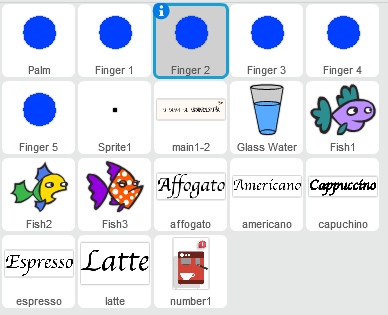
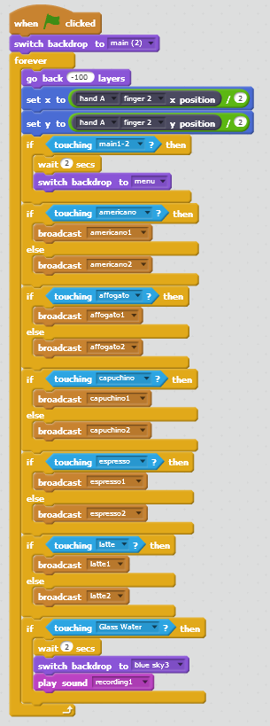

[← go back to the list](https://HandongHCI.github.io/StudentProjects/HCI2019S)

# 바리스타 교육용 립모션 게임

#### members
- 한준모, 박진규, 정여능, 박기쁨

## Backgrounds & Objectives
기존의 바리스타 교육에서 메뉴 암기와 관련된 교육은 약 9회로, 단순히 반복적인 과정을 통한 암기로 구성되어 있습니다. 이런 교육 과정이 지적 장애인들에게 그대로 적용되어 있어 비효율적이라는 생각이 들었습니다. 이런 부분을 개선하고자 보다 효과적인 교육 방식에 대해서 알아보았고, 립모션을 통해서 새로운 방식의 교육 프로그램을 만들게 되었습니다.

립모션을 통해서 기존의 지적 장애인들을 위한 교육 과정을  개선하고 보다 그들을 위한 보다 효율적인 교육 프로그램을 만드는 것을 목적으로 하고 있습니다.

## 세부사항
전체 화면 구성은 (1) 첫 화면, (2) 메뉴 화면, (3) 카페 기본 화면, (4) 카페 1단계(샷 내리기), (5) 카페 2단계(물 넣기), (6) 카페 3단계, (7) 완성으로 이루어져 있다.

### 1. 전체 Sprites 구성
손가락을 나타내는 다섯 개의 Finger과 손바닥을 나타내는 Palm, 그리고 손가락과 손바닥을 이어주는 Sprite 1이 있다. 이외에는 이 프로그램을 만들기 위한 Sprites로서, 전체의 약 35%만 들어가 있다. 보통 스크래치에서 "이 물체를 마우스로 클릭했을 때"의 명령을, 이 프로그램에서는 "Finger 2가 사물에 2초 이상 머무를 때"로 명령한다.

### 2. 배경 구성
배경은 첫 화면인 main(2)과, 메뉴 화면인 menu, 카페 기본 배경화면인 cafe1이 있다. 앞으로 4개의 backdrops가 추가될 예정이다.

### 3. 메뉴화면
메뉴 화면을 2초 이상 터치하고 있을 때, 다음 화면으로 넘어가는 형식이다. 메뉴 화면에서 아메리카노, 아포가토, 카푸치노, 에스프레소, 라떼의 글자를 터치할 경우 진한 글자로 바뀌게 되며, 그 소스코드를 부르기 위해 각각의 메시지를 broadcast한다.

### 4. 기본 화면에서 메뉴 화면으로 넘어갈 때
Sprite를 2초 이상 터치하면 menu 화면으로 넘어가게 된다. 이때, menu 화면으로 넘어가게 되면 이 sprite는 사라진다.

### 5. 메뉴 화면에서 글자를 클릭할 경우 진한 색상으로 바뀌기
Affogato, capuccino, espresso, latte의 경우, 처음에는 보이지 않았다가 메뉴 배경으로 넘어가면 나타나고, cafe1 배경으로 넘어가면 다시 사라지도록 했다. 각각의 글자를 터치하면 각각의 메시지를 broadcast하고, 이는 해당 sprite에서 받는다. 예를 들어, affogate 글자를 터치할 경우, affogato1이라는 메시지를 broadcast하고, affogato sprite에서 이 메세지를 받아, 굵은 글씨인 affogato2로 코스튬을 바꾼다. 그리고, affogato 글자를 터치하지 않을 경우, affogato2라는 메시지를 broadcast하고, affogato sprite에서 이 메시지를 받아, 얇은 글씨인 affogato로 코스튬을 바꾼다.

### 6. 메뉴에서 음료를 선택하면, 그 다음 화면으로 넘어가기
가령, 아메리카노를 선택하면 그 제조 방법을 사용자가 직접 경험하도록 한다. 음료를 2초 이상 터치할 경우 해당 음료를 만드는 화면으로 넘어간다.

## 소스코드

## 진행 절차
- 3주차: 사용자를 지적 장애인으로 지정하고 Leap motion을 활용하기로 결정
- 4주차: 지적 장애인들을 위한 카페 레시피 암기 프로그램을 만들기로 목적 설정
- 5주차: User research 시행. 히즈빈스 전직 직원 분 인터뷰를 통해 지적 장애인의 특성과 레시피 교육 방법에 대한 조사 진행. 추가적으로 개별적으로 사용자 조사와 현재 지적 장애인을 채용하고 있는 카페에 대한 조사.
- 6주차: 페이퍼 프로타입 제작. 팀 구성원들과 함께 단계 별 구현 방법을 대략적으로 의논하여 전체적인 틀을 짜고 초반 시작 화면부터 메뉴 구성, 전체 화면 drawing.
- 7주차: 전체 화면부터 커피 제조 단계에서 선택지를 고르는 화면 그리고 이후 재료의 조합 단계까지 프로토타입 작성. 이를 기반으로 중간 발표 준비
- 9주차: Scratch 구현 시작. 이를 위해 일러스트 이미지를 만들기 시작하고 프로그램 구현 코딩을 위해 임의의 대상에 여러 가지를 시도하며 스크레치 코딩 학습.
- 10주차: 전체 프로그래밍 코드를 3 파트로 나눠 각 부분을 분담. 디자인 작업 수행. 
- 11주차: 코딩 고도화
- 12주차: 마무리 및 사용자 조사 진행. 최종 발표 준비.

   
[← go back to the list](https://HandongHCI.github.io/StudentProjects/HCI2019S)