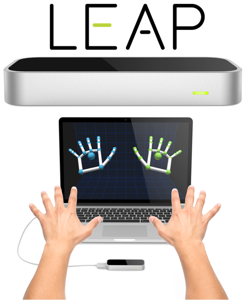
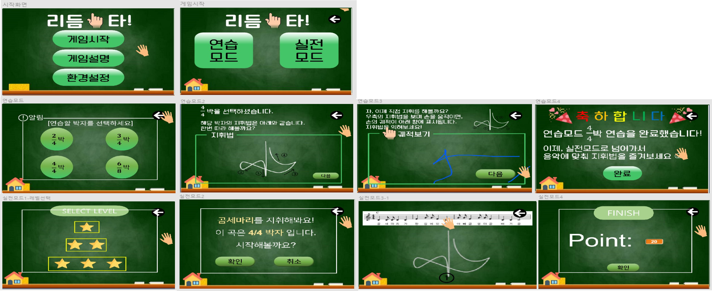
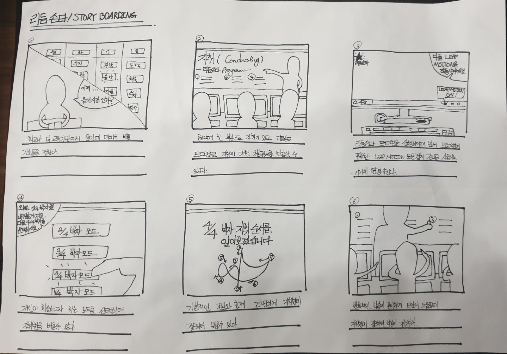
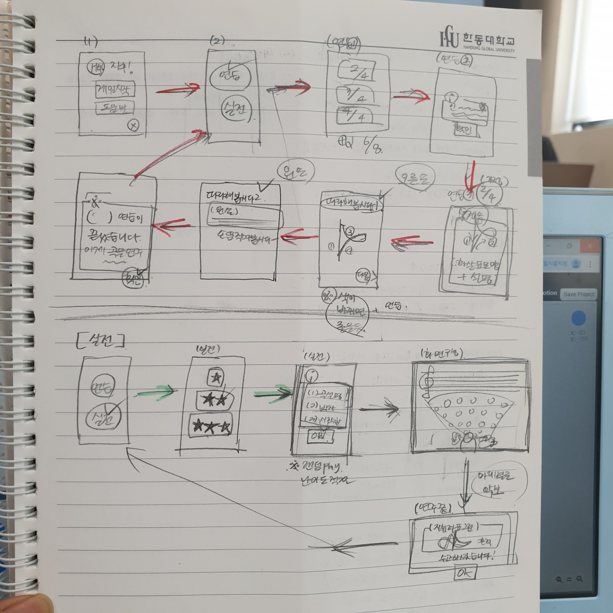
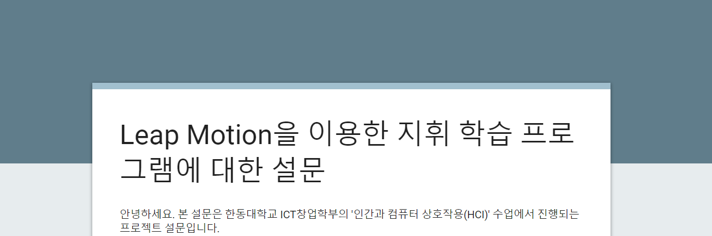

[← go back to the list](https://HandongHCI.github.io/StudentProjects/HCI2019S)

# 리듬손타
### LeapMotion을 활용한 지휘 프로그램

#### Members
- 김태운, 유재은, 나누리

## 01. Purposes / Expectation
리듬손타 프로그램은 교육용 프로그램으로서, 음악을 학습하는 학습자를 대상으로 지휘법을 배우고, 직접 실습할 수 있도록 하는 프로그램이다. 사용자는 이로 하여금 지휘법을 익히고 음악적 이해도를 높이는 데 그 의의가 있다. 기존과는 다른 색다른 학습법의 도입으로, 쉽고 재미있게 지휘법을 익힐 수 있을것이다. 또한, 그에 따라 음악을 좀 더 풍부하게 이해할 수 있을 것이라 생각된다.

## 02. Photos & videos

## 03. 화면 설명
1. 시작 화면: 프로그램 로고와 함께 '게임시작','게임설명', 그리고 '환경설정'을 선택할 수 있다.
2. 게인시작: '연습모드'와 '실전모드'를 선택할 수 있고 홈 버튼으로 시작화면으로, 뒤로가기 버튼으로 이전 페이지로 돌아갈 수 있다. 
3. 연습모드: 연습할 수 있는 4가지 박자(2/4박, 3/4박, 4/4박, 6/8박)를 선택하여 연습모드를 진행할 수 있다. 
4. 연습모드1: 선택한 박자에 따라서 해당 지휘법과 지휘 방법을 보고 학습할 수 있다.다음 버튼을 누를 경우 연습모드 2으로 넘아가게 된다. 
5. 연습모드2: 선택한 박자의 지휘법을 실제로 연습할 수 있고 사용자가 움직이는 손 궤적에 따라 선을 만들어 사용자가 확인할 수 있다. 
             반복적인 연습을 통해 지휘궤적이 겹쳐 식별이 어려울 경우를 대비하여 시간이 경과함에 따라 궤적의 색에 변화를 주었다.
             다음 버튼을 누를 경우 연습모드 3으로 넘아가게 된다. 
6. 연습모드3: 연습에 대한 축하와 이후 진행할 수 있는 방향성을 제시한다. 완료 버튼을 누를 경우 시작화면으로 돌아가게 된다. 
7. 실전모드: 총 3가지 난이도 중 하나를 선택하여 지휘법을 연습할 수 있다. 
8. 실전모드1: 선택한 난이도에 따라 해당하는 노래와 박자를 미리 알려준다. 확인 버튼을 누를 경우 실전모드2로, 취소 버튼을 누를 경우
             이전 화면으로 넘어가게 된다. 
9. 실전모드2: 선택한 난이도에 해당하는 노래가 플레이되고 노래에 맞는 악보가 나온다. 해당하는 지휘법에 따라 터치해야하는 포인트가 
             나오게 되고 사용자의 손 궤적에 따라 그 포인트를 지나게 될 경우 다음 포인트가 나오고 사용자의 점수가 올라간다. 노래가
             종료될 경우 실전모드 3으로 넘어가게 된다. 
10. 실전모드3: 최종적으로 사용자가 획든한 점수와 노래에서 획득가능한 점수를 비교하여 100점 만점으로 점수를 보여준다. 완료 버튼을 누를 경우
              시작화면으로 돌아가게 된다. 

## 04. 프로젝트 진행 과정
- week2 ~ week3: idea development
- week4 ~ week5: storyboard 제작 및 프로그램 화면구성정리

- week5 ~ 6: concept testing - 구글폼으로 설문진행 (응답자: 46명)

  

- week7: low-fidelity prototype -figma
  - 악보 이미지 및 아이콘 다운로드
  - 피그마를 활용하여 tool-based prototyping 진행

	

- week8: Mid-term presentation

	
    
- week12 ~ week13: prototype testing & Final PT

	<image width="50%" src = "https://user-images.githubusercontent.com/48409392/58369059-37a18200-7f30-11e9-9449-e8655d8bdc51.png"> <image width = "45%" src="https://user-images.githubusercontent.com/48409392/58367694-2733dc00-7f1d-11e9-8cbb-647fb60b64c1.png">

## 구현방법: Leap Motion ver. 2.3.1 과 ScratchX를 활용하여 제작

### 구동환경 구현

* [Downloads of Leap-Motion](https://www.leapmotion.com/setup/desktop) 
	
  (해당 페이지에서 Windows, Mac, Linux 등 버전에 맞게 다운로드 가능)

* [ScratchX](http://scratchx.org/?url=http://khanning.github.io/scratch-leapmotion-extension/examples/Leap%20Motion%20Example%20-%20Hand%20Skeleton.sbx#scratch, "ScratchX")

### 구현원리

  * Leap Motion Controller는 컴퓨터와 USB를 활용, 연결시켜 사용하는 기기이다.
  
  * 기기에 내장과 LED와 카메라 센서를 통해 움직임을 인식하여 화면으로 반영한다. 기기에서 8-cubic feet (2x2x2) 정도 떨어진 공간을 개략적으로 스캔하며, Leap Motion 기기는 양 손과, 10개 손가락을 모두 추적할 수 있다.
    
  * Interaction 예)
    - 손을 움직임이 그대로 반영되어, 움직임에 따라 자신이 움직인 궤적이 나타나도록 함.
    - 손의 움직임으로 마우스의 기능을 대체할 수 있도록 함. (2초 이상 머물면 다음 화면 전환)
    - 움직임을 점수화하여, 시각적으로 나타내도록 함.
    
    
### 장점

 - 학습자가 직접 참여해 손과 팔을 직접 움직이며 실제 지휘법을 익힐 수 있음
 - ScratchX를 활용하면 비교적 손쉽게 창의적인 컨텐츠 제작가능
 - 다양한 컨텐츠의 프로토타이핑 및 그래픽 등의 상시 검토 가능
 - 학습 참여도 향상의 효과를 기대할 수 있음

 

### 한계점

 - 화면 크기, 해상도, 세부 동작 등의 구현에 있어 기술적 제약 존재
 - 사용자의 편리를 고려한 인터페이스 구현
 - 평가 기준의 다양성 제고.
 - 구현 환경 마련이 미비한 경우, 작동 불가  
   (기기, 케이블, 소프트웨어 등이 구비되어야 함) 

### Source Code
download from [here](https://github.com/wodms95/HCI-Group3-RhythmSonTa/tree/master/HCI_Rythm%20SonTA_Source%20Code) 

## 결론
기존에 립모션을 경험해보지 않은 사람들도 쉽고 재미있게 프로그램을 즐기는 것을 확인하였다. 컨셉 테스팅과 프로토타입 테스팅을 통해 받은 피드백을 바탕으로 프로그램을 수정하고 발전시킨다면 앞으로 지휘를 배우고 싶어하는 개인 혹은 초등교육에 의해 프로그램이 사용되어질 수 있을 것이라고 기대한다.

## References
  [1] 곰세마리 음악: http://bit.ly/2EwKYgm
  
  [2] 곰세마리 악보: http://bit.ly/2K1xMDK
  
  [3] 스크래치 이미지: https://www.flaticon.com/

   
[← go back to the list](https://HandongHCI.github.io/StudentProjects/HCI2019S)