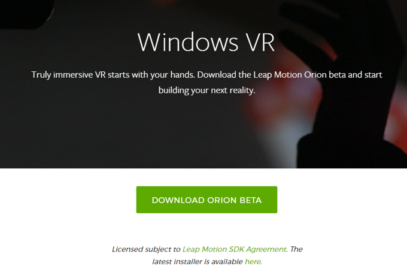
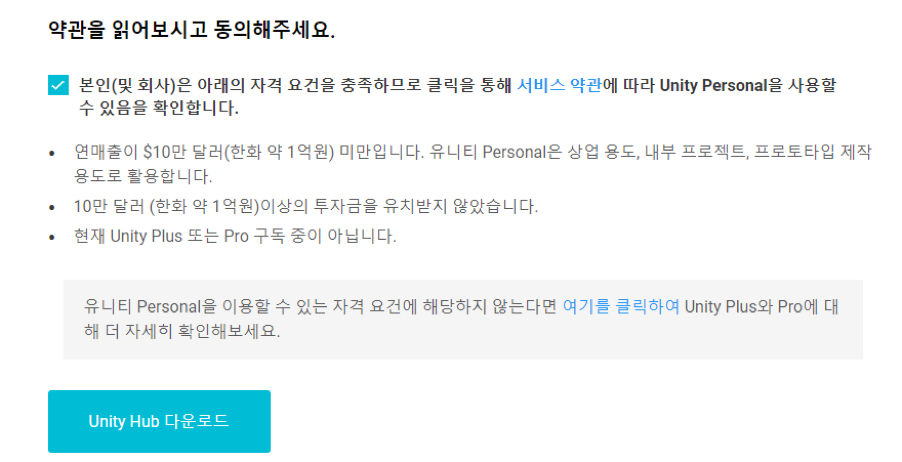
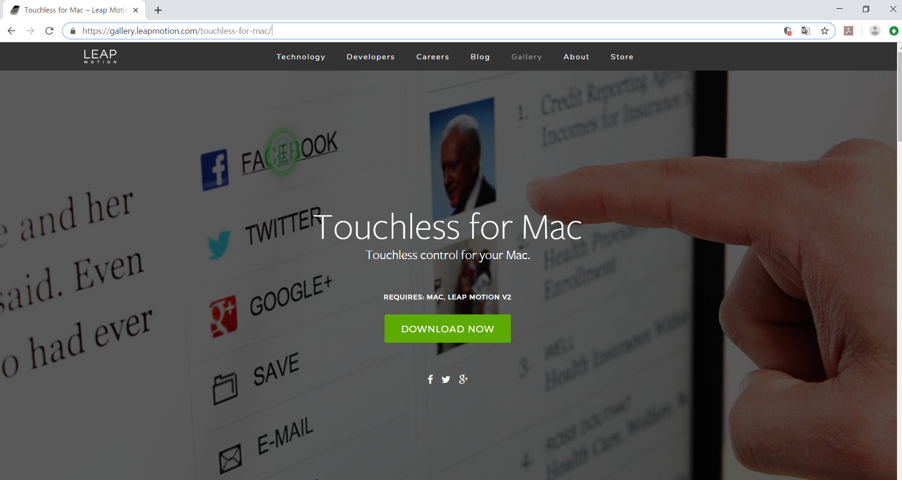
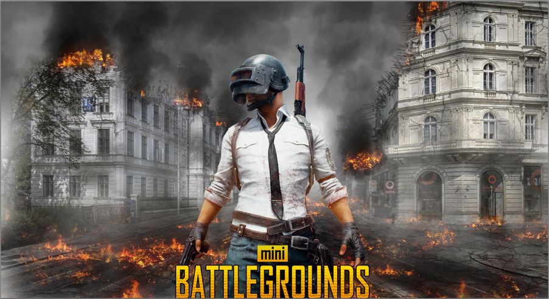

[← go back to the list](https://HandongHCI.github.io/HCI2018S)

# War Game Team

####  프로젝트명 및 멤버
- Mini Battle in Handong
- 김평강, 신지현, 전예은, 최은송, 홍혜성
  

##  1. 프로젝트 진행에 필요한 설치

1)	Leap motion
    - Leap motion setup을 pc에 다운로드 한다. 
    
    - 아래 파일들을 다운로드한다. 
    
    

2)	Unity
    - Personal 선택
    
    - 약관 동의 후 Unity Hub 다운로드를 클릭한다. 로그인 후 사용할 수 있다.
    

3)	Touchless For Mac
    - Touchless for Mac을 pc에 다운로드 한다. [Download_link](https://gallery.leapmotion.com/touchless-for-mac/) 
    
    - 실행하면 아래와 같은 화면이 뜬다.
    

4)	GameWave
    - Gamewave를 pc에 다운로드 한다. [Download_link](http://uwyn.com/gamewave/)
    

##  2. Research
Battle ground in handing 게임은 FPS 게임에 익숙하지 않은 사람들이 게임을 직관적으로 이해하고 쉽게 접근 할 수 있고, 기존에 사용자들 또한 게임을 흥미로운 관점으로 접근 할 수 있도록 돕는 것을 목표로 하였다. 따라서 사용자들의 게임 이해도, 게임 시간, 게임 흥미에 대한 정보를 수집하고자 하였다. 다음 단계는, Unity 와 leap-motion간의 상관관계를 이해하고 연동할 수 있는 연결점을 찾는 것을 조사의 목적으로 하였다. 실제로 게임에 등장하는 asset 을 구현하기 위해서는 Unity asset score, google 사이트를 참조하여 게임에 활용할 수 있는 정보와 자원들을 적극 수집하였다.

1) 용도
Battle ground in handing 는 기존의 FPS게임과의 방법과 달리 사용자가 직관적으로 게임을 이해하여 흥미로운 방법으로 게임을 즐길 수 있도록 한다.

2) 목표
Leap motion 기술과 unity engine을 활용하여 사람의 손을 인식하고 총을 쏘는 상황을 직관적으로 이해할 수 있도록 프로그램을 구현하여 게임을 할 수 있도록 한다.

3) 대상
FPS게임을 쉽게 즐기지 못하는 사람을 주로 대상으로 하며, 기존에 FPS게임을 하고 있는 사람을 대상으로도 새로운 게임 환경을 제공하여 그 발전 가능성을 확인하도록 한다.

##  3. 게임 첫 화면

##  4. Source Code
[click](SourceCode)

##  5. 구동방식
우리 팀은 동일한 게임에 대해 두 가지 방법의 interaction을 구현하고자 한다. 두 가지 방법을 구현한 후 그 둘을 비교할 것이다. 첫 번째는 기존의 FPS게임방식과 유사하게 마우스와 키보드를 활용한 interaction이다.  마우스의 이동에 따라 시점이 움직이게 한다. 정전은 자동으로 되며(총 1500발, 30발씩 장전됨), 사람이 이동하는 것은 키보드 방향키로 조작한다. 두 번째는 leap motion device을 활용한 interaction이다. 손가락 모션을 이용하여 총알을 발사하고, 다른 한쪽 손의 손바닥을 움직여 시점과 움직임을 조절한다. 이러한 leap motion을 이용한 interaction을 구현하기 위해 GameWAVE와 Touchless For Mac 툴을 이용하였다.

GameWAVE는 마우스와 키보드를 통한 interaction을 leap motion device을 통한 interaction으로 변환하여 주는 툴이다. 위의 사진과 같이 개발자가 직접 마우스와 키보드의 속도, 방향, 클릭 등을 원하는 손동작과 대응시킬 수 있으며, 이를 통해 다양한 interaction 조작이 가능하다. 아래의 링크는 GameWAVE tutorial영상이다. 이를 활용하여 게임 안에서 player의 move를 컨트롤하였다.

<iframe src="https://www.youtube.com/embed/bsQK3ab3YhQ" frameborder="0" allow="autoplay; encrypted-media" allowfullscreen style="position: absolute; top: 0; left: 0; width: 100%; height: 100%;"></iframe>

    
Touchless For Mac는 립모션으로 mouse를 control하기 위한 툴이며, 기준 선을 넘어가면 mouse click이 되는 방식이다. 이를 활용해 player가 총을 쏘는 동작을 컨트롤하였다. 

##  6. 향후 계획

1) 지금까지 구현한 에셋에 더해서 게임을 더 액티브하게 만들고자 한다. 게임에 등장하는 적의 방향과 움직임에 자유도를 더해주는 것이 첫번째 목표이다. 또한 사용자와 적의 전투 상황 시 구현 조건을 디테일하게 조정해 자연스러운 상황을 연출시키고자 한다. 
2) 게임은 사용자가 1인용 게임만을 추구하지 않고, 네트워크를 가능하게 하여 멀티유저가 게임을 즐길 수 있도록 한다.

##  7. Reference
- https://m.blog.naver.com/PostList.nhn?blogId=choish1919

