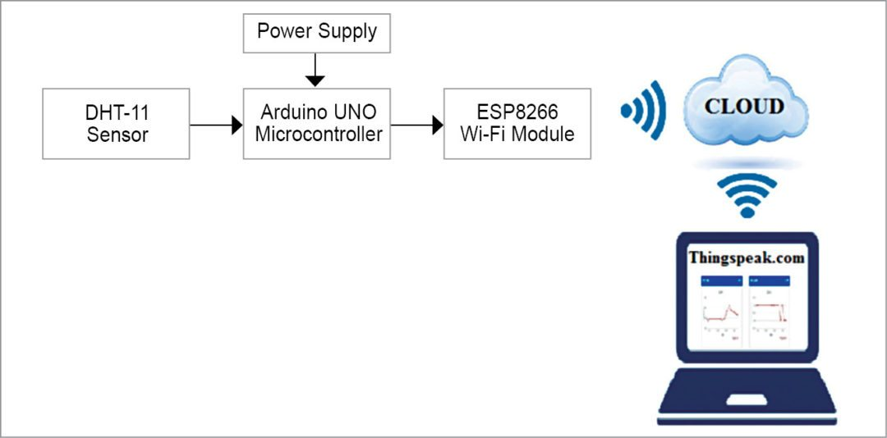

[← go back to the list](https://HandongHCI.github.io/StudentProjects/HCI2019S)

# SmartFarm

#### Group Members
- Vitumbiko Mafeni, Kelvin Mkhwimba, and Frank Matemba

## 1. Background & objective of research
Different crops require different environmental or weather conditions to grow properly. Based on research, farmers in Malawi Grow crops randomly without considering what's best for their crops. Our team is trying to help out farmers in Malawi who have trouble to choose a crop to grow in a particular season. After discussing, we thought of making a system that will recommend farmers what to grow based on soil moisture content (humidity) and temperature of the environment.  

## 2. Setting Up the Arduino
1. Requirements and Tools
- Arduino Uno
- Breadboard
- Male and Female Jumper Wires
- DHT11 Temperature and Humidity
- ESP8266-01 Wi-Fi Module
- Soil Moisture Sensor V2

2. Download Arduino Uno IDE [HERE](https://www.arduino.cc/en/Main/Software).

3. Set up the components as the Circuit Diagram below

4. Connect the Moisture Sensor to A2 pin of the Arduino 

5. Go to [thingspeak.com](https://www.thingspeak.com) and create a free account for cloud hosting of the data

6. Create Channels and Fields on [thingspeak.com](https://thingspeak.com/channels) as below:

7. Set-up the Wi-Fi network and change the SSID and password in the Code file above

8. You're almost done setting Up

9. Use the Following for reference to setup Channels,fields, reactors and apps on thingSpeak.com [thingspeak.com](https://thingspeak.com/channels/766328)

10. Code for Matlab Analysis [https://thingspeak.com/apps/matlab_analyses/124838/edit](https://thingspeak.com/apps/matlab_analyses/124838/edit)

11. final diagram and how it will work 

12. after set-up everything above, head to [ifttt.com](https://ifttt.com/my_applets) and create a webhooks applet and put the trigger url on thingSpeak server on ThingsHttp to send an email to the farmer once the conditions are meant. The email sent to farmer consists of instructions on how he/she can read the results from the system.

13. The SmartFarm recomendation document can be found [here](http://bit.ly/2Jpk5ig)

## 3. Reference websites
1. [https://create.arduino.cc/projecthub/AhmedAzouz/rory-the-robot-plant-f7e74b?ref=tag&ref_id=plants&offset=0](https://create.arduino.cc/projecthub/AhmedAzouz/rory-the-robot-plant-f7e74b?ref=tag&ref_id=plants&offset=0)
2. [https://www.instructables.com/id/Automated-FARM-Arduino-fanlightswater-Pump](https://www.instructables.com/id/Automated-FARM-Arduino-fanlightswater-Pump)
3. [https://www.youtube.com/watch?v=2cjufbgOBYo&t=499s](https://www.youtube.com/watch?v=2cjufbgOBYo&t=499s)
4. Setting up: [https://www.youtube.com/watch?v=4XEe0HY0j6k&t=194s](https://www.youtube.com/watch?v=4XEe0HY0j6k&t=194s)
5. [https://www.circuito.io/app?components=512,10167,11021,13322,13678](https://www.circuito.io/app?components=512,10167,11021,13322,13678)

   
[← go back to the list](https://HandongHCI.github.io/StudentProjects/HCI2019S)