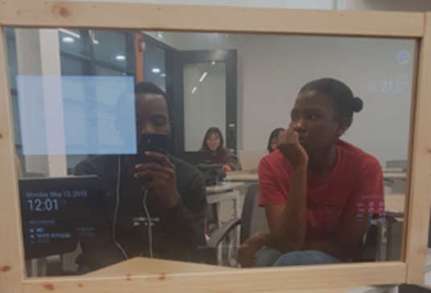

[← go back to the list](https://HandongHCI.github.io/StudentProjects/HCI2019S)

# Smart Mirror

#### members
Sion Lee, Brenda Dzanja, Benjamin Tutemi Manyunya, Yire Yoon

## 1. Background & objective 
Nowadays many people spend much time on the mirror perfecting their looks. As a result they end up being late to do other stuff. The Smart Mirror helps to solve this problem by offering information which gives a head start towards the day. Many people use smartphone or computer to check their daily information. However, it is not easy to check various inforamtion at once. This mirror will help the users to check information while doing any other job. Smart mirror is a small computer with Raspberry Pi. As it is easily modifialbe, we can display our necessary infomation for users.

## 2. Final output


## 3. Step-by-step tutorial
### 1. Install Raspberry Pi
Download the Raspbian from the website and start the Raspberry Pi. It is recommended to download the latest full version. https://www.raspberrypi.org/

### 2. Intall Smart mirror.
Automatic installation
```
bash -c "$(curl -sL https://raw.githubusercontent.com/MichMich/MagicMirror/master/installers/raspberry.sh)"
Manual Installation
```
Then following modules will be installed automatically. You can refer to these links to change options of each module such as positions, colors, images, size and so on.  
- [Clock](https://github.com/MichMich/MagicMirror/tree/master/modules/default/clock)
- [Calendar](https://github.com/MichMich/MagicMirror/tree/master/modules/default/calendar)
- [Current Weather](https://github.com/MichMich/MagicMirror/tree/master/modules/default/currentweather)
- [Weather Forecast](https://github.com/MichMich/MagicMirror/tree/master/modules/default/weatherforecast)
- [News Feed](https://github.com/MichMich/MagicMirror/tree/master/modules/default/newsfeed)
- [Compliments](https://github.com/MichMich/MagicMirror/tree/master/modules/default/compliments)
- [Hello World](https://github.com/MichMich/MagicMirror/tree/master/modules/default/helloworld)
- [Alert](https://github.com/MichMich/MagicMirror/tree/master/modules/default/alert)
  
    
### 3. Change settings
- Installation of korean font 
```sudo apt-get --yes install fonts-nanum fonts-symbola```
- Sound output
Check the speacker icon at the top right corner. choose either analog or HDMI.
- Automatic start of Mirror
```
sudo npm install -g pm2
pm2 startup
sudo env PATH=$PATH:/usr/bin /usr/lib/node_modules/pm2/bin/pm2 startup systemd -u pi --hp /home/pi
pm2 start ~/MagicMirror/installers/pm2_MagicMirror.json
pm2 save
#### to mimimize the mirror --> ctrl + m
#### to start mirror --> pm2 start MagicMirror
#### to stop mirror --> pm2 stop MagicMirror
#### to restart mirror --> pm2 restart MagicMirror
```


### 4. Install google assistant
MMM-Hotword and MMM-AssistantMk2 are required for google assistant

#### Step1. installation of related programs
```
sudo apt-get --yes install libmagic-dev libatlas-base-dev sox libsox-fmt-all mpg321
cd ~/MagicMirror/modules/
git clone https://github.com/eouia/MMM-Hotword.git
git clone https://github.com/eouia/MMM-AssistantMk2.git
```

#### Step2. installation of MMM-Hotword  
```
cd ~/MagicMirror/modules/MMM-Hotword/
npm install
```

#### Step3. installation of MMM-AssistantMk2  
```
cd ~/MagicMirror/modules/MMM-AssistantMk2/
npm install
npm install --save-dev electron-rebuild
./node_modules/.bin/electron-rebuild
chmod +x ~/MagicMirror/modules/MMM-AssistantMk2/scripts/*.sh
```

#### Step4. google API   
1. Go to Google API Console  
2. From the menu bar, select a project or create a new project.    
3. To open the Google API Library, from the Navigation menu, select APIs & Services > Library.    
4. Search for "Google Assistant API". Select the correct result and click Enable.    
5. Then, from the menu, select APIs & Services > Credentials.  
6. On the Credentials page, click Create Credentials > OAuth client ID.  
7. Select your Application type as Other and submit. (Before or After that, you might be asked for making consent screen. do that.)  
8. Then, you can download your credential json file from list. Downloaded file name would be client_secret_xxxx...xxx.json. rename it as credentials.json and save it to your MMM-AssistantMk2 directory.  
9. Then, type the following code:  
```
cd ~/MagicMirror/modules/MMM-AssistantMk2/
node auth_and_test.js
```
10. internet explore will open soon, then log in to the google and copy the code that appear on the screen and paste on the terminal.
11. if you see "Type your request" on the screen, type
```Hello```
12. if the response is working well, exit with typing [Ctrl+C]  
```
mv token.json ./profiles/default.json
```


### 5. Currentweather and weatherforecast module
Open your config.js file and look for currentweather.  
Change location to your location  
Get a API keys from https://openweathermap.org/ and paste the API ket to the appid in the config.js  
Do the same steps for the weatherforcast modules  
  
    
### 6. Google calendar
Get a ical address from your google calendar and paste it to the url part in your config.js file  
```
config: {
	colored: false,
	coloredSymbolOnly: false,
	calendars: [
		{
			url: 'http://www.calendarlabs.com/templates/ical/US-Holidays.ics',
			symbol: 'calendar',
			auth: {
			    user: 'username',
			    pass: 'superstrongpassword',
			    method: 'basic'
			}
		},
	],
}
```


### 7. Install google photos
We installed google photos to see the school bus schedules on the mirror. We uploaded school bus schedules to the google photo album and displayed on the mirror with silde show.

#### Step1. Install Module  
```
git clone https://github.com/eouia/MMM-GooglePhotos.git
cd MMM-GooglePhotos
npm install
```

#### Step2. Google API  
1. Go to Google API Console    
2. From the menu bar, select a project or create a new project.  
3. To open the Google API Library, from the Navigation menu, select APIs & Services > Library.  
4. Search for "Google Photos Library API". Select the correct result and click Enable. (You may need to enable "Google Plus" also.)   
5. Then, from the menu, select APIs & Services > Credentials.   
6. On the Credentials page, click Create Credentials > OAuth client ID.  
7. Select your Application type as Other and submit. (Before or After that, you might be asked for making consent screen. do that.)   
8. Then, you can download your credential json file from list. Downloaded file name would be client_secret_xxxx...xxx.json. rename it as 9. Credentials.json and save it to your MMM-GooglePhotos directory.    
10. Then open console and type  
```
cd ~/MagicMirror/modules/MMM-GooglePhotos
node auth_and_test.js
```
11. The internet browser will be opened, then log in to ypur google account and do the allowance.  
12. Copy the code that is shown after the allowance and paste on the console.  
13. Now you can get list of your Google Photos albums. like these;  
14. <ALBUM_NAME> : <ALBUM_ID>  
```
travel to paris : AGj1epU5VMNoBGK9GDX3k_zDQaPT16Fe56o0N93eN6aXn-f21M98  
...
```
15. Remember the id    
16. Now set your config.js    
You can chage the size of you photos and speed of slide and so on...


### 8. Install remote control
You can control your smarmirror modules on your smartphone.  
Automatic installation  
```
bash -c "$(curl -s https://raw.githubusercontent.com/Jopyth/MMM-Remote-Control/master/installer.sh)"
```
Updates  
```
cd ~/MagicMirror/modules/MMM-Remote-Control # adapt directory if you are using a different one
git pull
npm install # install (new) dependencies
```
change address and whitelist
For security reasons, the MagicMirror (and therefore the Remote Control) is not reachable externally. To change this, configure address, and ipWhitelist in your config.js (see these lines in the sample config). For example change address to ```0.0.0.0```. You can add allawable IP addresses to the whitelist or just leave itself to allow many devices.
```
address : '0.0.0.0',
    port: 8080,
    ipWhitelist: ["127.0.0.1", "::ffff:127.0.0.1", "::1", "::ffff:192.168.0.42", "::ffff:192.168.0.50"],"
```

## 4. Source code  
- Installation of Raspberry Pi : https://www.raspberrypi.org/  
- Installation of modules : https://github.com/MichMich/MagicMirror  
- Installation of modules from 3rd party : https://github.com/MichMich/MagicMirror/wiki/3rd-party-modules  

## 5. Limitation
- YouTube is incompatible with the smart mirror module
- Mic sensors are not working properly
- Google Assistants is not working as smooth as on the smart phone
- Some APIs are not working well with the Raspberry Pi and SmartMirror

## 6. Future plan
1. Enabling to control modulse with voice command  
2. Installing the body sensor  
3. Enabling the touch screen  
4. Connect home devices to google home to control home devices
5. connect some health applications to the mirror

## 7. Conclusion
Raspberry PI is not so expensive and anyone can easily access to the open sources on the Internet. This mirror is easily modifiable and customizable. Therefore, anyone can make their own custom made smart mirror to make their life more convenient and enthusiastic.

<br><br><br>
[← go back to the list](https://HandongHCI.github.io/StudentProjects/HCI2019S)