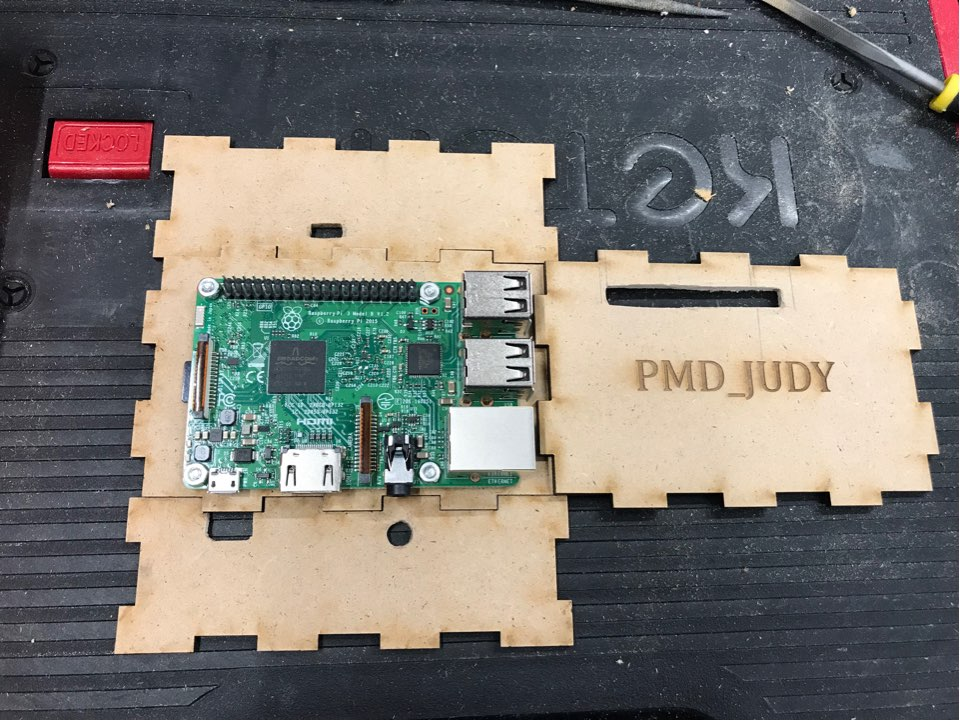

## PMD 부품설명 ##
---
1. 라즈베리 파이 

미세먼지 센서를 작동 시키고 센서로 부터 측정된 데이터를 어플리케이션과 연동시키는 기기이다. 
---
2. 미세먼지 센서

외부의 미세먼지 정도를 측정하여 데이터 값으로 변환하는 기기이다. 
---
3. 외관

- 정면

- 후면

- 수납공간

라즈베리 파이와 미세먼지 센서를 내장하고 추가적인 수납 공간을 제공한다. 
