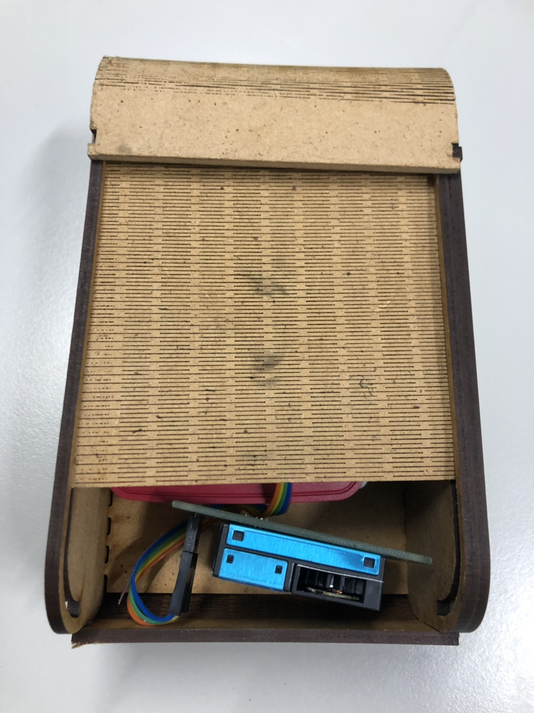
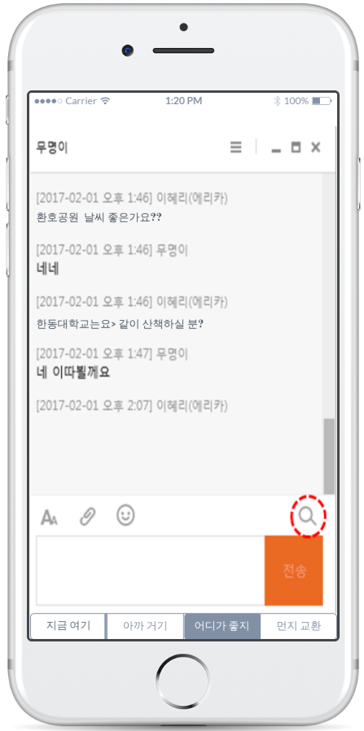

[← go back to the list](https://HandongHCI.github.io/StudentProjects/ICTprototyping2019S)

# Fine Dust Case

#### Members
- 이동희, 정윤상, 정진호

## Purpose
내가 있는 곳의 미세먼지를 알고 싶은 사람들이 늘고 있다. 특히 그 중에서도 어린 아이를 둔 어머니, 산책을 나가야하는 견주들을 타켓으로 유모차나 강아지 가방에 매달 수 있는 미세먼지 측정기 보관 케이스를 개발하고자 한다.

## Operating Principle
- Case의 내부에 미세먼지 측정기와 laspberry pi가 수납된다. 미세먼지 측정기에서 측정한 결과는 laspberry pi를 통해 구글시트로 전송되며 어플리케이션을 통해 확인할 수 있다.
- 미세먼지 측정기와 laspberry pi는 탈부착이 가능하다. 가방, 유모차 등등 소비자가 소지할 수 있는 다양한 물건에 장착하여 휴대할 수 있도록 하기 위함이다.
- Tool-based prototype은 서버를 통해 각자의 미세먼지 정보를 공유할 수 있는 커뮤니티까지 제작할 계획이었으나 현재 wed-based 어플리케이션의 prototype은 스마트폰과 laspberry pi의 연동을 통해 모든 데이터를 처리하고 값을 받아오는 것까지만 구축해놓은 상황이다.

## Producing Process of our prototype
### Hardware
- laser cutting을 통해 케이스의 도면을 만들어 조립했다. 조립 과정에서 연결 단자의 호환성 문제를 해결하기 위해 순간접착제를사용했다.

- 케이스에는 laspberry pi와 미세먼지 측정기를 수납할 수 있다.

### Tool-based application
- Laspberry pi는 미세먼지측정기에서 측정한 결과를 어플리케이션으로 전송하도록 프로그래밍했다.
- 서버에 접속하여 사용자들끼리 정보를 공유할 수 있다.

### Web-based application
https://htmlpreview.github.io/?https://raw.githubusercontent.com/jinojung/ICT_Webapp/master/index.html

### Future plan
- 현재 서버단위가 아닌 개인 기기단위의 어플리케이션을 개발하는 데 성공했다. 추후에 이를 서버단위로 확장하여 정보공유를 가능하게 만들 계획이다.

   
[← go back to the list](https://HandongHCI.github.io/StudentProjects/ICTprototyping2019S)