# Watch Dust! Project
>미세먼지 어플을 시간마다 활용하는 사용자는 많지 않다. 대부분의 사용자는 아침 혹은 외출하기 전, 마스크와 같은 대비책을 마련해야 하는지에 대한 결정을 하기위해 하루의 전체적인 미세먼지 농도를 확인하고 싶어한다. 하지만, 기존의 미세먼지 어플은 하루의 미세먼지 농도를 전체적으로 알 수 있게 하기보다는 현재 시각의 미세먼지에만 초점을 맞추고 있어 사용자의 니즈를 달성하기에는 한계가 있다. 이러한 사용자의 필요를 충족시키기 위해 하루의 전체적인 미세먼지 농도를 쉽고 빠르게 인지할 수 있도록 시각화하여 사용자들이 미세먼지 예방책을 마련할 수 있도록 하는 것이 우리 Watch Dust! 프로젝트의 목표이다. 즉, Watch Dust!프로젝트는 Design for Simplicity, Design for Ease of Use를 중심으로 복잡한 사용 방법, 혹은 24㎍/㎥(1h)와 같은 정확한 미세먼지 측정량과 같이 일반 사용자에게는 어렵고 불필요한 세세한 데이터를 배제하여 남녀노소 누구나 인지적인 스트레스가 크지 않고 무리없이 사용 가능하다. 이에 따라 사용자는 직관적으로 하루의 미세먼지 농도 정보를 얻을 수 있으며, 다른 미세먼지 알림 제품, 서비스와는 차별적으로 편리성, 직관성, 쉬움 등의 가치를 얻게 된다.

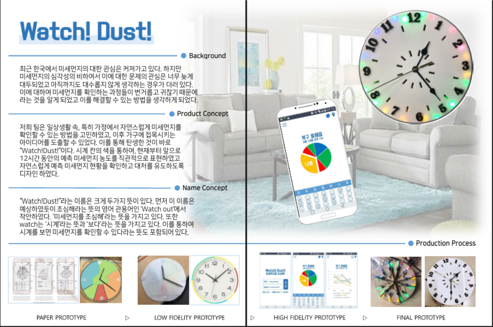

---
# Watch Dust's Hardware Product
## Concept
>Watch Dust! 프로젝트의 제품은 가정용 미세먼지 시계를 컨셉으로 제작된다. 미세먼지 시계란 다음 사진과 같이 동그란 아날로그 시계 테두리에 각 시간에 따라 미세먼지 농도 변화를 색상으로 표현해줄 수 있는 LED를 달아 사용자가 시각적으로 하루의 미세먼지 농도를 지각하게 하는 것에 초점을 둔다. 하루의 미세먼지 농도를 종합적으로 시각화하기 위해서는 시계와 결합하는 것이 어떨까라는 아이디어에서 시작하였다. 시계 중에서도 디지털 시계가 아닌 아날로그 시계를 택한 이유는 Design for Simplicity, Ease of Use를 실천하기 위해 디지털 기기에 생소한 사용자들도 편리하게 사용할 수 있기 때문이다. 또한, LED를 통해 조명으로 미세먼지를 표현하면서 디지털 화면을 보여준다면 사용자의 눈에 피로가 가서 장기간 사용하기에 무리가 있다고 판단되어 다음과 같은 결정을 하였다.

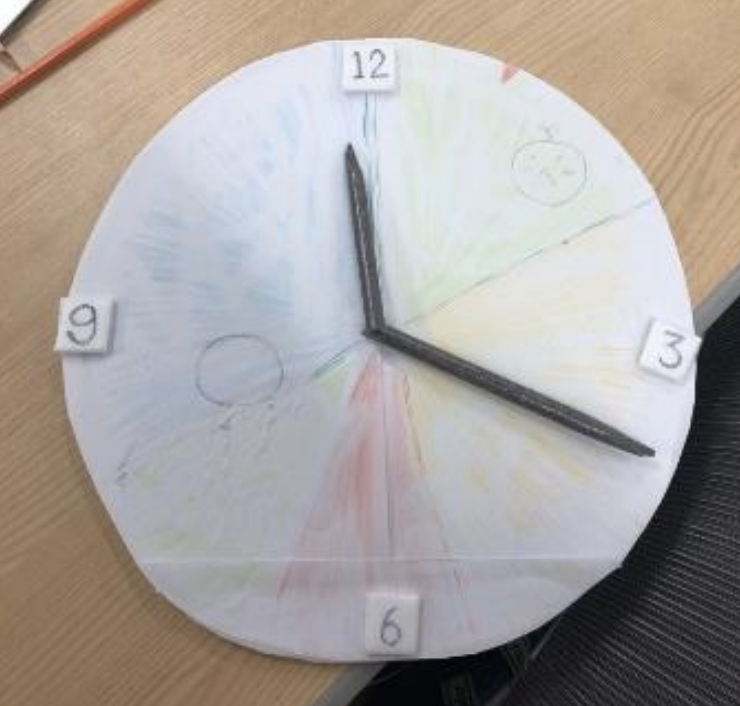 <strong>Low-Fidelity Concept</strong>  
 <strong>Concept Image</strong>  
 <strong>Color Division</strong> 
 

---
## How To Develop
>제품을 제작하기 위해서 아크릴 판과 나무판을 레이저 커팅하여 아날로그 시계 구조를 제작하였으며, 시계 침과 초는 따로 구매하였다.
다음은 레이저 커팅 도면과 실제 커팅을 한 후 모습이다.

 <strong>레이저 커팅 도면</strong>  
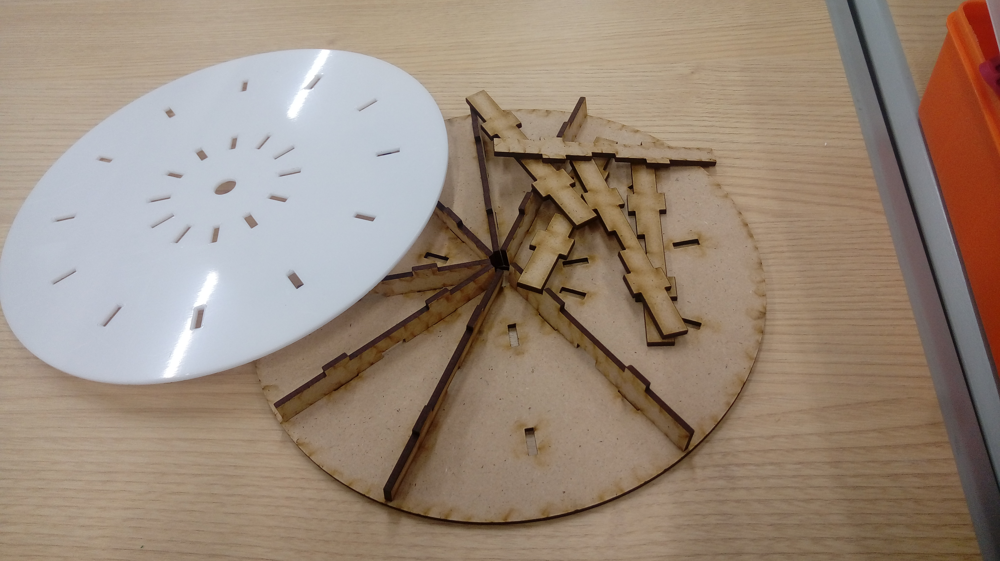 <strong>레이저 커팅 이후 사진</strong>  
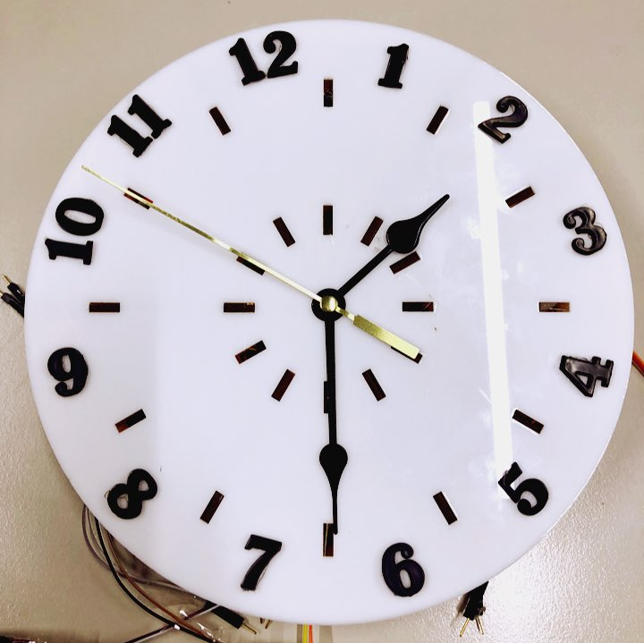 <strong>시계 구조</strong> 
 

>라즈베리 파이, 시계에 미세먼지 농도에 따라 빛으로 표현하게 하는 LED를 사용하였다. 시계의 센서를 통해 미세먼지 농도 정보를 받아들이고 현재 시각 이후의 농도는 미세먼지 예측 데이터를 에어코리아, 국가정보관리원과 같은 사이트에서 제공하는 데이터를 받아 대기의 상태를 매우 나쁨/나쁨/보통/좋음으로 나누어 다르게 표현할 예정이었다. LED의 색상은 농도에 따라 매우 나쁨(빨강), 나쁨(노랑), 보통(초록), 좋음(파랑)으로 나누어 표현하였다. LED는 빵판과 선을 이용하여 라즈베리 파이에 연결하였다. 

 <strong>라즈베리파이와 LED 연결</strong>  
 <strong>시계에 LED 시험 연결</strong>  
  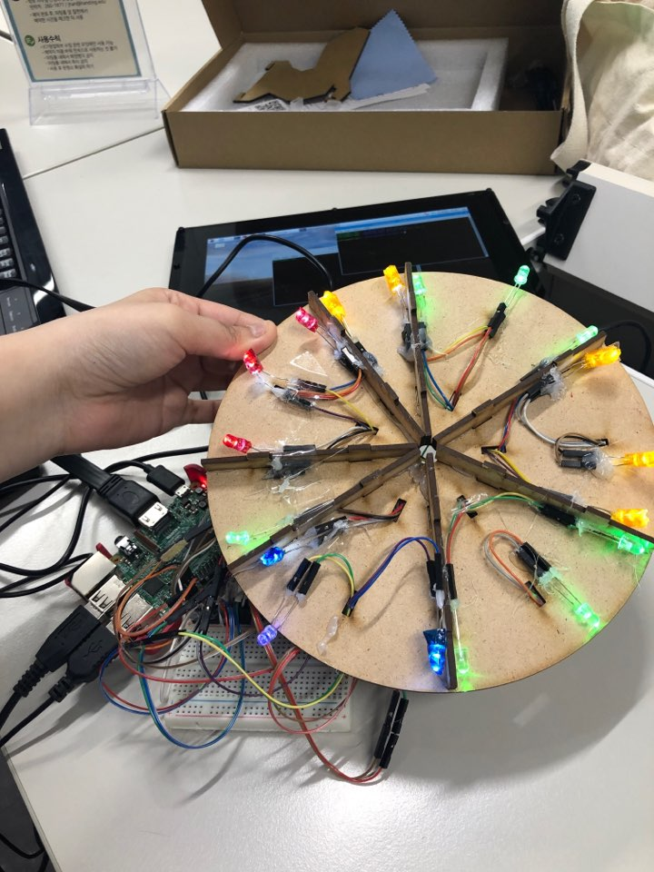  
 <strong>LED 연결 완료</strong>

---
## Result

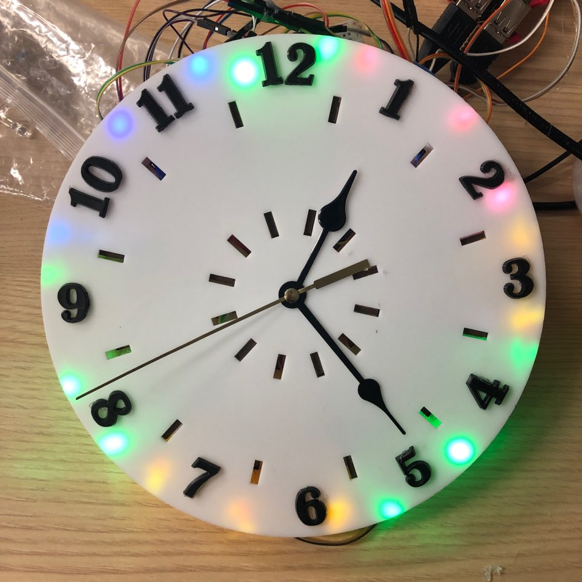 <strong>미세먼지 시계 하드웨어 프로토타입</strong>
  

---
# Watch Dust's Software App  

## Concept
>어플리케이션은 처음 키고 메인화면이 나오기 전, 로딩 중일 때 나오는 화면이다. 본 어플리케이션의 메인 캐릭터가 가운데에 등장한다. “ loading… “이라는 문장이 하단에 나온다. 그중 “…”의 경우, “.”개에서 세개까지 시간적 간격을 두면 타이핑되고 다시 하나로 가능 등의 효과를 주어서 어플리케이션이 작동중인 것을 간접적으로 보여준다.

 <strong>로딩 화면</strong>
  

>로딩이 끝나면 나오는 화면이다.
상단 좌측에 메뉴를 뜻하는, 줄 세 개 가 아래로 나란히 있는 아이콘이 있 다. 상단 우측에는 왼쪽부터 차례대로 미세먼지 모양 아이콘, 지도 표시 아 이콘이 있다.
중앙에는 현재 시간을 중심으로 앞으 로 12시간 동안의 미세먼지 현황을 원그래프로 볼 수 있다. 디자인을 시 계 느낌으로 만들어 시간도 함께 표 시되도록 디자인한다. 또한 현재 시간 에 해당하는 부분의 영역을 조금 튀 어나오게 디자인함으로 현재 상태가 더 눈에 띄게 만든다. 시계 위에는 현재 위치에 대한 정보를 텍스트로 제공한다. 하단에는 오늘부터 시작하여 일주일 간의 미세먼지 대략적인 아침 점심 저녁의 예측을 얼굴 표정(좋음, 보통, 나쁨, 매우 나쁨)으로 나타낸다.

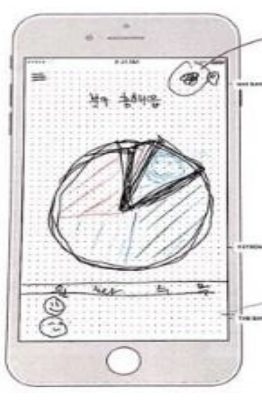 <strong>메인 화면</strong>
  

>메인 화면의 상단 좌측에 있는 메뉴 버튼을 누르면 왼쪽에서부터 오른쪽 으로 화면이 나타난다. 로그인을 했을 경우 상단에 나의 그림이 나타난다. 그리고 아래로 테마와 화면 등 환경 설정을 할 수 있는 부분이 나타난다. 하드웨어와 연동이 가능할 경우 하드 웨어의 대한 설정도 이곳을 통하여 들어 설정이 가능하다.

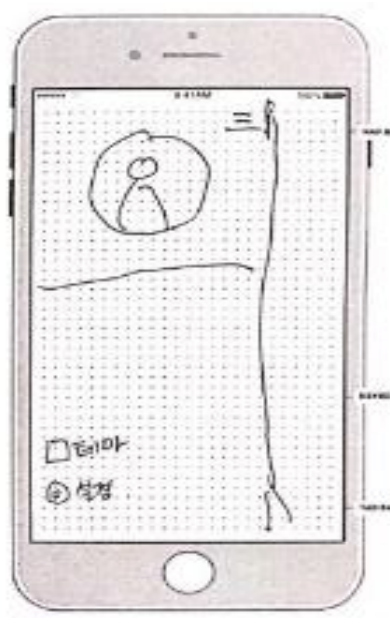 <strong>메뉴 화면</strong>
  

>메인 메뉴 상단 우측에 있는 미세먼 지 아이콘을 누르면 이동된다.전환된 화면 상단에는 원래 미세먼지 아이콘이 있던 자리에 홈 아이콘으로 바뀐다. 본 메뉴는 미세먼지 이외의 초미세먼 지, 이산화질소, 오존, 일산화탄소, 아 황산가스의 농도 현황을 이전 5일 이 후 5일 예측과 함께 그래프 형식으로 보여준다. 그리고 가운데 있는 오늘의 현황은 네모박스 등을 통하여 강조한다.

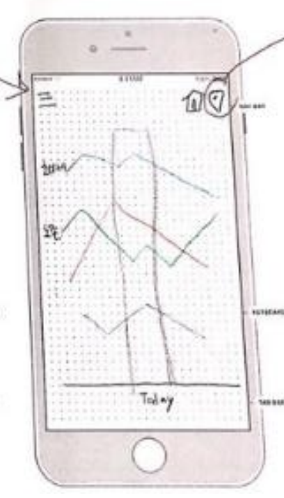 <strong>세부 미세먼지 현황 화면</strong>
  

>메인 화면에서 지도 표시 아이콘을 누르면 이동된다. 상단에 텍스트 입력칸이 나타나며 ‘동/읍/면을 입력하세요’라는 문장이 기본으로 보여짐으로 사용자의 행동을 유도한다.
음성인식이 가능하도록 기능을 탑재 하고 우측에 위치시킨다.

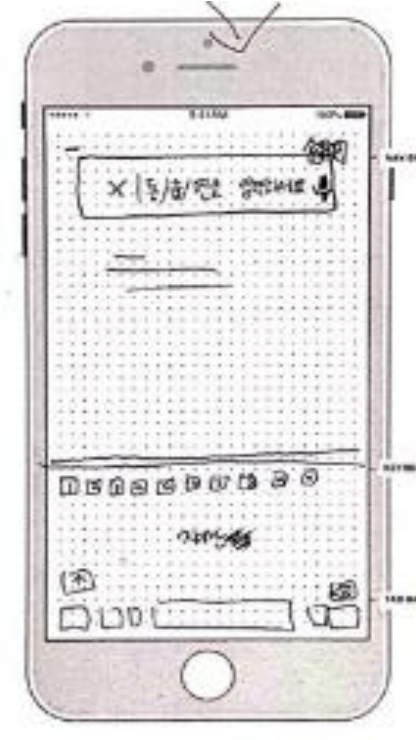 <strong>위치 설정 화면</strong>
  

>잠금화면에 캐릭터 위젯 서비스를 제 공함으로 어플을 들어가지 않아도 대 략적인 미세먼지 현황을 알 수 있도 록 한다.
캐릭터는 미세먼지 현황(좋음, 보통, 나쁨, 매우 나쁨)에 따라 색으로 나타 낸 각 캐릭터들이 화면에 등장한다. 캐릭터는 드래그를 통하여 스티커처 럼 이동이 가능하고 터치를 하면 말 풍선으로 현재 미세먼지의 수치적 현 황을 알려주거나 ‘마스크를 챙기시오’ 등 다양한 인터페이스용 대화를 탑재 하여 좀 더 사용자와 친근감을 가지도록 디자인한다.

 <strong>잠금 화면 캐릭터 위젯 서비스</strong>
  

---
## How To Develop

>프로토타입핑 툴 마블을 사용하여 Watch Dust! 프로토타입 앱을 제작하였다. 마블은 스크린을 불러오고, 핫스팟을 만들어서 연결하는 방식으로서 간단한 screen by screen 프로토타입을 제작하기에 탁월하다. 스크린 간의 인터랙션을 잘 나타내줄 수 있고 빠르고 쉽게 프로토타이핑이 가능하다. 어플 스크린은 총 6개로서 시작화면, 로딩화면, 메인화면 세부먼지정보 화면, 지역설정 화면, 메뉴로 나뉜다.

---
### Login
>시작화면에서는 사용자의 로그인이 가능하며, 로그인이 완료되면 로딩화면으로 넘어간다.

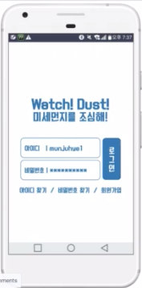 <strong>시작 화면</strong>  
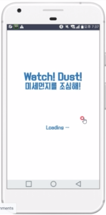 <strong>로딩중</strong>
  

--- 
### Main
>현재부터 앞으로 12시간까지의 미세먼지 현황을 색을 통해 시각적이면서도 직관적으로 볼 수 있다. 
화면 아래의 표는 오늘부터 앞으로 일주일 간의 미세먼지 예상 정보를 이모티콘을 활용해 나타낸 것이다.

 <strong>메인 화면</strong> 
 

---
### Detail
>상단 우측의 메뉴에서 미세먼지 버튼을 누르면 상세 페이지로 이동한다.
미세먼지 이외에 대기 오염과 관련된 세부적인 정보들을 어제, 오늘, 내일 데이터를 비교하여 확인할 수 있으며,
홈 아이콘을 누를 시 다시 메인 화면으로 돌아간다.

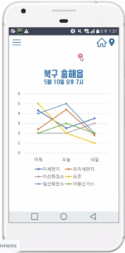 <strong>세부 미세먼지 정보 화면</strong> 
 

>메인 화면에서 GPS 모양의 버튼을 클릭하면 지역 설정 화면으로 이동한다.
지역설정 화면에서는 현재 설정된 지역이 아닌 다른 지역로 설정을 바꾸어, 타지역의 미세먼지 정보를 실시간으로 확인할 수 있다.
지역 검색창을 눌러 지역을 직접 검색할 수 있으며, 음성인식도 지원하여 간편하게 원하는 지역을 찾을 수 있다. 

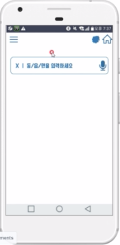 <strong>지역 설정 화면</strong>  
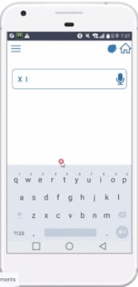 <strong>지역 검색</strong>  
 <strong>지역 음성 인식</strong> 
 

---
### Menu
>좌측 상단의 메뉴 버튼을 클릭하거나 왼쪽에서 오른쪽으로 화면을 스와이프하면 메뉴창이 나타난다. 
메뉴에서 로그인한 자신의 계정을 확인할 수 있으며, 마이페이지, 테마변경, 환경설정 등이 가능하다.
메인 화면을 클릭하거나, 끝내기 버튼을 끌릭하거나 오른쪽에서 왼쪽으로 스와이프할 시 메뉴화면에서 메인 화면으로 이동한다. 

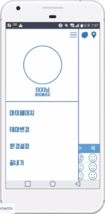 <strong> 화면</strong> 
 

---
## Result
  <strong>사진 클릭 후 어플 구동 영상으로 이동</strong>
