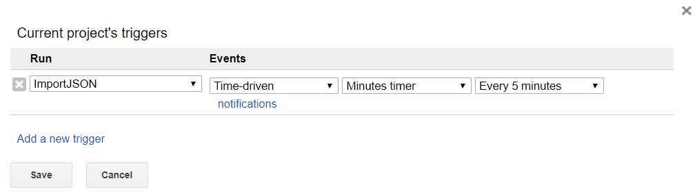

[← go back to the list](https://HandongHCI.github.io/Tutorials)

## 대한민국 공공데이터 이용하기

### Introduction
- 대한민국 공공데이터에서 JSON 형식으로 된 데이터를 Google Sheets로 받아옴
- 본 문서에서는 특정 지역의 미세먼지와 날씨 데이터를 주기적으로 받아와 Google Sheets를 자동으로 업데이트 하는 방법을 다룸
- [다음 문서](ReadGoogleSheets.md)에서는 Javascript를 이용하여 Google Sheets에 입력된 데이터를 web page로 불러오는 방법을 다룸

### 공공데이터 가입하기
- [대한민국 공공데이터 사이트](https://www.data.go.kr)
- 한국환경공단 대기오염정보 조회 서비스 예: https://www.data.go.kr/dataset/15000581/openapi.do
- 절차
1. 회원 가입
2. 원하는 공공데이터 신청 (1시간 정도 후부터 서비스키(key) 사용이 가능함; 아래는 미세먼지 정도를 알 수 있는 한국환경공단의 대기오염정보 조회 서비스 예시임)
3. 이용
	- 공공데이터에서 제공해준 Key값 복사
	- 데이터 접속 방법: 아래 `ServiceKey` 부분에 본인의 서비스키를 넣고, `stationName`에 본인의 위치(동 이름)를 입력한 후 인터넷 주소창에 붙여 넣음
	```http://openapi.airkorea.or.kr/openapi/services/rest/ArpltnInforInqireSvc/getMsrstnAcctoRltmMesureDnsty?stationName=장량동&dataTerm=daily&pageNo=1&numOfRows=1&ServiceKey=서비스키```
	
	- Input 변수
		- `stationName`: 모든 지역이 가능한 것은 아님(입력 가능한 지역 확인: http://www.airkorea.or.kr/index)
		- `dataTerm`
		- `pageNo`
		- `numofRows`: 1시간마다 업데이트 되므로 1로 하면 1시간 이내의 정보를 받게 됨, 2로 하면 최근 2회의 데이터를 받음
		- `ServiceKey`: 자신의 서비스키를 넣음
		- `_type=json`: 맨 마지막에 붙여 넣으면 JSON 형식으로 받아오고, 붙이지 않으면 XML 형식으로 받아옴
		
	- Output 데이터 형식
		- `dataTime` 측정일 및 시간 (매 시간 업데이트 됨)
		- `so2Value` 아황산가스 농도
		- `coValue` 일산화탄소 농도
		- `o3Value` 오존 농도
		- `no2Value` 이상화질소 농도
		- `pm10Value` 미세먼지 농도
		- `pm10Value24` 24시간 예측 농도
		- `pm25Value` 초미세먼지 농도
		- `pm25Value24` 24시간 예측 농도
		- `khaiValue` 통합대기환경수치
		- `khaiGrade` 통합대기환경지수
		- `so2Grade` 아황산가스 지수
		- `coGrade` 일산화탄소 지수
		- `o3Grade` 오존 지수
		- `no2Grade` 이상화질소 지수
		- `pm10Grade` 미세먼지 24시간 등급
		- `pm25Grade` 초미세먼지 24시간 등급
		- `pm10Grade1h` 미세먼지 1시간 등급
		- `pm25Grade1h` 초미세먼지 1시간 등급

### 활용 방법
- Google Sheets의 script editor를 이용하여 JSON 데이터를 받아와서 자동으로 저장
- 예시: https://docs.google.com/spreadsheets/d/1fImbr5ovXR07P7NxYKqU6FsYKsHHaonZV9PmDnjt_T8/edit#gid=0
- 본 예시에서는 공공데이터 중에서 미세먼지(한국환경공단 대기오염정보 조회)와 날씨((신)동네예보정보조회서비스)를 받아오는 방법을 소개
- script editor에 들어갈 내용
```
function ImportJSON()
{
  var url1 = http://openapi.airkorea.or.kr/openapi/services/rest/ArpltnInforInqireSvc/getMsrstnAcctoRltmMesureDnsty?stationName=%EC%9E%A5%EB%9F%89%EB%8F%99&dataTerm=daily&pageNo=1&numOfRows=1&ServiceKey=서비스키"; // '서비스키' 부분에 본인의 키 입력
  var res1 = UrlFetchApp.fetch(url1);
  var content1 = res1.getContentText();
  var json1 = JSON.parse(content1);
  
  var date1 = [];
  var pm10Value = [];
  
  var xPath = "list/dataTime";
  var patharray1_1 = xPath.split("/");
  for (var i in json1[patharray1_1[0]]) {
    date1.push(json1[patharray1_1[0]][i][patharray1_1[1]]);
  } // date 값 받아오기
  
  var xPath = "list/pm10Value";
  var patharray1_2 = xPath.split("/");
  for (var i in json1[patharray1_2[0]]) {
    pm10Value.push(json1[patharray1_2[0]][i][patharray1_2[1]]);
  } // 미세먼지값 받아오기
  
  var sheet = SpreadsheetApp.getActiveSheet();
  var datarange = sheet.getDataRange();
  var currentRowNo = datarange.getNumRows();
  
  sheet.getRange("N1").setValue(date1); // O1 셀에 현재 날짜 넣기
  sheet.getRange("O1").setValue("=YEAR(N1)"); // 현재 날짜 중에 Year 부분만 빼서 P1 셀에 넣기. Year는 Google Sheets 함수임.
  sheet.getRange("P1").setValue("=MONTH(N1)"); // Month 부분만 빼기
  sheet.getRange("Q1").setValue("=DAY(N1)"); // Day 부분만 빼기
  sheet.getRange("R1").setValue("=HOUR(N1)"); // Hour 부분만 빼기
  var Y = sheet.getRange("O1").getValue(); // 셀에 넣은 것을 다시 변수로 불러들임
  var M = sheet.getRange("P1").getValue();
  var D = sheet.getRange("Q1").getValue();
  var H = sheet.getRange("R1").getValue();
  var currentHour = H; // current hour
  var lastHour = sheet.getRange(currentRowNo, 4).getValue(); // last hour
  
  
  var date2 = sheet.getRange("S1").getValue(); // S1과 T1은 Google Sheets 내에서 다른 셀을 참고하여 만든 값이며, 이를 불러와서 변수에 저장. 자세한 내용은 공유된 Google Sheets의 S1과 T1셀 참고 (https://docs.google.com/spreadsheets/d/1fImbr5ovXR07P7NxYKqU6FsYKsHHaonZV9PmDnjt_T8/edit#gid=0)
  var time2 = sheet.getRange("T1").getValue();
  var url2 = "http://newsky2.kma.go.kr/service/SecndSrtpdFrcstInfoService2/ForecastGrib?base_date=" + date2 + "&base_time=" + time2 + "&nx=102&ny=95&numOfRows=10&pageSize=10&pageNo=1&startPage=10&_type=json&serviceKey=서비스키" // 날씨를 받아올 때는 현재 날짜와 시간을 인터넷 주소값에 넣어야 하는데, 미세먼지 데이터를 받아오면서 얻은 날짜 값을 변형하여 Google Sheets에서 date2와 time2를 만들고 이를 이용하여 현재 날씨를 불러옴
  var res2 = UrlFetchApp.fetch(url2);
  var content2 = res2.getContentText();
  var json2 = JSON.parse(content2); // JSON을 얻음
  
  var PTY;
  var REH;
  var RN1;
  var T1H;
  var UUU;
  var VEC;
  var VVV;
  var WSD;
  
  var xPath = "response/body/items/item/obsrValue";
  var patharray2 = xPath.split("/");
  T1H = json2[patharray2[0]][patharray2[1]][patharray2[2]][patharray2[3]][3][patharray2[4]]; // JSON에서 필요한 부분만 
  REH = json2[patharray2[0]][patharray2[1]][patharray2[2]][patharray2[3]][1][patharray2[4]];
  RN1 = json2[patharray2[0]][patharray2[1]][patharray2[2]][patharray2[3]][2][patharray2[4]];
  VEC = json2[patharray2[0]][patharray2[1]][patharray2[2]][patharray2[3]][5][patharray2[4]];
  WSD = json2[patharray2[0]][patharray2[1]][patharray2[2]][patharray2[3]][7][patharray2[4]];
  
  if(currentHour !== lastHour) // 시간이 바뀐 경우에만 실행
  {
    sheet.getRange(currentRowNo+1, 1).setFormula(Y); // currentRowNo + 1을 이용하여 가장 아래에 새로운 줄을 추가하여 내용을 넣음
    sheet.getRange(currentRowNo+1, 2).setFormula(M);
    sheet.getRange(currentRowNo+1, 3).setFormula(D);
    sheet.getRange(currentRowNo+1, 4).setFormula(H);
    sheet.getRange(currentRowNo+1, 5).setValue(pm10Value);
    
    sheet.getRange(currentRowNo+1, 7).setFormula(T1H); //온도
    sheet.getRange(currentRowNo+1, 8).setFormula(REH); //습도
    sheet.getRange(currentRowNo+1, 10).setFormula(RN1); //강수량
    sheet.getRange(currentRowNo+1, 11).setFormula(VEC); //풍향
    sheet.getRange(currentRowNo+1, 12).setFormula(WSD); //풍속
  }
}
```

### 자동 데이터 획득
- 상단 메뉴에서 저장(disk 이미지)과 run(삼각형 실행 이미지) 사이에 있는 시계 모양을 클릭
- 새 창이 뜨면 아래 그림과 같이 데이터 자동 획득을 위해 trriger를 생성

- 하루에 24개의 data를 자동으로 받아옴

<br><br><br>
[← go back to the list](https://HandongHCI.github.io/Tutorials)
